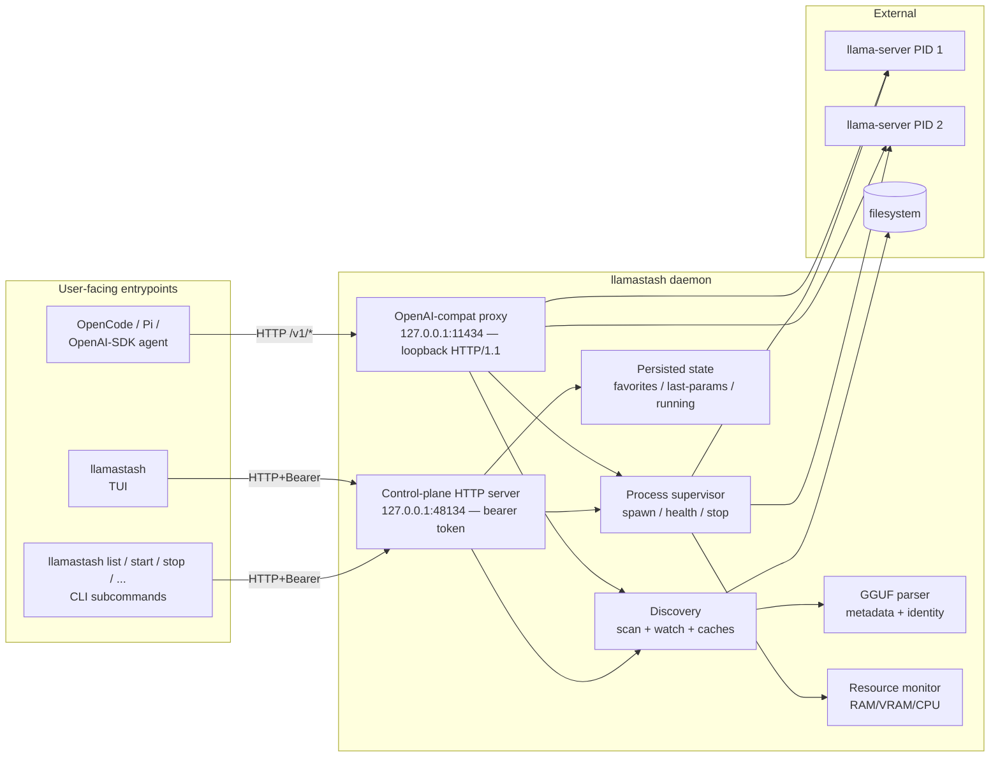
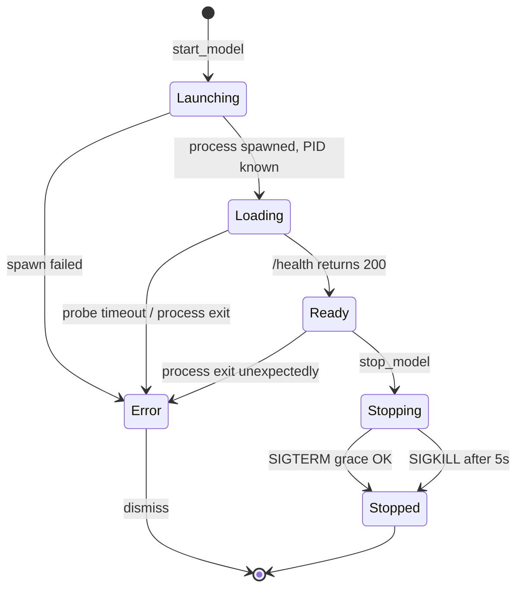

# Architecture

This is the architecture as it ships through v2. Authoritative sources for design intent and tradeoffs: [v1 plan](plans/2026-05-13-001-feat-llamatui-v1-launcher-plan.md), [v2 plan](plans/2026-05-18-001-feat-init-wizard-doctor-pull-plan.md). This document is a stable, user-readable summary of what's actually in the binary.

## v2 additions in one breath

```
llamastash init   ─┬─► detection (gpu::probe + RAM + binary locate)
                  ├─► install (GH Releases | brew | custom_path)
                  ├─► recommender (snapshot models × hardware fit × score)
                  ├─► download (hf-hub → ~/.cache/huggingface/hub/...)
                  ├─► config writer (atomic + 0600 + recursive merge + redaction)
                  ├─► smoke (phase-1 dry-run + binary --version probe)
                  └─► init_snapshot.json (sibling of state.json)

llamastash doctor ─► detection + init_snapshot diff → typed findings
llamastash pull   ─► hf-hub → HF cache layout
```

Three submodule groupings under `src/init/`:

- **Fetch substrate** — `fetch.rs` + `fetch_policy.rs` enforce the v2 fetch contract (host allowlist, redirect cap, body cap, HTTPS-only) on snapshot fetch and GH Releases install. HF traffic is carved out: `download.rs` uses the `hf-hub` crate, which talks only to `huggingface.co` and its LFS CDN — already constrained host families. `FetchClient::is_offline()` is still consulted so `--offline` / `LLAMASTASH_OFFLINE` short-circuits the HF path too.
- **Snapshots** — `snapshot.rs` owns `init_snapshot.json` (per-machine wizard record); `benchmark.rs` owns the bundled+remote `BenchmarkSnapshot` (the curated model catalog + recommender weights).
- **Wizard surface** — `detection.rs` (shared by init + doctor), `recommender.rs` (pure ranking, plus `vram_fit_for_file` used by the TUI HF picker), `install/*` (three install routes), `download.rs` (HF pull via `hf-hub`), `config_writer.rs` (atomic write + diff + redaction), `smoke.rs` (phase-1 + version probe), `wizard.rs` (6-step orchestrator), `doctor.rs` (read-only diagnostic).
- **HF Hub API client** — `hf_api.rs` issues `/api/models` search + per-repo file listing through `FetchClient` (cap, allowlist, offline branch fall out for free); pagination reads off the `Link` header but re-validates the next URL against the HF allowlist and extracts only the opaque `cursor` token. Powers the in-TUI HF pull dialog (`d`). Downloads still flow through `download.rs`'s `hf-hub` carve-out.

The TUI grows two new modules to host the dialog and its async surface:

- `tui::hf_dialog` — three-state modal (Search → File picker → Confirm), debounced live search with `query_seq` cancellation, slug-shortcut parsing via `RepoSpec::parse`, shard-collapse logic over the HF sibling listing, hardware-fit indicator pulling from the host-metrics snapshot.
- `tui::download_strip` — pinned single-line strip rendered below the info row when active; FIFO queue of pending pulls, an EMA-smoothed throughput readout, one active pull at a time, AlreadyCached short-circuit per R116.

## One binary, three roles



- **Daemon-on-demand.** The TUI and CLI both try to attach via `runtime.json` (URL + bearer token written by the daemon at startup). If absent or stale, they fork/exec `llamastash daemon start` (which detaches by default) and retry once the new daemon publishes a fresh `runtime.json`.
- **Control plane.** Loopback HTTP/1.1 on `127.0.0.1:48134` (with a small scan window if the slot is taken; deliberately above IANA's registered range and outside the `1143x` proxy family). Every route except `GET /health` requires a `Bearer` token validated in constant time. The token is 32 bytes from `OsRng`, rotated per daemon start, and persisted to `$XDG_STATE_HOME/llamastash/runtime.json` (mode `0600`) alongside the resolved URL. Wire protocol: JSON-RPC 2.0 envelopes carried in `POST /rpc` bodies.
- **Proxy.** An HTTP/1.1 listener enabled by default. In normal mode it prefers `127.0.0.1:11435`; in Ollama-compat mode it prefers `127.0.0.1:11434`. It routes `/health`, `/v1/models`, `/v1/chat/completions`, `/v1/completions`, `/v1/embeddings`, `/v1/rerank`, plus the Anthropic `/v1/messages` + `/v1/messages/count_tokens` (llama-server speaks these natively), by resolving `body.model` through the same fuzzy resolver as `llamastash start <ref>` and forwarding byte-for-byte to the matching `llama-server` child (auto-starting it if not running; falling back to a Ready model on launch failure with `x-llamastash-served-by` + `x-llamastash-fallback-reason` headers). Anthropic-shape clients (Claude Code via `ANTHROPIC_BASE_URL`) authenticate with the `x-api-key` header; `Bearer` and browser `Basic` are also accepted. It is the **only** listener that can be exposed to the LAN — `proxy.host` / `--proxy-host` binds a routable address, gated behind a bearer key (`proxy.api_key`, auto-provisioned; the daemon refuses a non-loopback bind with no key unless `--insecure-no-auth`). The control plane and `llama-server` children always stay loopback. TLS is still deferred, so LAN mode is plaintext. Implementation: `src/proxy/` (auth: `src/proxy/auth.rs`); user docs: [`usage.md §Proxy (OpenAI-compatible listener)`](usage.md#proxy-openai-compatible-listener); design: [`plans/2026-05-21-001-feat-proxy-router-plan.md`](plans/2026-05-21-001-feat-proxy-router-plan.md), [`plans/2026-06-09-001-feat-lan-exposed-proxy-auth-plan.md`](plans/2026-06-09-001-feat-lan-exposed-proxy-auth-plan.md).
- **State separation.** XDG-aware. `$XDG_STATE_HOME/llamastash/state.json` for favorites / last-params / running snapshot (persisted). `runtime.json` alongside it for the per-instance URL + bearer token (removed on shutdown). `$XDG_CONFIG_HOME/llamastash/config.yaml` for user-authored config, including the writable `presets:` store. `$XDG_CACHE_HOME/llamastash/logs/<id>-<ts>.log` for per-launch logs.

## Proxy comparison — Ollama, LM Studio, llamastash

All three engines expose an OpenAI-shape local server, so any agent that speaks the OpenAI REST contract attaches to any of them by swapping the base URL. The interesting differences are behavioral: what happens when the requested model isn't loaded yet, whether the server can keep several models resident, and what it does when a launch fails. These shape the agent experience more than the wire surface does.

- **Ollama** runs one HTTP server backed by a central `Scheduler`. Requests for an unloaded model flow through `scheduleRunner`, which asks the scheduler for a runner; if none exists, the scheduler launches one (each model is its own `llama.cpp` subprocess). Multiple runners can be resident concurrently, bounded by VRAM and the `OLLAMA_MAX_LOADED_MODELS` env. Eviction is refcount-gated with a keep-alive TTL (default 5 min). If a launch fails the request fails — Ollama treats `body.model` as exact intent and has no cross-model fallback. The `:cloud` suffix is a separate passthrough that signs and forwards requests to `ollama.com`.
- **LM Studio** uses Just-In-Time (JIT) loading: the first request to an unloaded model loads it inline. By default `Auto-Evict` is on, which means JIT keeps **one model resident at a time** — loading a new one unloads the previously JIT-loaded model (manually-loaded models are exempt). Idle TTL defaults to 60 min, resets on every request, configurable per-request via `"ttl"`. No documented fallback for load failures.
- **llamastash** auto-starts a dormant model via `route::handle_not_running` → `launch::auto_start`, with concurrent requests for the same `ModelId` coalesced through `proxy::coalesce::Coalesce`. Multiple models can stay resident at once (whatever the host fits). When a launch fails and another supervisor is already `Ready`, the proxy picks a family-MRU fallback (`pick_fallback` in `proxy/mru.rs`) and stamps `x-llamastash-served-by` + `x-llamastash-fallback-reason` (`launch_failed` for in-family substitution, `family_mismatch` for cross-arch picks). Idle-TTL eviction (`proxy.idle_ttl_secs`, default `1800` = 30 min; `0` disables) sweeps proxy-auto-started supervisors when both refcount and last-touch are quiet — `LaunchOrigin::Manual` rows from TUI/CLI `start` are exempt, mirroring LM Studio's rule. The proxy serves **two API surfaces in parallel**: the OpenAI compat endpoints (`/v1/...`) are the primary inference surface, and the Ollama discovery endpoints (`/api/tags`, `/api/version`, `/api/ps`, `/api/show`) ship so Ollama-shape discovery libraries (`ollama-python` default path, `OLLAMA_HOST` env detection) recognise llamastash without code changes — see `src/proxy/ollama_compat.rs`. The Ollama *inference* endpoints (`/api/chat`, `/api/generate`, `/api/embed`) are deferred to a future plan (TODO §R2). See `src/proxy/` and [`plans/2026-05-21-001-feat-proxy-router-plan.md`](plans/2026-05-21-001-feat-proxy-router-plan.md).

| Behavior | Ollama | LM Studio | llamastash |
|---|---|---|---|
| Auto-start unloaded model | Yes (scheduler) | Yes (JIT) | Yes (`auto_start` + coalesce) |
| Multiple loaded at once | Yes, VRAM-bounded | No by default (Auto-Evict on) | Yes (whatever fits) |
| Idle TTL eviction | 5 min, refcount-gated | 60 min, request-resets | 30 min default, refcount-gated, auto-start only (`proxy.idle_ttl_secs`) |
| Single-flight coalesce on concurrent first-requests | Implicit via scheduler channel | Not documented | Explicit `Coalesce` map keyed on `ModelId` |
| Fallback when load fails | None — request fails | None documented | Family-MRU pick, headers stamped (`x-llamastash-served-by` + `fallback-reason`) |
| Body pass-through (no `model` rewrite) | Re-routes by name, may rewrite | OpenAI-shape pass-through | Byte-pure forward via `StreamBody` |
| Loopback-only by default | No (configurable bind) | Yes (`127.0.0.1`) | Yes; opt-in LAN bind (`proxy.host`) behind a required bearer key |
| OpenAI-compat `/v1/...` surface | Yes (added later) | Yes (primary surface) | Yes (primary surface) |
| Ollama discovery `/api/tags` etc. | Yes (native) | No | Yes — `/api/tags`, `/api/version`, `/api/ps`, `/api/show` (Tier 1) |
| Ollama inference `/api/chat`, `/api/generate` | Yes (native) | No | **Deferred** (Tier 2 — TODO §R2) |

**Roadmap note.** The family-MRU fallback is the one behavior neither Ollama nor LM Studio surfaces — both fail the request when a launch fails. For agents that don't read response headers the substitution is invisible, which is worth re-considering before v1 ships (do we want this to be opt-in via `proxy.fallback: false`?). Idle-TTL eviction landed in `37d389a` and follows the Ollama shape — refcount-gated, auto-start only, with manually-launched models exempt (LM Studio's rule).

## Model lifecycle



Each launch is owned by a `ManagedModel`. The supervisor health-probes `/health` every 500 ms during `Loading`; transitions to `Ready` on first 200 OK. After Ready, a longer 30 s liveness re-check runs in the background.

Per-launch logs are tee'd to a 10 MB × 5-file rotating log on disk and a 4K-line in-memory ring buffer so the TUI's Logs tab and the `logs_tail` IPC method don't need to re-open files.

`llama-server` children are started in their own session (`setsid` on Linux) so they survive daemon exit. On daemon restart, the orphan sweep re-adopts each entry in `state.running` only after three-factor confirmation:

1. PID is alive (`kill(pid, 0)` via sysinfo).
2. Recorded port answers on `127.0.0.1`.
3. The port's `/v1/models` advertises the recorded model. `data[].id` is
   matched against the recorded full path (older llama-server echoed the `-m`
   value) **or** the file basename (llama.cpp `b9245+` reports only the
   basename as `id`). A *differing* full-path id is still rejected, preserving
   the PID-reuse guard.

A failed factor drops the entry from the running snapshot. Unmanaged `llama-server` processes the daemon doesn't own surface read-only in `status.external` — kernel threads are de-duplicated, so a multi-threaded child counts once, not once per thread.

## Model identity

`(canonical absolute path, BLAKE3 of GGUF header bytes)`. The header is small (up to ~1 MB); hashing it gives an identity that survives renames but doesn't fingerprint the whole weight file.

The discovery scanner emits one entry per canonical path — symlinks dedupe to their target — so the same model file doesn't appear twice. Split GGUFs (`model-00001-of-00003.gguf`) collapse into a single entry whose launch target is shard 1.

## GPU detection

The daemon runs a vendor probe chain at startup and again on a slow timer for hotplug. Whichever backend wins gets stamped onto `status.gpu` and drives the host-pane render plus the recommender's VRAM-fit math. Probes run in order; the first one to return non-empty wins.

| Order | Backend | Source | Platforms | What you get |
|---|---|---|---|---|
| 1 | NVIDIA | `nvidia-smi --query-gpu=…` (CSV) | Linux + Windows | name, total/used VRAM, **live util%**, **live temp** |
| 2 | AMD (ROCm) | `rocm-smi --showmeminfo vram gtt --json` | Linux | name, total/used VRAM, GTT (UMA), util%, temp |
| 3 | **DXGI** | `IDXGIFactory1::EnumAdapters1` + `GetDesc1` | **Windows only** | name, dedicated VRAM, shared system memory (UMA). **No live metrics.** |
| 4 | Apple Metal | `system_profiler SPDisplaysDataType -json` | macOS | unified-memory total |
| 5 | Vulkan | `vulkaninfo --summary` | Linux/Windows if Vulkan SDK present | adapter name only; surfaces under `Unknown` |
| 6 | — | (none) | all | `CpuOnly` — supervisor still runs |

### Per-tick refresh

A separate cheap path (`refresh_active`) runs every 1 Hz on the host-metrics sampler. It only re-probes backends that have **live** fields to update (NVIDIA on every platform; AMD ROCm on Linux). DXGI-sourced AMD on Windows, Apple Metal, Unknown, and CpuOnly all return `None` so the sampler preserves the last snapshot and skips per-tick subprocess spawns entirely.

### DXGI shortcomings (Windows AMD / Intel)

The DXGI backend fills the slot that `rocm-smi` doesn't reach on Windows. It surfaces the adapter name, dedicated VRAM, and shared system memory (so UMA APUs like Strix Halo / Phoenix don't double-count weights against RAM). Vendor classification: `0x1002` AMD, `0x10DE` NVIDIA, `0x8086` Intel — Intel-only machines land under `Unknown` rather than mis-labelling.

What DXGI **cannot** give you (these are API limitations, not bugs):

- **Live VRAM usage.** `DXGI_ADAPTER_DESC1` is a static description. The host pane renders the dedicated total but VRAM-used stays `0`. Closing that gap requires `IDXGIAdapter3::QueryVideoMemoryInfo` (current-process budget only, not the supervised child) or vendor SDKs.
- **GPU utilization % and temperature.** Not exposed by DXGI at all. The host pane renders `—` for those columns, same convention as Apple Metal today.
- **Per-PID VRAM attribution.** DXGI is adapter-level. The right-pane block title shows `0 MiB VRAM` per managed launch on Windows AMD; the host-level total still surfaces correctly.

Closing the live-metric gap is tracked under R2: **ADLX** (AMD's official C SDK) gives util/temp/per-PID VRAM but is AMD-only and ships a redistributable runtime DLL; **NVML** (`nvml-wrapper`) gives the same for NVIDIA across Linux + Windows and would also obsolete the `nvidia-smi` subprocess shell-out; **Intel's IGCL** is the equivalent for Arc. None of these ship in 0.0.2.

Filtered out before classification: software adapters (`DXGI_ADAPTER_FLAG_SOFTWARE`) and Microsoft Basic Render Driver (`VendorId == 0x1414`), so VM hosts without GPU pass-through correctly fall through to Vulkan / CpuOnly instead of reporting a phantom adapter.

## Right pane tabs

| Model focus state | Mode | Tabs shown |
|---|---|---|
| Not launched | (n/a) | Logs only (empty/grey) |
| Launching / Loading / Error | chat / embedding / rerank | Logs |
| Ready | chat | Logs, Chat |
| Ready | embedding | Logs, Embed |
| Ready | rerank | Logs, Rerank |

The Chat / Embed / Rerank tabs hit the same OpenAI-compatible endpoints any external client would use (`/v1/chat/completions`, `/v1/embeddings`, `/v1/rerank`). This is deliberate: it proves the model is consumable by anything, not just LlamaStash's own smoke test.

## IPC surface

The daemon dispatches on `req.method`. Wire format: `{"jsonrpc": "2.0", "id": <int|null>, "method": "...", "params": {...}}`. Errors come back as JSON-RPC error objects; transport problems close the connection.

| Method | Purpose |
|---|---|
| `ping`, `version`, `shutdown` | Liveness, build metadata, graceful exit |
| `list_models` | Catalog snapshot |
| `status` | Managed launches + external + GPU info + daemon health block |
| `start_model` | Spawn supervisor for a model |
| `stop_model`, `stop_all` | Stop a managed launch / all managed launches |
| `stop_external` | Kill an unmanaged llama-server (PID must already be in the external snapshot) |
| `logs_tail` | Tail snapshot from a launch's ring buffer |
| `presets_list / save / delete / show` | Per-model named preset CRUD, backed by the config `presets:` store |
| `presets_all` | Raw config `presets:` map (the TUI resolves each model's effective set client-side) |
| `favorite_list / add / remove` | Favorites CRUD |
| `last_params_list` | Persisted last-successful-launch params per model |

JSON-RPC error codes follow the spec (`-32601 Method not found`, `-32602 Invalid params`, etc.) plus `InternalError` for daemon-side faults.

## Persistence shape

`state.json` is read at daemon start, written via temp-file + rename after every mutation. Top-level keys:

- `favorites: ModelId[]`
- `last_params: { <ModelId>: LaunchParams }`
- `running: RunningSnapshot[]` (PID + port + started_at + params)
- `presets` — migration-only. Named presets now live in `config.yaml`; this field is read once at first boot after the upgrade, migrated into `config.yaml`, then cleared. It is slated for removal (see `TODO.md`).

Corruption → quarantine. A `state.json` that fails to parse is renamed to `state.json.broken-<unix-secs>` and the daemon starts with defaults rather than refusing to boot.

### Named presets (config.yaml)

Named launch presets live in `config.yaml` under a `presets:` key — the single writable source. The daemon loads them into an in-memory store at start and holds them there; a `presets save` / `delete` (CLI or TUI `Ctrl+P`) mutates memory **and** patches the one touched node in `config.yaml`. App-driven changes are live without a restart; hand-edits to `config.yaml` need a daemon restart. Each top-level key is classified per-resolution against the live catalog: a key naming a discovered model (basename, path fallback) is per-model, otherwise it is read as an arch id. A model's effective set is its per-model entries ∪ its arch entries (per-model wins on a name collision); `default` resolves the same way and is config-only. The `default` is the model's standing launch config: on a **no-selection** launch (a plain `start`, or proxy auto-start) the daemon resolves it server-side and applies it as a `PresetDefault` precedence layer (`User > PresetDefault > LastUsed > ArchDefault > fit`). `default: auto` launches pure fit (skips `PresetDefault` + `LastUsed`); an explicit `--preset` / TUI selection flattens client-side into `User` and skips the default layer; `--preset auto` is the per-launch pure-fit override. A `selection` field on `start_model` (`default` | `explicit` | `auto`) carries the intent.

### config.yaml reads and writes

Config is read/deserialized with [`yaml_serde`](https://crates.io/crates/yaml_serde) (the maintained serde_yaml fork, also pulled in by `yamlpatch`; the archived `serde_yaml` is not a dependency). Every `config.yaml` **write** in the binary goes through one comment-preserving primitive, `config::yaml_edit`: it locates the touched node's byte span via `yamlpath` and splices the rendered value in place (`yamlpatch`'s `Op::Remove` handles deletes), then writes atomically via the shared `write_secure`. Both writers funnel through it — the presets writer (`presets save` / `delete`) and the init / cli merge writer (`config::writer::merge_and_write`, which the wizard and `daemon`'s proxy-key / server-path persistence use). So a hand-written comment survives a save no matter which surface wrote it; there is no whole-file re-serialise. Preset entries are written in block style (multi-line, unquoted keys) to match a hand-authored file. A typed knob delegated to `--fit` serialises as the bare token `auto` (e.g. `n_gpu_layers: auto`); since `auto` is reserved, the literal string value `auto` is set via the `{ value: auto }` escape. This `auto` encoding is shared by `config.yaml`, the `--json` / IPC wire, and `state.json`.

A **symlinked `config.yaml`** (e.g. into a dotfiles repo) is followed to its canonical target and written there, so the link survives the save — `config::writer::preflight` resolves the link chain and runs the group/world-writable parent check on the resolved target's parent. This is config-only; `state.json` (machine-managed runtime state nobody symlinks) keeps its non-following atomic write.

## Theming

Five themes ship in v1: Catppuccin Macchiato (default), Catppuccin Latte, Gruvbox Dark, Solarized Dark, Monochrome. Themes are static palettes hard-coded into the binary; no dynamic loading. Switch at runtime with `t`, or pin in `config.yaml`.

Status icons are dual-encoded (colour + glyph) so the TUI stays usable in monochrome terminals and for users who can't rely on colour alone:

| State | Glyph |
|---|---|
| Launching | `◌` |
| Loading | `◐` |
| Ready | `●` |
| Error | `▲` |
| Stopped | `○` |
| External (read-only) | `⇪` |

## Testing strategy

Inline `#[cfg(test)] mod tests` per source file plus an integration suite under `tests/`. The integration suite uses a `fake_llama_server` binary (built only with the `test-fixtures` cargo feature) that fakes `/health`, `/v1/models`, `/v1/chat/completions` streaming, `/v1/embeddings`, `/v1/rerank`, and the Anthropic `/v1/messages` + `/v1/messages/count_tokens` — so CI never needs a real llama.cpp build.

Coverage is tiered (≈100% on pure-logic modules, 90%+ on daemon orchestration, best-effort on render/IO/`cfg` paths) and enforced honestly — render functions, interactive prompts, and installer subprocess code are exercised by golden snapshots / the pty harness / the hardware UAT rather than synthetic unit tests. The policy and the full exclusion list live in [`docs/testing/coverage.md`](testing/coverage.md).

## What's not here

- MCP and the rest of the original v1 R34 deferral. Anthropic `/v1/messages` now ships (proxied to llama-server's native endpoint — see Proxy above). LAN binding + bearer auth for the proxy shipped; **TLS** for the LAN-exposed proxy is the remaining piece and stays deferred.
- Multi-user / remote daemon. The control plane and `llama-server` children are loopback-only; only the proxy data plane can be exposed to the LAN, and only behind a key.
- Daily-driver chat history; markdown rendering. The right-pane Chat tab is a single-shot smoke test.
