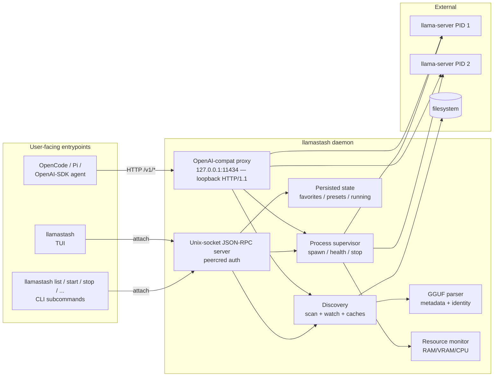
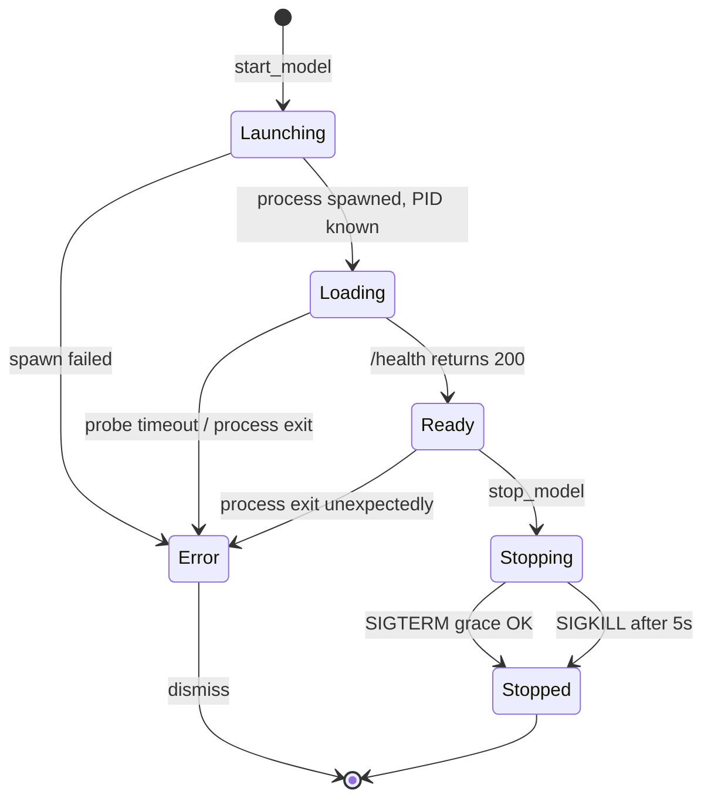

# Architecture

This is the architecture as it ships through v2. Authoritative sources for design intent and tradeoffs: [v1 plan](plans/2026-05-13-001-feat-llamatui-v1-launcher-plan.md), [v2 plan](plans/2026-05-18-001-feat-init-wizard-doctor-pull-plan.md). This document is a stable, user-readable summary of what's actually in the binary.

## v2 additions in one breath

```
llamastash init   ─┬─► detection (gpu::probe + RAM + binary locate)
                  ├─► install (GH Releases | brew | custom_path)
                  ├─► recommender (snapshot models × hardware fit × score)
                  ├─► download (hf-hub → ~/.cache/huggingface/hub/...)
                  ├─► config writer (atomic + 0600 + recursive merge + redaction)
                  ├─► smoke (phase-1 dry-run + binary --version probe)
                  └─► init_snapshot.json (sibling of state.json)

llamastash doctor ─► detection + init_snapshot diff → typed findings
llamastash pull   ─► hf-hub → HF cache layout
```

Three submodule groupings under `src/init/`:

- **Fetch substrate** — `fetch.rs` + `fetch_policy.rs` enforce the v2 fetch contract (host allowlist, redirect cap, body cap, HTTPS-only) on snapshot fetch and GH Releases install. HF traffic is carved out: `download.rs` uses the `hf-hub` crate, which talks only to `huggingface.co` and its LFS CDN — already constrained host families. `FetchClient::is_offline()` is still consulted so `--offline` / `LLAMASTASH_OFFLINE` short-circuits the HF path too.
- **Snapshots** — `snapshot.rs` owns `init_snapshot.json` (per-machine wizard record); `benchmark.rs` owns the bundled+remote `BenchmarkSnapshot` (the curated model catalog + recommender weights).
- **Wizard surface** — `detection.rs` (shared by init + doctor), `recommender.rs` (pure ranking, plus `vram_fit_for_file` used by the TUI HF picker), `install/*` (three install routes), `download.rs` (HF pull via `hf-hub`), `config_writer.rs` (atomic write + diff + redaction), `smoke.rs` (phase-1 + version probe), `wizard.rs` (6-step orchestrator), `doctor.rs` (read-only diagnostic).
- **HF Hub API client** — `hf_api.rs` issues `/api/models` search + per-repo file listing through `FetchClient` (cap, allowlist, offline branch fall out for free); pagination reads off the `Link` header but re-validates the next URL against the HF allowlist and extracts only the opaque `cursor` token. Powers the in-TUI HF pull dialog (`d`). Downloads still flow through `download.rs`'s `hf-hub` carve-out.

The TUI grows two new modules to host the dialog and its async surface:

- `tui::hf_dialog` — three-state modal (Search → File picker → Confirm), debounced live search with `query_seq` cancellation, slug-shortcut parsing via `RepoSpec::parse`, shard-collapse logic over the HF sibling listing, hardware-fit indicator pulling from the host-metrics snapshot.
- `tui::download_strip` — pinned single-line strip rendered below the info row when active; FIFO queue of pending pulls, an EMA-smoothed throughput readout, one active pull at a time, AlreadyCached short-circuit per R116.

## One binary, three roles



- **Daemon-on-demand.** The TUI and CLI both try to attach to the daemon socket first. If absent or stale, they fork/exec `llamastash daemon start` (which detaches by default) and retry with exponential backoff.
- **Socket.** Unix domain socket, mode `0600`, with peer-credential auth (`SO_PEERCRED` on Linux, `getpeereid` on macOS). Wire protocol: length-prefixed JSON-RPC 2.0 envelopes.
- **Proxy.** A loopback HTTP/1.1 listener enabled by default, no auth and no TLS. In normal mode it prefers `127.0.0.1:11435`; in Ollama-compat mode it prefers `127.0.0.1:11434`. It routes `/health`, `/v1/models`, `/v1/chat/completions`, `/v1/completions`, `/v1/embeddings`, `/v1/rerank` by resolving `body.model` through the same fuzzy resolver as `llamastash start <ref>` and forwarding byte-for-byte to the matching `llama-server` child (auto-starting it if not running; falling back to a Ready model on launch failure with `x-llamastash-served-by` + `x-llamastash-fallback-reason` headers). Same-machine threat model — LAN exposure, auth, and TLS are deferred follow-ups. Implementation: `src/proxy/`; user docs: [`usage.md §Proxy (OpenAI-compatible listener)`](usage.md#proxy-openai-compatible-listener); design: [`plans/2026-05-21-001-feat-proxy-router-plan.md`](plans/2026-05-21-001-feat-proxy-router-plan.md).
- **State separation.** XDG-aware. `$XDG_STATE_HOME/llamastash/state.json` for favorites / presets / last-params / running snapshot. `$XDG_CONFIG_HOME/llamastash/config.yaml` for user-authored config. `$XDG_CACHE_HOME/llamastash/logs/<id>-<ts>.log` for per-launch logs.

## Proxy comparison — Ollama, LM Studio, llamastash

All three engines expose an OpenAI-shape local server, so any agent that speaks the OpenAI REST contract attaches to any of them by swapping the base URL. The interesting differences are behavioral: what happens when the requested model isn't loaded yet, whether the server can keep several models resident, and what it does when a launch fails. These shape the agent experience more than the wire surface does.

- **Ollama** runs one HTTP server backed by a central `Scheduler`. Requests for an unloaded model flow through `scheduleRunner`, which asks the scheduler for a runner; if none exists, the scheduler launches one (each model is its own `llama.cpp` subprocess). Multiple runners can be resident concurrently, bounded by VRAM and the `OLLAMA_MAX_LOADED_MODELS` env. Eviction is refcount-gated with a keep-alive TTL (default 5 min). If a launch fails the request fails — Ollama treats `body.model` as exact intent and has no cross-model fallback. The `:cloud` suffix is a separate passthrough that signs and forwards requests to `ollama.com`.
- **LM Studio** uses Just-In-Time (JIT) loading: the first request to an unloaded model loads it inline. By default `Auto-Evict` is on, which means JIT keeps **one model resident at a time** — loading a new one unloads the previously JIT-loaded model (manually-loaded models are exempt). Idle TTL defaults to 60 min, resets on every request, configurable per-request via `"ttl"`. No documented fallback for load failures.
- **llamastash** auto-starts a dormant model via `route::handle_not_running` → `launch::auto_start`, with concurrent requests for the same `ModelId` coalesced through `proxy::coalesce::Coalesce`. Multiple models can stay resident at once (whatever the host fits). When a launch fails and another supervisor is already `Ready`, the proxy picks a family-MRU fallback (`pick_fallback` in `proxy/mru.rs`) and stamps `x-llamastash-served-by` + `x-llamastash-fallback-reason` (`launch_failed` for in-family substitution, `family_mismatch` for cross-arch picks). No idle-TTL eviction in v1 — models stay resident until explicit `stop_model`. The proxy serves **two API surfaces in parallel**: the OpenAI compat endpoints (`/v1/...`) are the primary inference surface, and the Ollama discovery endpoints (`/api/tags`, `/api/version`, `/api/ps`, `/api/show`) ship so Ollama-shape discovery libraries (`ollama-python` default path, `OLLAMA_HOST` env detection) recognise llamastash without code changes — see `src/proxy/ollama_compat.rs`. The Ollama *inference* endpoints (`/api/chat`, `/api/generate`, `/api/embed`) are deferred to a future plan (TODO §R2). See `src/proxy/` and [`plans/2026-05-21-001-feat-proxy-router-plan.md`](plans/2026-05-21-001-feat-proxy-router-plan.md).

| Behavior | Ollama | LM Studio | llamastash |
|---|---|---|---|
| Auto-start unloaded model | Yes (scheduler) | Yes (JIT) | Yes (`auto_start` + coalesce) |
| Multiple loaded at once | Yes, VRAM-bounded | No by default (Auto-Evict on) | Yes (whatever fits) |
| Idle TTL eviction | 5 min, refcount-gated | 60 min, request-resets | Not in v1 (R34 deferred) |
| Single-flight coalesce on concurrent first-requests | Implicit via scheduler channel | Not documented | Explicit `Coalesce` map keyed on `ModelId` |
| Fallback when load fails | None — request fails | None documented | Family-MRU pick, headers stamped (`x-llamastash-served-by` + `fallback-reason`) |
| Body pass-through (no `model` rewrite) | Re-routes by name, may rewrite | OpenAI-shape pass-through | Byte-pure forward via `StreamBody` |
| Loopback-only by default | No (configurable bind) | Yes (`127.0.0.1`) | Yes, hard-coded |
| OpenAI-compat `/v1/...` surface | Yes (added later) | Yes (primary surface) | Yes (primary surface) |
| Ollama discovery `/api/tags` etc. | Yes (native) | No | Yes — `/api/tags`, `/api/version`, `/api/ps`, `/api/show` (Tier 1) |
| Ollama inference `/api/chat`, `/api/generate` | Yes (native) | No | **Deferred** (Tier 2 — TODO §R2) |

**Two takeaways for llamastash's roadmap.** The family-MRU fallback is the one behavior neither Ollama nor LM Studio surfaces — both fail the request when a launch fails. For agents that don't read response headers the substitution is invisible, which is worth re-considering before v1 ships (do we want this to be opt-in via `proxy.fallback: false`?). The idle-TTL gap is the more concrete functional gap: both prior-art engines evict idle models so a long-running daemon doesn't pin memory forever. llamastash defers idle eviction to v2 under the broader R34 umbrella — see TODO §R1 follow-up.

## Model lifecycle



Each launch is owned by a `ManagedModel`. The supervisor health-probes `/health` every 500 ms during `Loading`; transitions to `Ready` on first 200 OK. After Ready, a longer 30 s liveness re-check runs in the background.

Per-launch logs are tee'd to a 10 MB × 5-file rotating log on disk and a 4K-line in-memory ring buffer so the TUI's Logs tab and the `logs_tail` IPC method don't need to re-open files.

`llama-server` children are started in their own session (`setsid` on Linux) so they survive daemon exit. On daemon restart, the orphan sweep re-adopts each entry in `state.running` only after three-factor confirmation:

1. PID is alive (`kill(pid, 0)` via sysinfo).
2. Recorded port answers on `127.0.0.1`.
3. The port's `/v1/models` response mentions the recorded model path.

A failed factor drops the entry from the running snapshot. Unmanaged `llama-server` processes the daemon doesn't own surface read-only in `status.external`.

## Model identity

`(canonical absolute path, BLAKE3 of GGUF header bytes)`. The header is small (up to ~1 MB); hashing it gives an identity that survives renames but doesn't fingerprint the whole weight file.

The discovery scanner emits one entry per canonical path — symlinks dedupe to their target — so the same model file doesn't appear twice. Split GGUFs (`model-00001-of-00003.gguf`) collapse into a single entry whose launch target is shard 1.

## Right pane tabs

| Model focus state | Mode | Tabs shown |
|---|---|---|
| Not launched | (n/a) | Logs only (empty/grey) |
| Launching / Loading / Error | chat / embedding / rerank | Logs |
| Ready | chat | Logs, Chat |
| Ready | embedding | Logs, Embed |
| Ready | rerank | Logs, Rerank |

The Chat / Embed / Rerank tabs hit the same OpenAI-compatible endpoints any external client would use (`/v1/chat/completions`, `/v1/embeddings`, `/v1/rerank`). This is deliberate: it proves the model is consumable by anything, not just LlamaStash's own smoke test.

## IPC surface

The daemon dispatches on `req.method`. Wire format: `{"jsonrpc": "2.0", "id": <int|null>, "method": "...", "params": {...}}`. Errors come back as JSON-RPC error objects; transport problems close the connection.

| Method | Purpose |
|---|---|
| `ping`, `version`, `shutdown` | Liveness, build metadata, graceful exit |
| `list_models` | Catalog snapshot |
| `status` | Managed launches + external + GPU info + daemon health block |
| `start_model` | Spawn supervisor for a model |
| `stop_model`, `stop_all` | Stop a managed launch / all managed launches |
| `stop_external` | Kill an unmanaged llama-server (PID must already be in the external snapshot) |
| `logs_tail` | Tail snapshot from a launch's ring buffer |
| `presets_list / save / delete / show` | Per-model named preset CRUD |
| `favorite_list / add / remove` | Favorites CRUD |
| `last_params_list` | Persisted last-successful-launch params per model |

JSON-RPC error codes follow the spec (`-32601 Method not found`, `-32602 Invalid params`, etc.) plus `InternalError` for daemon-side faults.

## Persistence shape

`state.json` is read at daemon start, written via temp-file + rename after every mutation. Top-level keys:

- `favorites: ModelId[]`
- `last_params: { <ModelId>: LaunchParams }`
- `presets: { <ModelId>: NamedPreset[] }`
- `running: RunningSnapshot[]` (PID + port + started_at + params)

Corruption → quarantine. A `state.json` that fails to parse is renamed to `state.json.broken-<unix-secs>` and the daemon starts with defaults rather than refusing to boot.

## Theming

Five themes ship in v1: Catppuccin Macchiato (default), Catppuccin Latte, Gruvbox Dark, Solarized Dark, Monochrome. Themes are static palettes hard-coded into the binary; no dynamic loading. Switch at runtime with `t`, or pin in `config.yaml`.

Status icons are dual-encoded (colour + glyph) so the TUI stays usable in monochrome terminals and for users who can't rely on colour alone:

| State | Glyph |
|---|---|
| Launching | `◌` |
| Loading | `◐` |
| Ready | `●` |
| Error | `▲` |
| Stopped | `○` |
| External (read-only) | `⇪` |

## Testing strategy

Inline `#[cfg(test)] mod tests` per source file plus an integration suite under `tests/`. The integration suite uses a `fake_llama_server` binary (built only with the `test-fixtures` cargo feature) that fakes `/health`, `/v1/models`, `/v1/chat/completions` streaming, `/v1/embeddings`, and `/v1/rerank` — so CI never needs a real llama.cpp build.

## What's not here

- Anthropic `/v1/messages`, MCP, LAN-exposed HTTP (the original v1 R34 deferral). The loopback OpenAI-compat proxy carves out only that surface; auth, TLS, network binding, and the rest of R34 stay deferred.
- Multi-user / remote / network daemon. v1 is loopback-only; v2 will require explicit opt-in.
- Daily-driver chat history; markdown rendering. The right-pane Chat tab is a single-shot smoke test.
