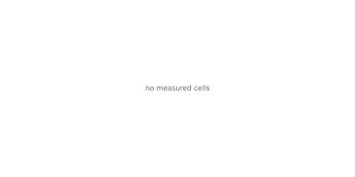

# Bench results — 2026-05-23

_Source: 1 run file(s) from host(s) deepu-flowz13-arch on backend(s) rocm._

> **First-run scope note.** This page captures the *first* hardware
> run from the new bench harness. The matrix was deliberately small:
> one model size class (`small` — `gemma-4-E2B-it-Q4_K_M.gguf`), one
> backend (AMD ROCm gfx1151, AMD Radeon 8060S / Ryzen AI Max+ 395),
> defaults mode only, two of the four workloads (`chat_turn`,
> `agent_decode`), and three of the four tools (LlamaStash, raw
> `llama-server`, Ollama). LM Studio is deferred — `lms load` does
> not accept arbitrary GGUF paths, so the same bytes must be staged
> into LM Studio's indexed library before comparable cells land
> (see [methodology.md §Per-tool fairness notes](methodology.md#per-tool-fairness-notes)).
>
> LlamaStash and raw `llama-server` use the same llama.cpp binary
> (b9282 HIP build) via `$LLAMASTASH_LLAMA_SERVER` so the comparison
> isolates the wrapper layer rather than the inference engine. All
> measured cells passed the variance gate (`stddev/mean < 10%`).

See [methodology.md](methodology.md) for the matched-pair settings policy, the variance-gate rules, and the conflict-of-interest disclaimer. Charts are deterministic SVG — re-render from the source JSONs to verify.

## small — agent_decode

| Tool | Mode | decode tok/s | TTFT | prompt tok/s | reps | status |
|---|---|---|---|---|---|---|
| llama-server (raw) | defaults | 79.8 tok/s | 58.3 ms | 963.1 tok/s | 3 | ok |
| LlamaStash | defaults | 79.9 tok/s | 55.5 ms | 1,009.1 tok/s | 3 | ok |
| Ollama | defaults | 44.3 tok/s | 224.7 ms | 253.8 tok/s | 3 | ok |

## small — chat_turn

| Tool | Mode | decode tok/s | TTFT | prompt tok/s | reps | status |
|---|---|---|---|---|---|---|
| llama-server (raw) | defaults | 79.6 tok/s | 50.6 ms | 948.2 tok/s | 3 | ok |
| LlamaStash | defaults | 80.4 tok/s | 51.5 ms | 932.2 tok/s | 3 | ok |
| Ollama | defaults | 49.4 tok/s | 221.8 ms | 221.2 tok/s | 3 | ok |

