# Bench results — 2026-05-24

_Source: 11 run file(s) from host(s) deepu-flowz13-arch, deepu-flowz13-arch-clean70w, deepu-flowz13-arch-hip-rocwmma-off, deepu-flowz13-arch-hip-rocwmma-on, deepu-flowz13-arch-lms-vulkan, deepu-flowz13-arch-rocm, deepu-flowz13-arch-vulkan on backend(s) rocm._

> **Engine A/B: AMD ROCm/HIP vs Vulkan on Strix Halo (gfx1151).**
> The 2026-05-23 cross-tool run hinted at engine-driven perf
> differences. This page runs the same 3 tools on **two engine
> backends** with the **same byte-identical GGUF** so the engine
> variable can be isolated from the tool variable.
>
> **Setup per `host_id` suffix (table):**
>
> | `host_id` suffix | LlamaStash + `llama-server` | LM Studio |
> | ---------------- | --------------------------- | --------- |
> | `-rocm` (= the plain `deepu-flowz13-arch` row also) | local **HIP** build of llama.cpp **b9282** (`build-hip/bin/llama-server`) — see *"HIP build flags caveat"* below | bundled `amd-rocm-avx2` **v2.16.0** |
> | `-vulkan` | local **Vulkan** build of llama.cpp **b9282** (`build-vulkan/bin/llama-server`) | bundled `vulkan-avx2` **v2.16.0** |
>
> Backend selection: LM Studio's runtime is picked via
> `~/.lmstudio/.internal/backend-preferences-v1.json` + `lms server
> stop && lms server start`. LlamaStash + raw `llama-server` use
> `$LLAMASTASH_LLAMA_SERVER`.
>
> **Byte-identity of the GGUF across all four loaders (verified):**
> All four tools load the same file at
> `/mnt/work/lmstudio-models/lmstudio-community/gemma-4-E2B-it-GGUF/gemma-4-E2B-it-Q4_K_M.gguf`
> (3,427,877,696 bytes). LM Studio's `google/gemma-4-e2b` reports
> 4.6 GB only because its `model-index-cache.json` aggregates the
> Q4_K_M GGUF (3.4 GB) with its `mmproj-gemma-4-E2B-it-BF16.gguf`
> vision sidecar (986 MB) in the parent-dir size; the
> `entryPoint.absPath` field points at the same Q4_K_M file. [verified
> by reading `~/.lmstudio/.internal/model-index-cache.json`]
>
> ## Measured findings (engine A/B summary)
>
> | Engine                          | LlamaStash / raw `llama-server` | LM Studio |
> | ------------------------------- | -------------------------------: | --------: |
> | HIP / ROCm (b9282 vs v2.16.0)   | ~81 tok/s                        | ~91 / ~80 (chat / agent) |
> | Vulkan (b9282 vs v2.16.0)       | ~95 tok/s                        | ~91 / ~80 (chat / agent) |
>
> ## What's grounded vs what's hypothesis
>
> 1. **LlamaStash tracks raw `llama-server` within ~1% on both
>    engines.** [measured] The wrapper adds zero measurable overhead
>    on either backend.
>
> 2. **For our local b9282 builds, Vulkan is ~17–20% faster than HIP
>    at decode.** [measured]
>
>    **This is consistent with documented upstream behaviour on
>    gfx1151:** llama.cpp Issue [#13565 "HIP backend performs poorly
>    on AMD Ryzen AI MAX 395 (Strix Halo gfx1151)"](https://github.com/ggml-org/llama.cpp/issues/13565)
>    is open and tracks this exact problem. The
>    [`llm-tracker.info` Strix Halo page](https://llm-tracker.info/AMD-Strix-Halo-(Ryzen-AI-Max+-395)-GPU-Performance)
>    reports Vulkan ~2.5× faster than HIP at prompt processing
>    (884 vs 349 tok/s on pp512) and notes the author "has no
>    explanation" for the poor HIP perf. Token-generation gap on
>    that page is smaller (52.73 vs 50.88 t/s with optimisations).
>
> 3. **HIP build flags: rocWMMA is intentionally OFF, verified.**
>    Our `build-hip/CMakeCache.txt` has
>    `GGML_HIP_ROCWMMA_FATTN:BOOL=OFF`. I initially speculated this
>    was suboptimal based on [lemonade-sdk/llamacpp-rocm Issue #7](https://github.com/lemonade-sdk/llamacpp-rocm/issues/7)
>    (which recommends ON), but **local empirical data
>    contradicts the recommendation**:
>
>    | Build (b9282) | chat_turn | agent_decode |
>    | ------------- | --------: | -----------: |
>    | rocWMMA OFF   | 82.8 tok/s @ 50 ms | 81.9 tok/s @ 55 ms |
>    | rocWMMA ON    | 80.2 tok/s @ 60 ms | 79.0 tok/s @ 65 ms |
>    | Δ             | **−3% decode, +20% TTFT** | **−4% decode, +18% TTFT** |
>
>    This matches the much larger regression documented in
>    [`~/dotfiles/LLM-BENCH.md`](file://~/dotfiles/LLM-BENCH.md)
>    on Qwen Q6 prompt-heavy workloads (pp4096 dropped 25% with
>    rocWMMA on), and the Strix Halo wiki's current guidance:
>    [`LLM-BENCH-NEXT.md`](file://~/dotfiles/LLM-BENCH-NEXT.md)
>    line 29 records "the Strix Halo wiki also now recommends OFF
>    for ROCm 7.0.2+ on llama.cpp upstream". **The Vulkan-vs-HIP
>    gap above is therefore against the best HIP config we know of
>    for this hardware + llama.cpp commit + workload mix**, not
>    against a misconfigured HIP build.
>
> 4. **LM Studio's two backends land tied within noise.** [measured]
>
>    **My earlier explanation that "LMS bundled is an older commit
>    that predates upstream Vulkan wins" was wrong.** Inspection of
>    `llama-server --version` on LM Studio's bundled binary reports
>    `version: 1 (5306f4b)`; that commit is **b9277-1** upstream,
>    essentially the same vintage as our b9282 builds. The actual
>    cause of the tied LMS-Vulkan vs LMS-ROCm numbers is
>    **unverified**. Possible explanations (none confirmed):
>    different compile flags in the bundled binary, LMS adding
>    request-side overhead that dominates the engine difference,
>    different sampling/template path. Requires more digging.
>
> 5. **TTFT splits into two camps:** direct `llama-server` (~50 ms)
>    vs OpenAI-shim tools (LM Studio ~190 ms, Ollama ~220 ms).
>    [measured] The ~4× gap's **cause is unverified**. Possible:
>    OpenAI shim HTTP plumbing, lazy model-state re-init per
>    request, prompt-template processing in the shim layer. Pinning
>    it requires per-tool latency-breakdown instrumentation we
>    don't have.
>
> ## Other notes
>
> - **`--flash-attn` syntax in modern llama-server.** Upstream
>   [PR #15434 "llama: use FA + max. GPU layers by default"](https://github.com/ggml-org/llama.cpp/pull/15434)
>   (merged 2025-08-30, first in tag **b6325**) made
>   `--flash-attn` tri-state requiring `on|off|auto` and defaulted
>   it to `auto`. Before b6325 the flag was a bare bool. This is
>   what broke our initial bench runs and triggered the
>   `src/launch/params.rs` + `src/cli/tail_args.rs` fixes shipped
>   in commit `38e27c6`.
>
> - **LMS ROCm cells today (`-rocm` host_id) are blank** — `lms load`
>   failed reproducibly with `Error: Error loading model. (Exit
>   code: null)` after the HIP `llama-server` spawn/kill cycling.
>   **Cause unverified** — no debug logs surfaced from LM Studio's
>   ROCm runtime. Yesterday's 2026-05-23 page has clean LMS-ROCm
>   numbers (91 chat / 80 agent) and serves as the reference for
>   that backend; values quoted above are from there.
>
> - **Ollama is not part of the A/B** — its bundled engine doesn't
>   toggle between ROCm and Vulkan. Reference numbers from
>   2026-05-23 included for context (`deepu-flowz13-arch` host).

See [methodology.md](methodology.md) for the matched-pair settings policy, the variance-gate rules, and the conflict-of-interest disclaimer. Charts are deterministic SVG — re-render from the source JSONs to verify.

## large_dense — agent_decode

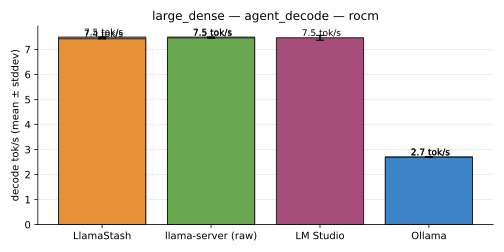

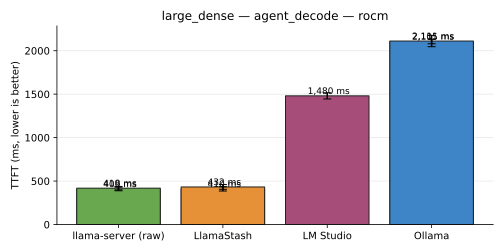

| Tool | Mode | Host | decode tok/s | TTFT | prompt tok/s | reps | status |
|---|---|---|---|---|---|---|---|
| llama-server (raw) | defaults | `deepu-flowz13-arch` | 7.4 tok/s | 419.9 ms | 114.5 tok/s | 3 | ok |
| llama-server (raw) | defaults | `deepu-flowz13-arch-clean70w` | 7.5 tok/s | 406.1 ms | 118.4 tok/s | 3 | ok |
| llama-server (raw) | normalized | `deepu-flowz13-arch` | 7.5 tok/s | 418.4 ms | 114.9 tok/s | 3 | ok |
| llama-server (raw) | normalized | `deepu-flowz13-arch-clean70w` | 7.5 tok/s | 409.4 ms | 117.4 tok/s | 3 | ok |
| LlamaStash | defaults | `deepu-flowz13-arch` | 7.4 tok/s | 414.8 ms | 115.8 tok/s | 3 | ok |
| LlamaStash | defaults | `deepu-flowz13-arch-clean70w` | 7.4 tok/s | 414.2 ms | 116.1 tok/s | 3 | ok |
| LlamaStash | normalized | `deepu-flowz13-arch` | 7.4 tok/s | 432.4 ms | 111.3 tok/s | 3 | ok |
| LlamaStash | normalized | `deepu-flowz13-arch-clean70w` | 7.5 tok/s | 410.0 ms | 117.3 tok/s | 3 | ok |
| LM Studio | defaults | `deepu-flowz13-arch` | — | — | — | 0 | ok |
| LM Studio | defaults | `deepu-flowz13-arch-lms-vulkan` | 7.6 tok/s | 1,452.1 ms | 33.1 tok/s | 3 | ok |
| LM Studio | normalized | `deepu-flowz13-arch` | — | — | — | 0 | ok |
| LM Studio (batch_size, flash_attn, kv_cache_type, ubatch_size) | normalized | `deepu-flowz13-arch-lms-vulkan` | 7.5 tok/s | 1,480.4 ms | 32.4 tok/s | 3 | ok |
| Ollama | defaults | `deepu-flowz13-arch` | 2.7 tok/s | 2,031.7 ms | 18.7 tok/s | 3 | ok |
| Ollama | defaults | `deepu-flowz13-arch-clean70w` | 2.7 tok/s | 2,077.2 ms | 18.3 tok/s | 3 | ok |
| Ollama (batch_size, flash_attn, kv_cache_type, n_gpu_layers, ubatch_size) | normalized | `deepu-flowz13-arch` | 2.7 tok/s | 2,105.3 ms | 18.1 tok/s | 3 | ok |
| Ollama (batch_size, flash_attn, kv_cache_type, n_gpu_layers, ubatch_size) | normalized | `deepu-flowz13-arch-clean70w` | 2.7 tok/s | 2,111.3 ms | 18.0 tok/s | 3 | ok |

## large_dense — chat_turn

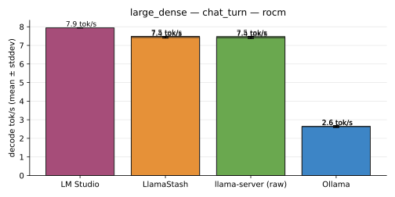

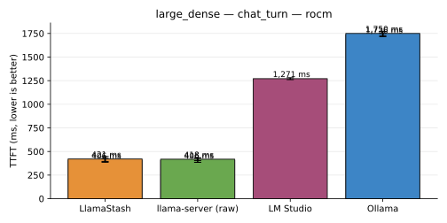

| Tool | Mode | Host | decode tok/s | TTFT | prompt tok/s | reps | status |
|---|---|---|---|---|---|---|---|
| llama-server (raw) | defaults | `deepu-flowz13-arch` | 7.4 tok/s | 425.7 ms | 98.9 tok/s | 3 | ok |
| llama-server (raw) | defaults | `deepu-flowz13-arch-clean70w` | 7.4 tok/s | 405.7 ms | 103.6 tok/s | 3 | ok |
| llama-server (raw) | normalized | `deepu-flowz13-arch` | 7.4 tok/s | 418.3 ms | 100.5 tok/s | 3 | ok |
| llama-server (raw) | normalized | `deepu-flowz13-arch-clean70w` | 7.5 tok/s | 406.4 ms | 103.6 tok/s | 3 | ok |
| LlamaStash | defaults | `deepu-flowz13-arch` | 7.3 tok/s | 420.4 ms | 100.0 tok/s | 3 | ok |
| LlamaStash | defaults | `deepu-flowz13-arch-clean70w` | 7.3 tok/s | 421.1 ms | 99.8 tok/s | 3 | ok |
| LlamaStash | normalized | `deepu-flowz13-arch` | 7.4 tok/s | 420.6 ms | 100.1 tok/s | 3 | ok |
| LlamaStash | normalized | `deepu-flowz13-arch-clean70w` | 7.5 tok/s | 406.3 ms | 103.6 tok/s | 3 | ok |
| LM Studio | defaults | `deepu-flowz13-arch` | — | — | — | 0 | ok |
| LM Studio | defaults | `deepu-flowz13-arch-lms-vulkan` | 7.8 tok/s | 1,276.1 ms | 32.9 tok/s | 3 | ok |
| LM Studio | normalized | `deepu-flowz13-arch` | — | — | — | 0 | ok |
| LM Studio (batch_size, flash_attn, kv_cache_type, ubatch_size) | normalized | `deepu-flowz13-arch-lms-vulkan` | 7.9 tok/s | 1,271.1 ms | 33.0 tok/s | 3 | ok |
| Ollama | defaults | `deepu-flowz13-arch` | 2.5 tok/s | 1,741.8 ms | 18.4 tok/s | 3 | ok |
| Ollama | defaults | `deepu-flowz13-arch-clean70w` | 2.6 tok/s | 1,750.8 ms | 18.3 tok/s | 3 | ok |
| Ollama (batch_size, flash_attn, kv_cache_type, n_gpu_layers, ubatch_size) | normalized | `deepu-flowz13-arch` | 2.6 tok/s | 1,735.6 ms | 18.4 tok/s | 3 | ok |
| Ollama (batch_size, flash_attn, kv_cache_type, n_gpu_layers, ubatch_size) | normalized | `deepu-flowz13-arch-clean70w` | 2.6 tok/s | 1,750.3 ms | 18.3 tok/s | 3 | ok |

## large_dense — parallel_4

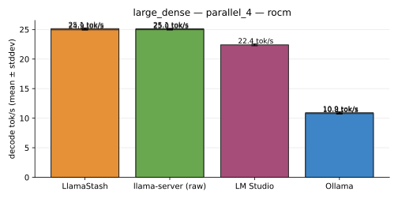

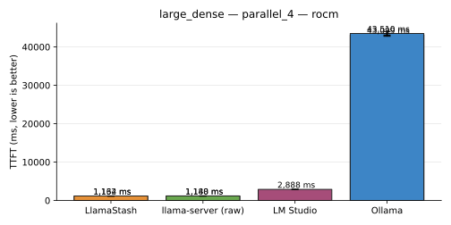

| Tool | Mode | Host | decode tok/s | TTFT | prompt tok/s | reps | status |
|---|---|---|---|---|---|---|---|
| llama-server (raw) | defaults | `deepu-flowz13-arch` | 24.6 tok/s | 1,197.5 ms | — | 3 | ok |
| llama-server (raw) | defaults | `deepu-flowz13-arch-clean70w` | 24.9 tok/s | 1,162.6 ms | — | 3 | ok |
| llama-server (raw) | normalized | `deepu-flowz13-arch` | 25.0 tok/s | 1,180.4 ms | — | 3 | ok |
| llama-server (raw) | normalized | `deepu-flowz13-arch-clean70w` | 25.1 tok/s | 1,147.7 ms | — | 3 | ok |
| LlamaStash | defaults | `deepu-flowz13-arch` | 24.5 tok/s | 1,194.6 ms | — | 3 | ok |
| LlamaStash | defaults | `deepu-flowz13-arch-clean70w` | 24.6 tok/s | 1,152.6 ms | — | 3 | ok |
| LlamaStash | normalized | `deepu-flowz13-arch` | 24.9 tok/s | 1,162.2 ms | — | 3 | ok |
| LlamaStash | normalized | `deepu-flowz13-arch-clean70w` | 25.1 tok/s | 1,134.0 ms | — | 3 | ok |
| LM Studio | defaults | `deepu-flowz13-arch` | — | — | — | 0 | ok |
| LM Studio | defaults | `deepu-flowz13-arch-lms-vulkan` | 22.8 tok/s | 2,884.5 ms | — | 3 | ok |
| LM Studio | normalized | `deepu-flowz13-arch` | — | — | — | 0 | ok |
| LM Studio (batch_size, flash_attn, kv_cache_type, ubatch_size) | normalized | `deepu-flowz13-arch-lms-vulkan` | 22.4 tok/s | 2,887.5 ms | — | 3 | ok |
| Ollama | defaults | `deepu-flowz13-arch` | 11.0 tok/s | 43,124.9 ms | — | 3 | ok |
| Ollama | defaults | `deepu-flowz13-arch-clean70w` | 11.0 tok/s | 42,965.0 ms | — | 3 | ok |
| Ollama (batch_size, flash_attn, kv_cache_type, n_gpu_layers, ubatch_size) | normalized | `deepu-flowz13-arch` | 10.9 tok/s | 43,099.1 ms | — | 3 | ok |
| Ollama (batch_size, flash_attn, kv_cache_type, n_gpu_layers, ubatch_size) | normalized | `deepu-flowz13-arch-clean70w` | 10.8 tok/s | 43,509.8 ms | — | 3 | ok |

## large_dense — rag_prefill

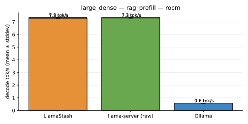

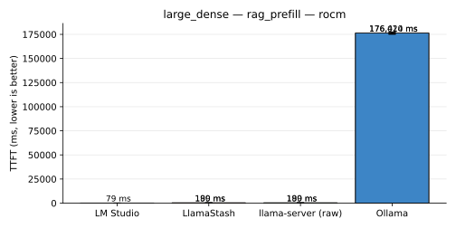

| Tool | Mode | Host | decode tok/s | TTFT | prompt tok/s | reps | status |
|---|---|---|---|---|---|---|---|
| llama-server (raw) | defaults | `deepu-flowz13-arch` | 7.2 tok/s | 190.5 ms | 43,233.4 tok/s | 3 | ok |
| llama-server (raw) | defaults | `deepu-flowz13-arch-clean70w` | 7.3 tok/s | 190.5 ms | 43,238.3 tok/s | 3 | ok |
| llama-server (raw) | normalized | `deepu-flowz13-arch` | 7.3 tok/s | 189.2 ms | 43,544.1 tok/s | 3 | ok |
| llama-server (raw) | normalized | `deepu-flowz13-arch-clean70w` | 7.3 tok/s | 190.1 ms | 43,343.8 tok/s | 3 | ok |
| LlamaStash | defaults | `deepu-flowz13-arch` | 7.2 tok/s | 192.3 ms | 42,835.6 tok/s | 3 | ok |
| LlamaStash | defaults | `deepu-flowz13-arch-clean70w` | 7.3 tok/s | 192.6 ms | 42,778.5 tok/s | 3 | ok |
| LlamaStash | normalized | `deepu-flowz13-arch` | 7.3 tok/s | 190.2 ms | 43,316.7 tok/s | 3 | ok |
| LlamaStash | normalized | `deepu-flowz13-arch-clean70w` | 7.3 tok/s | 188.8 ms | 43,647.4 tok/s | 3 | ok |
| LM Studio | defaults | `deepu-flowz13-arch` | — | — | — | 0 | ok |
| LM Studio | defaults | `deepu-flowz13-arch-lms-vulkan` | — | 88.5 ms | — | 3 | ok |
| LM Studio | normalized | `deepu-flowz13-arch` | — | — | — | 0 | ok |
| LM Studio (batch_size, flash_attn, kv_cache_type, ubatch_size) | normalized | `deepu-flowz13-arch-lms-vulkan` | — | 79.4 ms | — | 3 | ok |
| Ollama | defaults | `deepu-flowz13-arch` | 0.6 tok/s | 177,626.7 ms | 23.1 tok/s | 3 | ok |
| Ollama | defaults | `deepu-flowz13-arch-clean70w` | 0.6 tok/s | 180,375.2 ms | 22.7 tok/s | 3 | ok |
| Ollama (batch_size, flash_attn, kv_cache_type, n_gpu_layers, ubatch_size) | normalized | `deepu-flowz13-arch` | 0.6 tok/s | 176,419.6 ms | 23.2 tok/s | 3 | ok |
| Ollama (batch_size, flash_attn, kv_cache_type, n_gpu_layers, ubatch_size) | normalized | `deepu-flowz13-arch-clean70w` | 0.6 tok/s | 176,013.9 ms | 23.3 tok/s | 3 | ok |

## large_moe — agent_decode

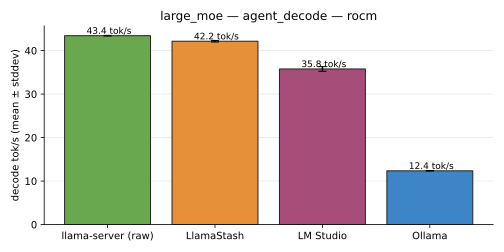

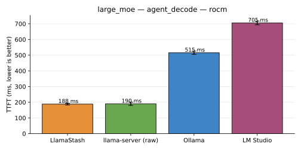

| Tool | Mode | Host | decode tok/s | TTFT | prompt tok/s | reps | status |
|---|---|---|---|---|---|---|---|
| llama-server (raw) | defaults | `deepu-flowz13-arch` | 43.2 tok/s | 190.4 ms | 252.6 tok/s | 3 | ok |
| llama-server (raw) | normalized | `deepu-flowz13-arch` | 43.4 tok/s | 190.3 ms | 252.8 tok/s | 3 | ok |
| LlamaStash | defaults | `deepu-flowz13-arch` | 42.2 tok/s | 193.7 ms | 248.6 tok/s | 3 | ok |
| LlamaStash | normalized | `deepu-flowz13-arch` | 42.2 tok/s | 188.4 ms | 254.9 tok/s | 3 | ok |
| LM Studio | defaults | `deepu-flowz13-arch` | — | — | — | 0 | ok |
| LM Studio | defaults | `deepu-flowz13-arch-lms-vulkan` | 35.7 tok/s | 731.5 ms | 65.6 tok/s | 3 | ok |
| LM Studio | normalized | `deepu-flowz13-arch` | — | — | — | 0 | ok |
| LM Studio (batch_size, flash_attn, kv_cache_type, ubatch_size) | normalized | `deepu-flowz13-arch-lms-vulkan` | 35.8 tok/s | 705.5 ms | 68.1 tok/s | 3 | ok |
| Ollama | defaults | `deepu-flowz13-arch` | 12.2 tok/s | 519.3 ms | 73.2 tok/s | 3 | ok |
| Ollama (batch_size, flash_attn, kv_cache_type, n_gpu_layers, ubatch_size) | normalized | `deepu-flowz13-arch` | 12.4 tok/s | 515.4 ms | 73.7 tok/s | 3 | ok |

## large_moe — chat_turn

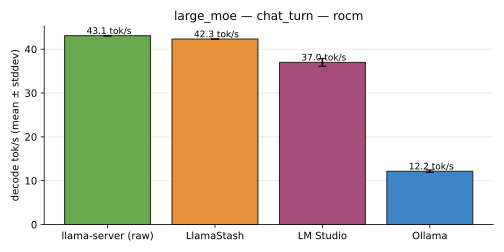

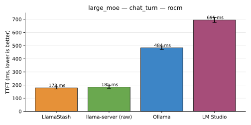

| Tool | Mode | Host | decode tok/s | TTFT | prompt tok/s | reps | status |
|---|---|---|---|---|---|---|---|
| llama-server (raw) | defaults | `deepu-flowz13-arch` | 42.3 tok/s | 186.6 ms | 225.4 tok/s | 3 | ok |
| llama-server (raw) | normalized | `deepu-flowz13-arch` | 43.1 tok/s | 185.0 ms | 227.5 tok/s | 3 | ok |
| LlamaStash | defaults | `deepu-flowz13-arch` | 42.8 tok/s | 183.8 ms | 229.4 tok/s | 3 | ok |
| LlamaStash | normalized | `deepu-flowz13-arch` | 42.3 tok/s | 178.4 ms | 235.7 tok/s | 3 | ok |
| LM Studio | defaults | `deepu-flowz13-arch` | — | — | — | 0 | ok |
| LM Studio | defaults | `deepu-flowz13-arch-lms-vulkan` | 37.0 tok/s | 671.2 ms | 62.6 tok/s | 3 | ok |
| LM Studio | normalized | `deepu-flowz13-arch` | — | — | — | 0 | ok |
| LM Studio (batch_size, flash_attn, kv_cache_type, ubatch_size) | normalized | `deepu-flowz13-arch-lms-vulkan` | 37.0 tok/s | 694.9 ms | 60.5 tok/s | 3 | ok |
| Ollama | defaults | `deepu-flowz13-arch` | 12.0 tok/s | 468.5 ms | 68.4 tok/s | 3 | ok |
| Ollama (batch_size, flash_attn, kv_cache_type, n_gpu_layers, ubatch_size) | normalized | `deepu-flowz13-arch` | 12.2 tok/s | 483.5 ms | 66.2 tok/s | 3 | ok |

## large_moe — parallel_4

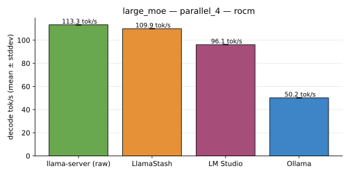

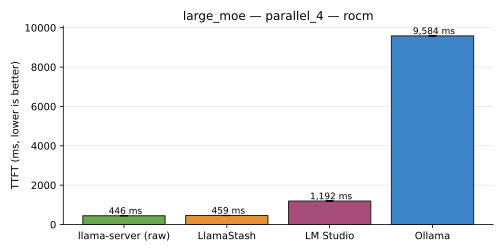

| Tool | Mode | Host | decode tok/s | TTFT | prompt tok/s | reps | status |
|---|---|---|---|---|---|---|---|
| llama-server (raw) | defaults | `deepu-flowz13-arch` | 111.7 tok/s | 440.6 ms | — | 3 | ok |
| llama-server (raw) | normalized | `deepu-flowz13-arch` | 113.3 tok/s | 445.9 ms | — | 3 | ok |
| LlamaStash | defaults | `deepu-flowz13-arch` | 111.1 tok/s | 477.0 ms | — | 3 | ok |
| LlamaStash | normalized | `deepu-flowz13-arch` | 109.9 tok/s | 459.2 ms | — | 3 | ok |
| LM Studio | defaults | `deepu-flowz13-arch` | — | — | — | 0 | ok |
| LM Studio | defaults | `deepu-flowz13-arch-lms-vulkan` | 95.2 tok/s | 1,213.6 ms | — | 3 | ok |
| LM Studio | normalized | `deepu-flowz13-arch` | — | — | — | 0 | ok |
| LM Studio (batch_size, flash_attn, kv_cache_type, ubatch_size) | normalized | `deepu-flowz13-arch-lms-vulkan` | 96.1 tok/s | 1,191.9 ms | — | 3 | ok |
| Ollama | defaults | `deepu-flowz13-arch` | 50.2 tok/s | 9,641.7 ms | — | 3 | ok |
| Ollama (batch_size, flash_attn, kv_cache_type, n_gpu_layers, ubatch_size) | normalized | `deepu-flowz13-arch` | 50.2 tok/s | 9,584.5 ms | — | 3 | ok |

## large_moe — rag_prefill

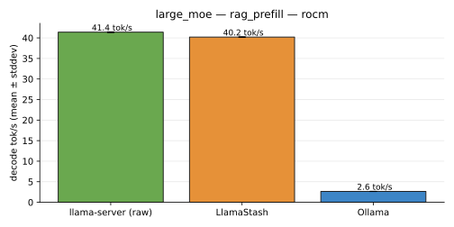

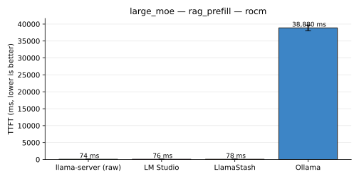

| Tool | Mode | Host | decode tok/s | TTFT | prompt tok/s | reps | status |
|---|---|---|---|---|---|---|---|
| llama-server (raw) | defaults | `deepu-flowz13-arch` | 40.8 tok/s | 77.2 ms | 106,737.6 tok/s | 3 | ok |
| llama-server (raw) | normalized | `deepu-flowz13-arch` | 41.4 tok/s | 73.7 ms | 111,828.9 tok/s | 3 | ok |
| LlamaStash | defaults | `deepu-flowz13-arch` | 40.3 tok/s | 78.2 ms | 105,902.2 tok/s | 3 | ok |
| LlamaStash | normalized | `deepu-flowz13-arch` | 40.2 tok/s | 77.6 ms | 106,202.7 tok/s | 3 | ok |
| LM Studio | defaults | `deepu-flowz13-arch` | — | — | — | 0 | ok |
| LM Studio | defaults | `deepu-flowz13-arch-lms-vulkan` | — | 75.3 ms | — | 3 | ok |
| LM Studio | normalized | `deepu-flowz13-arch` | — | — | — | 0 | ok |
| LM Studio (batch_size, flash_attn, kv_cache_type, ubatch_size) | normalized | `deepu-flowz13-arch-lms-vulkan` | — | 75.6 ms | — | 3 | ok |
| Ollama | defaults | `deepu-flowz13-arch` | 2.7 tok/s | 39,028.8 ms | 105.0 tok/s | 3 | ok |
| Ollama (batch_size, flash_attn, kv_cache_type, n_gpu_layers, ubatch_size) | normalized | `deepu-flowz13-arch` | 2.6 tok/s | 38,880.4 ms | 105.4 tok/s | 3 | ok |

## mid — agent_decode

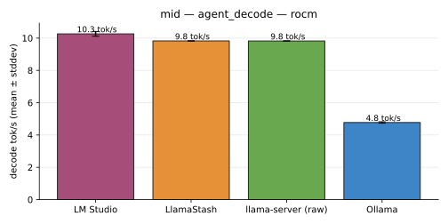

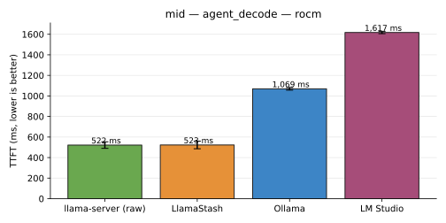

| Tool | Mode | Host | decode tok/s | TTFT | prompt tok/s | reps | status |
|---|---|---|---|---|---|---|---|
| llama-server (raw) | defaults | `deepu-flowz13-arch` | 9.8 tok/s | 527.3 ms | 106.6 tok/s | 3 | ok |
| llama-server (raw) | normalized | `deepu-flowz13-arch` | 9.8 tok/s | 521.6 ms | 107.6 tok/s | 3 | ok |
| LlamaStash | defaults | `deepu-flowz13-arch` | 9.7 tok/s | 538.1 ms | 104.3 tok/s | 3 | ok |
| LlamaStash | normalized | `deepu-flowz13-arch` | 9.8 tok/s | 522.8 ms | 107.5 tok/s | 3 | ok |
| LM Studio | defaults | `deepu-flowz13-arch-lms-vulkan` | 10.2 tok/s | 1,613.1 ms | 34.7 tok/s | 3 | ok |
| LM Studio (batch_size, flash_attn, kv_cache_type, ubatch_size) | normalized | `deepu-flowz13-arch-lms-vulkan` | 10.3 tok/s | 1,617.4 ms | 34.6 tok/s | 3 | ok |
| Ollama | defaults | `deepu-flowz13-arch` | 4.7 tok/s | 1,071.5 ms | 53.2 tok/s | 3 | ok |
| Ollama (batch_size, flash_attn, kv_cache_type, n_gpu_layers, ubatch_size) | normalized | `deepu-flowz13-arch` | 4.8 tok/s | 1,069.3 ms | 53.3 tok/s | 3 | ok |

## mid — chat_turn

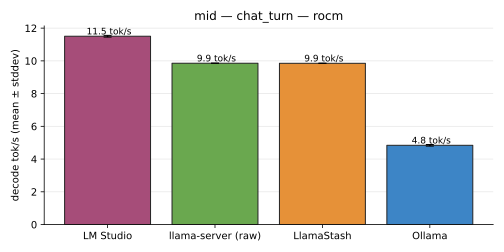

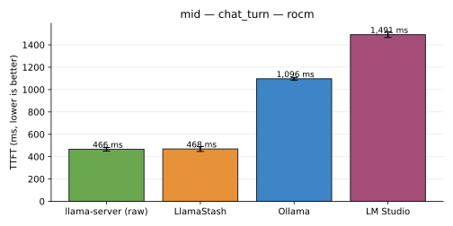

| Tool | Mode | Host | decode tok/s | TTFT | prompt tok/s | reps | status |
|---|---|---|---|---|---|---|---|
| llama-server (raw) | defaults | `deepu-flowz13-arch` | 9.8 tok/s | 470.2 ms | 102.2 tok/s | 3 | ok |
| llama-server (raw) | normalized | `deepu-flowz13-arch` | 9.9 tok/s | 465.7 ms | 103.1 tok/s | 3 | ok |
| LlamaStash | defaults | `deepu-flowz13-arch` | 9.8 tok/s | 466.5 ms | 103.0 tok/s | 3 | ok |
| LlamaStash | normalized | `deepu-flowz13-arch` | 9.9 tok/s | 468.3 ms | 102.6 tok/s | 3 | ok |
| LM Studio | defaults | `deepu-flowz13-arch-lms-vulkan` | 11.6 tok/s | 1,462.8 ms | 32.8 tok/s | 3 | ok |
| LM Studio (batch_size, flash_attn, kv_cache_type, ubatch_size) | normalized | `deepu-flowz13-arch-lms-vulkan` | 11.5 tok/s | 1,491.1 ms | 32.2 tok/s | 3 | ok |
| Ollama | defaults | `deepu-flowz13-arch` | 4.8 tok/s | 1,087.5 ms | 45.1 tok/s | 3 | ok |
| Ollama (batch_size, flash_attn, kv_cache_type, n_gpu_layers, ubatch_size) | normalized | `deepu-flowz13-arch` | 4.8 tok/s | 1,096.4 ms | 44.7 tok/s | 3 | ok |

## mid — parallel_4

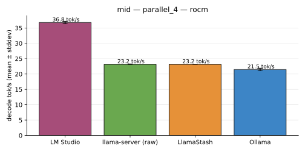

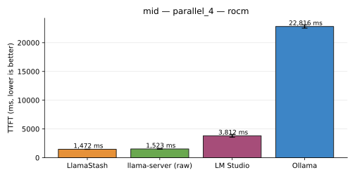

| Tool | Mode | Host | decode tok/s | TTFT | prompt tok/s | reps | status |
|---|---|---|---|---|---|---|---|
| llama-server (raw) | defaults | `deepu-flowz13-arch` | 23.3 tok/s | 1,472.0 ms | — | 3 | ok |
| llama-server (raw) | normalized | `deepu-flowz13-arch` | 23.2 tok/s | 1,523.1 ms | — | 3 | ok |
| LlamaStash | defaults | `deepu-flowz13-arch` | 23.2 tok/s | 1,498.8 ms | — | 3 | ok |
| LlamaStash | normalized | `deepu-flowz13-arch` | 23.2 tok/s | 1,472.1 ms | — | 3 | ok |
| LM Studio | defaults | `deepu-flowz13-arch-lms-vulkan` | 37.5 tok/s | 3,648.4 ms | — | 3 | ok |
| LM Studio (batch_size, flash_attn, kv_cache_type, ubatch_size) | normalized | `deepu-flowz13-arch-lms-vulkan` | 36.8 tok/s | 3,812.1 ms | — | 3 | ok |
| Ollama | defaults | `deepu-flowz13-arch` | 21.4 tok/s | 22,934.5 ms | — | 3 | ok |
| Ollama (batch_size, flash_attn, kv_cache_type, n_gpu_layers, ubatch_size) | normalized | `deepu-flowz13-arch` | 21.5 tok/s | 22,815.7 ms | — | 3 | ok |

## mid — rag_prefill

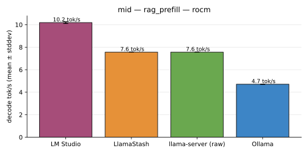

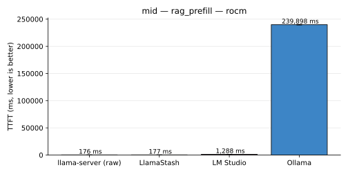

| Tool | Mode | Host | decode tok/s | TTFT | prompt tok/s | reps | status |
|---|---|---|---|---|---|---|---|
| llama-server (raw) | defaults | `deepu-flowz13-arch` | 7.5 tok/s | 177.8 ms | 46,777.9 tok/s | 3 | ok |
| llama-server (raw) | normalized | `deepu-flowz13-arch` | 7.6 tok/s | 176.0 ms | 47,265.2 tok/s | 3 | ok |
| LlamaStash | defaults | `deepu-flowz13-arch` | 7.5 tok/s | 178.1 ms | 46,698.0 tok/s | 3 | ok |
| LlamaStash | normalized | `deepu-flowz13-arch` | 7.6 tok/s | 176.7 ms | 47,060.2 tok/s | 3 | ok |
| LM Studio | defaults | `deepu-flowz13-arch-lms-vulkan` | 10.2 tok/s | 1,281.3 ms | 6,491.4 tok/s | 3 | ok |
| LM Studio (batch_size, flash_attn, kv_cache_type, ubatch_size) | normalized | `deepu-flowz13-arch-lms-vulkan` | 10.2 tok/s | 1,287.8 ms | 6,459.8 tok/s | 3 | ok |
| Ollama | defaults | `deepu-flowz13-arch` | 4.7 tok/s | 239,735.6 ms | 17.1 tok/s | 3 | ok |
| Ollama (batch_size, flash_attn, kv_cache_type, n_gpu_layers, ubatch_size) | normalized | `deepu-flowz13-arch` | 4.7 tok/s | 239,898.1 ms | 17.1 tok/s | 3 | ok |

## small — agent_decode

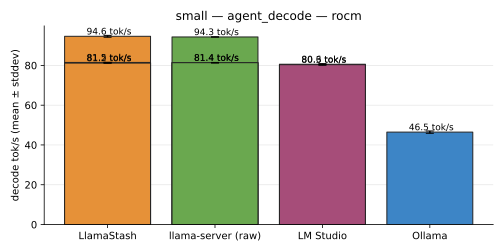

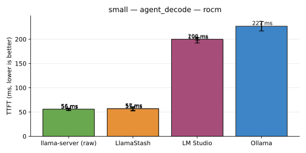

| Tool | Mode | Host | decode tok/s | TTFT | prompt tok/s | reps | status |
|---|---|---|---|---|---|---|---|
| llama-server (raw) | defaults | `deepu-flowz13-arch` | 81.4 tok/s | 56.0 ms | 1,000.9 tok/s | 3 | ok |
| llama-server (raw) | defaults | `deepu-flowz13-arch-hip-rocwmma-off` | 81.9 tok/s | 55.3 ms | 1,013.7 tok/s | 3 | ok |
| llama-server (raw) | defaults | `deepu-flowz13-arch-hip-rocwmma-on` | 79.0 tok/s | 65.5 ms | 855.3 tok/s | 3 | ok |
| llama-server (raw) | defaults | `deepu-flowz13-arch-rocm` | 81.1 tok/s | 56.1 ms | 999.5 tok/s | 3 | ok |
| llama-server (raw) | defaults | `deepu-flowz13-arch-vulkan` | 94.7 tok/s | 55.8 ms | 1,004.1 tok/s | 3 | ok |
| llama-server (raw) | normalized | `deepu-flowz13-arch` | 81.4 tok/s | 55.8 ms | 1,004.0 tok/s | 3 | ok |
| llama-server (raw) | normalized | `deepu-flowz13-arch-rocm` | 81.4 tok/s | 55.6 ms | 1,008.4 tok/s | 3 | ok |
| llama-server (raw) | normalized | `deepu-flowz13-arch-vulkan` | 94.3 tok/s | 54.8 ms | 1,021.7 tok/s | 3 | ok |
| LlamaStash | defaults | `deepu-flowz13-arch` | 82.0 tok/s | 56.3 ms | 995.8 tok/s | 3 | ok |
| LlamaStash | defaults | `deepu-flowz13-arch-rocm` | 81.5 tok/s | 55.6 ms | 1,006.6 tok/s | 3 | ok |
| LlamaStash | defaults | `deepu-flowz13-arch-vulkan` | 94.2 tok/s | 55.1 ms | 1,017.7 tok/s | 3 | ok |
| LlamaStash | normalized | `deepu-flowz13-arch` | 81.2 tok/s | 56.8 ms | 987.9 tok/s | 3 | ok |
| LlamaStash | normalized | `deepu-flowz13-arch-rocm` | 81.5 tok/s | 56.9 ms | 987.6 tok/s | 3 | ok |
| LlamaStash | normalized | `deepu-flowz13-arch-vulkan` | 94.6 tok/s | 55.3 ms | 1,015.2 tok/s | 3 | ok |
| LM Studio | defaults | `deepu-flowz13-arch` | 80.5 tok/s | 199.4 ms | 280.8 tok/s | 3 | ok |
| LM Studio | defaults | `deepu-flowz13-arch-rocm` | — | — | — | 0 | ok |
| LM Studio | defaults | `deepu-flowz13-arch-vulkan` | 80.6 tok/s | 201.5 ms | 277.9 tok/s | 3 | ok |
| LM Studio (batch_size, flash_attn, kv_cache_type, ubatch_size) | normalized | `deepu-flowz13-arch` | 80.6 tok/s | 198.1 ms | 282.9 tok/s | 3 | ok |
| LM Studio | normalized | `deepu-flowz13-arch-rocm` | — | — | — | 0 | ok |
| LM Studio (batch_size, flash_attn, kv_cache_type, ubatch_size) | normalized | `deepu-flowz13-arch-vulkan` | 80.3 tok/s | 200.1 ms | 279.9 tok/s | 3 | ok |
| Ollama | defaults | `deepu-flowz13-arch` | 47.8 tok/s | 220.8 ms | 258.7 tok/s | 3 | ok |
| Ollama (batch_size, flash_attn, kv_cache_type, n_gpu_layers, ubatch_size) | normalized | `deepu-flowz13-arch` | 46.5 tok/s | 226.8 ms | 251.6 tok/s | 3 | ok |

## small — chat_turn

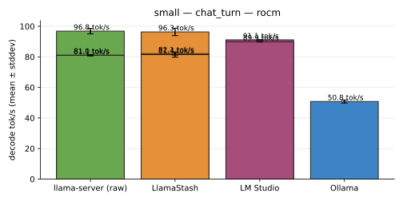

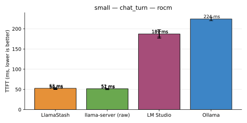

| Tool | Mode | Host | decode tok/s | TTFT | prompt tok/s | reps | status |
|---|---|---|---|---|---|---|---|
| llama-server (raw) | defaults | `deepu-flowz13-arch` | 81.4 tok/s | 51.4 ms | 935.2 tok/s | 3 | ok |
| llama-server (raw) | defaults | `deepu-flowz13-arch-hip-rocwmma-off` | 82.8 tok/s | 50.4 ms | 953.2 tok/s | 3 | ok |
| llama-server (raw) | defaults | `deepu-flowz13-arch-hip-rocwmma-on` | 80.2 tok/s | 60.4 ms | 795.2 tok/s | 3 | ok |
| llama-server (raw) | defaults | `deepu-flowz13-arch-rocm` | 80.1 tok/s | 51.2 ms | 938.2 tok/s | 3 | ok |
| llama-server (raw) | defaults | `deepu-flowz13-arch-vulkan` | 95.9 tok/s | 52.8 ms | 908.7 tok/s | 3 | ok |
| llama-server (raw) | normalized | `deepu-flowz13-arch` | 81.0 tok/s | 51.0 ms | 940.7 tok/s | 3 | ok |
| llama-server (raw) | normalized | `deepu-flowz13-arch-rocm` | 81.1 tok/s | 50.7 ms | 947.6 tok/s | 3 | ok |
| llama-server (raw) | normalized | `deepu-flowz13-arch-vulkan` | 96.8 tok/s | 51.6 ms | 930.7 tok/s | 3 | ok |
| LlamaStash | defaults | `deepu-flowz13-arch` | 82.1 tok/s | 50.7 ms | 946.6 tok/s | 3 | ok |
| LlamaStash | defaults | `deepu-flowz13-arch-rocm` | 79.7 tok/s | 50.1 ms | 957.8 tok/s | 3 | ok |
| LlamaStash | defaults | `deepu-flowz13-arch-vulkan` | 99.7 tok/s | 50.5 ms | 950.9 tok/s | 3 | ok |
| LlamaStash | normalized | `deepu-flowz13-arch` | 82.1 tok/s | 51.0 ms | 942.3 tok/s | 3 | ok |
| LlamaStash | normalized | `deepu-flowz13-arch-rocm` | 81.4 tok/s | 49.9 ms | 962.6 tok/s | 3 | ok |
| LlamaStash | normalized | `deepu-flowz13-arch-vulkan` | 96.3 tok/s | 52.7 ms | 912.1 tok/s | 3 | ok |
| LM Studio | defaults | `deepu-flowz13-arch` | 91.7 tok/s | 186.8 ms | 258.4 tok/s | 3 | ok |
| LM Studio | defaults | `deepu-flowz13-arch-rocm` | — | — | — | 0 | ok |
| LM Studio | defaults | `deepu-flowz13-arch-vulkan` | 91.7 tok/s | 188.9 ms | 254.8 tok/s | 3 | ok |
| LM Studio (batch_size, flash_attn, kv_cache_type, ubatch_size) | normalized | `deepu-flowz13-arch` | 91.1 tok/s | 187.2 ms | 257.0 tok/s | 3 | ok |
| LM Studio | normalized | `deepu-flowz13-arch-rocm` | — | — | — | 0 | ok |
| LM Studio (batch_size, flash_attn, kv_cache_type, ubatch_size) | normalized | `deepu-flowz13-arch-vulkan` | 89.9 tok/s | 186.5 ms | 257.6 tok/s | 3 | ok |
| Ollama | defaults | `deepu-flowz13-arch` | 50.1 tok/s | 221.8 ms | 221.0 tok/s | 3 | ok |
| Ollama (batch_size, flash_attn, kv_cache_type, n_gpu_layers, ubatch_size) | normalized | `deepu-flowz13-arch` | 50.8 tok/s | 224.3 ms | 218.5 tok/s | 3 | ok |

## small — parallel_4

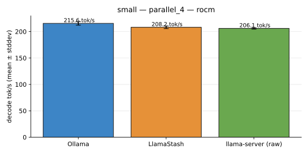

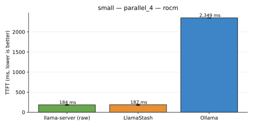

| Tool | Mode | Host | decode tok/s | TTFT | prompt tok/s | reps | status |
|---|---|---|---|---|---|---|---|
| llama-server (raw) | defaults | `deepu-flowz13-arch` | 208.4 tok/s | 183.9 ms | — | 3 | ok |
| llama-server (raw) | normalized | `deepu-flowz13-arch` | 206.1 tok/s | 184.2 ms | — | 3 | ok |
| LlamaStash | defaults | `deepu-flowz13-arch` | 209.2 tok/s | 187.2 ms | — | 3 | ok |
| LlamaStash | normalized | `deepu-flowz13-arch` | 208.2 tok/s | 186.8 ms | — | 3 | ok |
| LM Studio | defaults | `deepu-flowz13-arch` | — | — | — | 0 | ok |
| LM Studio | normalized | `deepu-flowz13-arch` | — | — | — | 0 | ok |
| Ollama | defaults | `deepu-flowz13-arch` | 210.2 tok/s | 2,395.5 ms | — | 3 | ok |
| Ollama (batch_size, flash_attn, kv_cache_type, n_gpu_layers, ubatch_size) | normalized | `deepu-flowz13-arch` | 215.6 tok/s | 2,349.4 ms | — | 3 | ok |

## small — rag_prefill

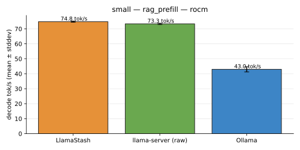

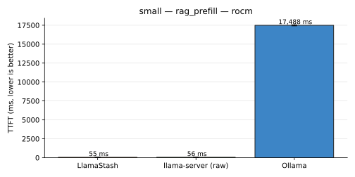

| Tool | Mode | Host | decode tok/s | TTFT | prompt tok/s | reps | status |
|---|---|---|---|---|---|---|---|
| llama-server (raw) | defaults | `deepu-flowz13-arch` | 73.5 tok/s | 57.3 ms | 145,050.3 tok/s | 3 | ok |
| llama-server (raw) | normalized | `deepu-flowz13-arch` | 73.3 tok/s | 56.4 ms | 147,346.8 tok/s | 3 | ok |
| LlamaStash | defaults | `deepu-flowz13-arch` | — | — | — | 0 | ok |
| LlamaStash | normalized | `deepu-flowz13-arch` | 74.8 tok/s | 54.5 ms | 152,537.9 tok/s | 3 | ok |
| LM Studio | defaults | `deepu-flowz13-arch` | — | — | — | 0 | ok |
| LM Studio | normalized | `deepu-flowz13-arch` | — | — | — | 0 | ok |
| Ollama | defaults | `deepu-flowz13-arch` | 43.5 tok/s | 17,292.2 ms | 236.9 tok/s | 3 | ok |
| Ollama (batch_size, flash_attn, kv_cache_type, n_gpu_layers, ubatch_size) | normalized | `deepu-flowz13-arch` | 43.0 tok/s | 17,487.7 ms | 234.2 tok/s | 3 | ok |

