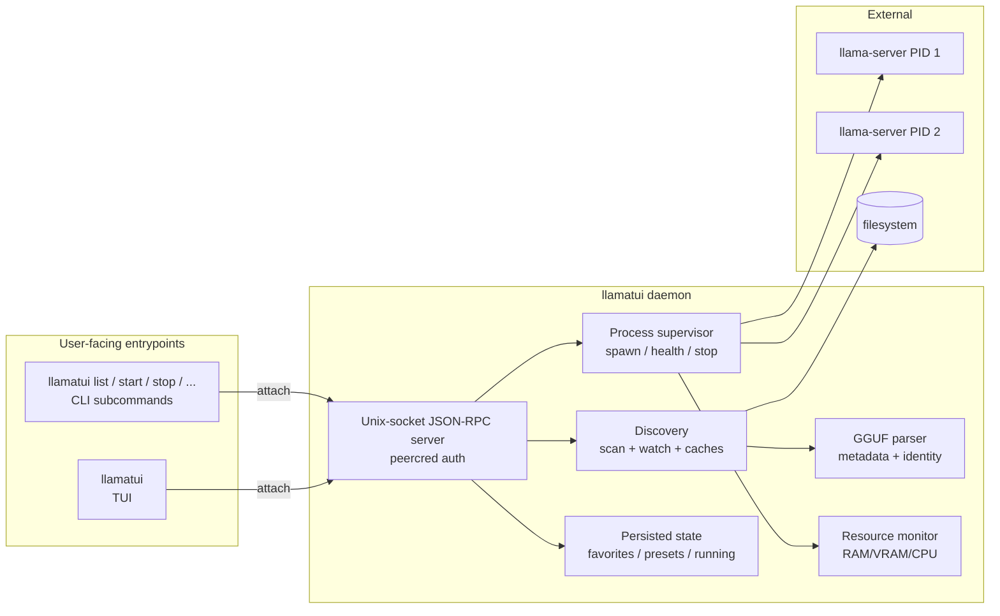
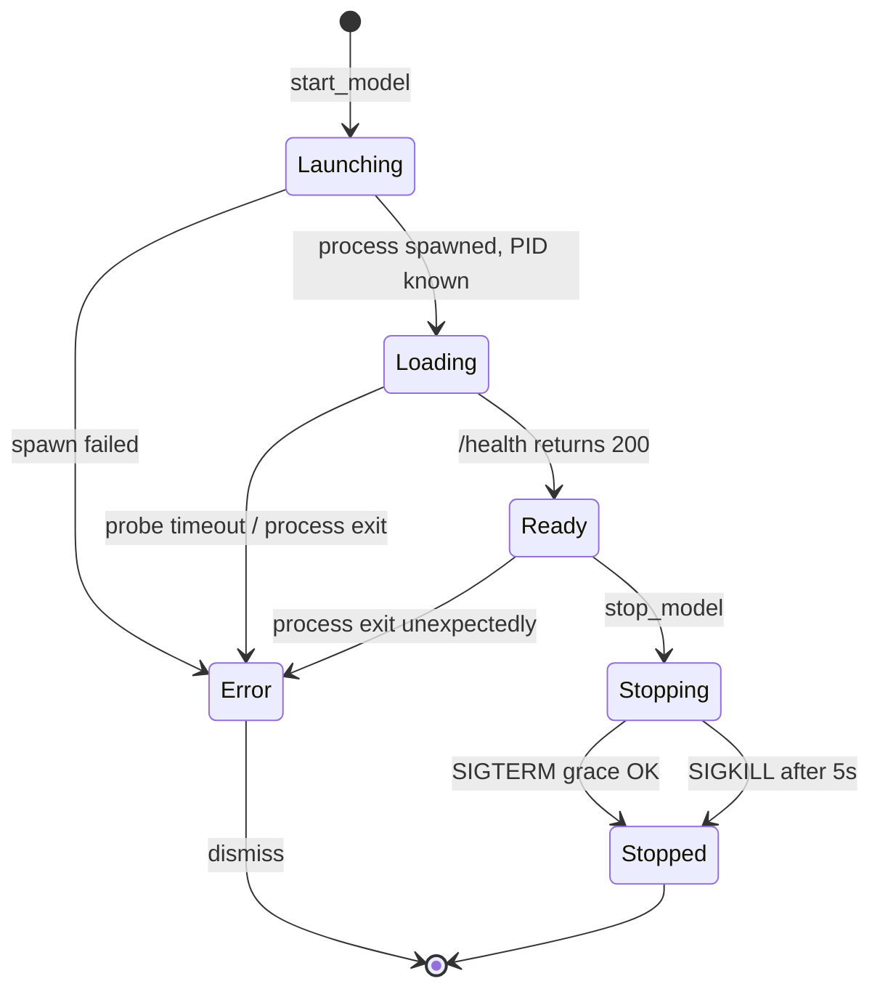

# feat: llamatui v1 — local llama.cpp launcher TUI + CLI

## Overview

llamatui is a greenfield Rust binary that gives developers a fast, keyboard-driven, *transparent* launcher for local `llama-server` instances. It discovers GGUF files on disk (including HuggingFace, Ollama, and LM Studio caches), surfaces rich GGUF metadata (arch, quant, native context, KV-cache-aware memory estimates), launches `llama-server` with sensible per-model defaults, exposes a smoke-test side panel for verifying that a launched model is healthy, and offers a clean non-interactive CLI so external agents and scripts can drive the same daemon. HTTP and MCP surfaces are deferred to v2 (origin: R34).

Architecture is daemon-on-demand: a single `llamatui` binary acts as TUI, CLI client, **and** daemon depending on the subcommand. The daemon owns `llama-server` children and persisted state; the TUI and CLI are thin clients that attach to it over a `0600` Unix socket authenticated via peer credentials (SO_PEERCRED on Linux, getpeereid on macOS). Running models survive TUI exit.

## Problem Frame

Origin: `docs/brainstorms/llamatui-requirements.md` (Problem Frame). Heavy abstractions (Ollama, LM Studio) hide llama.cpp; raw `llama-server` use is tedious. There is no fast, transparent TUI that is also a first-class shell-tool surface for agents. llamatui v1 fills that gap.

## Requirements Trace

Full requirements list lives in the origin document. Mapping each requirement to the implementation unit that owns it:

| Req | Owner | Req | Owner | Req | Owner |
|---|---|---|---|---|---|
| R1 scan & group | Unit 4 | R17 multi-run + resources | Unit 5 | R33 embed/rerank tabs | Unit 7 |
| R2 cache auto-discovery | Unit 4 | R18 stop semantics | Unit 5 | R34 v2 deferral | Unit 8 (note) |
| R3 custom paths | Unit 4 | R19 embedding/rerank launch | Unit 5 | R35 CLI subcommands | Unit 8 |
| R4 `--no-scan` | Unit 4 | R20 last-params per file | Unit 5 | R37 persistence | Unit 5 |
| R5 split-GGUF | Unit 4 | R21 named presets | Unit 5 | R38 XDG layout | Unit 1 |
| R6 symlink/Ollama blobs | Unit 4 | R22 fs watcher | Unit 4 | R39 daemon + IPC | Unit 2 |
| R7 GGUF metadata parse | Unit 3 | R23 layout | Unit 6 | R40 daemon lifecycle | Unit 2 |
| R8 RAM/VRAM est. + KV | Unit 3 (+ 5) | R24 favorites | Unit 6 (+ 5) | R41 single-instance lock | Unit 2 |
| R9 async scan | Unit 4 | R25 fuzzy filter | Unit 6 | R42 orphan adoption | Unit 5 |
| R10 binary lookup | Unit 5 | R26 themes (5) | Unit 1 | R43 Linux + macOS | Unit 9 |
| R11 launch picker | Unit 6 | R27 keyboard-first | Unit 6 | R44 GPU detect | Unit 5 |
| R12 ctx-length presets | Unit 6 | R28 a11y dual-encoding | Unit 6 | R45 single binary dist | Unit 9 |
| R13 reasoning toggle | Unit 6 | R29 perf targets | Unit 6, 7 | R46 HF pull | **v2 deferral** |
| R14 advanced panel | Unit 6 | R30 clipboard | Unit 6 | R47 peercred auth | Unit 2 |
| R15 port allocation | Unit 5 | R31 right-pane tabs | Unit 7 |  |  |
| R16 health probe | Unit 5 | R32 smoke-test chat | Unit 7 |  |  |

## Scope Boundaries

Carried verbatim from origin doc's Scope Boundaries:

- **Deferred to v2:** HTTP API and MCP server; HuggingFace pull worker (R46) — see "v2 deferrals" below.
- **Out of scope:** daily-driver chat (markdown render, history); model sources other than HuggingFace; quantization/conversion; backends other than llama-server; multi-user/remote/network daemon; Windows; telemetry; auto-update; OS-level notifications.
- **Explicit non-feature:** llamatui maintains no model registry — disk files are the source of truth.

### v2 deferrals

- **R46 HuggingFace pull (CLI + TUI hotkey).** Originally owned by Unit 4. Descoped from v1 mid-implementation to keep Unit 4 focused on local-disk discovery. The CLI `pull` subcommand surface remains scaffolded in `cli_args.rs` and the dispatcher arm exits via `unimplemented!`; both are tagged `TODO(v2-R46)` and ship as `hide = true` until the worker lands. The TUI hotkey is not bound. v1 users obtain GGUFs through their normal HF / Ollama / LM Studio workflows; discovery picks the resulting files up via the existing cache enumerators.

## Context & Research

### Relevant Code and Patterns

llamatui is greenfield; the reference codebases are sibling Rust TUIs by the same author:

- `kdash` source layout (under `../kdash/src/`): `main.rs` → `app/` (state, key_binding) → `event/` (key) → `handlers/` → `ui/` (theme, help, overview) → `network/` (async I/O loop) → `config.rs`. Mirror this shape, adapted for our domain modules.
- `kdash/src/main.rs` — terminal init pattern (`enable_raw_mode`, `EnterAlternateScreen`, `CrosstermBackend`, `Terminal`), panic hook installation, mpsc-channel event plumbing between async tasks and the render loop.
- `kdash/src/ui/utils.rs` — Catppuccin Macchiato colour constants (`MACCHIATO_BLUE`, `MACCHIATO_MAUVE`, `MACCHIATO_TEXT`, `MACCHIATO_YELLOW`, etc.) and the `light_theme: bool` pattern (in `kdash/src/config.rs`'s `ThemeConfig`). Generalise to a named-theme enum for llamatui.
- `kdash/src/ui/help.rs` — contextual help-bar pattern with theme-aware styling. Reuse the structure.
- `kdash/Cargo.toml` deps (versions): `ratatui = "0.30"` (crossterm feature), `crossterm = "0.29"`, `tokio = "1.50"` (macros, process, rt-multi-thread), `clap = "4.6"` (derive), `serde`/`serde_yaml`/`serde_json`, `anyhow`, `duct`, `strum`, `tokio-stream`, `futures`, `chrono`, `simplelog`.

### Institutional Learnings

No `docs/solutions/` yet in this repo (greenfield). Pattern decisions are inherited from `kdash` and `jwt-ui`.

### External References

- **GGUF format spec** — `ggml-org/ggml` repo, `docs/gguf.md`. Header layout is straightforward (magic + version + tensor count + metadata-kv count + KV list + tensor info). KV-cache memory cost approximation: `2 (K+V) * n_layers * n_kv_heads * head_dim * dtype_bytes * ctx_len`, with `dtype_bytes` driven by `--cache-type-k/v`.
- **llama-server reference** — `examples/server/README.md` in llama.cpp. Endpoints in use: `/v1/models`, `/v1/chat/completions`, `/v1/completions`, `/v1/embeddings`, `/v1/rerank`, `/health`. Flags in active use for v1: `-m`, `-c` (ctx), `--port`, `-ngl`, `--n-cpu-moe`, `--cache-type-k/v`, `--threads`, `--flash-attn`, `--mlock`, `--no-mmap`, `--parallel`, `--jinja`, `--reasoning-format`, `--embeddings`, `--reranking`.
- **Candidate crates** (subject to final selection at implementation time):
  - GGUF parsing: `gguf-rs` first-choice; fall back to a hand-rolled header reader if the crate doesn't expose what R7/R8 need.
  - ~~HuggingFace pull: `hf-hub` (official-ish crate by hf-rs).~~ *Deferred to v2 with R46.*
  - Filesystem watching: `notify` + `notify-debouncer-mini`.
  - NVIDIA GPU memory: `nvml-wrapper`. AMD: shell-out to `rocm-smi --showmeminfo vram --json`. Apple Silicon: shell-out to `system_profiler SPDisplaysDataType -json` (no Metal SDK dependency).
  - Process supervision: `tokio::process::Child` for I/O; signal delivery via `nix` (`libc::kill` is OS-portable but `nix` is ergonomic).
  - Sysinfo: `sysinfo` crate (cross-platform; tracks per-PID memory and CPU).
  - Clipboard: `arboard` (cross-platform; works in TTY contexts where `copypasta` does not).
  - JSON-RPC: hand-rolled framing over `tokio::net::UnixListener` with `serde_json` request/response envelopes is sufficient; a full `jsonrpsee` runtime is overkill for a single-user loopback daemon.
  - XDG paths: `directories` crate.
  - Fuzzy matching for filter (R25): `nucleo-matcher` (used by Helix; fast).

## Key Technical Decisions

- **Single binary, subcommands.** `llamatui` (no args) launches the TUI; `llamatui daemon start|stop|status`, `llamatui list|start|stop|status|logs|presets|pull` drive the daemon non-interactively. One Homebrew formula, one `cargo install` artefact, one PATH entry.
- **IPC: JSON-RPC framing over Unix socket.** Each message is a length-prefixed UTF-8 JSON object. Method shape matches well-known JSON-RPC 2.0 so a v2 HTTP/MCP layer can wrap the same handlers. Socket file at `$XDG_RUNTIME_DIR/llamatui/daemon.sock` (Linux) or `$TMPDIR/llamatui-$UID/daemon.sock` (macOS, since macOS has no `XDG_RUNTIME_DIR`), created mode `0600`. Auth via `SO_PEERCRED` (Linux) / `getpeereid` (macOS).
- **State / config / logs separated by XDG semantics.** State under `$XDG_STATE_HOME/llamatui/` (last-params per model, favorites, presets, running snapshot — file format `state.json`). Config under `$XDG_CONFIG_HOME/llamatui/config.yaml` (user-authored: theme, paths, port range, custom keybindings). Logs under `$XDG_CACHE_HOME/llamatui/logs/<model-id>-<launch-iso8601>.log` (append-only). macOS analogues via `directories::ProjectDirs`.
- **Daemon-on-demand lifecycle.** TUI and CLI clients always try to attach first; if the socket is absent or stale, they fork/exec `llamatui daemon start --detach` and retry the attach with exponential backoff (cap ~1 s). Daemon writes a PID lockfile at `$XDG_STATE_HOME/llamatui/daemon.pid` and refuses a second start. Daemon shuts down only on explicit `llamatui daemon stop` (or TUI hotkey that sends the same message); SIGINT to the daemon also performs a graceful stop. `llama-server` children are *not* killed on daemon shutdown — they detach (`setsid` on Linux, `daemon(3)` semantics) and become orphan-adoptable on next daemon start.
- **Model identity** is `(canonical absolute path, gguf-header-blake3)` — never a full-file hash. Header is small (<1 MB typical); BLAKE3 of the header bytes is stable across renames and survives moving the file (with same content) to a new path. Last-params lookup uses both halves with path-rename detection.
- **Process supervisor state machine.** Each launch is owned by a `ManagedModel` struct in the daemon with states `Launching → Loading → Ready | Error{cause} → Stopping → Stopped`. Health probe polls `/health` every 500 ms during `Loading`; transition to `Ready` on first 200 response. Configurable timeout (default 120 s) drives `Loading → Error`.
- **Port allocation.** Default range `41100..=41300` (high, unprivileged, rarely collided). User-configurable via config or `--port` override on `start`. Allocator probes the range linearly skipping in-use ports detected via TCP bind+release. Persisted `port` in state survives daemon restart for orphan re-adoption.
- **Reasoning toggle** is a single boolean with bundled effect (sets `--reasoning-format deepseek --jinja` + collapses `<think>` in smoke-test chat). Advanced panel exposes the unbundled flags so users can override either side independently (origin: R13).
- **Themes shipped in v1: five.** Catppuccin Macchiato (default), Catppuccin Latte, Gruvbox Dark, Solarized Dark, Monochrome. Selected from config or runtime hotkey. Theme palette is a static lookup table; no dynamic loading in v1.
- **Right pane is tab-driven, per-focused-model.** Tabs always include `Logs`; when the focused model is `Ready`, a mode-appropriate second tab appears: `Chat` (chat-mode models), `Embed` (embeddings models), `Rerank` (rerank models). Smoke-test invocations hit the same OpenAI-compatible endpoints external clients use — proving the model is consumable by anything.
- **Embedded `llama-server` discovery** prefers `--llama-server <path>` → `LLAMATUI_LLAMA_SERVER` → first hit in `$PATH`. If `$PATH` resolution finds *multiple* candidates (e.g., `llama-server-cuda`, `llama-server`), the daemon logs them and uses the first; user can pin via flag/env/config.
- **Orphan policy.** On daemon start, read `state.running.json`. For each entry, try to `kill -0 pid`; if alive *and* listening on the recorded port *and* `/v1/models` responds with the expected model path, re-adopt with full launch-param recall. External `llama-server` processes (detected via `sysinfo` enumeration with cmdline matching `*llama-server*`) are surfaced *read-only* in the TUI's `external` row and accept `stop` only — no edit/restart.
- **Testing strategy.** Unit tests inline `#[cfg(test)] mod tests` per file. Integration tests in `tests/` exercising daemon ↔ client roundtrips against a `tests/fixtures/fake_llama_server.rs` minimal Rust binary (declared as a `[[bin]]` in `Cargo.toml` gated behind a `test-fixtures` cargo feature so it does not ship in user installs) that fakes `/health`, `/v1/models`, streaming `/v1/chat/completions`, `/v1/embeddings`, and `/v1/rerank` — no real GGUF or llama.cpp required in CI.

## Open Questions

### Resolved During Planning

- **GGUF parser choice** → start with `gguf-rs`; hand-roll a header-only reader if the crate forces full-file mapping or misses fields. Resolution: try-the-crate-first, in Unit 3.
- **IPC protocol** → length-prefixed JSON-RPC 2.0 over Unix socket. Maps to v2 HTTP/MCP cleanly.
- **Port range default** → `41100..=41300`. Configurable.
- **Theme count** → all five from origin doc ship in v1 (user explicitly listed them as v1 inclusions).
- **Single vs split binary** → single (origin Key Decision).
- **Filesystem watcher scope** → watch only top-level scan roots with `notify-debouncer-mini`. For the HuggingFace hub tree (deeply nested), watch only `~/.cache/huggingface/hub/models--*/snapshots` two levels deep and do a 5-minute background full rescan as backstop.

### Deferred to Implementation

- Exact wire format details for JSON-RPC error codes (will be inferred when concrete error variants are enumerated in Unit 2).
- Whether `nucleo-matcher` vs `fuzzy-matcher` better suits the filter (Unit 6) — depends on Rust-edition and dep-tree friction.
- Whether `arboard` works in *every* Linux WM/Wayland environment we care about — fall back to writing to `xclip`/`wl-copy` via shell if not.
- KV-cache estimation precision: the simple formula gets us within ~10%, but advanced quantizations (`q4_0`/`q8_0` cache-types) change the byte-per-element factor. Refine at implementation time when we know which `--cache-type-k/v` values to default for the user.
- Whether Intel macOS GPU detection should attempt anything beyond reporting "Metal not supported" — depends on user testing on Intel Macs (R44).

## High-Level Technical Design

> *This illustrates the intended approach and is directional guidance for review, not implementation specification. The implementing agent should treat it as context, not code to reproduce.*

### Component diagram

### Model lifecycle state machine

### Right-pane tab decision

| Model focus state | Mode | Tabs shown |
|---|---|---|
| Not launched | (n/a) | Logs only (empty/grey) |
| Launching / Loading / Error | chat / embedding / rerank | Logs |
| Ready | chat | Logs, Chat |
| Ready | embedding | Logs, Embed |
| Ready | rerank | Logs, Rerank |

## Implementation Units

Phased delivery. Within a phase units may be parallelisable; across phases they are sequential.

### Phase A — Foundations

- [x] **Unit 1: Project scaffold, CLI surface, config, themes**

**Goal:** Establish the Rust binary, `clap`-derived top-level command surface (with all subcommand stubs returning `unimplemented!`), the YAML config loader, XDG path resolution, theme palette + selection, and the panic/logging plumbing. No daemon or model logic yet.

**Requirements:** R26, R38, R45 (scaffold + theme + paths only); structural prerequisite for everything else.

**Dependencies:** None.

**Files:**
- Create: `Cargo.toml`, `Cargo.lock` (initial), `.gitignore`, `rustfmt.toml`, `LICENSE` (MIT), `README.md` (placeholder), `src/main.rs`, `src/banner.rs`, `src/cli/mod.rs`, `src/cli/cli_args.rs`, `src/config/mod.rs`, `src/config/loader.rs`, `src/theme/mod.rs`, `src/theme/palette.rs`, `src/theme/macchiato.rs`, `src/theme/latte.rs`, `src/theme/gruvbox.rs`, `src/theme/solarized.rs`, `src/theme/mono.rs`, `src/util/paths.rs`, `src/util/logging.rs`
- Test: `tests/config_loader_test.rs`, inline `#[cfg(test)]` modules in `src/config/loader.rs`, `src/theme/palette.rs`, `src/util/paths.rs`

**Approach:**
- Single binary entry `src/main.rs` dispatches: no subcommand → TUI (deferred to Unit 6); `daemon`/`list`/`start`/etc. → CLI handler stubs.
- `Cli` struct uses `clap::Parser` derive with `command(subcommand)`; each subcommand a variant.
- Top-level flags follow origin doc env-var / flag pairs: `--llama-server <path>`, `--model-path <dir>` (repeatable), `--no-scan`, `--config <file>`, `-v` (verbose).
- Config: `serde_yaml`-based `Config` struct with `theme`, `port_range`, `model_paths`, `disable_default_cache_paths` (per-cache toggles), `keybindings` (optional override map). Loader merges defaults → file → env → CLI flags.
- Paths via `directories::ProjectDirs::from("", "", "llamatui")`. Helpers: `state_dir()`, `config_dir()`, `cache_dir()`, `runtime_socket_path()`.
- Theme: `ThemeName` enum (`Macchiato`, `Latte`, `GruvboxDark`, `SolarizedDark`, `Mono`); `Palette` struct with semantic colour slots (`fg`, `bg`, `accent`, `success`, `warning`, `error`, `muted`, `selection`). `palette_for(theme: ThemeName) -> &'static Palette`. All themes hard-coded.
- Logging: `simplelog::WriteLogger` writing to `cache_dir/logs/llamatui.log` rotating daily (use `flexi_logger` if `simplelog` rotation is insufficient).

**Patterns to follow:**
- `kdash/src/main.rs` for clap-derive Cli + banner + panic hook + raw-mode setup.
- `kdash/src/config.rs` for YAML config + theme dark/light pattern, generalised to named themes.
- `kdash/src/ui/utils.rs` Macchiato palette constants.

**Test scenarios:**
- Happy path: loading a config with `theme: latte` returns `Palette` containing Latte hex codes.
- Happy path: `directories::ProjectDirs` resolves `state_dir` to `$XDG_STATE_HOME/llamatui/` on Linux (asserted by overriding `XDG_STATE_HOME` env var in test).
- Happy path: `state_dir` on macOS (mocked via env override or `cfg`-gated test) resolves under `~/Library/Application Support/llamatui/`.
- Edge case: missing config file → defaults applied with no error.
- Edge case: config with unknown theme name → loader returns a validation error naming valid theme values, not a panic.
- Edge case: `--model-path` repeated → all paths captured as a `Vec<PathBuf>`.
- Error path: malformed YAML → loader returns `anyhow::Error` with line/column from `serde_yaml`.
- Error path: `LLAMATUI_NO_SCAN=true` plus zero `--model-path` and zero `model_paths` in config → loader returns a clear error before any scan would run (avoids silent empty state).

**Verification:**
- `cargo build` produces a single binary `llamatui`.
- `llamatui --help` lists every planned subcommand stub.
- `llamatui --version` prints the crate version.
- All theme palettes compile and `palette_for` returns each enum variant without panicking.

---

- [x] **Unit 2: Daemon process, Unix socket IPC, peercred auth, single-instance lock**

**Goal:** A `llamatui daemon start` subcommand that opens a `0600` Unix socket, accepts JSON-RPC requests with peercred verification, rejects non-owner peers, writes a PID lockfile, and exits cleanly on `llamatui daemon stop` or SIGINT. No model methods yet — only `ping`, `version`, and `shutdown` so the protocol is exercisable.

**Requirements:** R39, R40, R41, R47.

**Dependencies:** Unit 1.

**Files:**
- Create: `src/daemon/mod.rs`, `src/daemon/server.rs`, `src/daemon/lockfile.rs`, `src/daemon/peercred.rs`, `src/daemon/shutdown.rs`, `src/ipc/mod.rs`, `src/ipc/protocol.rs`, `src/ipc/client.rs`, `src/ipc/framing.rs`, `src/ipc/methods.rs`, `src/cli/daemon.rs`
- Modify: `src/cli/mod.rs` (wire `daemon` subcommand), `src/main.rs` (dispatch)
- Test: `tests/ipc_handshake_test.rs`, `tests/daemon_lifecycle_test.rs`, inline tests in `src/daemon/lockfile.rs`, `src/daemon/peercred.rs`, `src/ipc/framing.rs`

**Approach:**
- IPC framing: 4-byte big-endian length prefix + JSON body. Both directions. `ipc/framing.rs` provides `read_frame`/`write_frame` over `tokio::io::AsyncRead`/`AsyncWrite`.
- Protocol: JSON-RPC 2.0 (`{ "jsonrpc": "2.0", "id": <int|null>, "method": "...", "params": {...} }`). Method registry: `methods.rs` maps method name → handler in the daemon. Client (`ipc/client.rs`) is shared by TUI and CLI.
- `daemon::server`: `tokio::net::UnixListener::bind(socket_path)`. On accept, call `peercred::verify(&stream, uid)`; reject mismatched UIDs with a JSON-RPC error. Then enter request loop on a per-connection task.
- `lockfile::acquire(state_dir)`: open `daemon.pid` `O_CREAT | O_EXCL`; on `EEXIST`, read PID, `kill -0` check; if stale, unlink and retry; if alive, return `AlreadyRunning(pid)`.
- `peercred`: `SO_PEERCRED` (Linux, `libc::ucred`) or `LOCAL_PEERCRED` / `getpeereid` (macOS). Implementation gated by `cfg(target_os)`.
- `daemon start` foregrounds by default; `daemon start --detach` double-forks (or uses `daemon(3)` shim) to background; `daemon stop` opens a client connection and sends the `shutdown` method; `daemon status` returns daemon PID + uptime + connected-client count.
- Graceful shutdown: SIGINT/SIGTERM handlers in the daemon set a `tokio::sync::Notify`; the accept loop awaits it; on trigger, drain in-flight requests with a 2-second deadline, close the listener, remove the socket file and lockfile, exit zero.

**Patterns to follow:**
- `kdash/src/main.rs` panic hook + tokio runtime startup, but adapted for a long-running daemon rather than a TUI alt-screen.

**Test scenarios:**
- Happy path (integration): start daemon → client `ping` returns `pong` within 200 ms.
- Happy path: `daemon stop` cleanly removes both socket file and lockfile.
- Edge case: two daemon-start invocations back-to-back → second exits zero with `AlreadyRunning(pid)` message; lockfile not corrupted.
- Edge case: stale lockfile (PID points to non-existent process) → daemon start succeeds and overwrites the lockfile.
- Edge case: socket file exists but no listener → daemon start removes the stale socket and continues.
- Error path: peer with a different UID (simulated by running daemon under one UID and connecting from another in a containerised test, OR by injecting a peercred mismatch in unit tests with a mock socket) → connection closed, no method invoked.
- Error path: malformed frame (length prefix says 1 GB) → connection closed before allocating, no OOM.
- Error path: JSON-RPC request with unknown method → `-32601 Method not found` response and connection stays open.
- Integration: SIGINT to a daemon mid-request lets the in-flight request complete (within the 2-second drain budget) before exit.

**Verification:**
- `llamatui daemon start --detach` returns immediately; `llamatui daemon status` shows the running daemon.
- `nc -U <socket>` or a tiny test client can drive the `ping` method roundtrip.
- `ls -l <socket>` shows mode `srw-------`.
- `llamatui daemon stop` exits 0; subsequent `llamatui daemon status` shows "not running".

---

- [x] **Unit 3: GGUF parser, metadata extraction, model identity**

**Goal:** Parse the GGUF header to extract architecture, parameter count, quantization, native context length, embedded chat template, embedded tokenizer hints, and any reasoning-format hint (R7). Provide a stable model identity (canonical path + BLAKE3 of header bytes) (R20). Provide a memory estimator for weights *and* KV cache as a function of chosen context length (R8).

**Requirements:** R7, R8 (estimate side, supervisor adds runtime VRAM read in Unit 5), R20.

**Dependencies:** Unit 1.

**Files:**
- Create: `src/gguf/mod.rs`, `src/gguf/header.rs`, `src/gguf/metadata.rs`, `src/gguf/identity.rs`, `src/gguf/memory.rs`, `src/gguf/errors.rs`
- Test: `tests/gguf_parse_test.rs` with fixture files under `tests/fixtures/gguf/` (small synthetic GGUFs constructed in test setup, not real model weights)

**Approach:**
- `header::read` opens the file, reads up to N MB (default 1 MB; configurable cap 4 MB), validates magic `"GGUF"`, version, tensor count, kv-count. Returns `(header_bytes: Bytes, parsed: GgufHeader)`.
- Prefer `gguf-rs` if it exposes header-only parsing. If it forces full-file mmap, fall back to a hand-rolled reader that walks the KV list and returns a `HashMap<String, GgufValue>`.
- `metadata::summarise(header) -> ModelMetadata { arch, params, quant, native_ctx, chat_template, tokenizer_kind, reasoning_hint, mode_hint }`. `params` derived from `*.attention.head_count`, `*.block_count`, `*.embedding_length`, `*.feed_forward_length` per arch family — fall back to "unknown" if arch is unrecognised. `quant` derived from the first tensor's quantisation tag. `mode_hint` checks for `*.embedding_length` + presence of `output.weight` → `chat`; absence → `embedding`; reranker-specific keys → `rerank`. When the heuristic is uncertain (any GGUF that doesn't match a known signature), `mode_hint = Unknown` and the launch picker / CLI requires an explicit `--mode` choice; the user can always override the hint regardless via the same flag.
- `identity::compute(canonical_path, header_bytes) -> ModelId { path, header_blake3 }`. Use `blake3` crate. Header bytes hashed are exactly what `header::read` returned.
- `memory::estimate(metadata, ctx_len, cache_type_kv, n_gpu_layers) -> MemoryEstimate { weights_ram, weights_vram, kv_cache_ram, kv_cache_vram, total_ram, total_vram }`. Formula: `kv_bytes = 2 * n_layers * n_kv_heads * head_dim * ctx_len * bytes_per_elem(cache_type)`. Weights bytes from total tensor footprint (parsed from header) or from quant-scaled param count if tensor footprint unavailable.

**Patterns to follow:**
- None internal yet; mirror Rust idioms from the chosen GGUF crate.

**Test scenarios:**
- Happy path: parse a synthesised header with known KV pairs → `ModelMetadata.arch == "llama"`, native_ctx matches.
- Happy path: identity of the same file at two different absolute paths (symlink) → same `header_blake3`, different `path`.
- Happy path: estimate for a 7B Q4_K_M model at 8192 context, default cache → weights bytes within 5% of known value; KV bytes match the closed-form formula.
- Edge case: zero-tensor GGUF (metadata-only file) → returns `ModelMetadata` with `Unknown` quant; estimator returns weights-only.
- Edge case: chat-template KV missing → `chat_template: None` rather than error; not a hard failure.
- Edge case: file smaller than the magic+version preamble → `GgufError::Truncated` returned, not panic.
- Edge case: file with valid magic but unsupported GGUF version → `GgufError::UnsupportedVersion(v)`.
- Edge case: very long KV list (>10000 entries) → parsed without unbounded allocation; capped at configurable max with `GgufError::HeaderTooLarge`.
- Edge case (estimator): ctx_len above native_ctx → estimator still computes; supervisor consumer decides whether to warn.
- Error path: file does not exist → `GgufError::Io(..)`.
- Error path: file is not a GGUF (random bytes) → `GgufError::BadMagic`.

**Verification:**
- Estimator outputs documented in unit-test snapshots for at least three reference models (Qwen 2.5 7B Q4_K_M, Phi 3.5 mini Q5, a synthetic embedding model).
- BLAKE3 stable across rename (test moves a fixture file to a new name and re-computes).

---

### Phase B — Discovery & Acquisition

- [x] **Unit 4: Filesystem scan, cache auto-discovery, watcher**

**Goal:** Asynchronously discover GGUF files across user-configured roots and well-known caches (HF, Ollama, LM Studio), group them by directory and surface them with parsed metadata. Detect split-GGUF sibling sets and Ollama's content-addressed blob layout. Keep the list live via a debounced filesystem watcher.

> **Note:** The HuggingFace *pull* worker (R46) originally belonged to this unit. Descoped to v2 mid-implementation — see "v2 deferrals" in `Scope Boundaries`. Unit 4's discovery side still surfaces files HF deposits in its cache directory; only the in-app *download* surface is deferred.

**Requirements:** R1, R2, R3, R4, R5, R6, R9, R22.

**Dependencies:** Units 1, 3.

**Files:**
- Create: `src/discovery/mod.rs`, `src/discovery/scanner.rs`, `src/discovery/known_caches.rs`, `src/discovery/watcher.rs`, `src/discovery/split_gguf.rs`, `src/discovery/ollama.rs`, `src/discovery/lm_studio.rs`
- Modify: `src/daemon/mod.rs` (host the discovery task), `src/ipc/methods.rs` (add `list_models` method)
- Test: `tests/discovery_scan_test.rs`, `tests/split_gguf_test.rs`, `tests/known_caches_test.rs`, inline tests in `src/discovery/split_gguf.rs`

**Approach:**
- `scanner::scan(roots, ignore_dirs) -> tokio::sync::mpsc::Receiver<DiscoveredModel>`: walks roots with `ignore`-style respect (`.gitignore`-aware skip, plus user-configurable exclude globs). Uses `tokio::task::spawn_blocking` for the walk; sends results into a channel so the UI can stream them as they arrive (R9).
- For each `*.gguf` found, dispatch GGUF parse (Unit 3) on a bounded pool; cache parsed metadata in a per-file LRU keyed by `(path, mtime, size)` to avoid re-parsing on every scan.
- `split_gguf::group(paths) -> Vec<ModelEntry>`: regex `^(.+)-\d{5}-of-\d{5}\.gguf$` groups siblings; the entry's launchable file is the `-00001-of-NNNNN.gguf` shard.
- `ollama::enumerate(root)`: reads `manifests/` JSON to map blob hash → human name + arch; surfaces by name not hash.
- `lm_studio::enumerate()`: tries (in order) `~/.lmstudio/models`, `~/.cache/lm-studio/models`, then probes the LM Studio config file at `~/.lmstudio/settings.json` if present for a configured `modelsDirectory`.
- `known_caches::default_set(config) -> Vec<Root>` builds the merged scan-root list respecting per-cache disables (`disable_default_cache_paths.huggingface`, `.ollama`, `.lmstudio`) and the global `--no-scan` flag.
- `watcher::start(roots) -> mpsc::Receiver<WatchEvent>`: `notify-debouncer-mini` with 500 ms debounce. HF hub tree is watched with depth-limited scope (`models--*/snapshots`, two levels) plus a `tokio::time::interval(5*60s)` full rescan backstop.

**Patterns to follow:**
- `kdash/src/network/stream.rs` mpsc-stream pattern for incremental UI updates.

**Test scenarios:**
- Happy path: scan a fixture tree with 3 GGUFs in two dirs → emits 3 `DiscoveredModel` events grouped under their parent directories.
- Happy path: split-GGUF detection groups `model-00001-of-00003.gguf` + siblings into a single entry whose launch target is shard 1.
- Happy path: Ollama manifest enumeration maps the recorded blob hash → human name in the output.
- Edge case: symlinked GGUF → deduplicated to its canonical path (same model not listed twice).
- Edge case: `.gguf.part` (mid-download) is ignored by the scanner.
- Edge case: empty file with `.gguf` extension → flagged as invalid (via Unit 3 parser) but does not crash discovery; surfaced with `metadata: None` and a warning glyph.
- Edge case: `LLAMATUI_NO_SCAN=1` set → only user-supplied paths are scanned; default cache locations skipped even if they exist.
- Edge case: `--model-path` overlaps a default cache → file listed once (deduped by canonical path).
- Error path: scan root that doesn't exist → logged as warning, scan continues with other roots; daemon does not crash.
- Integration: a newly-dropped `model.gguf` into a watched root appears via `list_models` within ~1 second.

**Verification:**
- A scan of a representative HF + Ollama + LM Studio tree returns within 5 s on a developer SSD and surfaces the expected count of distinct models.

**Review follow-ups from Unit 4 discovery review:**
- [ ] **P1: Route Ollama cache roots through the Ollama enumerator.** `known_caches::default_set` currently returns `$HOME/.ollama/models` as a normal scanner root, but the generic scanner only emits extension-matched `*.gguf` files while Ollama stores model blobs as hash-named files without `.gguf`. Add a unified discovery stream that sends Ollama roots through `ollama::enumerate`, or make root resolution return typed root jobs so specialized enumerators are invoked. Add a regression that default cache discovery surfaces an Ollama manifest-backed blob.
- [ ] **P2: Include symlinked GGUFs and dedupe by canonical path.** The scanner must satisfy the symlink edge case by accepting symlinked `.gguf` files, canonicalizing them before emit/grouping, and deduping canonical duplicates so the same target is not listed twice. Add a scanner test with a real file plus symlink under the scan root.
- [ ] **P2: Wire LM Studio settings overrides into default roots.** `lm_studio::resolve_models_dirs` reads settings-based custom model directories, but `known_caches::default_set` still uses only hard-coded defaults. Use the resolver from root resolution and add a `default_set` regression for a settings-provided models directory.
- [ ] **P1: Complete live discovery/listing integration.** Unit 4 still needs `watcher::start` with debounced events and the daemon/list-models integration so newly dropped GGUFs appear via `list_models` within ~1 second, per the integration scenario above.

---

### Phase C — Launching

- [ ] **Unit 5: Process supervisor — launch params, binary lookup, presets, favorites, port allocation, health probe, resource monitor, orphan adoption, stop semantics**

**Goal:** The full launch and lifecycle backbone in the daemon. Locate `llama-server`, compose flags from the user's choices, allocate a port, spawn the child with piped stdout/stderr to log files and a ring buffer, drive the `Launching → Loading → Ready/Error → Stopping → Stopped` state machine, sample RAM/VRAM/CPU per model, persist last-params and presets and favorites and the running-snapshot, and handle orphan re-adoption on daemon restart.

**Requirements:** R8 (runtime read), R10, R15, R16, R17, R18, R19, R20, R21, R24 (storage; UI mark/render in Unit 6), R37, R42, R44.

**Dependencies:** Units 1, 2, 3.

**Files:**
- Create: `src/launch/mod.rs`, `src/launch/binary.rs`, `src/launch/params.rs`, `src/launch/mode.rs`, `src/launch/presets.rs`, `src/launch/favorites.rs`, `src/daemon/supervisor.rs`, `src/daemon/probe.rs`, `src/daemon/ports.rs`, `src/daemon/resources.rs`, `src/daemon/state_store.rs`, `src/daemon/orphans.rs`, `src/gpu/mod.rs`, `src/gpu/nvidia.rs`, `src/gpu/amd.rs`, `src/gpu/metal.rs`, `src/gpu/vulkan.rs`
- Modify: `src/ipc/methods.rs` (add `start_model`, `stop_model`, `stop_all`, `status`, `logs_tail`, `presets_*`, `favorite_*`), `src/daemon/server.rs` (wire methods)
- Test: `tests/supervisor_lifecycle_test.rs`, `tests/orphan_adoption_test.rs`, `tests/port_allocation_test.rs`, `tests/preset_persistence_test.rs`, plus `tests/fixtures/fake_llama_server.rs` (declared as a `[[bin]]` in `Cargo.toml` under feature `test-fixtures`, faking `/health`, `/v1/models`, streaming `/v1/chat/completions`, `/v1/embeddings`, `/v1/rerank` — does not ship in user installs); inline tests in `src/launch/params.rs`, `src/launch/binary.rs`, `src/daemon/ports.rs`, `src/daemon/resources.rs`, `src/gpu/*.rs`

**Approach:**
- `binary::locate(cli, env, config) -> Result<PathBuf>`: priority `--llama-server <path>` → `LLAMATUI_LLAMA_SERVER` → `which::which("llama-server")`. If `$PATH` has multiple matches, take the first and log all candidates so the user can pin.
- `params::compose(model, mode, ctx, reasoning, port, advanced) -> Vec<OsString>`: builds the argv: `-m <path>`, `-c <ctx>`, `--port <port>`, `--host 127.0.0.1`, plus mode-specific flags (`--embeddings`, `--reranking`), plus reasoning (`--jinja --reasoning-format deepseek` when on), plus the free-form `advanced` overrides last (so they trump bundled flags).
- `ports::allocate(range, in_use) -> u16`: linear probe `41100..=41300` (configurable), `TcpListener::bind` test, skip occupied. Persist the chosen port in the running-snapshot.
- `supervisor::spawn(ManagedSpawn { model, params, port, mode, started_by_user }) -> ManagedModel`: `tokio::process::Command` with `Stdio::piped` on stdout/stderr; one tokio task per stream forwards lines to (a) a per-launch log file under `cache_dir/logs/` (rotated at 10 MB per file, max 5 files per launch — caps unbounded child output), (b) an in-memory ring buffer (last 4 K lines) for the TUI's Logs tab. Process started in its own session (`setsid` on Linux; equivalent on macOS) so it survives daemon exit (origin: R40).
- `probe::watch(pid, port, timeout) -> probe::Outcome`: poll `http://127.0.0.1:<port>/health` every 500 ms until 200 OK or `timeout` (default 120 s); on success transition to `Ready` and prime a longer-period readiness re-check (every 30 s). If process exits during `Loading`, transition to `Error` with the last 50 stderr lines as the cause.
- `resources::sample_loop(pid)`: `sysinfo::ProcessRefreshKind::everything()` per 1 s for RSS + CPU%. For VRAM, query the active GPU backend (Unit 5's `src/gpu/`) and attribute to the PID where the backend exposes per-PID attribution (NVML does); otherwise report process-level RSS only and a system-level VRAM total separately.
- `gpu::probe()`: best-effort detection at daemon start. Linux: try `nvml-wrapper` (NVIDIA), fall back to `rocm-smi` shellout (AMD), fall back to `vulkaninfo` parse, fall back to "CPU only". macOS: `system_profiler SPDisplaysDataType -json` for Apple Silicon Metal info; on Intel macOS, no-op (CPU only).
- `state_store`: a JSON-on-disk record at `state_dir/state.json` covering `favorites: Vec<ModelId>`, `last_params: HashMap<ModelId, LaunchParams>`, `presets: HashMap<ModelId, Vec<NamedPreset>>`, `running: Vec<RunningSnapshot { id, pid, port, started_at, params }>`. Writes via temp-file rename to avoid torn state.
- `orphans::sweep_on_start(state_store) -> OrphanReport`: for each `running` entry, `kill -0 pid`; if alive, try `/v1/models` against the recorded port and confirm the model file matches; on match, re-adopt (rebuild a `ManagedModel` referencing the live PID and start streaming its stdout if the child's FD is still readable, otherwise tail the log file). Mismatches are dropped from the snapshot. Separately, enumerate all `llama-server` processes via `sysinfo`; any not adopted are surfaced as `external` (read-only) entries in `status` output.
- `stop`: send SIGTERM, wait 5 s on a `tokio::time::sleep`, then SIGKILL if still alive. `stop_all` iterates the active model map and confirms in the caller.

**Patterns to follow:**
- `kdash/src/network/mod.rs` long-running task pattern with mpsc.
- `kdash/src/cmd/shell.rs` child-process plumbing.

**Test scenarios:**
- Happy path: `start_model` with the fake-llama-server fixture → state transitions Launching → Loading → Ready within ~1 s; `status` reports the right port and pid.
- Happy path: `stop_model` while Ready → Stopping → Stopped within 5 s (clean SIGTERM exit).
- Happy path: `start_model` for embedding mode appends `--embeddings` and supervisor records `mode: Embedding`.
- Happy path: launching the same model file twice gets two different ports; both Ready concurrently.
- Happy path: presets are saved and recalled by name; `last_params` updates only on a *successful* Ready transition.
- Edge case: port range exhausted (mock by occupying the range) → start returns a structured error `NoFreePort`, supervisor state stays clean (no zombie).
- Edge case: model launched at `ctx_len` > GGUF native max → daemon logs a warning and proceeds; not an error.
- Edge case: child writes a few KB to stderr in 50 ms → log file and ring buffer both capture without dropping lines.
- Edge case: SIGTERM ignored by child (simulate by making the fake server trap it) → SIGKILL after 5 s, state transitions to Stopped.
- Edge case: orphan adoption — start a fake child outside the daemon with a known PID, write a matching running-snapshot, restart the daemon → orphan listed as adopted with the right port and model id.
- Edge case: external `llama-server` running (started by user manually) → surfaces in `status` under `external: []` with PID + port, no `params`.
- Edge case: favorites toggle persists across daemon restart.
- Error path: `llama-server` not on PATH and no flag/env → start returns `BinaryNotFound`; error message names both flag and env var.
- Error path: spawn fails (binary path points to a non-executable) → state transitions Launching → Error with cause; no port held.
- Error path: probe times out (fake server returns 503 forever) → Error{cause: "health probe timeout"}, child SIGKILL'd, port released.
- Error path: NVML not installed on Linux → probe reports "no GPU detected" and supervisor still launches CPU-only.
- Integration: resource sampler reports plausible RSS and CPU% for the fake server (>0 RSS, <100 cores' worth of CPU%).

**Verification:**
- An end-to-end test launches the fake server via the daemon, smoke-tests a `/v1/models` query through the daemon (no separate llama.cpp install needed for CI), then stops it cleanly.
- `state.json` is well-formed JSON after any of: success, error during launch, daemon SIGINT, daemon SIGKILL+restart.

---

### Phase D — Frontends

- [ ] **Unit 6: TUI shell — layout, list pane, filter, help bar, launch picker, advanced panel, clipboard, theme application, status icons**

**Goal:** The `ratatui`-based TUI. Layout: model-list pane (left), right pane (placeholder for tabs in Unit 7), contextual help bar (bottom). List pane shows favorites first, then directory-grouped models with metadata badges. `/` opens a filter. Marking favorites and selecting models all work. Selecting a model and pressing `Enter` opens a launch picker (context length / reasoning / Advanced panel). Themes apply. Status icons render with both colour and glyph. Clipboard yanks endpoint URL / curl / model path.

**Requirements:** R11, R12, R13, R14, R23, R24, R25, R27, R28, R29 (warm-attach <200 ms, input-to-redraw <16 ms), R30.

**Dependencies:** Units 1, 2 (uses IPC client), 5 (drives launches).

**Files:**
- Create: `src/tui/mod.rs`, `src/tui/app.rs`, `src/tui/events.rs`, `src/tui/render.rs`, `src/tui/layout.rs`, `src/tui/list_pane.rs`, `src/tui/help_bar.rs`, `src/tui/filter.rs`, `src/tui/launch_picker.rs`, `src/tui/advanced_panel.rs`, `src/tui/status_icons.rs`, `src/tui/keybindings.rs`, `src/util/clipboard.rs`
- Modify: `src/main.rs` (no-subcommand path enters TUI), `src/cli/mod.rs`
- Test: `tests/tui_smoke_test.rs` (headless render against a `ratatui::backend::TestBackend`), inline tests in `src/tui/list_pane.rs`, `src/tui/filter.rs`, `src/tui/launch_picker.rs`, `src/util/clipboard.rs`

**Approach:**
- `App` state owns: connected daemon client, current model list, current selection, focus mode (List | Filter | LaunchPicker | AdvancedPanel | RightPane), filter buffer, theme palette ref, running-models snapshot.
- Event loop: a tokio task drives crossterm events into one mpsc channel; another tokio task subscribes to daemon notifications (model updates, status changes, log lines) over the IPC client and feeds into the same channel; the render loop drains both at a fixed tick (~16 ms target, 60 fps).
- `list_pane::render` groups: favorites at top with a `★` glyph, then by parent directory. Each row shows: name, arch badge, quant badge, native-ctx, est-mem badge (KV-aware once ctx is chosen at launch), status icon if a launch is associated.
- `filter`: activated with `/`; `nucleo-matcher` ranks against `{name, dir, arch, quant, labels}`; `Esc` clears.
- `launch_picker`: modal-style overlay (still keyboard-only) with three controls — context length (preset selector + custom input), reasoning toggle, "Advanced…" button. `Enter` dispatches `start_model`.
- `advanced_panel`: free-form flag editor pre-populated with last-params and named-preset values. Tab-completion suggestions for common flags surface inline as ghost text.
- `status_icons`: dual encoding via the `Palette.status_*` colours and per-state glyphs (`◌` Launching, `◐` Loading, `●` Ready, `▲` Error, `○` Stopped, `⇪` External read-only).
- `clipboard::yank_*` use `arboard`; on Linux Wayland sessions where arboard fails, fall back to shelling out to `wl-copy` (then `xclip` then `xsel`).
- Keybindings: default map in `keybindings.rs`; overridable from config (`config.yaml` `keybindings:`). Help bar reads the keybinding registry and renders bindings valid in the current focus.

**Patterns to follow:**
- `kdash/src/ui/help.rs` help-bar layout.
- `kdash/src/app/key_binding.rs` keybinding initialization pattern.
- `kdash/src/event/key.rs` Key enum and event plumbing.

**Test scenarios:**
- Happy path (TestBackend): render an empty app → shows banner, empty list, help bar with primary keys.
- Happy path: render with 6 models in 2 directories → favorites section appears only when ≥1 favorite exists; directory groups render in alphabetical order.
- Happy path: filter `qwen` → only matching rows visible; `Esc` restores.
- Happy path: select a model, press Enter → launch picker overlay appears; press Enter again → `start_model` dispatched with default ctx + reasoning.
- Happy path: yank endpoint URL while a Ready model is focused → clipboard returns `http://127.0.0.1:<port>/v1`.
- Edge case: terminal width 60 cols → list pane truncates names with `…` rather than wrapping; help bar uses a compact keybinding view.
- Edge case: zero models discovered → list pane shows an empty-state hint with `Ctrl+D` shortcut prompt.
- Edge case: status changes mid-render (notification arrives during a render tick) → render is idempotent; no torn frame.
- Edge case: theme switched at runtime → next frame uses the new palette; no restart required.
- Edge case: custom ctx-length input rejects non-numeric → input box shows validation hint.
- Edge case: launching a model already running → picker pre-populates with that model's last params; submit creates a *new* instance on a new port (no duplicate-prevention in v1).
- Error path: daemon disconnects during a TUI session → status bar shows "daemon disconnected"; reconnect attempt loop with backoff.
- Error path: clipboard unavailable → yank action surfaces a transient toast "clipboard not available; URL: ..." showing the URL inline.
- Integration: warm-attach (daemon already running, fake list) cold-start time to first interactive frame measured in test backend < 200 ms (origin: R29).

**Verification:**
- TestBackend snapshots for the major states (empty list, populated list, filter active, launch picker open, advanced panel open).
- Manual run: every documented keybinding is reachable and the help bar reflects them.
- Profiling: input-to-redraw round-trip under 16 ms on a representative dev laptop.

---

- [ ] **Unit 7: Right-pane tabs — Logs, Chat, Embed, Rerank**

**Goal:** The tabbed right pane. `Logs` tab is always present; when the focused model is `Ready`, a mode-appropriate second tab appears: `Chat` (chat), `Embed` (embeddings), `Rerank` (rerank). Smoke-test prompts hit the OpenAI-compatible endpoints directly (proving external-client compatibility). Stream tokens for chat. Hide `<think>` blocks when reasoning is on.

**Requirements:** R31, R32, R33.

**Dependencies:** Units 5, 6.

**Files:**
- Create: `src/tui/right_pane.rs`, `src/tui/tabs/logs.rs`, `src/tui/tabs/chat.rs`, `src/tui/tabs/embed.rs`, `src/tui/tabs/rerank.rs`, `src/tui/oai_client.rs`
- Modify: `src/tui/app.rs` (focus state expansion), `src/tui/keybindings.rs` (tab cycle key)
- Test: `tests/tui_chat_smoke_test.rs` (against the fake-llama-server fixture's `/v1/chat/completions`), inline tests in `src/tui/tabs/chat.rs` (think-block collapse logic), `src/tui/tabs/embed.rs`, `src/tui/tabs/rerank.rs`

**Approach:**
- `right_pane::render(active_tab, ...)` dispatches to the per-tab renderer.
- `tabs::logs` reads from the supervisor's per-model ring buffer (delivered via IPC `logs_tail` subscription); auto-scrolls unless the user has scrolled up; pause/resume hotkey.
- `tabs::chat` UI: prompt input field (multi-line, `Ctrl+Enter` to send), output viewport. On send, builds an OpenAI `chat.completions` request with `stream: true`, hits `http://127.0.0.1:<port>/v1/chat/completions` via `reqwest` (or `hyper` direct for less bloat), parses SSE chunks, appends to viewport. No conversation history retained between sends — v1 is single-shot smoke test (R32). When reasoning is on, lines matching `<think>...</think>` collapse to `⏵ reasoning (N tokens)` with a hotkey to expand.
- `tabs::embed` UI: single text input; on submit, calls `/v1/embeddings` and shows vector dimensionality + first 8 values + L2 norm. Optional second text field computes cosine similarity client-side.
- `tabs::rerank` UI: query field + 1..N candidate fields; on submit, calls `/v1/rerank` and renders ranked scores.
- `oai_client::stream_chat` is a thin wrapper around `reqwest` SSE iteration; isolates the protocol so v2's MCP layer can reuse the same client primitives.

**Patterns to follow:**
- `kdash/src/ui/resource_tabs.rs` for the tabs-with-state pattern.

**Test scenarios:**
- Happy path (chat): send a prompt to the fake-llama-server → tokens stream into the viewport and the request completes; final state shows finish_reason and token count.
- Happy path (logs): supervisor pushes a new stderr line → it appears in the Logs tab within one render tick.
- Happy path (embed): send "hello" → fake server returns a 1024-dim vector; UI shows dim=1024 and the first 8 values.
- Happy path (rerank): query + 3 candidates → fake server returns sorted scores; UI renders them top-to-bottom.
- Edge case: model is not yet Ready → Chat tab not selectable; help bar reflects.
- Edge case: reasoning ON + response contains `<think>...</think>` → block is collapsed by default; `r` toggles per-message.
- Edge case: very long streaming response → viewport scrolls; input remains focused.
- Edge case: user scrolls up in logs while new lines arrive → auto-scroll pauses; resume on `End` or `g`.
- Error path: chat request 4xx → toast with the error code + body; viewport stays clean for next prompt.
- Error path: connection refused (model died between probe and send) → toast "model unreachable"; supervisor receives a notification and re-probes.
- Error path: SSE chunk malformed → ignored with a debug log; stream continues.
- Integration: a Ready model with mode `chat` shows Chat tab; switch its mode hint to embedding (e.g., via a fixture flip) → tab becomes Embed on next refresh.

**Verification:**
- Streaming chat against the fake server completes end-to-end in a TestBackend integration test.
- Tab cycle hotkey advances through the right set of tabs for each mode.

---

- [ ] **Unit 8: CLI non-interactive subcommands + JSON outputs**

**Goal:** A complete non-interactive CLI surface: `list`, `start`, `stop`, `status`, `logs`, `presets`, `daemon`, all driving the daemon via the same IPC client. Every read command supports `--json`. Exit codes are distinct per failure class so scripts can branch reliably. This is v1's agent-facing surface (HTTP/MCP are v2 per R34; the `pull` subcommand scaffold ships hidden and exits `unimplemented` pending R46 in v2).

**Requirements:** R35; R34 enforced via deliberate absence of HTTP/MCP code paths.

**Dependencies:** Units 1, 2, 4, 5.

**Files:**
- Create: `src/cli/list.rs`, `src/cli/start.rs`, `src/cli/stop.rs`, `src/cli/status.rs`, `src/cli/logs.rs`, `src/cli/presets.rs`, `src/cli/output.rs` (human + JSON formatters), `src/cli/exit_codes.rs`. (`src/cli/pull.rs` is a v2 follow-up tracked with R46.)
- Modify: `src/cli/mod.rs` (full subcommand wiring), `src/cli/cli_args.rs` (per-subcommand arg structs)
- Test: `tests/cli_integration_test.rs` (drives every subcommand against a daemon fixture in a temp dir), inline tests in `src/cli/output.rs`, `src/cli/exit_codes.rs`

**Approach:**
- Every subcommand opens the same IPC client (auto-spawn daemon if not present, with explicit `--no-spawn` opt-out for scripted environments that want fail-fast).
- `list` resolves models from `list_models`; output: TSV-like default (single line per model, columns: id, path, arch, quant, native_ctx) or JSON when `--json`.
- `start <model-ref>` accepts: `name` (matches against name/path substring), `path` (absolute), or `id` (canonical id). Flags: `--preset NAME`, `--ctx N`, `--port N`, `--reasoning on|off`, `--mode chat|embedding|rerank`, then `--` followed by raw `llama-server` flags forwarded verbatim.
- `stop <id-or-port>` and `stop --all` (with `--yes` to skip confirmation).
- `status [--json]` returns active models, external read-only models, and daemon health.
- `logs <id> [--follow] [-n N]` streams from `logs_tail` subscription; respects SIGINT to detach cleanly.
- `presets <model-ref> {list|save NAME|delete NAME|show NAME}` manages presets.
- `pull <hf-repo-id>`: **v2 (R46 deferral).** The CLI subcommand is wired and hidden from `--help`; invoking it exits with `unimplemented!` so the surface compiles but never claims work that isn't done.
- `daemon {start|stop|status}` controls the daemon lifecycle directly (start uses the same auto-spawn path; stop sends the IPC `shutdown` method; status returns PID + uptime + #connections + #managed models).
- Exit codes: 0 success, 64 usage error, 65 daemon unreachable, 66 model not found, 67 launch failed (probe error), 68 stop failed, 70 binary not found, 71 unknown error. (Exit code 69 is reserved for `pull` and arrives with R46 in v2.)

**Patterns to follow:**
- `kdash/src/cmd/shell.rs` for subcommand-as-Rust-handler pattern.

**Test scenarios:**
- Happy path: `llamatui list --json` against a populated daemon → valid JSON array, each element has the documented fields.
- Happy path: `llamatui start <name> --preset coding` → exits 0; subsequent `status --json` shows the model Ready (or Loading at minimum).
- Happy path: `llamatui stop <id>` → exits 0; `status` shows it gone.
- Happy path: `llamatui presets <ref> save coding --ctx 32768 --` → persisted; `presets list` shows it.
- Edge case: `start` with `--ctx` exceeding native_ctx → exits 0 with a warning line; supervisor proceeds (per R12).
- Edge case: `start` for a model already running → second instance on a new port; both visible in `status`.
- Edge case: `logs --follow` and daemon shuts down → CLI prints "daemon disconnected" and exits 65.
- Edge case: `--json` on a list with zero models → `[]`, not error.
- Error path: `start <ref>` matching multiple models → exits 66 with a disambiguation hint listing matches.
- Error path: daemon not running and `--no-spawn` set → exits 65 immediately.
- Error path: `llama-server` not found → exits 70 with the env-var + flag hint (origin: R10 error message).
- Error path: SIGPIPE during `logs --follow | head` → handled cleanly, exit 0.
- Integration: an agent script (in test) chains `list --json | jq ...` → `start` → poll `status --json` → query the running endpoint → `stop`, all without TUI involvement (origin: success-criteria scenario).

**Verification:**
- `llamatui --help` shows every subcommand with one-line descriptions.
- The agent-script integration test passes in CI.
- Exit-code table documented in `README.md`.

---

### Phase E — Release

- [ ] **Unit 9: Distribution, packaging, docs**

**Goal:** Ship-ready. README with install + usage + screenshots; Homebrew formula (in a sibling tap if needed); GitHub Actions release matrix for Linux x86_64/aarch64 and macOS Apple Silicon/Intel; `cargo install` polish (binary size, feature flags); CONTRIBUTING; CHANGELOG; LICENSE; ASCII banner; troubleshooting doc.

**Requirements:** R43, R45.

**Dependencies:** Units 1–8.

**Files:**
- Create: `README.md`, `CHANGELOG.md`, `CONTRIBUTING.md`, `CODE_OF_CONDUCT.md`, `SECURITY.md`, `.github/workflows/ci.yml`, `.github/workflows/release.yml`, `.github/ISSUE_TEMPLATE/bug_report.md`, `.github/ISSUE_TEMPLATE/feature_request.md`, `docs/usage.md`, `docs/troubleshooting.md`, `docs/architecture.md`, `Makefile.toml` (cargo-make tasks)
- Modify: `Cargo.toml` (release profile, metadata, keywords for crates.io discoverability)

**Approach:**
- README structure mirrors kdash's: banner image, badge row (CI, crates.io, license), one-paragraph pitch, animated demo gif (in `artwork/`), installation (cargo, brew, prebuilt), quickstart, configuration, FAQ, related projects (kdash, jwt-ui).
- CI matrix: `ubuntu-latest`, `macos-latest`, plus a cross-compile job for `aarch64-unknown-linux-gnu`. Runs `cargo fmt --check`, `cargo clippy -- -D warnings`, `cargo test`, builds release artefacts on tags.
- Release workflow: triggered on `v*` tags; builds binaries, packages tarballs per (target, version), uploads to GitHub Releases; opens a PR against `kdash-rs/homebrew-tap` (or new `llamatui-rs/homebrew-tap`) bumping the formula's `url` and `sha256`.
- Cargo profile: `lto = "thin"`, `codegen-units = 1` on release; strip symbols; aim for binary < 15 MB before compression.
- Architecture doc summarises the high-level diagram from this plan (Mermaid in docs/architecture.md).
- Troubleshooting doc covers: `llama-server` not on PATH, GPU not detected, socket file already exists (stale), port range exhausted, Wayland clipboard quirks. *(HF pull troubleshooting moves to v2 with R46.)*

**Test scenarios:**
- Test expectation: none for source code — this unit is project metadata, CI, and docs. Verification is via CI passing and release dry-run.

**Verification:**
- Tag a `v0.1.0-rc1` on a branch; release workflow produces artefacts for all four targets.
- A clean machine with `cargo install llamatui` from crates.io (post-publish) runs `llamatui --help` successfully.
- README links resolve; embedded GIF or screenshot present.

## System-Wide Impact

- **Interaction graph:** the daemon is the single coordinator. All side effects (process spawn, file I/O, HF network calls) live there; TUI and CLI are pure transports. Any new feature should add a method to `src/ipc/methods.rs` rather than touch frontends directly.
- **Error propagation:** errors traverse `daemon → JSON-RPC error envelope → client → user-visible toast/exit-code`. Each error variant has a stable code documented in `docs/architecture.md`. CLI exit codes (Unit 8) are part of the public contract.
- **State lifecycle risks:** `state.json` corruption could brick the daemon. Mitigations: temp-file + rename writes; on parse failure, the daemon renames the bad file to `state.json.broken-<ts>` and starts with defaults rather than refusing to boot.
- **API surface parity:** any new daemon method must be reachable from both the TUI and the CLI for v1; HTTP/MCP equivalence is enforced in v2.
- **Integration coverage:** the fake-llama-server fixture is the v1 integration spine. It must support `/health`, `/v1/models`, `/v1/chat/completions` (streaming), `/v1/embeddings`, `/v1/rerank`. Any new daemon-driven behaviour gets a fixture method too.
- **Unchanged invariants:** llamatui is single-user and loopback-only in v1. The IPC layer never binds to anything other than a Unix socket; the smoke-test client always targets `127.0.0.1`. v2 work must opt in to network exposure explicitly rather than acquiring it by default.

## Risks & Dependencies

| Risk | Mitigation |
|---|---|
| GGUF crate doesn't expose header-only parsing → forces full mmap on huge files. | Plan B is a 200–400 LOC hand-rolled header reader; estimator falls back to params-from-name heuristic if metadata is genuinely absent. Decided in Unit 3. |
| `llama-server` flag surface changes upstream (llama.cpp moves fast). | Free-form Advanced flag entry is always available (R14); structured flags we surface are a *subset* shortcut. We document a tested minimum llama.cpp version. |
| Filesystem watcher noisy on HF hub trees (many writes during external pulls). | Debounce + depth-limited watch scope + 5-min full rescan backstop (decided above). External pulls (HF CLI, Ollama, LM Studio) typically write to a `.part` / temp name and atomically rename; the watcher ignores in-progress files via the extension filter. |
| Wayland clipboard failures with `arboard`. | Shellout fallbacks to `wl-copy`, `xclip`, `xsel`; user-visible toast surfaces the URL inline if all fail. |
| Orphan re-adoption picks the wrong process (PID reuse). | Adoption requires PID alive AND port match AND `/v1/models` model-path match — three-factor confirmation. Mismatch drops from snapshot. |
| Daemon races on first attach (TUI and CLI race to spawn). | The daemon's `O_CREAT \| O_EXCL` lockfile means the second spawn cleanly loses; both clients then attach to the survivor. |
| Single-instance lock leaks across container restarts. | On daemon start, stale-lock detection via `kill -0` on the recorded PID; stale → cleaned and retried. |
| Performance target <200 ms warm attach. | TUI render pipeline avoids blocking work on the main task; initial frame paints before scan results arrive (origin: R29). Profiling required in Unit 6 verification. |
| GPU detection unreliable on AMD/Intel mac. | Plan downgrades gracefully — VRAM estimate becomes "n/a"; CPU launch still works; warning, not error. |

## Documentation / Operational Notes

- Public surfaces requiring user docs: `config.yaml` schema, env vars (`LLAMATUI_*`), CLI subcommands + exit codes, default scan paths per OS, theme list.
- Logging: daemon logs at `cache_dir/logs/llamatui.log`; per-model launch logs at `cache_dir/logs/<model-id>-<ts>.log` rotated at 10 MB × 5 files per launch (caps unbounded child output). Default retention: 30 days, configurable.
- macOS release artefacts must be code-signed and notarised — unsigned binaries from GitHub Releases will be blocked by Gatekeeper. Plan: enrol in the Apple Developer Program before first signed release; CI release workflow imports the Developer ID cert from GitHub Actions secrets, signs with `codesign`, notarises via `notarytool`, staples with `stapler`. For pre-release work, document the `xattr -d com.apple.quarantine` workaround for testers. `cargo install` (compile-from-source) and Homebrew (build-from-source formula) sidestep this; the issue only affects pre-built tarballs.
- Telemetry: none (origin: explicit scope exclusion).
- Migration: not applicable (greenfield).

## Sources & References

- **Origin document:** `docs/brainstorms/llamatui-requirements.md`
- **Reference code:** `../kdash/src/` (sibling repo at `/mnt/work/Workspace/oss-libs/kdash`), `../jwt-rs/jwt-ui/` (sibling repo at `/mnt/work/Workspace/okta/jwt-rs/jwt-ui`) — both authored by the same maintainer.
- **External docs (no fetch performed during planning; cited as expected references for implementers):**
  - llama.cpp `examples/server/README.md` (flag reference)
  - GGUF format spec in `ggml-org/ggml`
  - `ratatui` book at ratatui.rs/concepts
  - `notify-debouncer-mini` crate docs
  - `nvml-wrapper` crate docs
  - HuggingFace Hub API docs (model file listing endpoint)
