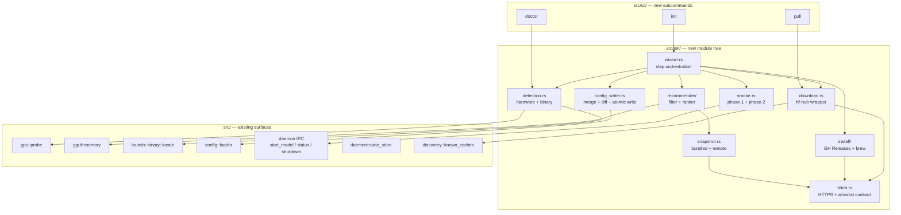
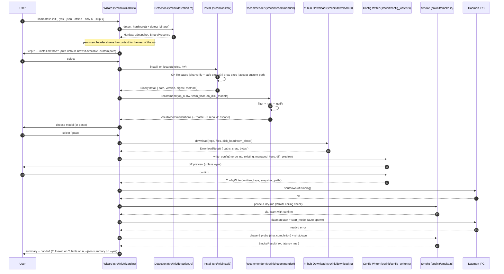

# feat: llamastash v2 — init wizard, doctor, and pull (R48–R80)

## Overview

v2 lands three coordinated CLI surfaces that share one detection + fetch substrate:

- **`llamastash init`** — terminal-prompts wizard (no ratatui) that detects hardware, installs `llama-server` per OS×GPU class, downloads a recommender-picked starter GGUF into the HF cache layout R2 already scans, writes a tuned `config.yaml` (new `_init_snapshot` + `arch_defaults` blocks), and runs an end-to-end smoke launch.
- **`llamastash doctor`** — read-only diagnostic that reuses init's detection module and compares against the `_init_snapshot` baseline.
- **`llamastash pull <hf-repo>`** — graduated R46 primitive (was v1 `unimplemented!`), the same `hf-hub`-based downloader init's model step uses.

The release ships a Rust-native recommender (whichllm-derived algorithm, slim Path A) and a daily CI-refreshed benchmark snapshot bundled into the binary as fallback. Init is fully idempotent (`--only` / `--skip` for component re-runs), agent-driveable (`--yes` / `--json`), and offline-capable (`--offline` / `LLAMASTASH_OFFLINE`). The v1 security contract is preserved unchanged; init's three new surfaces — binary install + execve, network egress, HF token reads — each carry a documented control.

## Problem Frame

Origin: `docs/brainstorms/2026-05-18-init-wizard-requirements.md` (Problem Frame). A fresh-machine user installing llamastash today must locate or build `llama-server` and find a GGUF before they ever see the TUI — v1's "healthy endpoint in 10 seconds without reading docs" silently assumes both. v2's deliberate audience expansion to the developer-without-llama.cpp adjacent user requires closing that wall transparently, and committing to curated model picks (R55–R60) as the identity bet. Init must also work as ongoing maintenance for GPU swaps and llama.cpp upgrades — not a one-shot bootstrap.

## Requirements Trace

Full requirements list in the origin document. Mapping each requirement to its owning Implementation Unit:

| Req | Owner | Req | Owner | Req | Owner |
|---|---|---|---|---|---|
| R48 init subcommand | Unit 3, 10 | R59 top-N + HF-paste escape | Unit 6 | R70 smoke launch (phase 1 + 2) | Unit 12 |
| R49 step order + skippable | Unit 10 | R60 on-disk GGUFs ranked alongside | Unit 6 | R71 smoke-launch failure hints | Unit 12 |
| R50 persistent hardware header | Unit 10 | R61 hf-hub Rust crate | Unit 9 | R72 idempotent re-run + managed_keys | Unit 10, 11 |
| R51 install-method prompt | Unit 10 | R62 HF cache target layout | Unit 9 | R73 --only / --skip flags | Unit 3, 10 |
| R52 hardware-aware install default | Unit 8 | R63 multi-shard + resume | Unit 9 | R74 doctor diagnostic set | Unit 13 |
| R53 GH Releases integrity contract | Unit 8 | R64 disk-space precheck | Unit 9 | R75 doctor --json | Unit 13 |
| R54 existing-install detection | Unit 3, 10 | R65 pull primitive + CLI MVP | Unit 9 | R76 init --yes | Unit 10 |
| R55 recommender (filter + ranker) | Unit 6 | R66 config merge + write integrity | Unit 11 | R77 init --json summary | Unit 10 |
| R56 benchmark snapshot 2-tier | Unit 5 | R67 always-written keys + snapshot | Unit 2, 11 | R78 new exit codes 72/73/74 | Unit 3 |
| R57 CI refresh script + corpus gate | Unit 7 | R68 arch_defaults schema | Unit 2, 11 | R79 interactive handoff | Unit 12 |
| R58 justification block | Unit 6 | R69 launch-time precedence | Unit 2 (schema + daemon merge), Unit 12 (consumer) | R80 non-interactive handoff | Unit 10 |
| R71 GH API rate-limit retry | Unit 8 | R71 smoke-launch failure hints | Unit 12 | Security Contract addendum | Unit 4, 8, 9, 11, 13 |

R46 (HF pull primitive) is **pulled forward** and owned by Unit 9. R34 (HTTP/MCP) remains v2-future, not in this release (origin: opportunity-cost discussion).

## Scope Boundaries

Carried from the origin document's Scope Boundaries:

- **Out of scope:** llamastash auto-update; HF token *creation* (read-only); shell rc-file modification; distro package managers (apt/dnf/pacman/AUR); Windows; telemetry; non-GGUF formats (AWQ/GPTQ/raw HF); a Path B-equivalent richer benchmark layer.
- **Explicit non-features:** the wizard maintains no llamastash-specific model registry (HF cache is source of truth); it never edits user-set config keys (managed_keys-scoped writes only); it never writes to `PATH` or shell completions.
- **Deferred TUI surface:** the TUI HF-pull hotkey is *schedule-flexible* (origin: R65) — may stage independently if Unit 9's budget is tight. The `llamastash pull` CLI MVP is a committed deliverable this release.

## Context & Research

### Relevant Code and Patterns

- `src/cli/cli_args.rs` — clap derive surface; `Command` enum currently has `Pull` hidden (the `unimplemented!` v1 shim). The init/doctor commands plug in here.
- `src/cli/mod.rs::dispatch` — async dispatcher; each subcommand returns a `CliResult` mapped to an exit code via `src/cli/exit_codes.rs`. Pattern: handler module per command (`src/cli/start.rs`, `src/cli/stop.rs`, etc.). Init/doctor/pull replace `src/cli/pull.rs`'s placeholder.
- `src/cli/exit_codes.rs` — `SUCCESS = 0`, `USAGE = 64` … `UNKNOWN = 71`. The trailing `distinct_codes_per_failure_class` test prevents collisions; new codes (72/73/74) must extend the test.
- `src/config/loader.rs` — `Config` struct with `#[serde(default)]`, `MAX_CONFIG_BYTES`, regular-file refusal, parse-warning surface. Init's `_init_snapshot` / `arch_defaults` fields plug into `Config` here. The size cap stays; new fields are typed and `#[serde(default)]`.
- `src/daemon/state_store.rs` — the canonical secure-write pattern: `<file>.tmp.<pid>.<rand>` + atomic rename, parse-failure → `<file>.broken-<ts>` quarantine, mode `0600`. R66 / `_init_snapshot` writes mirror this exactly.
- `src/gpu/mod.rs::probe` — chained NVIDIA→AMD→Metal→Vulkan→CpuOnly detection with `PROBE_TIMEOUT = 5s`. Init's hardware-header step calls `probe()` once and reuses the result; doctor calls it again and diffs against `_init_snapshot`.
- `src/launch/binary.rs::locate` — flag > env > config > `$PATH` resolution order, `LocateError::ExplicitPathNotExecutable` action-able errors, canonicalisation. R54's existing-install detection wraps this and adds the "common locations" probe.
- `src/gguf/memory.rs::EstimateOptions` + `src/gguf/metadata.rs` — KV-cache-aware memory estimator and architecture/quant metadata. Recommender's VRAM-fit hard filter calls this; R70 phase-1's pre-download check calls it with the chosen ctx.
- `src/launch/params.rs::compose` + `FORBIDDEN_ADVANCED_PREFIXES` — argv composition with denylist enforced before spawn. R69's precedence rule applies *upstream* of `compose`, in the start-model path that builds `LaunchParams`.
- `src/discovery/known_caches.rs::default_huggingface_paths` — the HF cache discovery roots. `hf-hub` downloads land in the canonical path R2 already scans (origin: R62) with zero glue.
- `src/util/paths.rs` — XDG resolution: `config_dir`, `state_dir`, `cache_dir`, `runtime_socket_path`, `state_file`, `user_config_file`. `_init_snapshot.json` (if Unit 2 picks the separate-state-file design — see Key Decision) plugs in next to `state.json`.
- `src/daemon/supervisor.rs` — `setsid` + log-rotation + state-machine lifecycle. Smoke launch (Unit 12) uses the IPC `start_model` path so children get supervised the same way, not a wizard-direct spawn (except R70's `--version` probe).

### Institutional Learnings

No `docs/solutions/` entries exist yet; greenfield work. v1's review artefacts under `docs/review*.md` carry posture but no init-specific learnings.

### External References

Verification of external contracts is **explicitly part of Unit 1's pre-implementation spikes** rather than pre-decided here. The spike outputs (hf-hub Range-resume behavior, GitHub Releases asset/checksum format, brew Linux bottle CPU-only status, per-backend VRAM overhead band) feed Units 4, 6, 8, 9, and 12 before those units lock their implementations.

## Key Technical Decisions

- **Stop + restart the daemon when init installs a fresh `llama-server`.** Chosen over the new IPC `reload_launch_env` and the in-process supervisor exception. Rationale: smallest surface change, reuses tested orphan-readopt (v1's three-factor confirmation), keeps the "no new non-IPC supervisor entry" invariant intact. The brief unsupervised window during restart is acceptable for an install-time event; v1's orphan-readopt was designed for exactly this case.
- **Path A — dynamic Rust-native recommender (R55) over the static-table alternative.** Confirmed user choice. ~600–700 LOC for VRAM-fit hard filter + composite ranker; the static (GPU class, VRAM, task) corpus check (16/20) acts as a release-blocking regression gate against the ranker, not as the recommender itself. Identity bet: transparent live ranking with per-pick justification (R58).
- **Move `_init_snapshot` out of `config.yaml` and into `$XDG_STATE_HOME/llamastash/init_snapshot.json`.** Rationale: keeps `config.yaml` user-authored and audit-friendly; gives the snapshot the same state-store hardening (`tmp.<pid>.<rand>` + atomic rename + `0600` + quarantine on parse fail) as `state.json` rather than tying integrity to YAML parsing; the snapshot becomes a daemon-/init-/doctor-only artifact the user has no reason to hand-edit. `managed_keys` still records dotted paths the wizard *wrote* into `config.yaml`. The config-side write contract (R66) is preserved unchanged.
- **Snapshot integrity uses monotonic-timestamp + minimum-version, not embedded signature.** Rationale: no key-management story to invent; v2 ships a CI-built artifact in our own GitHub Releases (allowlisted host per the fetch contract) and TLS+host-allowlist already gates origin trust. Signature can layer in post-launch if a real threat model demands it. Bundled snapshot's `min_version` field is the rollback gate; doctor's "remote unreachable since" finding (R74) is the detection path for the rollback-DoS attack the brainstorm's threat model calls out.
- **Init and doctor share a `src/init/detection.rs` module** with `detect_hardware()` (calls `gpu::probe` + RAM/disk inspection), `detect_binary()` (wraps `launch::binary::locate` + R54 common-location probes), and `verify_binary_integrity()` (sha256 + symlink/UID + parent-dir-mode checks). doctor consumes the same module read-only.
- **Custom `reqwest::Client` injected into `hf-hub`.** `hf-hub` accepts a user-supplied transport; init builds one reqwest client configured per the v2 fetch contract (allowlisted hosts, redirect cap, IP-class filter, body-size cap) and hands it to `hf-hub` so HF downloads honor the same policy as snapshot + GH Releases fetches. No fetch-contract carve-out.
- **`arch_defaults` resolved at launch time, daemon-side, between R20 last-params and built-in defaults.** Merge happens in the start-model handler that builds `LaunchParams`, **before** `launch::params::compose` runs. Per-model preset > per-model last-params > `arch_defaults[architecture]` > built-in defaults (R69 precedence). Daemon reads `arch_defaults` from `Config`; `_init_snapshot` is daemon-ignored (init + doctor only). The merge code lives in `src/launch/params.rs` next to `compose` and is wired into `src/ipc/methods.rs::start_model` — Unit 2 owns both the schema and this merge function; Unit 12's smoke launch consumes it via the existing IPC contract.
- **`managed_keys` entries record a value digest, not just the dotted path.** Schema is `Vec<ManagedKey>` where `ManagedKey = {path: String, value_digest: [u8; 32], wrote_at: ISO-8601}`. The digest is `blake3(canonical_yaml_serialization(value))`. On re-run, the wizard compares the on-disk value's digest against the recorded one: match → wizard still owns the key, may regenerate; mismatch → user edited it, preserve. Without value digests, the brainstorm's R72 contract ("never touches keys the user has edited or added by hand") cannot be enforced from paths alone.
- **GH Releases API calls are explicitly unauthenticated** — the reqwest client init builds for the GH Releases path uses no `Authorization` header and never reads `GITHUB_TOKEN`/`GH_TOKEN`/`gh auth`. R71's backoff+fallback handles the 60/hr unauthenticated rate-limit.
- **Init writes mode-`0700` directories explicitly** (`mkdir-with-mode`, not whatever umask permits) for `$XDG_DATA_HOME/llamastash/llama-cpp/<version>/`, `~/.config/llamastash/`, `$XDG_STATE_HOME/llamastash/`. doctor finding #5 extends to flag parent-directory mode drift.
- **`--yes` is `--no-confirm` semantics, not "answer Y to everything".** A failing integrity check (parent-dir writable, cross-UID symlink, archive bomb, checksum mismatch) aborts with exit 72/73/74 rather than silently downgrading. Reasoning: `--yes` is the agent's path; agents must see deterministic failure.
- **No `_init_snapshot` GGUF digest in v2.** v2 records the `llama-server` binary digest (R53) and verifies it via doctor (R74-finding-2), but does *not* record per-GGUF digests. Rationale: GGUFs are user-owned files in the HF cache shared with Python tooling; digesting them on every init introduces I/O and surprises users. Re-evaluate if a real tampering trace lands post-launch.
- **No launch-time binary digest re-verification (detection-only via doctor).** The daemon's `start_model` does not re-check `_init_snapshot.llama_server_digest` against the on-disk binary on every spawn — that's doctor's job. Rationale: launch-time re-verify trains users to dismiss findings after every `brew upgrade` / GH Releases bump (same dynamic that excludes brew binaries from doctor finding #2); active enforcement is post-launch work if a CVE class warrants it.
- **`init --json` output redaction allowlist.** `installed.server.path`, `downloaded[].sha`, `config.diff` are classified not-safe-for-public-log; `config.diff` redacts any key matching the secret-key allowlist (HF token, future auth tokens) before emission. The `--json` summary documents which fields are which class so agent consumers know how to handle them.
- **Disk-headroom default and "no-candidate-fits" UX.** R64: refuse when `free < download_size + 1 GiB` (matches origin spec). R59: zero-candidate-fits suggests a smaller ctx (next preset down), then a smaller quant, then "skip model step and use `llamastash pull` later".

## Open Questions

### Resolved During Planning

- **Daemon binary-path reload (R70 deferred decision)** → stop + restart the daemon (see Key Decisions).
- **Recommender architecture (Path A vs static table)** → Path A dynamic ranker (see Key Decisions).
- **`_init_snapshot` storage location** → separate file under state dir (see Key Decisions).
- **Snapshot integrity verification** → monotonic-timestamp + min-version (see Key Decisions).
- **`arch_defaults` merge point** → daemon-side, in start-model handler, before `compose` (see Key Decisions).
- **hf-hub HTTP-client injection** → llamastash-supplied `reqwest::Client` per the fetch contract (see Key Decisions).
- **GitHub Releases auth posture** → explicitly unauthenticated (see Key Decisions).
- **Wizard-created directory modes** → explicit `0700`, mode flagged by doctor finding #5 (see Key Decisions).
- **`--yes` semantics on integrity failure** → abort with structured exit code, no silent downgrade (see Key Decisions).
- **No per-GGUF digest in v2 / no launch-time binary re-verify** → detection-only via doctor (see Key Decisions).
- **`init --json` redaction policy** → `safe_to_log` allowlist (see Key Decisions).
- **Disk headroom + no-candidate UX** → 1 GiB headroom; ctx-down → quant-down → skip (see Key Decisions).
- **Detection module ownership** → `src/init/detection.rs` shared by init and doctor (see Key Decisions).
- **`managed_keys` schema** → `Vec<{path, value_digest, wrote_at}>` so user-edit detection is value-based, not path-based (see Key Decisions). Without value tracking, R72's "never touches keys the user has edited or added by hand" rule isn't enforceable.
- **`arch_defaults` daemon-side merge function lives in `src/launch/params.rs`** (alongside `compose`) so the daemon's `start_model` handler imports it through the existing module path; Unit 2 owns both the schema and this pure-function merge.
- **`brew install` failure** → abort with `INIT_ABORTED = 72`, no silent downgrade to GH Releases (would surprise users who picked brew specifically; see Unit 8).
- **Daemon stop fallback** → `stop_via_client` (5s timeout) → PID-based SIGTERM (5s grace) → SIGKILL → abort with exit 72 if even the kill fails (see Unit 12).
- **Phase-2 fallback against R20 model that no longer exists** → walk the R20 list and skip missing paths; if every entry is missing, stop at `--version` and report "no model to smoke-probe" (see Unit 12).
- **`detect_binary` common-location list** → includes `/home/linuxbrew/.linuxbrew/bin` on Linux for users with linuxbrew (see Unit 3).
- **Bundled snapshot size budget** → 500 KiB, enforced at build time (see Unit 5).
- **`FetchClient` User-Agent** → minimal `llamastash/<version>` only; no hostname/user (see Unit 4).
- **Snapshot JSON schema shape** → forward-compatible envelope: `{schema_version: u32, bundle_date: ISO-8601, min_version: semver, models: [{repo, file, architecture, quant, params, weights_bytes, benchmark_score: {value, source}, tok_s_factor, recency}]}`. Recommender ignores unknown fields; older binaries refuse a snapshot whose `min_version` exceeds their own build.
- **CI partial-source-failure handling** → last-known-good fallback: the refresh script writes a candidate snapshot but only promotes it to the daily Release asset if (a) every source returned data and (b) the 16/20 corpus passes the failure threshold. Otherwise it auto-files a recalibration issue; the previous Release stays live. doctor's "remote unreachable since" finding (R74) catches the prolonged-degraded case.
- **`vram_gb` aggregation rule** → `min(device.total_memory_bytes)` for Nvidia/Amd (single-GPU placement is the limiting case); `total_memory_bytes × 0.75` for AppleMetal; `null` for CpuOnly + Unknown. Pin in `detection.rs`.
- **Archive-bomb defenses** → entry count cap 10 000, total uncompressed cap 2 GiB, per-entry compression-ratio cap 100×, refuse hardlinks. All applied during extraction, before atomic rename.
- **Wizard-direct `--version` probe env-strip** → `Command::env_clear()` then re-apply the supervisor's minimum env (`PATH`, `HOME`, `USER`, `LANG`); `LLAMA_ARG_*` and `HF_TOKEN` stripped explicitly.

### Deferred to Implementation

- Exact `dialoguer` macro choice per prompt (`Select` vs `FuzzySelect` vs `Confirm`) — settled when prompts are wired.
- Final regex(es) for parsing `ggml-org/llama.cpp` release asset names — settled in Unit 8 after the Unit 1 spike captures the current naming.
- Final reqwest `User-Agent` string and timeout per endpoint class (GH API vs snapshot host vs HF) — settled in Unit 4 once we know rate-limit headroom.
- Whether the daily snapshot Release tag is `snapshot-YYYY-MM-DD` or rolling `snapshot-latest` (CI-script choice; settled in Unit 7).
- Whether the maintenance-tool TUI nudge (origin: open question) ships in this release or a follow-up — flagged as Future Considerations.
- Whether `init` writes a per-step wall-clock trace to `$XDG_STATE_HOME/llamastash/init-trace.json` (origin: "Attended-time-to-decision" reframing) — left to implementation in Unit 10; cost is small, and the file is opt-in to share.
- Final progressive-disclosure shape of R58's justification block (one-line vs `?`-expand) — UX call settled in Unit 6 once we have real picks to render.

## High-Level Technical Design

> *These illustrate the intended approach and are directional guidance for review, not implementation specification. The implementing agent should treat them as context, not code to reproduce.*

### Component map



### `init` step lifecycle (R49)



### Recommender pipeline (R55 / R58 / R59 / R60)

```text
candidates  = snapshot.models  ∪  on_disk_models(catalog)             [labeled]
fit_filter  = peak_mem(ctx, KV-dtype, model) ≤ 0.90 × VRAM − overhead_band[backend]
score       = w_b · benchmark_score
            + w_t · tok_s_factor(bandwidth, quant_efficiency, backend)
            + w_q · params_quality_curve(param_count)
            + w_r · recency
top_n       = top_by(score, candidates.filter(fit_filter))
ranked      = top_n.map(annotate_justification)                        [headroom, score, tok/s ± band, params, quant]
result      = ranked ++ [Escape("paste HF repo id"), ...on_disk_unranked_lowest_priority]
no_fit_fallback: try ctx_down ↘ quant_down ↘ "skip model step"
vram_unknown_branch: prompt user for VRAM estimate; fall back to CPU bucket
```

*Weights `w_b/w_t/w_q/w_r` and `overhead_band[backend]` live in the snapshot as `recommender_weights` so a CI snapshot regeneration can re-tune without a binary release. The 16/20 corpus check pins weight changes against regressions.*

### `init`/`doctor` mode/flag decision matrix (R72 / R73 / R74)

| Invocation | Detection (step 1) | Server (step 2) | Models (steps 3 + 5) | Config (step 4) | Handoff (step 6) |
|---|---|---|---|---|---|
| `init` (no flags) | run | prompt | prompt | prompt | TUI exec |
| `init --only server` | run | run | **skip** | **skip** | print summary |
| `init --only models` | run | **skip** | run | **skip** | print summary |
| `init --only config` | run | **skip** | **skip** | run | print summary |
| `init --skip models` | run | run | **skip** | run | TUI exec / print |
| `init --yes` | run | auto-default | top-1 + disk-check | merge + no-confirm | print summary |
| `init --yes --json` | run | auto-default | top-1 | merge + no-confirm | JSON summary |
| `init --offline` | run | skip if needs net | skip if needs net | run | print "offline" hints |
| `doctor` | run + diff | read-only check | n/a | read-only check | n/a |
| `doctor --json` | same | same | n/a | same | structured findings |

`--only` and `--skip` are mutually exclusive, both repeatable, both comma-separable. Step 1 (detection) and step 6 (handoff) always run.

## Implementation Units

- [x] **Unit 1: Pre-implementation spikes (research only, no production code)**

**Goal:** Resolve the four research items the brainstorm folded into planning. Each spike outputs a small fixture or one-line fact that pins a downstream unit's design.

**Requirements:** R52, R53, R55, R56, R61, R63, R70 (each spike unblocks specific downstream units).

**Dependencies:** None.

**Files:**
- Create: `docs/spikes/2026-05-XX-hf-hub-resume.md` — fixture + finding.
- Create: `docs/spikes/2026-05-XX-hf-hub-client-injection.md` — confirms `ApiBuilder::with_client(reqwest::Client)` exists on the pinned `hf-hub` version, applies to *all* download paths (not just metadata), and propagates redirect/host/IP-class/body-size policy. If injection is partial, this spike scopes the carve-out (option (b) in the origin's deferred-to-planning item) before Unit 4 / Unit 9 lock.
- Create: `docs/spikes/2026-05-XX-llama-cpp-releases-asset-contract.md` — asset-name regex, checksum publication path, variant set per platform.
- Create: `docs/spikes/2026-05-XX-brew-linux-bottle.md` — one-line bottle CUDA/HIP/Vulkan status against current SHA.
- Create: `docs/spikes/2026-05-XX-vram-overhead-band.md` — measured peak overhead per backend (CUDA / HIP / Vulkan / Metal / CPU).

**Approach:**
- hf-hub resume: build a one-off binary that calls `Api::get()` against a small multi-shard HF GGUF, kill the download mid-shard, restart, and verify whether the second request uses HTTP Range or restarts the shard. If no native Range, scope the range-resume wrapper concretely.
- hf-hub client injection: write a tiny binary that builds a `reqwest::Client` rejecting all non-allowlisted hosts, hands it to `hf-hub::ApiBuilder::with_client`, and confirms a download to a non-allowlisted mirror is refused at the transport layer. If `with_client` doesn't exist on the pinned version or applies only to metadata, the spike outputs which fetch contract controls must be implemented in a llamastash-side wrapper around `hf-hub`'s downloads instead.
- GH Releases contract: hit `https://api.github.com/repos/ggml-org/llama.cpp/releases` for the most recent N releases and document (a) asset-name regex that survives across releases, (b) whether SHA-256 digests are discrete assets or only in the rendered release body, (c) confirmed variant set per platform.
- Brew Linux bottle: `brew info --json=v2 llama.cpp` on a Linux test box → record bottle SHA + which build options the formula ships.
- VRAM overhead: spawn `llama-server` against a 7B Q4 model on one machine per available backend, sample peak resident memory at load, compute stddev across N=5 runs. Record default band per backend.

**Patterns to follow:**
- `docs/architecture.md` is the audience for short-form fact statements; spike docs follow the same matter-of-fact tone.

**Test scenarios:**
- *Test expectation: none — research-only deliverables (Markdown fixtures), not code. Spike output is consumed by Units 4, 6, 8, 9, 12 design decisions.*

**Verification:**
- Each spike doc contains a clear yes/no or numeric finding that a downstream unit can cite without further investigation.
- The hf-hub resume spike either confirms native Range resume or scopes a wrapper.
- The hf-hub client-injection spike either confirms `with_client` propagates the fetch contract to all download paths, or scopes the wrapper-around-hf-hub carve-out for Unit 9.
- The GH Releases spike either confirms discrete SHA assets or pins the body-parse fallback.
- The brew spike confirms or refutes "Linux bottle is CPU-only" (R52's routing premise).

---

- [x] **Unit 2: Config schema extensions + state-store sibling**

**Goal:** Extend `Config` with `_init_snapshot` (separate file under state dir) and `arch_defaults`, plus the secure-write helper init uses to merge keys into `config.yaml`.

**Requirements:** R66, R67, R68, R69 (schema half), Security Contract (config write integrity).

**Dependencies:** Unit 1 spikes do not block this unit; can run in parallel with Unit 1.

**Files:**
- Modify: `src/config/loader.rs` — add typed `arch_defaults: BTreeMap<String, ArchDefaults>` field to `Config`. Add `ArchDefaults` struct (`n_gpu_layers`, `threads`, `cache_type_k`, `cache_type_v`, `flash_attn`, `mlock`, `no_mmap`, `parallel`, each `Option`).
- Create: `src/init/snapshot.rs` — `InitSnapshot` struct (gpu_vendor, vram_gb, gpu_device_count, llama_server_version, install_method: InstallMethod, init_date, llama_server_path, llama_server_digest, snapshot_bundle_date, remote_fetch_failures: u32, managed_keys: Vec<ManagedKey>) with `ManagedKey = {path: String, value_digest: [u8; 32], wrote_at: String}`; load/save with `tmp.<pid>.<rand>` + atomic rename, 0600 mode, parse-fail → `init_snapshot.json.broken-<ts>`. Path resolution via `util::paths::state_dir().join("init_snapshot.json")`.
- Modify: `src/launch/params.rs` — add `pub fn apply_arch_defaults(params: &mut LaunchParams, defaults: &ArchDefaults)` that fills `params.advanced` with default flags **only if** the corresponding flag is not already present (respecting R69 precedence: existing values in `LaunchParams` originate from preset/last-params and outrank defaults). Pure function; no I/O.
- Modify: `src/ipc/methods.rs::start_model` — call `apply_arch_defaults` between merging last-params (R20) and built-in defaults, keyed by the GGUF's `architecture` field read from `Config.arch_defaults`. The handler reads `Config` from the daemon's loaded copy; no schema migration needed (existing `#[serde(default)]` covers backward parsing).
- Modify: `src/util/paths.rs` — add `init_snapshot_file()` helper next to `state_file()`.
- Modify: `src/config/mod.rs` — re-export `ArchDefaults`.
- Create: `src/config/writer.rs` — secure-write helper (`merge_and_write(path, current: &Config, additions: &PartialConfig, managed_keys: &mut Vec<String>) -> Result<Diff>`). Refuses if target is a symlink or parent dir is group/world-writable on Linux; uses `<config.yaml>.tmp.<pid>.<rand>` + atomic rename; final mode 0600. Recursive merge: leaf-level user edits inside a managed block are preserved.
- Test: `src/config/loader.rs` inline tests for `arch_defaults` round-trip; `src/init/snapshot.rs` inline tests; `src/config/writer.rs` inline tests; `tests/init_snapshot_persistence.rs` integration test for tmp-rename + corruption recovery.

**Approach:**
- `ArchDefaults` derives `Default`, `Serialize`, `Deserialize`; `BTreeMap<String, ArchDefaults>` keyed by GGUF `architecture` field (`llama`, `qwen2`, `mistral`, `gemma`, `phi`, `qwen3`, …).
- `InitSnapshot` is *not* embedded in `Config`; it lives in a sibling state file so the wizard owns its integrity end-to-end without burdening `config.yaml`'s parser. `managed_keys` is `Vec<String>` of dotted paths (e.g. `"llama_server_path"`, `"port_range"`, `"arch_defaults.llama"`).
- The writer's `merge` is *recursive*: managed block exists in user config → merge keys we wrote last time, preserving user-added keys inside that block; managed block absent → write it; managed key user-overridden → leave alone.
- `_init_snapshot` data being read by both init and doctor → defined on the `crate::init` boundary; daemon ignores it (no daemon dependency).
- `apply_arch_defaults` lives in `src/launch/params.rs` so the daemon's `start_model` handler can call it via the existing `use crate::launch::params::compose` import path. The function is pure (read-only `&ArchDefaults`, mutable `&mut LaunchParams`) and unit-testable without daemon scaffolding.

**Patterns to follow:**
- `src/daemon/state_store.rs::save` for the tmp+rename pattern.
- `src/daemon/state_store.rs` schema-version + quarantine-on-parse-fail pattern.
- `src/config/loader.rs::MAX_CONFIG_BYTES` size cap; reuse for the snapshot file.

**Test scenarios:**
- *Happy path*: `Config` with `arch_defaults: {qwen2: {n_gpu_layers: 99}}` round-trips through YAML.
- *Happy path*: `InitSnapshot::save_then_load` round-trips and writes mode 0600.
- *Edge case*: missing `_init_snapshot` file → `load()` returns `Ok(None)`, no warning (first-run case).
- *Edge case*: corrupt `init_snapshot.json` → parse fails, file moved to `init_snapshot.json.broken-<ts>`, returns `Ok(None)`.
- *Error path*: `merge_and_write` against a symlink target → refuses with actionable error.
- *Error path*: `merge_and_write` when parent dir is `0777` (Linux only) → refuses with actionable error.
- *Edge case*: `merge_and_write` preserves a user-added key inside a managed `arch_defaults.qwen2` block (recursive merge).
- *Edge case*: `merge_and_write` does not touch a key the user has explicitly set, even if it's in `managed_keys`.
- *Integration*: tmp file gets atomic-renamed; aborting between tmp-write and rename leaves the previous `config.yaml` intact.
- *Edge case*: `managed_keys` correctly enumerates `{path, value_digest, wrote_at}` triples after a multi-block write; the digest is reproducible from the same canonical YAML serialization.
- *Edge case*: on re-run, a managed key whose on-disk value digest matches the recorded one is treated as wizard-owned (regenerable); a key whose digest differs is treated as user-edited (preserved).
- *Happy path*: `apply_arch_defaults` fills `n_gpu_layers` when not already in `params.advanced`; leaves it alone when an upstream caller has set it (preset / last-params precedence).
- *Edge case*: `apply_arch_defaults` against an architecture with no entry in `Config.arch_defaults` is a no-op (no panic, no insertion).

**Verification:**
- `cargo test --features test-fixtures config::loader config::writer init::snapshot` passes.
- A hand-edited `config.yaml` with user-added `theme: latte` survives a wizard write that targets `port_range` and `arch_defaults`.

---

- [x] **Unit 3: CLI subcommand surface + new exit codes + shared detection module**

**Goal:** Add `init`, `doctor`, and a working `pull` to the clap surface; reserve exit codes 72/73/74; create `src/init/detection.rs` as the shared module init and doctor consume.

**Requirements:** R48, R54 (existing-install probe half), R73 (--only / --skip parsing), R78, R75 (doctor --json shape).

**Dependencies:** Unit 1 is a soft dependency for `detect_binary`'s common-location list (informed by spike output but the module can ship a sensible default first).

**Files:**
- Modify: `src/cli/cli_args.rs` — add `Init(InitArgs)`, `Doctor(DoctorArgs)` to `Command`. Rewrite `PullArgs` to add a top-level positional `repo: String` for the MVP form (`llamastash pull <hf-repo>`). Add `InitArgs`: `yes: bool`, `json: bool`, `offline: bool`, `only: Vec<InitStep>`, `skip: Vec<InitStep>`, with `value_delimiter = ','` and `ArgAction::Append`. Add `InitStep` enum (`Server`, `Config`, `Models`).
- Modify: `src/cli/exit_codes.rs` — add `INIT_ABORTED = 72`, `INIT_DOWNLOAD_FAILED = 73`, `INIT_SMOKE_FAILED = 74`. Extend `distinct_codes_per_failure_class` test.
- Modify: `src/cli/mod.rs` — wire `Command::Init`/`Command::Doctor` to new handler modules; replace `pull::handle` deferred stub.
- Create: `src/cli/init.rs` — handler stub that calls into `src/init/wizard.rs` (Unit 10).
- Create: `src/cli/doctor.rs` — handler stub that calls into `src/init/doctor.rs` (Unit 13).
- Rewrite: `src/cli/pull.rs` — handler that calls into `src/init/download.rs` (Unit 9).
- Create: `src/init/mod.rs` — declares submodules: `detection`, `wizard`, `recommender`, `snapshot`, `install`, `download`, `config_writer`, `smoke`, `fetch`, `doctor`.
- Create: `src/init/detection.rs` — `detect_hardware()` returns `HardwareSnapshot` (calls `gpu::probe` + RAM/disk inspection + `vram_gb` aggregation rule from Key Decisions); `detect_binary()` returns `BinaryPresence` (wraps `launch::binary::locate` + probes prior llamastash-managed install dir, `/opt/homebrew/bin`, `/usr/local/bin`, `/home/linuxbrew/.linuxbrew/bin` (Linux only), `LLAMASTASH_LLAMA_SERVER`). Pure logic; no I/O beyond probe + filesystem stat.
- Modify: `src/lib.rs` — `pub mod init;`.
- Test: inline `#[cfg(test)] mod tests` per file; `tests/cli_init_parse.rs` for `--only`/`--skip` parsing matrix; `tests/cli_doctor_basic.rs` for the read-only smoke.

**Approach:**
- `InitStep` uses `ValueEnum` so `--only server,config` parses to `Vec<InitStep>`. The repeatable + comma-separated requirement is satisfied by `ArgAction::Append` + `value_delimiter`.
- `--only` and `--skip` get `clap`-level `conflicts_with = "skip"` / `conflicts_with = "only"`.
- `detect_binary` returns `BinaryPresence { resolved_path: Option<PathBuf>, source: BinarySource, version: Option<String>, digest: Option<[u8; 32]> }`. `BinarySource` enum tags PATH / env / config / common-location / known-managed-dir.
- The shared module is `pub` at `crate::init::detection`; doctor calls it read-only; init calls it once at step 1 and stashes the snapshot for the rest of the run.
- New exit codes: `INIT_ABORTED = 72`, `INIT_DOWNLOAD_FAILED = 73`, `INIT_SMOKE_FAILED = 74`. `PULL_FAILED = 69` remains the contract for `llamastash pull` (an existing-binary HF download), distinct from 73 (init's download step).

**Patterns to follow:**
- `src/cli/start.rs` and `src/cli/stop.rs` for handler-module structure.
- `src/cli/exit_codes.rs::distinct_codes_per_failure_class` for the collision test extension.
- `src/launch/binary.rs::locate` for the existing detection path.

**Test scenarios:**
- *Happy path*: `llamastash init --only server,config` parses to `InitStep::Server + InitStep::Config`.
- *Happy path*: `llamastash init --only server --only models` parses to `InitStep::Server + InitStep::Models` (repeatable).
- *Error path*: `llamastash init --only server --skip config` fails clap parse with mutual-exclusion error.
- *Happy path*: `llamastash doctor --json` is accepted and dispatched; `llamastash doctor` (no flags) is accepted and dispatched.
- *Happy path*: `llamastash pull HuggingFaceH4/zephyr-7b-beta-gguf` parses to `PullArgs { repo: "HuggingFaceH4/zephyr-7b-beta-gguf" }`.
- *Happy path*: `detect_hardware()` on the test machine returns a non-panicking snapshot with `vram_gb` honoring the aggregation rule (CpuOnly → None, AppleMetal → 0.75 × total, etc.).
- *Happy path*: `detect_binary()` finds a touched `llama-server` placed in a temp dir on `$PATH`.
- *Edge case*: `detect_binary()` returns `BinarySource::Common` when nothing is on `$PATH` but a binary lives at `/opt/homebrew/bin/llama-server` (mock via override hook for testability).
- *Edge case*: exit-code constants are all distinct (existing test extended for 72/73/74).

**Verification:**
- `cargo run -- init --help` shows the new flags.
- `cargo run -- doctor --json` returns a structured (possibly empty) findings array.
- `cargo test --features test-fixtures cli` passes.

---

- [x] **Unit 4: Network fetch contract + offline mode**

**Goal:** Build the shared HTTPS-only allowlisted fetch client used by snapshot fetch, GH Releases install, and `hf-hub`. Honor `LLAMASTASH_OFFLINE` / `--offline`.

**Requirements:** Security Contract (network egress), R53 verification half, R56 fetch half, R61 hf-hub client injection.

**Dependencies:** Unit 1 GH-Releases-contract spike output (used to lock the asset-name regex and shape the User-Agent).

**Files:**
- Create: `src/init/fetch.rs` — `FetchClient` builder + impl. Exposes `get_bytes(url, max_bytes)` and `get_json<T: Deserialize>(url)`. Owns a `reqwest::Client` configured per the contract.
- Create: `src/init/fetch_policy.rs` — host allowlist, redirect cap (3), IP-class refusal (private / loopback / link-local / `169.254.169.254`), body-size cap, TLS-only, no opportunistic `GITHUB_TOKEN`.
- Modify: `Cargo.toml` — add `reqwest` features the new client needs (`rustls-tls` is already there; may need `gzip`); reuse the existing `reqwest 0.12` dep.
- Modify: `Cargo.toml` — add `hf-hub = "0.4"` (or the latest 1.x at planning time) with default features minimized; the resolved version is pinned in `Cargo.lock`.
- Test: `src/init/fetch.rs` inline tests; `tests/fetch_redirect_policy.rs` integration test against a local `wiremock`-style server (or hand-rolled `tokio::net::TcpListener` so we don't pull in a test dep).

**Approach:**
- Custom `redirect::Policy`: count + per-hop check that resolved IP is not private/loopback/link-local/metadata-service.
- Body size enforced by reading into a `Vec<u8>` with `take(max_bytes)`-equivalent; refuses if `Content-Length > max_bytes` up-front.
- User-Agent is minimal — `llamastash/<CARGO_PKG_VERSION>` only. No hostname, no `$USER`, no OS detail beyond what `reqwest` includes by default in its TLS handshake. Servers that need OS info can read the TLS fingerprint; the User-Agent itself is not a fingerprinting surface.
- `FetchClient::offline()` returns a stub variant whose calls return `FetchError::Offline`; the wizard checks the result class to print actionable hints rather than crashing.
- `LLAMASTASH_OFFLINE=1` env or `--offline` flag → `FetchClient::offline()`. `--offline` overrides env in the same direction the v1 CLI overrides work.
- `hf-hub` accepts `ApiBuilder::with_client(reqwest::Client)`. Init passes its own client; the same policy applies to HF traffic.

**Patterns to follow:**
- `src/gpu/mod.rs::run_with_timeout` for the deadline-and-cleanup pattern (applied to in-flight requests).
- v1 has no existing HTTP-client patterns; this unit is the canonical one.

**Test scenarios:**
- *Happy path*: GET against allowlisted host returns body bytes; under `max_bytes` cap.
- *Error path*: GET against a non-allowlisted host returns `FetchError::HostNotAllowed` without making a connection.
- *Error path*: redirect to a non-allowlisted host is refused; redirect chain capped at 3.
- *Error path*: redirect whose resolved IP is `127.0.0.1` / `10.0.0.5` / `169.254.169.254` is refused.
- *Error path*: response with `Content-Length` over `max_bytes` is refused before body read.
- *Error path*: streaming response that exceeds `max_bytes` mid-read is truncated and returns `FetchError::BodyOverflow`.
- *Edge case*: HTTP (plaintext) URL is refused even on an allowlisted host (HTTPS-only invariant).
- *Edge case*: `LLAMASTASH_OFFLINE=1` makes every method return `FetchError::Offline` without dialing.
- *Integration*: 60/hr rate-limit response from a stubbed GH Releases endpoint is caught and surfaced as `FetchError::RateLimited` so R71's backoff path triggers.
- *Edge case*: no `Authorization` header is sent against `api.github.com` even when `GITHUB_TOKEN` is exported.

**Verification:**
- All adversarial test scenarios above pass.
- `cargo run -- init --offline` (after Unit 10 lands) makes zero outbound requests, verified via test fixture.

---

- [x] **Unit 5: Benchmark snapshot — schema, bundling, remote fetch**

**Goal:** Define the JSON schema, bundle a snapshot into the binary at compile time, and implement the short-timeout remote fetch with monotonic-timestamp + min-version verification.

**Requirements:** R56, Security Contract (snapshot integrity).

**Dependencies:** Unit 4 (fetch contract); Unit 1 spike output is not blocking but informs `recommender_weights` defaults.

**Files:**
- Create: `data/benchmark-snapshot.json` — committed to the repo; the CI script in Unit 7 regenerates it. Bundled into the binary via `include_str!`.
- Create: `src/init/snapshot.rs` (extends Unit 2's file or split into `src/init/snapshot/` if the file gets long) — `BenchmarkSnapshot` struct: `schema_version: u32`, `bundle_date: chrono-like ISO-8601 string`, `min_version: semver`, `recommender_weights`, `models: Vec<ModelEntry>`.
- Add: `pub fn load_bundled() -> BenchmarkSnapshot` (parses `include_str!` at startup).
- Add: `pub async fn load_remote(fetch: &FetchClient, bundled: &BenchmarkSnapshot) -> Option<BenchmarkSnapshot>` — short-timeout fetch, returns `None` on any failure (silent fallback per Security Contract); checks `remote.min_version <= our build version` and `remote.bundle_date > bundled.bundle_date` before accepting.
- Modify: `Cargo.toml` — add a small semver crate (`semver = "1"`) for the min-version check.
- Test: inline tests for bundle load + remote verification + fallback semantics.

**Approach:**
- Schema is intentionally forward-compatible: `schema_version` lets a future field land; unknown fields parse-tolerated via `#[serde(deny_unknown_fields = false)]`.
- `min_version` is the rollback gate. Local binary's `CARGO_PKG_VERSION` is the comparator.
- Remote fetch failure (including verification mismatch) is **silent** — we log at `info!`, not `warn!`, and the recommender uses the bundled snapshot. doctor's "remote unreachable since" finding (R74-finding-silent-fallback) records consecutive failures so users learn about prolonged outages.
- The bundled snapshot is included via `include_str!("../../data/benchmark-snapshot.json")` so it travels with the binary (R45 single-binary invariant). **Size budget: 500 KiB committed source artifact.** Enforced by a build-time check (`build.rs` or a `const_assert` on the included bytes) so a future snapshot regen that blows past the budget fails the build rather than silently bloating the binary. The CI script (Unit 7) keeps the snapshot under budget by capping vendored fields per model entry; if 500 KiB becomes binding, the budget is raised deliberately rather than drifted.
- The remote URL is `https://github.com/llamastash/llamastash/releases/download/snapshot-latest/benchmark-snapshot.json` (or whichever tag Unit 7's CI publishes; pinned in `src/init/snapshot.rs` as a const).

**Patterns to follow:**
- `src/banner.rs::BANNER` for `include_str!`-bundled data.
- `src/config/loader.rs` parse-tolerant deserialization with default fields.

**Test scenarios:**
- *Happy path*: `load_bundled()` parses without error and yields a non-empty `models` array.
- *Happy path*: `load_remote` accepts a fresher snapshot (bundle_date newer + min_version ≤ build) and returns `Some`.
- *Edge case*: `load_remote` rejects a snapshot whose `min_version` exceeds the build (rollback-DoS gate).
- *Edge case*: `load_remote` rejects a snapshot whose `bundle_date` is older than bundled (monotonic-timestamp gate).
- *Error path*: `load_remote` returns `None` on `FetchError::Offline` / `HostNotAllowed` / `BodyOverflow` (silent fallback).
- *Integration*: a corrupt remote JSON is treated as a failure (silent fallback), not a panic.
- *Edge case*: schema parser tolerates a snapshot with an unknown new field (forward compat).

**Verification:**
- Recommender (Unit 6) consumes the bundled snapshot when offline and the remote one when network + verification both succeed.

---

- [x] **Unit 6: Recommender — VRAM-fit filter + composite ranker + justification**

**Goal:** The Path-A recommender. Pure Rust, candidate universe = bundled+remote snapshot ∪ R2-discovered on-disk GGUFs.

**Requirements:** R55, R58, R59, R60.

**Dependencies:** Unit 5 (snapshot); Unit 2 (detection's `HardwareSnapshot`); Unit 1 VRAM-overhead-band spike output (informs `overhead_band` defaults).

**Files:**
- Create: `src/init/recommender/mod.rs` — `recommend(snapshot, hardware, on_disk, top_n, ctx_floor) -> Vec<Recommendation>`.
- Create: `src/init/recommender/filter.rs` — `fits(model, hardware, ctx) -> bool` using `gguf::memory::estimate` + the snapshot's `overhead_band[backend]`.
- Create: `src/init/recommender/ranker.rs` — composite score = `Σ wᵢ · feature_i(model, hardware)`.
- Create: `src/init/recommender/justify.rs` — render the one-line and expanded justification blocks.
- Test: inline tests per file + `tests/recommender_corpus.rs` for the 16/20 corpus check.

**Approach:**
- Filter: `estimated_peak_mem ≤ 0.90 × vram_gb − overhead_band[backend]`. CpuOnly → "fits if weights ≤ 0.5 × RAM" (1–3B Q4 size bucket per origin doc).
- Ranker: weights live in the snapshot (`recommender_weights`), so CI re-tuning doesn't require a binary release. Default weights documented in `data/benchmark-snapshot.json`.
- VRAM-unknown branch (`GpuInfo::Unknown`): the wizard prompts the user for an estimate before calling `recommend`. If declined, recommend the CPU bucket.
- On-disk models: the catalog (R2) supplies GGUF metadata; the recommender produces a synthetic `ModelEntry` (no benchmark_score) and ranks them alongside snapshot entries with a `[already on disk]` label; ties broken in favor of on-disk to make the "skip download" path natural.
- Escape option (`I'll paste an HF repo id`) is always appended as the final list entry. Always present, regardless of fit results — the brainstorm explicitly says first-class, not buried.
- No-fit fallback: try `ctx_floor` halved → next quant down → "skip model step" (UX prompt in Unit 10).
- Justification block (R58): one-line summary by default ("fits 24 GB · ~52 t/s · 7B Q4"); user presses `?` (handled by the dialoguer wrapper) to reveal the full breakdown — composite score, tok/s confidence band, parameter count, quant, benchmark source.

**Patterns to follow:**
- `src/gguf/memory.rs::estimate` (existing) for the peak-memory function.
- `src/gguf/identity.rs::ModelId` for stable model identity in the recommendation output.

**Test scenarios:**
- *Happy path*: 24 GB Nvidia + 16k ctx + default weights → top pick is a ≥ 7B Q4/Q5 model fitting under the safety margin.
- *Happy path*: CpuOnly hardware → top pick is a 1–3B Q4 model.
- *Edge case*: VRAM exactly at the safety ceiling → model is filtered out (no off-by-one accepting a hair-over fit).
- *Edge case*: no models fit at default ctx → no-fit fallback offers ctx-halved alternative; if none still fit, offers quant-down; if none, "skip model step".
- *Edge case*: on-disk GGUF that fits ranks above a remote GGUF with a marginally higher score (tie-break preference).
- *Edge case*: escape option ("paste HF repo id") is always appended last, even when 5 candidates fit.
- *Edge case*: `GpuInfo::Unknown` without a user-supplied VRAM estimate → defaults to CPU bucket.
- *Edge case*: multi-GPU Nvidia with min(VRAM)=8 GB picks against the 8 GB ceiling, not the aggregate.
- *Integration*: 16/20 corpus check: maintainer-curated (GPU class, VRAM, task) inputs match top-3 ≥ 16 times. Fixture lives in `tests/fixtures/recommender_corpus.json`.

**Verification:**
- `cargo test --features test-fixtures recommender` passes including the 16/20 corpus.
- A failing corpus drops below the documented threshold (e.g. <14/20) → the test fails loudly so a snapshot regression doesn't ship.

---

- [x] **Unit 7: CI benchmark snapshot regeneration script + release-blocking corpus gate**

**Goal:** Python script under `scripts/` that fetches benchmark sources, builds the snapshot JSON, runs the 16/20 corpus check, and publishes to GitHub Releases on success.

**Requirements:** R56 (remote-tier source), R57 (CI script + corpus gate), Security Contract (CI loop as first-class).

**Dependencies:** Unit 5 (snapshot schema) so the script writes valid output; Unit 6 (recommender corpus runner) so the gate can run.

**Files:**
- Create: `scripts/regenerate-benchmark-snapshot.py` — fetches sources, merges into snapshot JSON, validates schema, runs corpus gate via `cargo test --features test-fixtures --test recommender_corpus -- --nocapture`. Exits non-zero if gate fails or any source returns no data.
- Create: `scripts/benchmark_sources/` — vendored whichllm Python modules (Open LLM Leaderboard, Aider, etc.). Attribution + commit hash recorded in `NOTICE`.
- Create: `NOTICE` — vendored-source attribution (MIT, with current upstream commit hash for sync trail).
- Create: `.github/workflows/regenerate-benchmark-snapshot.yml` — daily cron + manual-trigger. Steps: checkout, install Python deps, run script, on success: `gh release upload snapshot-latest --clobber benchmark-snapshot.json`. On failure: `gh issue create --label snapshot-regression`.
- Modify: `NOTICE` is added to crate metadata so it's distributed with the source release.

**Approach:**
- The script is the gate, not just a refresher. The gate is run **twice**: locally during the daily build, and also against any PR that touches `data/benchmark-snapshot.json` so a manual update of the bundled snapshot follows the same rules.
- Partial-source-failure policy: if any source returns no data (timeout, parse error, upstream removal), the script does **not** publish — last-known-good stays live. doctor finding "remote unreachable since" surfaces prolonged outages.
- The published Release tag is `snapshot-latest` (rolling) for the URL stability the bundled snapshot's `REMOTE_URL` const relies on. Each daily run is also tagged `snapshot-YYYY-MM-DD` for audit history.
- `cargo test --test recommender_corpus` is the corpus gate — Unit 6 owns the actual fixture and runner.
- Vendored Python keeps the binary pure-Rust (R45) — the script runs in CI only.

**Patterns to follow:**
- `docs/architecture.md` style — short and matter-of-fact for the README that ships with the snapshot tarball.
- v1 CI workflows in `.github/workflows/` for the action-step convention (TBD which v1 workflows exist; the spike unit can confirm).

**Test scenarios:**
- *Happy path*: dry-run of the script against fixture data produces a valid snapshot that the Rust loader parses.
- *Happy path*: corpus gate run against a passing fixture exits 0.
- *Error path*: corpus gate run against a regressed snapshot exits non-zero; CI workflow does not publish.
- *Error path*: partial source failure → script does not publish; auto-files a recalibration issue.
- *Integration*: the rolling `snapshot-latest` Release tag stays live across daily runs; per-day audit tags accumulate.
- *Edge case*: a hand-authored PR that changes `data/benchmark-snapshot.json` triggers the same corpus gate via a `paths:` filter on the workflow.

**Verification:**
- A green daily run uploads a fresh `benchmark-snapshot.json` to `snapshot-latest`; the Rust binary's `load_remote` accepts it.
- A red corpus gate run blocks publication and files an issue.

---

- [x] **Unit 8: GitHub Releases install path — download, integrity, safe extract**

**Goal:** When R52's hardware-aware default routes to GH Releases, download the right asset, verify SHA-256 (fetched via REST API, not HTML), and safely extract to a versioned directory.

**Requirements:** R52 (GH Releases routing), R53 (integrity contract), Security Contract (binary install path).

**Dependencies:** Unit 4 (fetch client); Unit 1 GH-Releases-contract spike output (asset regex, checksum publication path, variant set).

**Files:**
- Create: `src/init/install/mod.rs` — `install(method: InstallMethod, hardware: &HardwareSnapshot) -> Result<BinaryInstall>`.
- Create: `src/init/install/gh_releases.rs` — `fetch_asset_list()`, `pick_variant(hardware) -> AssetUrl`, `download_with_checksum(fetch, asset, sha) -> PathBuf`, `safe_extract(archive, dest) -> PathBuf`.
- Create: `src/init/install/brew.rs` — wraps `brew install --quiet llama.cpp` for the macOS path (and Linux when explicitly chosen); records the resolved `brew --prefix` path. Verification: bottle install is trusted (doctor finding #2 carve-out). On `brew install` non-zero exit, init aborts with `INIT_ABORTED = 72`, prints the captured brew stderr verbatim, and offers the "point at existing binary" path on a re-run hint — never silently downgrades to GH Releases without explicit user confirmation (would surprise users who chose brew specifically).
- Create: `src/init/install/custom_path.rs` — accept an explicit `llama-server` path; run the same integrity checks (parent-dir writability, no cross-UID symlink, +x bit, SHA-256 record).
- Modify: `Cargo.toml` — add `zip = "2"` (or `tar = "0.4"` + `flate2`) for archive extraction depending on the spike's findings about asset format.
- Test: inline tests using a hand-rolled archive fixture under `tests/fixtures/gh_releases/`; `tests/install_safe_extract.rs` integration tests for the archive-bomb defenses.

**Approach:**
- Asset selection: GH Releases REST API → JSON → pick first asset whose name matches the (platform, variant) regex the spike pinned. Variant table per Key Decisions / R52.
- Checksum: prefer discrete `.sha256` asset; fallback to parsing the rendered release body for the canonical `sha256:` line if the spike confirms that's the only path. Verification happens **before** extraction.
- Extraction safety: refuse `..` / absolute / device / FIFO / out-of-tree symlinks / hardlinks; cap entry count at 10 000; cap total uncompressed size at 2 GiB; cap per-entry compression ratio at 100×. Extract into `<dir>.tmp.<pid>` then atomic rename to `<XDG_DATA_HOME>/llamastash/llama-cpp/<version>/` (mode 0700).
- Final binary is `chmod 0700`. Recorded digest persists into `_init_snapshot.llama_server_digest`.
- "Point at existing binary" path: the install module also owns the integrity check (parent-dir + target mode, no cross-UID symlinks, digest record). `--yes` mode auto-pre-selects an existing binary only if integrity passes; failure aborts with exit 72.
- Rate-limit handling (R71): retry once with exponential backoff, then fall back to offering the "point at existing binary" path.

**Patterns to follow:**
- `src/daemon/state_store.rs` for the tmp+rename pattern (applied to the extract dir).
- `src/launch/binary.rs::canonicalise_or_err` for the +x check.

**Test scenarios:**
- *Happy path*: pick CUDA variant for Linux + Nvidia hardware; checksum matches; extracts under the versioned dir; `llama-server` is `chmod 0700` and digest is recorded.
- *Happy path*: pick Metal variant for macOS Apple Silicon (this routes through brew, not GH Releases — verify routing in `install::install`).
- *Error path*: checksum mismatch → abort before extraction, return `InstallError::ChecksumMismatch`, no on-disk side effects.
- *Error path*: missing checksum (neither discrete asset nor body match) → abort, no partial download retained.
- *Error path*: archive entry with `..` in path → refused.
- *Error path*: archive entry with absolute path → refused.
- *Error path*: archive entry with out-of-tree symlink target → refused.
- *Error path*: archive with > 10 000 entries → refused.
- *Error path*: archive total uncompressed size > 2 GiB → refused mid-extraction (streaming check).
- *Error path*: archive entry with > 100× compression ratio → refused (bomb defense).
- *Error path*: archive entry that is a hardlink → refused.
- *Error path*: GH API returns 403 rate-limit → retry once, fall back to custom-path offer.
- *Error path*: `brew install llama.cpp` exits non-zero → init aborts with exit 72; brew stderr is printed; user is told to re-run with explicit method choice.
- *Integration*: extraction failure mid-stream leaves no partial dir at the final path; `.tmp.<pid>` is cleaned up.
- *Edge case*: extracted binary's permissions are 0700 even if the archive entry mode was 0755.
- *Integration*: custom-path with parent dir mode 0777 is refused; with a cross-UID symlink is refused; with a working binary is accepted and digest recorded.

**Verification:**
- Unit test against fixture archives covers every refusal branch.
- A real download against the latest llama.cpp release succeeds end-to-end on a Linux test box.

---

- [x] **Unit 9: hf-hub download integration + `llamastash pull` MVP**

**Goal:** Multi-shard GGUF download via `hf-hub` (custom client per fetch contract) with resume + disk-space precheck; ship the standalone `llamastash pull <hf-repo>` MVP CLI.

**Requirements:** R61, R62, R63, R64, R65.

**Dependencies:** Unit 4 (fetch client); Unit 1 hf-hub-Range-resume spike output.

**Files:**
- Create: `src/init/download.rs` — `pub async fn download_repo(repo: &str, fetch: &FetchClient, options: DownloadOptions) -> Result<DownloadResult>`; orchestrates `hf-hub::Api::list_repo_files` → split-GGUF detection via existing `discovery::split_gguf` → per-shard download with the Range-resume wrapper (or native, per spike).
- Modify: `src/cli/pull.rs` — handler now calls `download::download_repo`; emits progress to stderr (or JSON if `--json`); returns `PULL_FAILED = 69` on failure.
- Modify: `Cargo.toml` — `hf-hub` added in Unit 4 already.
- Test: `tests/pull_smoke.rs` integration test against a small public GGUF; inline tests for resume wrapper.

**Approach:**
- `hf-hub` is initialised with the Unit 4 fetch client so HF traffic obeys redirect / host / body-size policy. Token resolution defers to hf-hub's stock contract (`HF_TOKEN` env → `~/.cache/huggingface/token`), with two added rules: refuse to use the cache-file token if its mode is group/world-readable (suggests `chmod 600`); and never propagate `HF_TOKEN` into the spawn env of `llama-server` children (already handled by daemon-side env strip, but the wizard's `--version` probe restates it).
- Cache layout: writes land in `~/.cache/huggingface/hub/models--<owner>--<repo>/snapshots/<rev>/`. The existing `discovery::known_caches::default_huggingface_paths` finds them on the next scan.
- Multi-shard: use `discovery::split_gguf` over the listing to enumerate shards; download sequentially with the resume wrapper. If the spike confirmed `hf-hub` ≥ 0.4 supports native Range resume, use it; otherwise the wrapper performs a HEAD → partial-file size check → `Range: bytes=offset-` GET.
- Disk-space precheck (R64): sum shard byte sizes from the HF listing; compare against `available_bytes(target_filesystem)`; refuse if `free < sum + 1 GiB headroom`. Override via explicit confirm prompt (not bypassable in `--yes`).
- `llamastash pull` CLI (R65): MVP scope is "download + progress + checksum verify". Not yet supporting `--background`, `--cancel`, or job-id semantics from the v1 placeholder — those graduate post-launch when a real consumer asks.
- Init's model step calls `download::download_repo` with `OnExisting::ReuseIfSameSha`; `llamastash pull` calls with `OnExisting::ReuseIfSameSha` too (idempotent re-pulls).

**Patterns to follow:**
- `src/discovery/known_caches.rs` for cache path resolution.
- `src/discovery/split_gguf.rs` for the multi-shard detection contract.

**Test scenarios:**
- *Happy path*: single-file GGUF downloads to the canonical HF cache path; sha verified.
- *Happy path*: multi-shard GGUF downloads each shard sequentially; landed paths match what discovery scans.
- *Edge case*: `download_repo` against a partially-downloaded shard resumes from the offset (or restarts cleanly via the wrapper, per spike).
- *Error path*: insufficient disk space + no override → `DownloadError::InsufficientDisk` with exit 73.
- *Edge case*: `HF_TOKEN` env present → bearer auth attached; token value never logged.
- *Edge case*: `~/.cache/huggingface/token` is mode 0644 → refuse to use it; surface "chmod 600" hint.
- *Edge case*: `HF_TOKEN` is not propagated to the spawn env of any later `llama-server` child (cross-unit assertion via Unit 12 smoke test).
- *Edge case*: `llamastash pull <repo>` is idempotent — second invocation against the same repo is a fast no-op when shas match.
- *Integration*: `--json` mode emits a single summary line on success; intermediate progress is line-buffered JSON.
- *Edge case*: PULL_FAILED (69) on download failure for `llamastash pull`; INIT_DOWNLOAD_FAILED (73) on download failure inside `llamastash init`.

**Verification:**
- `llamastash pull` against a known small public GGUF places it where `llamastash list` (post-rescan) finds it.

---

- [x] **Unit 10: Wizard orchestration — dialoguer prompts, step order, --only/--skip, --yes/--json/--offline**

**Goal:** The `llamastash init` interactive flow. Owns the step ordering, prompts, summary lines, persistent hardware header, and non-interactive modes.

**Requirements:** R48, R49, R50, R51, R54 (existing-install pre-select), R72, R73, R76, R77, R80.

**Dependencies:** Units 2, 3, 4, 5, 6, 8, 9 all lock first; Unit 11 (config writer) and Unit 12 (smoke) are consumed by this unit.

**Files:**
- Create: `src/init/wizard.rs` — `pub async fn run(args: InitArgs, cli: &Cli, config: &Config) -> CliResult`.
- Create: `src/init/wizard_steps.rs` — one function per step (`step_detect`, `step_install`, `step_model`, `step_config`, `step_smoke`, `step_handoff`).
- Create: `src/init/prompts.rs` — `dialoguer` wrappers: `select_with_default_and_reason`, `confirm_with_diff`, `paste_or_select`, `header`. Honors `--yes` by short-circuiting to defaults.
- Create: `src/init/summary.rs` — `InitSummary` struct + `render_human()` + `render_json()` (with the safe_to_log redaction policy from Key Decisions).
- Modify: `Cargo.toml` — add `dialoguer = "0.11"` (default features: `console` for the styled prompt rendering).
- Test: `tests/init_orchestration.rs` — drives the wizard against a mocked daemon + fixture filesystem; covers each `--only` / `--skip` mode.

**Approach:**
- Step order (R49): (1) detection, (2) install, (3) model, (4) config, (5) smoke, (6) handoff. Steps 1 and 6 always run; 2/3/4/5 honor `--only`/`--skip` per the matrix in High-Level Technical Design.
- Persistent header (R50): rendered at the top of each prompt block, shows hardware context with the property relevant to the current step highlighted.
- Existing-install detection (R54): runs as part of step 2; if a working binary is found, the install-method prompt pre-selects "use existing" with version + path shown.
- `--yes` short-circuits every prompt to its hardware-aware default and the no-confirm semantics on the config diff. Integrity-check failures still abort (exit 72/73/74).
- `--json` (combinable with `--yes`) emits a single structured summary at completion per R77. Per-step progress is written to stderr at `--verbose`, never to stdout.
- `--offline` (Unit 4) disables outbound calls; steps that need network downgrade to "skipped, see hint". `doctor` and `init --only config` work fully offline.
- Idempotent re-run (R72): step 1 always runs; each later step's first action is "detect current state and present skip-or-redo". Config regen is scoped to `_init_snapshot.managed_keys` (Unit 11 owns the recursive merge).
- Init-trace.json (origin: open question) is written if `LLAMASTASH_INIT_TRACE=1` is set; default off. Captures per-step wall-clock for users who want to paste it into issue reports. No telemetry; user-owned file.

**Patterns to follow:**
- v1 CLI handler style (`src/cli/start.rs`) for the dispatch shape.
- `src/cli/output.rs::status_json` for JSON shape conventions.

**Test scenarios:**
- *Happy path*: `init` no-flags on a fresh machine runs all 6 steps; final summary lists what was installed/downloaded/written.
- *Happy path*: `init --yes` accepts every hardware-aware default; completes without prompts.
- *Happy path*: `init --yes --json` emits a single JSON summary matching R77's schema.
- *Happy path*: `init --only models` runs detection, skips install + config, downloads a new GGUF, runs phase-2 smoke against it (or against the existing on-disk best per R70).
- *Happy path*: `init --only config` runs detection + config write; touches no network; works under `--offline`.
- *Edge case*: existing-install pre-select shows version + path next to "use existing"; user can still pick a fresh install.
- *Edge case*: persistent header surfaces the VRAM number next to the recommender prompt; the GPU vendor next to the install picker.
- *Edge case*: `--only server --only models` (repeatable) runs both step 2 and steps 3+5.
- *Edge case*: `--only server,models` (comma-separated) is equivalent to the above.
- *Edge case*: `--only` and `--skip` together → clap rejects.
- *Error path*: install integrity check fails under `--yes` → init aborts with exit 72, no silent downgrade.
- *Error path*: download fails under `--yes` → init exits 73; partial state recorded so re-run is safe.
- *Integration*: re-run of `init` after a successful run pre-selects "keep" for each step (server/config/models all show "✓ already configured").
- *Integration*: `LLAMASTASH_INIT_TRACE=1 init --yes` writes a per-step wall-clock file under `$XDG_STATE_HOME/llamastash/init-trace.json`.
- *Edge case*: `--offline` disables network; step 3 emits "skipped, see hint"; final exit is 0 if no network-dependent step was `--only`-required.
- *Edge case*: `--offline --only models` → init refuses up-front (cannot satisfy `--only models` offline).

**Verification:**
- End-to-end run on a fresh Linux Nvidia box completes in < 15 minutes wall-clock on a 100 Mbps link for a default 7B-class pick (Success Criterion).
- Attended-time-to-decision design target: every prompt clearable in < 90 s by a competent operator (design target; not telemetry-measured).

---

- [x] **Unit 11: Config merge writer — managed_keys-scoped recursive merge, diff preview, redaction**

**Goal:** The actual `config.yaml` write half. Mirrors v1's `state.json` hardening: tmp+rename, 0600, parent-dir mode check, symlink refusal. Plus the diff preview and `--yes`/`--no-confirm` semantics, with secret-key redaction in the displayed diff.

**Requirements:** R66, R67, R68, R72 (managed_keys-scoped re-run write half), Security Contract (config write integrity).

**Dependencies:** Unit 2 (`Config` schema + `merge_and_write`); Unit 10 (consumes this).

**Files:**
- Create: `src/init/config_writer.rs` — `pub async fn write_config(current: &Config, additions: &PartialConfig, managed_keys: &mut Vec<String>, options: WriteOptions) -> Result<WriteResult>`. Wraps `src/config/writer.rs::merge_and_write` (Unit 2) and adds: diff preview rendering, redaction of secret-key allowlist (HF_TOKEN-like patterns), confirmation prompt under interactive mode, no-confirm under `--yes`.
- Create: `src/init/diff.rs` — render a human-friendly YAML-aware diff (added keys, modified keys, untouched keys); applies the redaction allowlist before rendering.
- Modify: `src/init/snapshot.rs` (Unit 2) — extends `InitSnapshot` write to be atomic alongside the `config.yaml` write (best-effort 2-phase: config first, then snapshot; on snapshot write failure, log and continue — snapshot is recoverable from re-detection).
- Test: inline tests for the diff renderer + redaction; `tests/config_merge_integration.rs` for the end-to-end write path.

**Approach:**
- Inputs: current parsed `Config`, the wizard's `PartialConfig` (a record of what the user accepted to write — `llama_server_path`, `port_range`, `theme`, `probe_timeout_secs`, `arch_defaults[arch]`), and the prior `managed_keys`.
- Merge contract (R72): recursive — leaf-level user edits inside a managed block are preserved; managed blocks no longer relevant (e.g. user removed all qwen2 models) are left in place rather than dropped; user-written keys are never touched.
- Diff preview: renders YAML-style additions/changes (`+ llama_server_path: /opt/...`). For any key that matches the secret-key allowlist (case-insensitive substring of `token`, `secret`, `password`, etc.), the value is redacted (`<redacted>`) before display. The displayed diff is exactly what `init --json` would emit as `config.diff` after the same redaction pass.
- `--yes` skips the confirmation prompt but **not** the diff render — the diff is always rendered to stderr at `--verbose` so users can inspect what happened after the fact. JSON mode emits the redacted diff as part of `config.diff`.
- The write itself goes through `src/config/writer.rs::merge_and_write` (Unit 2). This unit owns the user-facing wrapper.
- `_init_snapshot` is updated immediately after a successful `config.yaml` write, recording the new `managed_keys` (post-merge), the digest of the freshly-installed binary, the snapshot bundle date used, and the timestamps. Best-effort: log on failure (snapshot is rebuildable).

**Patterns to follow:**
- `src/daemon/state_store.rs` for atomic-write hardening (already followed by Unit 2's `merge_and_write`).
- `src/cli/output.rs::status_json` for the JSON emission convention.

**Test scenarios:**
- *Happy path*: writing a fresh `config.yaml` from defaults records 5+ keys in `managed_keys`.
- *Happy path*: writing on top of a user-authored `config.yaml` with `theme: latte` preserves the theme key.
- *Edge case*: writing on top of a config whose `arch_defaults.qwen2` block has a user-added `parallel: 8` key — the wizard's regen preserves `parallel: 8` (recursive merge).
- *Edge case*: a managed block that's no longer in the wizard's `PartialConfig` (user removed all qwen2 models) is left in place, not dropped.
- *Error path*: target `config.yaml` is a symlink → write refused with actionable error.
- *Error path*: parent dir is `0777` on Linux → write refused.
- *Edge case*: diff preview redacts a `hf_token: hf_xxx` line as `hf_token: <redacted>`.
- *Edge case*: `--yes` skips confirmation but still renders the diff at `--verbose` to stderr.
- *Edge case*: `--json` emits `config.diff` with the same redaction applied.
- *Integration*: after a successful write, `_init_snapshot.managed_keys` contains the dotted paths of every key the wizard wrote.
- *Integration*: on snapshot-write failure (e.g. state dir read-only), config write still succeeds; warning is logged; doctor's next run rebuilds the snapshot.

**Verification:**
- A user with a hand-edited `config.yaml` runs `init --only config` and their custom keys survive untouched.
- `cargo test --features test-fixtures init::config_writer` passes including redaction.

---

- [x] **Unit 12: Smoke launch — phase 1 dry-run + phase 2 daemon-mediated probe + handoff**

**Goal:** The post-install verification half. Phase 1 estimates peak memory against the chosen model + ctx; phase 2 spawns a real launch via the daemon, waits for `/health`, sends a tiny chat completion, and shuts down. Plus the interactive TUI-exec handoff.

**Requirements:** R70, R71, R79; Key Decision (stop+restart daemon).

**Dependencies:** Units 8 + 9 (install + download); Unit 6 (recommender output supplies the chosen model); Unit 11 (config write must land before phase 2 reads `llama_server_path`).

**Files:**
- Create: `src/init/smoke.rs` — `phase_1_dry_run(model, ctx, hardware, snapshot) -> SmokeWarning` and `phase_2_probe(client: &mut ipc::Client, model_path: &Path, params: LaunchParams) -> SmokeResult`.
- Create: `src/init/handoff.rs` — interactive: render summary block + `Launch TUI now? [Y/n]`; on Y, exec into the TUI with the freshly chosen model pre-focused. Non-interactive: print summary, exit clean.
- Modify: `src/init/wizard_steps.rs` — `step_smoke` orchestrates stop-daemon + start-daemon + phase-1 + phase-2; on phase-1 warning, prompt for confirm unless `--yes`.
- Modify: `src/cli/daemon.rs` — expose a helper (already present as `daemon::stop_via_client` / `daemon::start_detached`); init reuses these directly, not via subprocess.
- Test: `tests/init_smoke_integration.rs` — drives smoke against the `fake_llama_server` fixture (feature `test-fixtures`).

**Approach:**
- Phase 1: pure-function call to `gguf::memory::estimate` with the chosen ctx; compares against `0.90 × vram_gb − overhead_band[backend]`. If estimated peak is within 10% of the ceiling, emit `SmokeWarning::VRAMTight` and prompt for confirm (auto-yes under `--yes`).
- Daemon stop+restart: before phase 2, init calls `daemon::stop_via_client` (5-second timeout) to shut the daemon down cleanly so its cached `LaunchEnv.binary` is dropped. Then `daemon::start_detached` re-spawns with the freshly written `llama_server_path` from `config.yaml`. The orphan-readopt path (v1) picks up any running models on the daemon restart.
- **Daemon stop fallback (adversarial)**: if `stop_via_client` times out or fails (daemon hung, socket unresponsive), init reads `daemon.pid` from the state dir, sends SIGTERM to the PID (5-second grace), then SIGKILL on expiry — same pattern v1's supervisor uses on child processes. If both `stop_via_client` and the PID-based kill fail (e.g. permission denied on a foreign UID), init aborts with `INIT_ABORTED = 72` and an actionable message telling the user how to clean up; it never proceeds to `start_detached` over a daemon that may still own the socket. This path also cleans up a stale `daemon.sock` + `daemon.pid` pair after a confirmed kill so the next `start_detached` rebinds clean (matches v1's documented wedge-recovery procedure in `AGENTS.md`).
- Phase 2: connects to the fresh daemon, calls `start_model` (the same IPC the TUI/CLI use) for the chosen model with the chosen `arch_defaults`-merged params; waits up to `probe_timeout_secs` for the supervisor's Ready transition; opens a request to `/v1/chat/completions` with a tiny prompt; on success, calls `stop_model` to clean up.
- Phase-2 fallback path (R70(b)/(c)): if init's models step was skipped (`--skip models` with no new download) but R20 has a most-recently-used model on disk, probe against that — **but only after verifying the recorded model_path still exists and is readable**. If R20's most-recent model has been deleted from disk since last launch (a common case after a user clears their cache), init advances to the next R20 entry; if every entry is missing, it stops at the `--version` check rather than spuriously failing. No spurious pass or fail.
- `llama-server --version` direct probe: spawned with `env_clear()` then minimal env (`PATH`, `HOME`, `USER`, `LANG`); `LLAMA_ARG_*` and `HF_TOKEN` explicitly absent. Used to confirm the binary executes before any IPC roundtrip.
- Smoke failure hints (R71): a small enum (`OOM`, `VersionTooOld`, `FileCorrupt`, `ProbeTimeout`, `PortExhausted`) mapped to actionable messages. VRAM hint covers the genuinely-unpredictable case where R55 + phase-1 should have caught it but didn't.
- Handoff (R79): interactive prints summary, asks `Launch TUI now? [Y/n]` (default Y); on Y, `exec`s into the TUI entry point with the freshly chosen model pre-focused (cli arg or env hint); on n, prints next-step suggestions. Non-interactive prints summary and exits 0.

**Patterns to follow:**
- `src/daemon/supervisor.rs::ProbeOutcome` for the health-probe state machine.
- `src/tui/oai_client.rs` for the chat-completion request shape (right-pane smoke-test pattern).
- `src/cli/daemon.rs::stop_via_client` for the daemon-stop helper.

**Test scenarios:**
- *Happy path*: phase 1 returns no warning for a model that fits comfortably; phase 2 against a freshly-downloaded model lands a chat completion; final summary reports `ok: true, latency_ms: N`.
- *Edge case*: phase 1 warns when estimated peak is within 10% of the safety ceiling; `--yes` auto-confirms; interactive prompts.
- *Error path*: phase 2 times out at `/health` → `SmokeError::ProbeTimeout` with the `probe_timeout_secs` value in the message; init exits 74.
- *Error path*: phase 2 child OOMs at load (rare; phase 1 should have caught) → `SmokeError::OOM` with the hint that the recommender estimate was off for this hardware class; init exits 74.
- *Error path*: `llama-server --version` exits non-zero (binary corrupted or arch mismatch) → init exits 74 before any IPC call.
- *Edge case*: with `--skip models` and an R20 most-recently-used model, phase 2 runs against that model.
- *Edge case*: with `--skip models` and no R20 model on disk, phase 2 stops at the `--version` check; init exits 0 with summary noting "no model to smoke-probe".
- *Edge case*: daemon was running before init; init stops it, installs, restarts, and orphan-readopt picks up the previously-running supervised processes.
- *Error path*: `stop_via_client` times out → init falls back to PID-based SIGTERM+SIGKILL; on success continues; on permission failure aborts with exit 72.
- *Edge case*: R20's most-recently-used model path no longer exists on disk → smoke advances to the next R20 entry; if none survive, stops at `--version` and reports "no model to smoke-probe" in the summary.
- *Integration*: handoff `Y` `exec`s into the TUI; `n` prints the suggested next commands.
- *Edge case*: non-interactive (`--yes`) handoff prints summary and exits 0 without exec.
- *Edge case*: `--version` probe spawns with `env_clear()`; `HF_TOKEN` and `LLAMA_ARG_*` are absent in the child's environ (verified via fake-llama-server's introspection).

**Verification:**
- A fresh Linux Nvidia run ends with a healthy `/v1/chat/completions` response and a 0 exit; `llamastash list` shows the new model post-handoff.

---

- [x] **Unit 13: `llamastash doctor` — read-only diagnostic + JSON output**

**Goal:** The doctor sibling subcommand. Re-runs detection, diffs against `_init_snapshot`, emits 3–5 findings + the silent-fallback freshness check. Each finding has a `→ fix with: llamastash init --only X` hint and a stable id agent consumers can branch on.

**Requirements:** R74, R75, Security Contract (doctor output redaction, doctor as detection path for rollback-DoS).

**Dependencies:** Unit 2 (`_init_snapshot` load); Unit 3 (`detection.rs` shared module); Unit 5 (snapshot remote-fetch failure counter); Unit 8 (binary digest verification).

**Files:**
- Create: `src/init/doctor.rs` — `pub async fn run(args: DoctorArgs, config: &Config) -> CliResult`. Calls `detection.rs` + `_init_snapshot.load` + snapshot bundle-date check.
- Create: `src/init/doctor/findings.rs` — enum of finding ids: `BinaryMissing`, `BinaryDigestDrift`, `HardwareDrift`, `SnapshotStale`, `ConfigModeDrift`, `RemoteSnapshotUnreachable`. Each carries a `safe_to_log: bool` (always `true` for v2 since no token-bearing data is in any finding per the doctor-output-redaction rule).
- Modify: `src/cli/doctor.rs` (Unit 3 stub) — wire to `init::doctor::run`.
- Test: `tests/doctor_findings.rs` integration test against synthetic state-dir fixtures.

**Approach:**
- The 5 checks are exactly the origin doc's initial set, plus the silent-fallback freshness check:
  1. Binary missing/unreadable at `_init_snapshot.llama_server_path`.
  2. Binary digest drift — **only for GH-Releases-installed binaries** (`_init_snapshot.install_method == GhReleases`); brew-installed binaries are exempt to avoid training users to dismiss findings on every `brew upgrade`.
  3. GPU vendor or VRAM changed since `_init_snapshot.init_date`.
  4. Benchmark snapshot age (relative to `bundle_date`) exceeds 14 days.
  5. Config file or parent directory has unexpected mode (post-R66 hardening drift) — flags parent-dir mode in addition to file mode.
  6. **Silent-fallback freshness** — if N consecutive remote-snapshot fetches failed verification, surface "remote benchmark snapshot has been unreachable since <date>". This is the rollback-DoS detection path. The failure counter lives in `_init_snapshot.remote_fetch_failures` (resets to 0 on a successful verified fetch).
- Each finding includes `→ fix with: llamastash init --only X` where X is the appropriate step name.
- JSON output (R75): `{schema_version, findings: [{id, severity, message, fix_hint, safe_to_log}], baseline: {snapshot_bundle_date, init_date}}`. `id` is a stable string (`"binary_digest_drift"` etc.); agent consumers can branch on it.
- doctor is read-only — no writes to `_init_snapshot`, `config.yaml`, or anywhere else.
- Token values are never included in any finding regardless of channel. This is enforced by the finding-id enumeration (the rule from Security Contract addendum: "If a future finding genuinely needs differentiated redaction guidance, a `safe_to_log: bool` per-finding tag is introduced *then*").

**Patterns to follow:**
- `src/cli/status.rs` for the read-only-command shape.
- `src/cli/output.rs` for the human-vs-JSON output split.

**Test scenarios:**
- *Happy path*: no drift → empty findings array; human output prints "everything looks healthy" + last-init date.
- *Edge case*: binary file deleted → `BinaryMissing` finding with `fix_hint: "llamastash init --only server"`.
- *Edge case*: GH-Releases-installed binary, on-disk digest differs from `_init_snapshot` → `BinaryDigestDrift` finding.
- *Edge case*: brew-installed binary, on-disk digest differs → **no** finding (carve-out).
- *Edge case*: GPU vendor changed from `nvidia` to `amd` since init → `HardwareDrift` finding with `fix_hint: "llamastash init --only server"` (recommends re-running the install variant decision).
- *Edge case*: snapshot bundle-date > 14 days old (vs today's wall-clock) → `SnapshotStale` finding.
- *Edge case*: `config.yaml` mode is 0644 (post-write drift) → `ConfigModeDrift` finding.
- *Edge case*: parent dir is 0755 instead of 0700 → `ConfigModeDrift` finding flags the parent-dir half.
- *Edge case*: 3+ consecutive remote-snapshot fetch failures → `RemoteSnapshotUnreachable` finding with date of first failure.
- *Edge case*: doctor never reads `HF_TOKEN` from any source; doctor never writes a token value into any finding; doctor output is safe to paste into a public issue.
- *Edge case*: `doctor --json` emits a parseable JSON object; each finding has a stable `id`.

**Verification:**
- After a clean `init`, `doctor` shows no findings.
- Deleting the installed `llama-server` binary makes `doctor` report `BinaryMissing` with the correct fix hint; `doctor --json` flags it with id `binary_missing`.

## System-Wide Impact

- **Interaction graph:** init touches the daemon's start/stop lifecycle (stop+restart on install), the IPC `start_model` surface (smoke phase 2), the `Config` parser (new fields), the state-store directory (new sibling file `init_snapshot.json`), and the HF cache directory (downloads land where R2 discovery already scans). The shared detection module is read by both `init` and `doctor`; the recommender consumes both the snapshot and the discovery catalog.
- **Error propagation:** new exit codes 72/73/74 must travel cleanly from handler → `CliExit` → process exit. `--json` callers branch on these. Errors during smoke-phase-2 do not leave the daemon in a stuck state — every `start_model` issued by smoke is paired with a `stop_model` finalizer (success or error).
- **State lifecycle risks:** the daemon stop+restart for binary reload (Key Decision) relies on orphan-readopt; if init aborts between stop and restart, the user is left without a running daemon — but `cargo run` / `llamastash list` auto-spawns on attach, so the user-visible degradation is "next attach starts the daemon", not "data lost". Init writes `init_snapshot.json` *after* `config.yaml`; a crash between the two leaves the user with a stale snapshot — recovered by `doctor` flagging it and `init --only config` rebuilding it.
- **API surface parity:** `init --json` and `doctor --json` follow the v1 `--json` convention (wrapped object, stable shape). `llamastash pull` emits JSON when `--json` is passed. The IPC method dispatch is unchanged in this release (Key Decision: no new IPC for daemon binary reload). The daemon's `start_model` handler gains an in-process call to `launch::params::apply_arch_defaults` (Unit 2) — public IPC shape is unchanged; the merge is internal to handler logic.
- **Integration coverage:** the smoke launch covers the install → download → config write → start_model → /health → chat-completion → shutdown chain. The orphan-readopt path is exercised by stopping the daemon during smoke with a previously-supervised model still running.
- **Unchanged invariants:** v1's loopback-only Unix socket (`0600` mode, peercred auth), `FORBIDDEN_ADVANCED_PREFIXES` deny-list, `LLAMA_ARG_*` env strip on supervisor spawn, single-binary distribution (R45), no network listener. The `Pull(PullArgs)` clap surface is reused; init pulls it forward from `unimplemented!` to functional. `state.json`'s schema is unchanged.

## Risks & Dependencies

| Risk | Mitigation |
|------|------------|
| `hf-hub` 0.4+ does not natively support HTTP Range resume (spike outcome) | Unit 9's resume wrapper performs HEAD → size-check → `Range: bytes=offset-` GET as a thin shim. ~50 LOC. |
| llama.cpp Release asset names drift (e.g. `cu12` → `cuda12`) | Unit 1 spike captures the regex; Unit 8 keeps the regex in a single const + has a test fixture for the current names. CI alerts (Unit 7 alerting) catch drift. |
| Daily snapshot CI quota exceeded (Action minutes / network) | Daily cadence is the design budget; on quota pressure, the script's last-known-good fallback (Unit 7) keeps the previous Release live; cadence can degrade to weekly without a code change. doctor's staleness finding's 14-day threshold absorbs the change. |
| 16/20 corpus check produces flaky failures across CI environments | Corpus inputs are deterministic (pinned model IDs + hardware classes + ctx); the recommender is pure; the gate runs in a single Linux runner. Flake suggests a real ranker regression, not a CI artifact. |
| GH Releases unauthenticated rate-limit (60/hr) bites during high-traffic launch period | R71's retry-once-then-fall-back-to-existing-binary path covers it. The fallback offer is documented in init's prompt copy. |
| User's HF_TOKEN leaks into a doctor or `init --json` finding | Finding ids are enumerable; the safe_to_log rule is absolute in v2 (no per-finding flag). New findings post-launch require the same review. The redaction allowlist in Unit 11 covers `config.diff`. |
| Stop+restart daemon trips a long-running supervised model that doesn't orphan-readopt cleanly | v1's three-factor orphan-readopt is well-tested; the brief window is short (~seconds). If a user reports trip-ups, the fix is to harden orphan-readopt, not to revert the daemon-restart decision. |
| Recursive merge in Unit 11 produces an unexpected result on an exotic user YAML | The diff preview is always shown (even under `--yes` it's rendered to stderr at `--verbose`) so users can audit before/after. The recursive-merge tests cover the typical edge cases; uncovered cases fall back to "leave user value alone" which is the safe default. |
| `dialoguer` version churn breaks prompts on a `cargo update` | Pin `dialoguer = "0.11"` exactly in `Cargo.toml`; bumps go through a deliberate PR with a re-run of `tests/init_orchestration.rs`. |
| User's HF cache lives on a filesystem with low free space | Unit 9 disk-space precheck refuses up-front; user can override with explicit confirm (not bypassable in `--yes`). |
| Snapshot remote-fetch falls back silently and the user never notices | Unit 13 doctor finding `RemoteSnapshotUnreachable` surfaces it after N consecutive failures. |
| A maintainer ships a benchmark snapshot that regresses the 16/20 corpus | Unit 7's release-blocking corpus gate prevents publication. Bundled snapshot regen via PR triggers the same gate via `paths:` filter. |

## Phased Delivery

The 13 units below ship in 5 ordered phases. Phases run sequentially; within each phase, units may overlap if the dependency graph allows.

### Phase 0 — Spikes (1 unit)

- **Unit 1** runs in parallel with the rest of Phase 1 planning. Its outputs feed Units 4, 6, 8, 9, 12 design lockdowns.

### Phase 1 — Foundations (3 units)

- **Unit 2** (config schema)
- **Unit 3** (CLI surface + detection module)
- **Unit 4** (fetch contract)

Required: all three lock before Phase 2 starts.

### Phase 2 — Recommender (3 units)

- **Unit 5** (snapshot bundling + remote fetch)
- **Unit 6** (recommender)
- **Unit 7** (CI script + corpus gate)

Unit 7 can land slightly after Units 5–6 if the CI workflow needs more iteration, as long as the bundled snapshot (Unit 5) is committed and the corpus gate (Unit 6) runs locally.

### Phase 3 — Install & Download (2 units)

- **Unit 8** (GH Releases install path)
- **Unit 9** (hf-hub + `pull` MVP)

The `llamastash pull` MVP CLI graduates here. The TUI HF-pull hotkey is schedule-flexible (origin: R65) and may slip to a post-Unit-13 follow-up.

### Phase 4 — Wizard Flow (3 units)

- **Unit 10** (orchestration)
- **Unit 11** (config writer)
- **Unit 12** (smoke launch + handoff)

### Phase 5 — Doctor (1 unit)

- **Unit 13** (doctor + JSON output)

Documentation, CHANGELOG, and `docs/architecture.md` updates land alongside Unit 13 as part of release scaffolding.

## Alternative Approaches Considered

- **In-process supervisor for smoke launch (Q1 option c, rejected).** Would have let init avoid daemon stop+restart entirely, but carves an exception to the v1 "no new non-IPC supervisor entry" invariant — the smoke-launched process wouldn't show up in `status`, wouldn't be readopted on the next daemon start, and would introduce a parallel lifecycle path. Cost outweighs the saved restart window.
- **Narrow `reload_launch_env` IPC (Q1 option b, rejected).** Cleaner than restart in the long run, but adds a new public IPC method that locks in a contract for a one-time-per-install event. Stop+restart reuses existing tested code paths. Re-evaluate if the restart window proves user-visible.
- **Static maintainer-curated table as the recommender (Q2 option b, rejected).** ~100 LOC vs ~700 LOC; defers all CI machinery. Loses per-pick justification (R58) and the "live freshly-ranked" identity signal that the Key Decision treats as load-bearing. Re-evaluate if the 16/20 corpus is too brittle in production.
- **Hybrid: static table primary, ranker behind it (Q2 option c, rejected).** Splits the diff but adds coordination across two layers and doesn't actually reduce the LOC budget for v2.
- **Embedded-signature snapshot verification (rejected).** Would require a key-management story (generation, rotation, distribution) ill-suited to a single-binary OSS project at this stage. Monotonic-timestamp + min-version + TLS+host-allowlist provides adequate integrity for v2's threat model. Layer on signature post-launch if a real attacker materialises.
- **`_init_snapshot` embedded in `config.yaml` (rejected).** Single-source-of-truth appeal, but makes `managed_keys` integrity user-editable (a hand-edit to the snapshot can mislead doctor) and ties snapshot integrity to YAML parsing rather than the tested state-store atomic-write pattern.
- **Active launch-time binary digest re-verification (rejected for v2).** Detection-only via doctor avoids the brew-upgrade-spam-and-dismiss training pattern. Active enforcement waits for a real CVE class.

## Scope Cuts During Implementation

Three planned items shipped reduced or were deferred. Recorded here so the gap between this plan's intent and the merged feat/v2-init-wizard branch is traceable, and so the v2.1 backlog isn't reconstructed from commit archaeology.

### 1. Unit 9 HF client — `hf-hub` 0.5.0 instead of 1.0.0-rc.1 *(later resolved)*

- **Plan (Unit 1 spike + Unit 9):** pin `hf-hub = "1.0.0-rc.1"` with custom `reqwest::Client` injection so HF traffic also rides `FetchClient`'s host allowlist / redirect cap / body cap.
- **What shipped initially:** an in-crate HF client (~350 LOC on top of `FetchClient`) because rc.1 pulled `reqwest 0.13` transitively, which broke v1's `tokio::spawn`'d dispatch test with a Send-bound auto-trait regression.
- **As-merged on feat/v2-init-wizard:** `hf-hub = "0.5"`. The 0.5 line resolves the same `reqwest 0.12` we pin elsewhere, with no Send-bound regression. The "0.5.0 needs ~150 LOC of glue" assumption in the Unit 1 spike was wrong for v2's needs (we don't need Range resume in v2). The in-crate client was removed; `src/init/download.rs` is built on `hf_hub::api::tokio::{Api, ApiBuilder, ApiRepo}`.
- **Trade-off accepted:** hf-hub builds its own `reqwest::Client`, so HF traffic does **not** flow through `FetchClient`'s gates. The host scope is already constrained to `huggingface.co` + its LFS CDN, and `FetchClient::is_offline()` is still consulted so `--offline` short-circuits. GH Releases and benchmark snapshot fetches stay on `FetchClient` end-to-end.
- **v2.1 backlog:** Range-resume on partial HF downloads (a fresh `repo.get(filename)` after an interruption re-downloads from byte zero). Waits on a future hf-hub line that exposes both a `Range` builder and a custom-`reqwest::Client` hook without a reqwest 0.13 transitive.
- **References:** Resolution footers in `docs/spikes/2026-05-19-hf-hub-client-injection.md` and `docs/spikes/2026-05-19-hf-hub-resume.md`.

### 2. Unit 12 Smoke — phase 1 + `--version` only; phase 2 deferred

- **Plan:** two-layered smoke pass. Phase 1 (pure-function dry-run against `0.90 × VRAM` ceiling) **plus** Phase 2 (daemon-mediated `/health` probe and a `/v1/chat/completions` round-trip against a re-started daemon, with stop+restart bracketing).
- **What shipped:** Phase 1 + `--version` probe. `version_probe` spawns the installed binary with `env_clear()` and a `PATH/HOME/USER/LANG` allowlist (so `LLAMA_ARG_*` / `HF_TOKEN` can't leak into the child). Phase-2 omitted entirely from `src/init/smoke.rs`.
- **Why:** Phase 2 requires daemon stop+restart helpers exported through the IPC surface that don't exist yet. The failure-mode tree (probe times out, model loads but probe-fails, supervisor crash mid-probe, cleanup of `state.running` on probe-failed-but-loaded model) is large enough to warrant its own work item rather than bundle into Unit 12.
- **Gap this leaves:** Phase 1 + `--version` covers wrong-binary / corrupt-binary / arch-variant-mismatch. It misses **genuine OOM-at-load** where the binary's real overhead doesn't match our estimator. Unit 6's `0.90 × VRAM` filter plus the conservative overhead band (next cut) is now the only line of defense against that case rather than a backstop.
- **v2.1 backlog:** Phase 2 lands once daemon stop+restart is exported via IPC. Tracked in [`CHANGELOG.md`](../../CHANGELOG.md) "Deferred to v2.1+".
- **References:** Module doc-comment at `src/init/smoke.rs:1-21` records the deferral inline.

### 3. Unit 1 VRAM overhead-band spike — skipped, sensible defaults shipped

- **Plan:** measure per-backend (CUDA, HIP, Vulkan, Metal) overhead empirically by spawning `llama-server` against a 7B Q4_K_M with `--ctx 4096 --n-gpu-layers 99`, sampling peak resident GPU memory at the `/health` Ready transition, 5× per backend, deriving the residual after subtracting our `gguf::memory::estimate`.
- **What shipped:** anecdotal defaults in `data/benchmark-snapshot.json::recommender_weights.overhead_band_bytes` — CUDA 800 MB, HIP 800 MB, Vulkan 1024 MB, Metal 512 MB, CPU 0. Sourced from llama.cpp issue-tracker discussions and Vulkan backend docs; not measured on real hardware during this release.
- **Why skipped:** required physical access to representative CUDA / AMD-ROCm / Vulkan / Apple Silicon machines; explicitly skipped at session start per user choice.
- **Why ship-safe:** values bias conservative (overestimating overhead under-recommends rather than OOMs). The 16/20 corpus ranking check still passes 20/20 with these numbers. Because the band lives in the JSON snapshot, **CI can republish corrected values via the daily snapshot workflow without cutting a binary release** — every installed `llamastash` picks them up on next fetch.
- **Where this could bite:** ROCm specifically (we assumed CUDA parity, but ROCm versions vary more than CUDA versions in practice); 12 GB Vulkan cards near quant boundaries; AMD HIP if its real overhead is materially above 800 MB.
- **Post-launch signal:** doctor's `hardware_drift` finding flags "recommended X, but X OOMs" — that's the cue to remeasure for that backend.
- **v2-GA gate (not v2-launch gate):** spike `docs/spikes/2026-05-19-vram-overhead-band.md` documents the remeasurement procedure. The `todo:` frontmatter field carries the GA blocker.

## Success Metrics

- A fresh Linux Nvidia run from `cargo install llamastash` to healthy `/v1/chat/completions` response: attended-time-to-decision < 90 s (design target, not telemetry-measured), wall-clock < 15 minutes on 100 Mbps for default 7B-class pick. Zero docs read.
- An agent running `llamastash init --yes --json` parses the structured summary deterministically: knows what was installed, what was downloaded, what was written.
- A user who swaps GPUs runs `llamastash doctor`, sees `HardwareDrift`, runs `llamastash init --only server` or `--only config`, and is back in shape — without losing favorites, presets, or model catalog.
- On a Linux + Nvidia box, `init` defaults to the CUDA prebuilt; never silently installs a CPU-only binary.
- The recommender's 24 GB Nvidia pick is ≥ 7B-class quantized at ≥ 16k context with a tok/s estimate within a sensible band. CPU-only pick is 1–3B Q4.
- 16/20 corpus check passes pre-release and on every snapshot regeneration.

## Documentation Plan

- `README.md` — add a "Getting started" subsection that points new users at `llamastash init`. Add `init`, `doctor`, `pull` to the subcommand list.
- `docs/architecture.md` — extend "Architecture in one breath" with the init / doctor / fetch substrate.
- `docs/usage.md` — new `init` walkthrough section; new `doctor` reference; new `pull` reference.
- `AGENTS.md` — add the new plan path to "Source of truth"; add `init` / `doctor` / `pull` to the "CLI agent surface" section; extend exit-code table.
- `CHANGELOG.md` — v2 release notes covering R48–R80 and the v1→v2 security-contract addendum.
- `NOTICE` — record vendored whichllm sources + upstream commit hash.

## Operational / Rollout Notes

- v2 is a meaningful feature release; semver bump to `0.2.0`.
- Bundled snapshot in `data/benchmark-snapshot.json` is part of the source tree; CI workflow's daily refresh updates the Release asset but does not auto-PR a new bundled snapshot. Maintainer-triggered PR refreshes the bundled snapshot when prudent.
- `llama-cpp/<version>/` extract dirs accumulate across upgrades. v2 does not garbage-collect them automatically; doctor finding for "old extracted versions" is a v2-follow-up if users hit disk pressure.
- The maintenance-tool TUI nudge (origin: open question) is **deferred** to a follow-up. Without it, the TUI offers no in-app surface for doctor findings — users must run `doctor` explicitly. Worth revisiting once the install base has data on whether users do.
- `llamastash pull` MVP scope is "download + progress + checksum verify". Background, cancel, and job-id semantics graduate from v1's hidden scaffold to MVP shape in this release; full surface (background jobs, status polling) waits for real consumer demand.

## Future Considerations

- TUI HF-pull hotkey (origin: R65) — schedule-flexible; can ship alongside Phase 4 or in a follow-up depending on Unit 9's budget.
- Maintenance-tool TUI nudge surfacing doctor findings — deferred follow-up.
- Path B richer benchmark layer (multi-source live fetches, confidence grading, lineage recency demotion) — landing trigger is documented post-launch: drops in the corpus check, scoring inversions on important models, user-reported aggregated complaints.
- Per-GGUF digest tracking in `_init_snapshot` for tampering detection — re-evaluate if a real trace lands.
- Active launch-time binary digest enforcement — re-evaluate if a CVE class warrants it.
- Embedded-signature snapshot verification — re-evaluate if a real attacker emerges.

## Sources & References

- **Origin document:** [docs/brainstorms/2026-05-18-init-wizard-requirements.md](../brainstorms/2026-05-18-init-wizard-requirements.md)
- **v1 plan (architecture baseline):** [docs/plans/2026-05-13-001-feat-llamatui-v1-launcher-plan.md](./2026-05-13-001-feat-llamatui-v1-launcher-plan.md)
- **v1 origin:** [docs/brainstorms/llamatui-requirements.md](../brainstorms/llamatui-requirements.md)
- **AGENTS.md** — security contract baseline (loopback-only, peercred, 0600, `state.json` hardening pattern).
- **`src/config/loader.rs`** — `Config` schema extension point.
- **`src/daemon/state_store.rs`** — canonical secure-write pattern for new `init_snapshot.json` sibling.
- **`src/launch/binary.rs::locate`** — existing-install detection foundation.
- **`src/gpu/mod.rs::probe`** — hardware detection foundation.
- **`src/gguf/memory.rs::estimate`** — recommender's VRAM-fit hard filter input.
- **`src/cli/cli_args.rs`** — clap surface; `Command` enum extension.
- **`src/cli/exit_codes.rs`** — exit-code table extension (72/73/74).
- **External:** `hf-hub` (HuggingFace's official Rust client; MIT/Apache-2.0); `dialoguer` (terminal prompts); `ggml-org/llama.cpp` GitHub Releases (asset distribution); whichllm (MIT, algorithm + data reference, vendored under attribution).

## Post-shipping addendum

Unit 10 of this plan shipped without the interactive prompts the §R48–R51 contract called for: `dialoguer` was declared in `Cargo.toml` but never imported, and the wizard ran fully non-interactive on every invocation. The follow-up plan
[docs/plans/2026-05-19-001-feat-interactive-init-wizard-and-cli-colors-plan.md](./2026-05-19-001-feat-interactive-init-wizard-and-cli-colors-plan.md)
closes that gap and extends the surface: swap `dialoguer` for `cliclack` and wire it through `src/init/prompts.rs`; add canonical `--recommended` (with `--yes` preserved as a hidden alias) plus three per-step value flags (`--install`, `--model`, `--config-step`) that pre-answer individual prompts without skipping the rest of the wizard; add a global `--no-colors` flag and color-polish every existing CLI surface.
