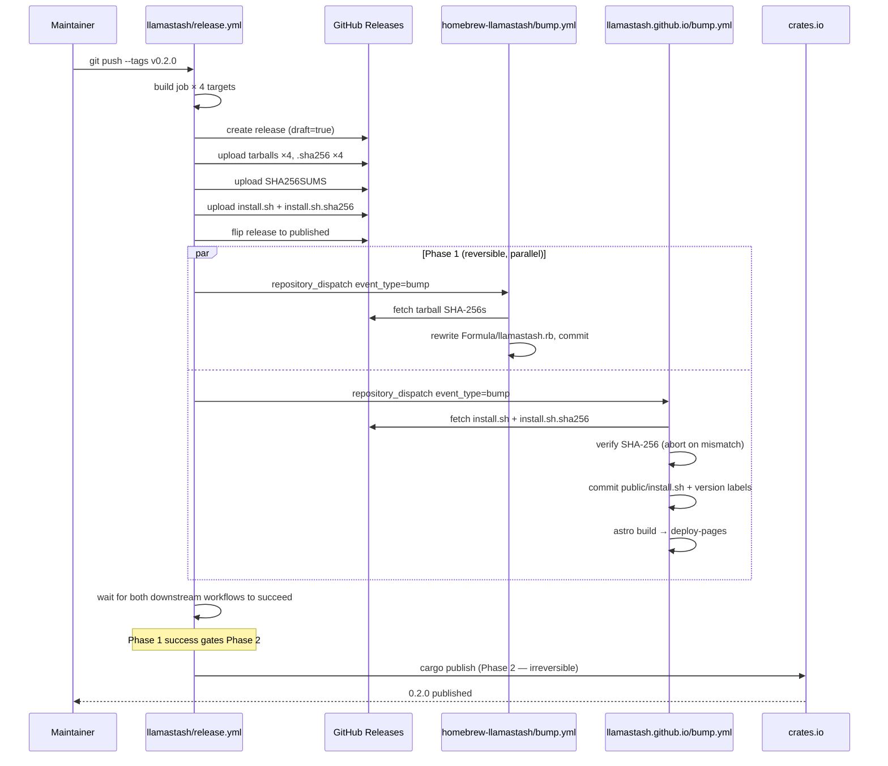

# feat: 0.2.0 release setup — distribution, install script, marketing site

## Overview

Close the gap between what the README promises and what actually works. Ship llamastash 0.2.0 as the first publicly-installable release across four foundation channels (cargo, Homebrew tap, GitHub-hosted install script, marketing site) with end-to-end automated release-on-tag. Long-tail channels (AUR / Nix / Snap / Docker) are deferred to 0.2.x point releases per the brainstorm.

This is **release-engineering only**. The functional surface of 0.2.0 (v1 launcher, v2 init wizard / doctor / pull) is assumed merged on `main` before tagging — that work is tracked in `docs/plans/2026-05-13-001-feat-llamatui-v1-launcher-plan.md` and `docs/plans/2026-05-18-001-feat-init-wizard-doctor-pull-plan.md` and is not re-litigated here.

## Problem Frame

Today the only path to a working llamastash binary is `git clone && cargo install --path .`. The `Cargo.toml`'s `repository`, `homepage`, and `documentation` URLs point at `github.com/llamastash/llamastash` — a non-existent repo under an aspirational org name; the local working tree has no `origin` remote at all. The README pre-announces three install channels (`cargo install`, Homebrew tap, prebuilt binaries) that don't yet exist. There is a `.github/workflows/release.yml` that builds tarballs on tag and uploads them to GH Releases, but nothing pushes to crates.io, no tap repo exists, no install script, no marketing site, no CNAME on `llamastash.cli.rs`.

After this plan lands, a user on a fresh macOS or Linux machine runs exactly one of three commands and has `llamastash` on `$PATH` in under thirty seconds; a maintainer running `git tag v0.2.0 && git push --tags` triggers a fully automated release chain with zero post-tag manual steps. (See origin: `docs/brainstorms/2026-05-19-release-setup-requirements.md` → Success Criteria.)

## Requirements Trace

This plan satisfies R81–R99 from the brainstorm. R100–R103 (AUR / Nix / Snap / Docker) are deferred to 0.2.x point releases per the origin and are not in this plan's scope.

- **R81** First-push migration to `github.com/llamastash/llamastash` with full URL cleanup. (Unit 1)
- **R82** Supporting repos: `homebrew-llamastash`, `llamastash.github.io`, `.github` org profile. (Unit 1, 4, 5)
- **R83** Build matrix unchanged + release-asset inventory + draft-then-publish atomicity. (Unit 2)
- **R84** Aggregate `SHA256SUMS` published alongside per-file sidecars. (Unit 2)
- **R85** Two-phase `publish` job: reversible dispatches in parallel, then `cargo publish`. (Unit 2)
- **R86** Pre-tag CI guards (crate-name API check, old-URL grep, CHANGELOG section). (Unit 2)
- **R87** Crate name `llamastash` confirmed available; `llamastash-cli` fallback retained as race-guard. (Unit 1)
- **R88** Cargo.toml metadata cleanup (URLs, categories, package-size check). (Unit 1)
- **R89** Homebrew tap repo with binary-formula bottling. (Unit 4)
- **R90** `brew install llamastash/llamastash/llamastash` + `--HEAD` source-build branch. (Unit 4)
- **R91** Install-script source-of-truth + per-tag-immutable GH Release asset + content-verified site mirror. (Unit 3, Unit 5)
- **R92** Install.sh contract: Bash 3 compat, OS/arch detection, SHA-256 verification, idempotence, no PATH mutation. (Unit 3)
- **R93** shellcheck + Bats integration tests for install.sh. (Unit 3)
- **R94** Site repo layout: Astro project + `public/` assets + workflows. (Unit 5)
- **R95** Astro 4 + Tailwind 3 + asciinema-player + full Catppuccin Macchiato palette. (Unit 5)
- **R96** Page structure: nav, hero, features grid, social proof, why-local, FAQ, footer. (Unit 6)
- **R97** `demo.cast` asciinema cast + static `og:image` fallback. (Unit 6)
- **R98** CNAME setup via PR to community-managed `cli.rs` zone-config repo. (Unit 7)
- **R99** GitHub Pages deploy via `actions/deploy-pages` with the repo Pages source set to "GitHub Actions". (Unit 5)

## Scope Boundaries

Carried from origin §Scope Boundaries:

- **No Windows native binaries.** Source-only via `cargo install` on Windows.
- **No macOS code signing or notarization.** All three MVP channels avoid Gatekeeper quarantine.
- **No cosign / Sigstore signing.** SHA-256 sums + GitHub's TLS are the 0.2.0 integrity contract.
- **No AUR, Nix, Snap, Flatpak, or Docker for 0.2.0.** Deferred to 0.2.x (R100–R103).
- **No on-site documentation duplication.** README + `docs/usage.md` stay canonical; site links out.
- **No third-party analytics, newsletter, or comment platforms.**
- **No automatic release-note generation beyond `softprops/action-gh-release` defaults.** CHANGELOG.md is canonical.

## Context & Research

### Relevant Code and Patterns

- `.github/workflows/release.yml` — existing tag-driven build of four-target tarballs + `.sha256` sidecars + GH Release upload. Unit 2 extends this; we don't rewrite it.
- `.github/workflows/ci.yml` — fmt + clippy + test matrix. Unit 2 adds new guard jobs here, not in `release.yml`, so failures appear before the irreversible publish.
- `Cargo.toml` — `exclude` array already strips `test_data/*`, `deployment/*`, `artwork/*`, `.github`, `CONTRIBUTING.md`, `*.log`, `tags`. Unit 1 verifies the published package stays under crates.io's 10 MB limit and adds `categories`.
- `README.md` — already announces install channels that don't exist; Unit 1 reconciles the gap by either delivering them (cargo + brew + install.sh) or moving them to a roadmap section.
- `AGENTS.md` "Docs stay in sync with code" — every plan that changes user-visible surfaces or URLs must update the relevant docs in the same change. Honored throughout.
- `docs/plans/2026-05-13-001-feat-llamatui-v1-launcher-plan.md` and `docs/plans/2026-05-18-001-feat-init-wizard-doctor-pull-plan.md` — established the plan-document style (numbered units, `---` separators, per-unit Files/Approach/Patterns/Test scenarios/Verification, high-level technical design diagrams).
- `CHANGELOG.md` — maintained throughout v1 + v2; Unit 1 promotes the `[Unreleased]` block to `[0.2.0]` as the final pre-tag commit.

### Institutional Learnings

- AGENTS.md §"Common gotchas": `cargo install` artifacts deliberately exclude `src/gguf/test_fixtures` and `_test_sleep` via feature gating. Unit 1's pre-publish package-listing check (`cargo package --list`) must confirm those exclusions still hold.
- AGENTS.md §"Build, test, lint": clippy denies `shadow_unrelated` and `rustfmt.toml` enforces 2-space indentation. Pre-tag CI already enforces these — no new guards needed.
- `docs/spikes/` notes (per AGENTS.md): the brew Linux-bottle spike, hf-hub injection spike, and VRAM-overhead spike all anchor v2 design decisions but do not affect release infra.

### External References

External research was deliberately not dispatched: the patterns this plan needs (cargo publish on tag, brew tap auto-bump via `repository_dispatch`, Astro 4 + GH Pages, asciinema-player embedding, SHA-256 verification of `curl | sh` scripts) are well-established, and the brainstorm fully specified the intended shape. Implementer-time validation against current upstream docs is acceptable. Specific upstream docs the implementer should consult during execution:

- Homebrew Formula Cookbook for the `Formula` DSL — the formula's exact bottle / sha256 / version syntax is pinned at implementation time against `brew style` lint output (origin §Deferred to Planning).
- Astro 4 deployment guide for GitHub Pages — pin Astro and Tailwind versions during implementation against the latest stable line.
- `actions/deploy-pages` + `actions/upload-pages-artifact` action READMEs — the `enablement: true` setting on `actions/configure-pages` programmatically enables Pages on first deploy if the repo setting hasn't been clicked.
- crates.io publishing docs for token scopes — the `CRATES_IO_TOKEN` should be a per-crate token (`llamastash`) once the crate exists, not a global account token; first publish uses a scoped one-time token created during Unit 2 setup.

## Key Technical Decisions

- **Two-phase publish, irreversible step last.** Phase 1 (brew + site dispatch) runs in parallel and is fully reversible via commit revert; phase 2 (`cargo publish`) is irreversible. Ordering eliminates the "0.2.0 on crates.io but 0.1.x on brew" hazard the origin's Success Criteria pledges against. (See origin: R85, Key Decision #5.)
  - *Rejected alternatives:* (a) **all three jobs in parallel** — the origin's original shape, rejected because `cargo publish` is irrevocable (`cargo yank` is metadata-only and does not remove the published `.crate` tarball) and an unlucky tap-or-site failure leaves crates.io permanently asymmetric. (b) **all three sequential with cargo first** — symmetric problem in reverse. (c) **single-shot publish with manual reconciliation** — relies on the maintainer being awake during every tag.
- **Install script's served copy is a content-verified mirror, not a redirect.** GitHub Pages can't serve HTTP 30x redirects that `curl` honors, so `llamastash.cli.rs/install.sh` is regenerated by the site repo's bump workflow by fetching the GH Release asset and SHA-256-verifying before commit. Trust boundary is the bump workflow's verification step; branch protection on `.github/workflows/bump.yml` plus required reviews on workflow changes is the operational mitigation. (See origin: R91, Key Decision #4.)
  - *Rejected alternatives:* (a) **Cloudflare proxy in front of GH Pages** doing a true 302 — gives full immutability but adds a third-party service dependency (Cloudflare account, DNS at registrar level, ongoing rule maintenance) and a billing risk if traffic spikes. (b) **Drop the short URL entirely** and direct users at `github.com/.../releases/latest/download/install.sh` — most secure, least UX. (c) **Astro `redirects` config** generating HTML meta-refresh pages — works for browsers but breaks `curl | sh` because the shell receives HTML, not the actual script. The content-verified mirror was the deliberate middle-ground (origin Round-2 P2-E6).
- **Binary-only Homebrew formula.** No source-build by default — source-build formulas need a `rust` build dependency and a 90s+ compile on every install. A `head "..." do` branch in the same formula provides `brew install --HEAD` for users who want pre-release builds. (See origin: R89.)
  - *Rejected alternative:* **Source-build formula as default** with the binary as `--prebuilt` opt-in. Rejected because the user's quoted success criterion is "working binary on $PATH in under thirty seconds" — a 90s compile blows that budget on any laptop without a warm Rust cache.
- **Install script is Bash-3-safe, not POSIX-pure.** macOS still ships Bash 3.2 by default. Bash 3 features (`[[`, arrays, `==`) are fine; Bash 4-only (`mapfile`, `readarray`, case-conversion expansions) are forbidden. `shellcheck -s sh` is the lint baseline despite the Bash 3 target — POSIX is a stricter superset so the lint catches portability issues the Bash 3 runtime would tolerate. (See origin: R92.)
- **No PATH mutation in install.sh.** Print a hint if `$LLAMASTASH_INSTALL_DIR` (default `~/.local/bin`) isn't on `$PATH`; never edit `~/.zshrc`, `~/.bashrc`, `~/.profile`. Matches rustup's recent posture; predictable.
  - *Rejected alternative:* **`cargo-binstall`-style opt-in `--modify-path`** that prepends an `export PATH=...` line to the user's shell init. Rejected because (a) the right shell init file is ambiguous (`~/.bashrc` vs `~/.bash_profile` vs `~/.profile` vs `~/.zshrc` vs `~/.config/fish/config.fish` — each with their own loading order quirks), (b) edits to user dotfiles are exactly the class of surprise that creates support burden, and (c) `~/.local/bin` is on `$PATH` by default in most modern distros' systemd-aware login shells; the hint covers the rest.
- **Catppuccin Macchiato is the site's brand axis.** The TUI's default theme already commits to Macchiato (per AGENTS.md §"Scope boundaries"); the site reuses the same palette so tool and marketing surface feel like one product. Every color on the site must come from the 26-token palette listed in R95.
- **Site structure is opencode.ai-shaped, but copy and visual identity are llamastash-original.** Hero + multi-tab install + asciinema + features grid + social proof + why-local + FAQ + footer is the *layout pattern*; the words, asciinema content, and Catppuccin palette are the *brand identity*. (See origin: R96, Key Decision #1.)
- **Site is deployed via the GitHub Actions Pages source, not the legacy `gh-pages` branch.** Org-default Pages repos (`<org>.github.io`) default to serving `main`; switching to GitHub Actions as the source is a one-time manual repo-settings flip during Unit 5 bootstrap. The deploy workflow uploads an artifact via `actions/upload-pages-artifact` and `actions/deploy-pages` handles the publish.
  - *Rejected alternative:* **Deploy from a `gh-pages` branch** using the older `peaceiris/actions-gh-pages` action. Works but adds a "deployment" commit per release that pollutes the branch's history and slows clone times if the site ever gets large. The Actions source is the path GitHub itself documents as preferred.

## Open Questions

### Resolved During Planning

- **Where does install.sh's served copy come from?** Site repo's `bump.yml` fetches the new GH Release's `install.sh` + `.sha256`, verifies, commits with a provenance header. (Origin R91 + R85; Unit 5.)
- **What is the pre-tag guard for crate-name availability?** `curl -fsSL https://crates.io/api/v1/crates/<name>` returns 404 (unclaimed) or owner-list (must intersect llamastash org members). 200 with non-member owner triggers the `llamastash-cli` rename fallback. (Origin R86 amended.)
- **How does the release survive partial uploads?** GitHub Release is created as `draft: true`; assets upload as drafts; release is flipped to published only after every asset upload succeeds. Install.sh's `releases/latest` resolution never sees a partial release. (Origin R83 amended.)
- **What about the `cli.rs` subdomain?** PR to the community-managed `cli.rs` zone-config repo, same path the maintainer walked for `kdash.cli.rs`. Unit 7 owns this. (Origin §Resolved at Doc-Write Time.)
- **Plan filename sequence number.** Today already has two plans at `-001-` and `-002-` for unrelated topics; this plan uses `-003-`.

### Deferred to Implementation

- **Exact `SHA256SUMS` file format.** Cargo's `sha256` vs `shasum -a 256` vs `sha256sum` output differ in whitespace (two spaces vs one). Pin to `shasum -a 256` output (POSIX two-space form) during Unit 2 against `shasum -c SHA256SUMS` working from both macOS and Linux install hosts.
- **Brew formula DSL version.** `class Llamastash < Formula ... end` block form vs newer `formula!` macro. Pin against `brew style` lint output during Unit 4.
- **Astro + Tailwind exact versions.** Astro 4.x latest stable + Tailwind 3.x latest stable; if Astro 5 has shipped and is stable at implementation time, prefer it. Pin in `package.json` during Unit 5.
- **asciinema-player version + theme bridge.** Pin asciinema-player to the latest 3.x release; the Macchiato terminal-theme mapping (asciinema's `theme` JSON) is authored during Unit 6 against the recorded cast.
- **Bats test runner choice.** `bats-core` is the canonical runner; pin during Unit 3.
- **FAQ accordion component.** Astro doesn't ship one — implementer picks between rolling a small `<details>`/`<summary>` styled element (accessible by default) or pulling in a headless library (Astro-compatible). Lean toward `<details>` for minimum dependency footprint; revisit if keyboard arrow-nav requirements push otherwise.
- **`--uninstall` flag in install.sh.** Origin leans no for 0.2.0; revisit only if a user reports needing it.
- **Logo SVG.** `artwork/` in the main repo may or may not have a current logo asset; implementer audits and either reuses or commissions during Unit 6.
- **`og-image.png` content.** Static screenshot of the same scene as the asciinema cast; framed during Unit 6.

## High-Level Technical Design

> *These diagrams illustrate the intended cross-repo data flow, sequencing, and trust boundaries for review. They are directional guidance, not implementation specification. The implementing agent should treat them as context.*

### Multi-repo topology

```
github.com/llamastash/
├── llamastash                       ← main source (this repo, first-pushed in Unit 1)
│   ├── scripts/install.sh          ← source of truth for the install script
│   └── .github/workflows/
│       ├── ci.yml                  ← + pre-tag guards (Unit 2)
│       └── release.yml             ← + draft-then-publish, install.sh asset, 2-phase publish (Unit 2)
│
├── homebrew-llamastash              ← brew tap (Unit 4)
│   ├── Formula/llamastash.rb        ← binary formula, --HEAD branch
│   └── .github/workflows/bump.yml  ← workflow_dispatch manual fallback (primary bump path: release.yml clones + pushes directly)
│
├── llamastash.github.io          ← marketing site (Units 5 + 6)
│   ├── src/                        ← Astro project
│   ├── public/install.sh           ← SHA-256-verified copy of GH Release asset (R91)
│   ├── public/install.sh.sha256
│   ├── public/demo.cast            ← asciinema cast
│   ├── CNAME                       ← llamastash.cli.rs
│   └── .github/workflows/
│       ├── deploy.yml              ← astro build → actions/deploy-pages
│       └── bump.yml                ← workflow_dispatch manual fallback (primary mirror path: release.yml writes from main repo)
│
└── .github                         ← org profile repo (optional, Unit 1)
    └── profile/README.md
```

### Release flow on `git push --tags v0.2.0`



### Trust boundary map for install paths

```
brew install llamastash/llamastash/llamastash
  └─ trust: Homebrew formula's sha256 declaration matches downloaded tarball
     (brew refuses install on mismatch — DoI, not poisoning)

cargo install llamastash
  └─ trust: crates.io's tarball over TLS; cargo verifies the registry's signed index
     (no per-crate signing; trust = crates.io infrastructure)

curl -fsSL https://github.com/.../releases/download/v0.2.0/install.sh | sh
  └─ trust: GitHub TLS + immutable per-tag asset
     (most secure; the marketing URL below is a content-verified mirror of this)

curl -fsSL https://llamastash.cli.rs/install.sh | sh
  └─ trust: site repo's bump.yml SHA-256-verified the served copy against the
            GH Release sidecar before committing
     (operational mitigation: branch protection on .github/workflows/bump.yml,
      required review on workflow changes — origin Key Decision #4)
```

### Pre-tag → tag-time gate matrix

| Guard | Where it runs | Failure mode | Carried-from |
|---|---|---|---|
| `cargo fmt --all -- --check` | ci.yml (existing) | Build red | AGENTS.md |
| `cargo clippy -- -D warnings` | ci.yml (existing) | Build red | AGENTS.md |
| `cargo test --features test-fixtures` | ci.yml (existing) | Build red | AGENTS.md |
| `cargo publish --dry-run` | ci.yml (new, Unit 2) | Build red — manifest invalid | R86 |
| Crate-name availability via crates.io API | ci.yml (new, Unit 2) | Build red — name conflict / wrong owner | R86 |
| Grep guard for old `llamastash/llamastash` URLs | ci.yml (new, Unit 2) | Build red — URL drift | R86 |
| CHANGELOG section header matches tag | release.yml (new, Unit 2) | Tag-time abort before build | R86 |
| `shellcheck scripts/install.sh` | ci.yml (new, Unit 3) | Build red | R93 |
| `bats scripts/install.test.bats` | ci.yml (new, Unit 3) | Build red | R93 |

## Implementation Units

The seven units below land in three dependency-ordered phases. After Phase 1 lands the foundation, Phase 2's units (3, 4, 5) can develop in parallel because they live in separate repos. Phase 3's content + cutover (6 + 7) wait on phase 2.

**Phase 1 — foundation (sequential):** Unit 1 → Unit 2.
**Phase 2 — channel build-out (parallel after Phase 1):** Unit 3, Unit 4, Unit 5.
**Phase 3 — content + cutover (sequential after Phase 2):** Unit 6 → Unit 7.

---

- [ ] **Unit 1: Repo migration + Cargo.toml + URL cleanup** *(partial — URL/metadata cleanup landed in `019fa78`. Org-admin actions documented in `docs/runbooks/release-0.0.1-bootstrap.md`; pending: create the four `llamastash/*` GitHub repos and configure `CRATES_IO_TOKEN` + `GH_BUMP_TOKEN` secrets per the runbook)*

**Goal:** First-push the local working tree to `github.com/llamastash/llamastash`, fix every URL reference, add missing Cargo metadata, create the empty supporting repos, prepare CHANGELOG.

**Requirements:** R81, R82, R87 (race-guard prep), R88.

**Dependencies:** None. This is the first commit visible in the new repo's history.

**Files:**
- Modify: `Cargo.toml` (`repository`, `homepage`, `documentation` → `https://github.com/llamastash/llamastash`; add `categories = ["command-line-utilities"]`; confirm `keywords` ≤ 5; review `exclude` list)
- Modify: `README.md` (every `github.com/llamastash/llamastash` reference; pre-1.0 binaries-not-yet-published warning rewritten to link the new install methods or marked as accurate at tag time)
- Modify: `AGENTS.md` (URL fix per AGENTS.md §"Docs stay in sync with code")
- Modify: `CONTRIBUTING.md` (URL fix)
- *(Unit 1 does **not** touch `CHANGELOG.md` — the `[Unreleased]` → `[0.2.0]` promotion is Unit 7's job, in the same commit as the version bump. Unit 1 is the first commit on the new repo, not the final pre-tag commit.)*
- Create: new GitHub repos (org-admin action, not source-controlled): `llamastash/llamastash` (target of the push), `llamastash/homebrew-llamastash` (empty, populated by Unit 4), `llamastash/llamastash.github.io` (empty, populated by Unit 5), `llamastash/.github` (optional, with a one-paragraph `profile/README.md`)
- Test: none directly — verified by Unit 2's grep guard catching any remaining old-URL references.

**Approach:**
- The local tree currently has no `git remote`. Add `origin git@github.com:llamastash/llamastash.git`, push `main`.
- All URL-rewrite edits live in one commit so the new repo's first visible state is consistent. Use a single search-and-replace pass with explicit file enumeration; do not `git grep | xargs sed` blindly because the brainstorm doc and existing plan docs intentionally reference both old and new URLs as part of their record.
- `cargo package --list` runs locally before push to confirm the published-crate file set matches expectations and stays under 10 MB. If size > 8 MB, add the offending paths to `exclude` (likely candidates: `docs/benchmark_sources/`, `tests/fixtures/` — both already excluded or fixture-gated, so this is a precaution).
- Create `CRATES_IO_TOKEN` and `GH_BUMP_TOKEN` repo secrets before tagging — Unit 2's workflows are non-functional without them. `GH_BUMP_TOKEN` is a fine-grained PAT scoped to `contents:write` + `actions:write` on `homebrew-llamastash` and `llamastash.github.io` only. (Upgrade to a scoped GitHub App is a 0.3.x consideration per origin §Outstanding Questions.)

**Patterns to follow:**
- `AGENTS.md` §"Docs stay in sync with code" — every file affected by the URL change is touched in the same commit.
- Conventional-commit prefix (per `AGENTS.md` §Conventions): commit subject `chore(release): migrate to llamastash org` or similar; body lists the touched files.

**Test scenarios:**
- Happy path: after Unit 1 commit, `grep -r 'llamastash/llamastash' --include='*.md' --include='*.toml'` returns no matches except in `docs/brainstorms/` and `docs/plans/` (those preserve the historical record).
- Happy path: `cargo package --list` outputs a file list that excludes `tests/fixtures/`, `docs/benchmark_sources/`, `.context/`, `temp/`, `target/`.
- Happy path: `cargo package --no-verify` produces a `.crate` archive under 10 MB.
- Edge case: README's "binaries not yet published" warning is either replaced with working install instructions (preferred at tag time) or kept with an updated link; reviewer confirms in the PR.

**Verification:**
- The new `llamastash/llamastash` repo on GitHub shows the project README rendered with no broken `github.com/llamastash/llamastash` links.
- `Cargo.toml`'s `repository` field renders as a working link on the same repo's GitHub page.
- The three secondary repos exist (empty for now is fine — Units 4 and 5 populate them).

---

- [x] **Unit 2: Release workflow extensions** *(landed — release.yml rewritten in the kdash cd.yml shape per maintainer direction: per-job direct clone+push to the tap + site repos via `GH_BUMP_TOKEN`, no `repository_dispatch`, no draft-then-publish atomicity. SHA256SUMS aggregate + install.sh + install.sh.sha256 are uploaded as release assets by a dedicated `publish-shasums` job. `cargo publish` runs in parallel with the tap/site jobs (rather than the plan's original two-phase ordering) and is gated off pre-release tags by `is_prerelease`. ci.yml gains a `release-readiness` job that runs `cargo publish --dry-run`, a crates.io name-availability check, the old-URL grep guard, and a CHANGELOG `[Unreleased]` header check. `deployment/homebrew/{packager.py,llamastash.rb.template}` template the formula; both files are excluded from the published crate via the existing `Cargo.toml` `exclude = ["deployment/*"]`. Tap + site `bump.yml` workflows are now `workflow_dispatch`-only manual fallbacks.)*

**Goal:** Extend the existing `.github/workflows/release.yml` and `.github/workflows/ci.yml` so that `git push --tags v0.2.0` triggers a complete, atomic, two-phase release that publishes to crates.io, dispatches the tap-bump and site-bump, and stays revertable until the very last step.

**Requirements:** R83, R84, R85, R86.

**Dependencies:** Unit 1 (new repo, URLs fixed, secrets configured).

**Files:**
- Modify: `.github/workflows/release.yml` — add: draft-create + asset-upload-then-publish atomicity; aggregate `SHA256SUMS` build step; `install.sh` + `install.sh.sha256` upload from the tagged `scripts/install.sh`; new `publish` job with `phase1-bump` and `phase2-cargo-publish` jobs gated on phase 1. **Tag filter syntax:** GH Actions uses glob, not regex; the current `release.yml` already filters with `tags: ['v*']`. Refine to `tags: ['v*.*.*']` for shape, then add a job-level guard at the top of the `publish` job: `if: github.ref_name !~ /-/` (or the GH-Actions-compatible equivalent: `if: !contains(github.ref_name, '-')`) so pre-release tags like `v0.0.0-rc1` build + upload draft assets but **do not** fire phase 1 or phase 2. This separates "exercise the workflow" tags from "publish for real" tags.
- Modify: `.github/workflows/ci.yml` — add jobs: `cargo-publish-dry-run`, `crate-name-availability`, `url-grep-guard`. The CHANGELOG-section-header check runs in `release.yml` (it's tag-specific) but the others are pre-tag in `ci.yml` so PRs that would break a future release fail review.
- Create: `.github/workflows/lib/` (optional helper actions; only create if YAML duplication crosses ~50 lines)
- Test: workflow YAML is validated by `actionlint` if a CI step for it is added (defer to implementation; not strictly required for 0.2.0).

**Approach:**
- Keep the existing `build` job intact — it already produces correctly-named tarballs. Insert a `package-install-sh` step in the matrix or as a separate single-runner step that copies `scripts/install.sh` to `dist/install.sh` and computes `shasum -a 256 dist/install.sh > dist/install.sh.sha256`.
- Replace `softprops/action-gh-release@v2`'s single-shot publish with a two-call sequence: create-as-draft, upload all assets, then a final `softprops/action-gh-release@v2` call with `draft: false, prerelease: false` toggled on for the same tag. (Or use `gh release create --draft` + `gh release upload` + `gh release edit --draft=false` if the action's API is awkward — pin during implementation.)
- The `publish` job has two named jobs in workflow syntax. `phase1-bump` runs the two `gh api repos/.../dispatches` calls in parallel and polls each receiving repo's most-recent matching workflow run via a unique `correlation_id` field in `client_payload` until both report `conclusion: success`. `phase2-cargo-publish` lists `needs: phase1-bump`. A `cargo publish` failure leaves the tap and site bumps committed; the brainstorm's Key Decision #5 explicitly accepts this because both are revertable via commit revert and the next tag will overwrite.
- Pre-tag guards in `ci.yml`:
  - `cargo-publish-dry-run`: `cargo publish --dry-run --token dummy --no-verify` — checks manifest validity. Does *not* verify name availability.
  - `crate-name-availability`: a small shell step that `curl -fsSL https://crates.io/api/v1/crates/llamastash` and branches on HTTP code: 404 = unclaimed (pass), 200 = inspect `owners` array and cross-reference against `gh api orgs/llamastash/members --jq '.[].login'` — pass if intersection is non-empty, fail otherwise. The cross-reference uses `GH_BUMP_TOKEN` or the workflow's default token.
  - `url-grep-guard`: `! grep -rn 'llamastash/llamastash' Cargo.toml README.md AGENTS.md CONTRIBUTING.md` — refuse-on-match.

**Patterns to follow:**
- Existing `release.yml` matrix style: `include:` entries with `target` and `os`. Keep the four-row matrix unchanged.
- `dtolnay/rust-toolchain@stable` + `Swatinem/rust-cache@v2` already wired; keep as-is.

**Execution note:** Implement the new pre-tag guards in `ci.yml` first (Unit 2a, lightweight), then the release-workflow extensions (Unit 2b). The pre-tag guards being in place before the workflow extensions means PRs to the release workflow itself get linted against the same name/URL checks. Use a throw-away `v0.0.0-rc1` tag against a feature branch to exercise the full release-on-tag path end-to-end before merging — origin §Outstanding Questions deferred the dry-run mechanism to planning, and the cheap-and-correct answer is a real tag against a branch that's then deleted.

**Test scenarios:**
- Happy path: pushing a tag `v0.2.0-test1` against a feature branch creates a draft release, uploads all 11 assets (4 tarballs + 4 sidecars + `SHA256SUMS` + `install.sh` + `install.sh.sha256`), flips to published, dispatches both bump events, both downstream workflows succeed, then `cargo publish --dry-run` runs (since this is `-test1`, real publish is gated off the version regex; if the regex matches, the real cargo publish would run — for the test cycle use `0.0.0-rc1` to be safe).
- Edge case: a partial upload (simulated by killing the workflow mid-asset-upload) leaves the GH Release in draft state; install.sh's `releases/latest` does not resolve to it; a re-run of the workflow either resumes or re-creates cleanly.
- Edge case: the tap-dispatch step's downstream workflow fails (e.g., the formula has a syntax error after rewrite). `cargo publish` is skipped; the GH Release is published but no crate is on crates.io. Recovery: fix the formula, retry the workflow's `phase2` job. Document this in the workflow's `summary` step output.
- Error path: `crate-name-availability` finds `llamastash` owned by a non-org user. The workflow fails with a clear message pointing to R87's `llamastash-cli` fallback path.
- Error path: `url-grep-guard` finds a residual `github.com/llamastash/llamastash` reference. The job lists the matching files and fails.
- Error path: `phase1-bump` exceeds a 10-minute timeout waiting for a downstream workflow. The dispatch is considered failed; phase 2 does not run. Document the retry mechanism in workflow logs.
- Integration: a successful `v0.0.0-rc1` end-to-end run (against a sacrificial branch) is the verification gate before tagging `v0.2.0` for real.

**Verification:**
- A test tag against a feature branch exercises the full chain. After it completes, the draft → published flip is visible, all assets are downloadable, both downstream workflows show green, and `cargo publish --dry-run` ran. (Real `cargo publish` is gated off the test version regex.)
- The tap repo's `bump.yml` produces a commit that, when applied to a Formula, `brew style` lints clean — verified by Unit 4 once that exists. Unit 2 can stub this for now by hand-writing a target formula file the dispatch would produce.
- The `ci.yml` pre-tag guards run on every PR and pass on Unit 1's commit (because Unit 1 cleaned up all old URLs).

---

- [x] **Unit 3: Install script + bats integration tests** *(landed in `f9647d4` — 19/19 bats tests pass locally; shellcheck `-s sh` clean; CI jobs added for ubuntu + macos)*

**Goal:** Implement `scripts/install.sh` to the contract pinned in origin R91 + R92 + R93 — Bash 3 compatible, OS/arch detection, SHA-256 verification, idempotence, no PATH mutation — with a Bats integration test that covers all four target platforms and the documented failure modes.

**Requirements:** R91 (source side), R92, R93.

**Dependencies:** Unit 1 (for the repo; new file lives in `scripts/`). Independent of Unit 2 in develop-time (the script itself can be written without the release workflow being in place), but Unit 2 must ship `install.sh` as a release asset before users can `curl` it from `github.com/.../releases/...` or from `cli.rs`.

**Files:**
- Create: `scripts/install.sh`
- Create: `scripts/install.test.bats`
- Create: `tests/fixtures/install-sh-fakes/` — directory of fixture tarballs + checksums used by the bats test to simulate GH Releases responses. Contents: 4 zero-byte-ish tarballs labeled by target triple, a `SHA256SUMS` file, a corrupt-checksum scenario, a partial-upload scenario.
- Modify: `.github/workflows/ci.yml` — add a `shellcheck` job (`-s sh scripts/install.sh`) and a `bats` job.

**Approach:**
- Detect: `uname -s` → `linux`/`darwin`; `uname -m` → `x86_64`/`arm64` (aliased from `aarch64` on macOS). Refuse on `windows`/`mingw`/`cygwin` and on unknown arches with exit code 64 (sysexits `EX_USAGE` — matches the project's exit-code table in `src/cli/exit_codes.rs` for analogous meaning, even though install.sh is shell not the binary).
- Version resolution: if `LLAMASTASH_VERSION` env var or `--version <tag>` flag is set, use it; else `curl -fsSL https://api.github.com/repos/llamastash/llamastash/releases/latest | jq -r '.tag_name'` — but jq is not always installed, so fall back to grep+sed on the JSON. (Bats fixture provides both jq-present and jq-absent cases.)
- Download target tarball + the aggregate `SHA256SUMS`. Verify with `shasum -a 256 -c <(grep "${target}" SHA256SUMS)` (or `sha256sum -c` on Linux — both shipped by default).
- Extract `tar -xzf` to a temp dir, then `mv` the binary atomically to `$LLAMASTASH_INSTALL_DIR/llamastash` (default `$HOME/.local/bin/llamastash`). `mkdir -p` the target if missing.
- Idempotence: before download, check if `$LLAMASTASH_INSTALL_DIR/llamastash` exists, compute its SHA-256 against the registered target's expected, and short-circuit on match.
- PATH-on-path hint: `case ":$PATH:" in *":$install_dir:"*) ;; *) echo "Note: $install_dir is not on \$PATH..." ;; esac`. No file edits.
- Flags: `--version`, `--prefix`, `--quiet`, `-h | --help`. Env-var equivalents: `LLAMASTASH_VERSION`, `LLAMASTASH_INSTALL_DIR`, `LLAMASTASH_QUIET`.

**Patterns to follow:**
- rustup's `rustup-init.sh` for the overall flow (download, verify, extract, hint) — same posture, no PATH mutation by default.
- `cargo-binstall`'s install-prelude script for the OS/arch detection table.

**Execution note:** Test-first. Write the Bats fixtures and test cases first; let them fail; implement the script against them. The four-target detection + verification + error-path matrix is the kind of thing that's easier to specify upfront than to retrofit.

**Test scenarios:**
- Happy path: on Linux x86_64, install.sh detects target, fetches latest release tag, downloads + verifies + extracts to `~/.local/bin/llamastash`. Repeat for each of the four targets via Bats matrix.
- Happy path: `LLAMASTASH_VERSION=v0.2.0 sh install.sh` pins to that tag; the resolution step skips the latest-release API call.
- Happy path: re-running install.sh with the same version is a no-op — the existing binary's SHA-256 matches, no download happens.
- Edge case: `$HOME/.local/bin` doesn't exist; install.sh creates it with `mkdir -p` and 0755.
- Edge case: `$LLAMASTASH_INSTALL_DIR` set to an unwriteable path; install.sh refuses with a clear error before downloading.
- Edge case: `$PATH` does not contain `$LLAMASTASH_INSTALL_DIR`; install.sh prints the hint line.
- Error path: `uname -s` returns `mingw` or `cygwin`; refuse with exit 64.
- Error path: `uname -m` returns an unknown arch; refuse with exit 64.
- Error path: the downloaded tarball's SHA-256 doesn't match `SHA256SUMS`; refuse with exit 2 (distinct from generic exit 1); leaves no partial files on disk.
- Error path: `curl` returns 404 (release not found or partially uploaded); refuse with exit 1.
- Error path: `--version v0.0.0` for a version that doesn't exist; refuse with exit 1, no download attempted.
- Integration: shellcheck `-s sh scripts/install.sh` passes (POSIX-strict mode).
- Integration: Bats runs all of the above against the fixture matrix in CI.

**Verification:**
- `bats scripts/install.test.bats` passes locally on macOS and Linux.
- `shellcheck -s sh scripts/install.sh` passes.
- Both jobs are part of `ci.yml`'s default matrix and pass on every PR.
- A manual smoke run: against the test tag from Unit 2 (`v0.0.0-rc1`), `curl -fsSL https://github.com/llamastash/llamastash/releases/download/v0.0.0-rc1/install.sh | sh` installs cleanly on a fresh Ubuntu container.

---

- [ ] **Unit 4: Homebrew tap repo bootstrap + auto-bump** *(scaffolded locally at `../homebrew-llamastash/`; pending: org-admin creates the GitHub repo and first-pushes per `docs/runbooks/release-0.0.1-bootstrap.md`)*

**Goal:** Stand up `llamastash/homebrew-llamastash` with an initial binary formula and a `bump.yml` workflow that listens for `repository_dispatch` events from the main repo's release workflow and rewrites the formula on each new tag.

**Requirements:** R82, R89, R90.

**Dependencies:** Unit 1 (the tap repo must exist on GitHub). Develop-time independent of Units 2, 3, 5.

**Files (in `llamastash/homebrew-llamastash` repo — not the main repo):**
- Create: `Formula/llamastash.rb` — initial formula referencing v0.2.0 (placeholder hashes until the test-tag run produces real ones).
- Create: `.github/workflows/bump.yml` — `on: workflow_dispatch:` workflow (manual fallback only; primary bump path is direct clone+push from the main repo's `release.yml`).
- Create: `README.md` — short installation instructions, link back to main repo.
- Create: `LICENSE` — match main repo (MIT).
- Test: no test files in the tap repo; verification is `brew install --force llamastash/llamastash/llamastash` working against the test-tag.

**Approach:**
- Formula structure: `class Llamastash < Formula` with `desc`, `homepage`, `version`, `license`, `head "..." do ... end`, and four `if Hardware::CPU.arm? OS.mac?` (or `if OS.linux? && Hardware::CPU.intel?` etc.) branches setting `url` + `sha256` per target. The `head` branch fetches `github.com/llamastash/llamastash.git` and builds from source with `system "cargo", "install", *std_cargo_args` so users opting into `--HEAD` get pre-release builds.
- Per the Unit 2 deviation, the primary bump path is direct clone+push from the main repo's `release.yml` (`publish-homebrew` job). The tap's `bump.yml` is retained only as a `workflow_dispatch`-triggered manual fallback for cases where the main-repo job partially fails. Inputs are bare version + 4 SHA-256s; commits use the `llamastash-release-bot` identity.
- Branch protection on `main` of the tap repo: at minimum, require status checks (the formula's `brew style` lint runs on PR if a check workflow is added — defer to implementation if not blocking 0.2.0).

**Patterns to follow:**
- `kdash-rs/homebrew-kdash` (same maintainer, established pattern — implementer reads the formula structure there as a reference).
- Standard Homebrew tap layout per the Homebrew Formula Cookbook.

**Test scenarios:**
- Happy path: the main repo's `release.yml` `publish-homebrew` job (triggered by a real tag, e.g. `v0.0.1` or a dry-run `v0.0.0-rc1`) renders `Formula/llamastash.rb` via `deployment/homebrew/packager.py`, lints with `brew style`, clones the tap, commits, pushes. (The `bump.yml` workflow_dispatch fallback exercises the same render+commit path with operator-supplied SHAs.)
- Happy path: `brew install llamastash/llamastash/llamastash` against a real tag fetches the tarball, verifies the SHA-256 declared in the formula, installs the binary to `Cellar`, links to `bin/llamastash`.
- Happy path: `brew install --HEAD llamastash/llamastash/llamastash` clones the main repo and builds from source via cargo.
- Edge case: `packager.py` rejects malformed inputs (bad version, bad sha256 hex/length). The render step fails before any push.
- Error path: a SHA-256 baked into the formula doesn't actually match the tarball at the URL. Brew install fails at fetch time with a checksum mismatch — desired behavior; the tap doesn't get to install a poisoned binary.
- Error path: the formula fails `brew style` after rewrite. `release.yml` aborts before pushing to the tap, so the broken formula never lands on `main`.

**Verification:**
- The tap repo exists, has the four files listed above, and `brew tap llamastash/llamastash && brew search llamastash` returns a result.
- Against the test-tag from Unit 2: `brew install llamastash/llamastash/llamastash` works on macOS and on Linux (with Linuxbrew).
- A real `release.yml` run on a stable tag produces a `chore(formula): bump ...` commit on the tap repo's `main`. (Pre-release tags skip this step by design.)

---

- [ ] **Unit 5: Website scaffolding + Catppuccin theme + dispatch handler** *(scaffolded locally at `../llamastash.github.io/`; `npm run build` clean, 440 KB dist; pending: org-admin creates the GitHub repo and first-pushes per `docs/runbooks/release-0.0.1-bootstrap.md`)*

**Goal:** Stand up `llamastash/llamastash.github.io` as an Astro 4 project with Tailwind + asciinema-player wired, the full Catppuccin Macchiato palette tokenized, the deploy workflow publishing to GitHub Pages, and the `bump.yml` handler ready to verify + commit `install.sh` from each new GH Release. **Site content (the actual page) lands in Unit 6; this unit is the chassis.**

**Requirements:** R82, R94, R95, R99, R91 (site-side).

**Dependencies:** Unit 1 (site repo exists). Develop-time independent of Units 2, 3, 4. Unit 6's page content depends on this unit.

**Files (in `llamastash/llamastash.github.io` repo):**
- Create: `package.json` — Astro 4 latest stable + Tailwind 3 latest stable + `asciinema-player` + `@astrojs/tailwind`.
- Create: `astro.config.mjs` — Tailwind integration, `site: 'https://llamastash.cli.rs'`, no SSR (`output: 'static'`).
- Create: `tailwind.config.cjs` — `theme.extend.colors` mapping to the Catppuccin tokens defined in `src/styles/catppuccin-macchiato.ts`.
- Create: `src/styles/catppuccin-macchiato.ts` — the 26 palette tokens enumerated in origin R95.
- Create: `src/styles/global.css` — Tailwind base/components/utilities + a `:root` block applying Macchiato as the default theme.
- Create: `src/layouts/Base.astro` — HTML shell, meta tags including `og:image`, theme background.
- Create: `src/pages/index.astro` — placeholder hero (Unit 6 fills in).
- Create: `public/CNAME` — exactly `llamastash.cli.rs`, one line, no trailing newline (GitHub Pages quirk).
- Create: `public/favicon.svg` — generated from main repo's `artwork/` if a logo exists; placeholder otherwise.
- Create: `public/og-image.png` — placeholder; Unit 6 replaces.
- Create: `public/install.sh` — placeholder containing only `#!/bin/sh\necho "no release yet — see github.com/llamastash/llamastash"` until the first dispatch from Unit 2 overwrites it.
- Create: `public/install.sh.sha256` — placeholder matching the above.
- Create: `.github/workflows/deploy.yml` — runs `npm ci && npm run build` on push to `main`, uploads `dist/` via `actions/upload-pages-artifact@v3`, deploys via `actions/deploy-pages@v4`. `enablement: true` on `actions/configure-pages@v5` so the first deploy auto-enables Pages with source = GitHub Actions.
- Create: `.github/workflows/bump.yml` — `workflow_dispatch` manual fallback. Operator supplies a tag; the workflow fetches `install.sh` + sidecar from `https://github.com/llamastash/llamastash/releases/download/${TAG}/install.sh`, runs `shasum -a 256 -c install.sh.sha256` against the downloaded `install.sh`, aborts on mismatch, writes the file to `public/install.sh` (prepending a provenance header), and commits along with `src/data/version.ts`. The primary mirror path is direct clone+push from the main repo's `release.yml` `publish-site` job; `bump.yml` exists only for recovery if that job fails after the release is already published.
- Create: `README.md` — short, points at `llamastash.cli.rs` and the main repo.
- Create: `.gitignore` — `node_modules/`, `dist/`, `.astro/`.

**Approach:**
- Astro is configured for fully static output (`output: 'static'`). The asciinema-player import is wrapped in a `client:visible` Astro island so only the index page loads it.
- `tailwind.config.cjs`'s `theme.extend.colors` maps `catppuccin.base`, `catppuccin.surface0`, ..., `catppuccin.mauve`, `catppuccin.text` etc., so every Tailwind class in Unit 6 (e.g., `bg-catppuccin-base text-catppuccin-text`) resolves to the palette.
- The `bump.yml` verification step is the security trust boundary. Implementation: shellcheck-clean inline shell, no third-party action other than `actions/checkout`. Hard-coded `set -euo pipefail` (or `set -eu` since `pipefail` isn't strictly POSIX but is fine in Bash on the runner).
- Branch protection on `main` of the site repo: require PR reviews on changes to `.github/workflows/bump.yml` specifically. (Configured via a `CODEOWNERS` file routing workflow changes to the maintainer.)

**Patterns to follow:**
- Standard Astro + Tailwind + Pages deployment pattern per Astro's docs. No project-specific deviation needed.

**Test scenarios:**
- Happy path: `npm run build` locally produces a `dist/` containing `index.html`, `_astro/*.css`, `_astro/*.js`, and the `public/` files copied unchanged.
- Happy path: pushing to `main` triggers `deploy.yml`; the deploy succeeds within the 30s target; the deployed site renders at `llamastash.github.io` (and at `llamastash.cli.rs` after Unit 7 lands DNS).
- Happy path: a real `release.yml` run from the main repo (or a `workflow_dispatch` invocation of `bump.yml` with a valid tag) produces a commit that updates `public/install.sh`, recomputes `public/install.sh.sha256` over the headered file, and bumps `src/data/version.ts`.
- Edge case: the first deploy on an empty repo — does `actions/configure-pages@v5` correctly enable Pages with source = Actions on a brand-new repo? Verified by running it; the action's `enablement: true` flag is the contract.
- Error path: `bump.yml` receives a dispatch where the SHA-256 doesn't match. The workflow aborts with a clear log message; `public/install.sh` is not updated; the site still serves the previous version's install.sh.
- Error path: the dispatch points at a GH Release URL that 404s (e.g., release got unpublished). Workflow aborts.
- Integration: after Unit 5 + Unit 6, the site URL `llamastash.github.io` returns 200 and the hero install-tab labels match the version in `src/data/version.ts`.

**Verification:**
- `npm run dev` opens a local server with the (placeholder) page rendering in Catppuccin Macchiato colors.
- `npm run build` produces a `dist/` under 1 MB (sanity check — a static Astro page should easily clear this).
- The GitHub Pages "Build and deployment" source for the repo is set to "GitHub Actions" (one-time manual setup; verified in repo Settings → Pages after first deploy).
- A workflow_dispatch invocation of `bump.yml` with a valid release tag produces a commit on the site repo's `main` and triggers a deploy.

---

- [ ] **Unit 6: Website content + asciinema cast + FAQ + accessibility** *(content authored in `../llamastash.github.io/src/`; demo.cast + og-image + hero static are procedurally-generated placeholders pending real-recording exit criterion; Lighthouse pass deferred until live on Pages)*

**Goal:** Fill in `src/pages/index.astro` with the eight section structure (nav, hero, features, social proof, why-local, FAQ, footer), commit the asciinema cast, write all copy in the brand voice, and ensure the FAQ accordion meets basic accessibility (keyboard navigation, `aria-expanded`, focus visibility).

**Requirements:** R96, R97.

**Dependencies:** Unit 5 (chassis exists). Independent of Units 2, 3, 4.

**Files (in site repo):**
- Modify: `src/pages/index.astro` — every section from origin R96.
- Create: `src/components/Nav.astro`, `src/components/Hero.astro`, `src/components/InstallTabs.astro`, `src/components/Features.astro`, `src/components/SocialProof.astro`, `src/components/WhyLocal.astro`, `src/components/Faq.astro`, `src/components/Footer.astro` — one section per component for maintainability.
- Create: `src/data/faq.ts` — the FAQ Q&A content as structured data the `Faq.astro` component consumes.
- Create: `src/data/features.ts` — the six feature checkmark items.
- Create: `src/data/version.ts` — populated by `bump.yml` (Unit 5) on each release.
- Create: `public/demo.cast` — the asciinema recording (binary file committed; record once per Unit 6's exit criterion, refresh only on major UX changes).
- Create: `public/og-image.png` — static screenshot matching the cast's hero moment; ~1200×630 for OpenGraph.
- Create: `public/screenshots/hero-static.png` — the reduced-motion fallback for the asciinema cast.

**Approach:**
- Each component is a pure-Astro file with scoped styles and Tailwind classes. No client-side JS except in `InstallTabs.astro` (tab switching) and `Faq.astro` (accordion); both implemented as Astro islands with `client:idle`.
- `InstallTabs.astro` uses `<details>`-based or `role="tablist"`-based tabs. Pick `role="tablist"` + `role="tab"` + `role="tabpanel"` per WAI-ARIA Authoring Practices because users expect the install-method tabs to support arrow-key navigation. Default selected: `curl`; honor `localStorage.getItem('preferred-install')` if set.
- `Faq.astro` uses native `<details>`/`<summary>` for zero-JS accessibility. Each FAQ entry is a `<details>` with `<summary>` (the question) and a `<div>` (the answer). Native browser accessibility covers keyboard nav, focus, screen-reader announcements. Add CSS to style `<summary>` so it doesn't show the default disclosure triangle (use a custom chevron rotated on `[open]`).
- Asciinema cast embed: `<asciinema-player src="/demo.cast" preload="auto" autoplay="true" loop="true" speed="1.5">`; CSS overrides set the player's terminal theme tokens to Macchiato.
- Static screenshot fallback via `<noscript>` + `@media (prefers-reduced-motion: reduce)` CSS swap to ``.
- Social-proof live data: GitHub stars + contributors fetched at build time via `astro:build` or a tiny `src/integrations/github-stats.ts` that queries `gh api repos/llamastash/llamastash` and caches the result for 5 minutes. (Build-time fetch is preferred — the result is baked into the static HTML, no client-side API hits.)
- Copy: drafted by the implementer in Unit 6, reviewed by the maintainer before merge (origin §Deferred to Planning).

**Patterns to follow:**
- Catppuccin Macchiato as the only color source (origin R95).
- WAI-ARIA Authoring Practices for the tablist + accordion semantics.
- opencode.ai's section ordering and information density for layout reference (origin Key Decision #1 — structure only, not copy).

**Test scenarios:**
- Happy path: visiting `llamastash.github.io` (or `llamastash.cli.rs` after Unit 7) renders all eight sections in Macchiato palette.
- Happy path: clicking the `brew` tab in the install-command block switches the visible code; pressing arrow keys cycles through tabs.
- Happy path: clicking a FAQ question opens the answer; keyboard `Enter` / `Space` does the same; closing one and opening another works.
- Happy path: the asciinema cast auto-plays and loops at the hero position.
- Edge case: a user with `prefers-reduced-motion: reduce` sees the static screenshot instead of the looping cast.
- Edge case: a user with JS disabled still sees the install commands (the tabs degrade to all three being visible) and can read all FAQ answers (via native `<details>`).
- Edge case: GitHub stars at build time is `< 5`; the social-proof card for stars is omitted; the row collapses to two centered cards.
- Edge case: a user on a 320px-wide mobile viewport sees a stacked layout, not a broken grid.
- Integration: Lighthouse run against the deployed site scores ≥ 95 on accessibility (the minimum bar for this kind of static site).

**Verification:**
- `npm run dev` shows the complete page locally.
- Pushing to `main` deploys; the live site at `llamastash.github.io` shows all eight sections.
- A Lighthouse accessibility score ≥ 95 (run via the in-browser tool or `lhci`); fix any flagged a11y issues before merging.
- Manual cross-browser smoke: Chrome (latest), Firefox (latest), Safari 17+, all render the hero asciinema correctly.

---

- [ ] **Unit 7: CNAME flip + first real tag + smoke verification** *(pre-tag file changes prepared: Cargo.toml at `0.2.0`, CHANGELOG `[Unreleased]` → `[0.2.0]` promotion, README install commands now reference live channels + llamastash.cli.rs. Tag-push, cli.rs DNS PR, and fresh-box smoke testing remain pending Unit 2 + org-admin bootstrap)*

**Goal:** Land `llamastash.cli.rs → llamastash.github.io` DNS via PR to the community-managed `cli.rs` zone-config repo, flip the site to serve under the branded URL, cut the actual `v0.2.0` tag, and smoke-test every install path on a fresh box. This is the public-launch unit.

**Requirements:** R98, plus the integration check on Success Criteria.

**Dependencies:** Units 1–6 all merged and verified. The Unit 2 test-tag round (`v0.0.0-rc1` or similar) must have completed successfully end-to-end.

**Files (mostly orchestration; the touched files are the final pre-tag commit on `main`):**
- Modify: `llamastash/llamastash.github.io` repo's `public/CNAME` — already committed in Unit 5; this unit's role is to confirm it's still `llamastash.cli.rs` and that the file is in `dist/` after build.
- Modify: `llamastash/README.md` — replace any "binaries not yet published" disclaimer with the three live install commands; mention `llamastash.cli.rs` as the marketing URL.
- Modify: `llamastash/Cargo.toml` — bump `version = "0.2.0-dev"` → `version = "0.2.0"`.
- Modify: `llamastash/CHANGELOG.md` — promote `[Unreleased]` content to `[0.2.0] — 2026-MM-DD`. (This is the canonical CHANGELOG promotion for the release; Unit 1 deliberately leaves it untouched so the final pre-tag commit owns it.)
- External: PR to the `cli.rs` zone-config repo adding a CNAME record `llamastash IN CNAME llamastash.github.io.`.

**Approach:**
- Open the cli.rs PR first; while waiting for it to merge, the site is already live at `llamastash.github.io` (Units 5+6). Marketing copy that mentions `llamastash.cli.rs` is held until DNS resolves.
- Once cli.rs DNS resolves: verify with `dig llamastash.cli.rs` returning a CNAME pointing at `llamastash.github.io`. GitHub Pages auto-provisions an HTTPS cert via Let's Encrypt within a few minutes of CNAME working.
- Then: bump `Cargo.toml` version, finalize CHANGELOG, commit (`chore(release): 0.2.0`), tag (`git tag v0.2.0`), push tag.
- The release workflow (Unit 2) takes over. Wait for completion. Verify the published release on GitHub, the published crate on crates.io, and the auto-bumped formula on the tap.
- Smoke: provision a fresh Ubuntu 24.04 container and a fresh macOS 14 VM (or borrow one if container/VM isn't available; a clean user account on the maintainer's macOS works as a fallback). On each, run all three install commands sequentially in a transcript (`script -c '...'` or similar). Record the transcripts as evidence and link from the GitHub Release notes.

**Patterns to follow:**
- AGENTS.md §"Docs stay in sync with code": README + CHANGELOG updates land in the same commit as the version bump.
- Conventional-commit: `chore(release): 0.2.0` for the version-bump commit.

**Test scenarios:**
- Happy path: `dig llamastash.cli.rs` returns a CNAME to `llamastash.github.io`; `curl https://llamastash.cli.rs` returns 200 with valid TLS.
- Happy path: `git tag v0.2.0 && git push --tags` triggers the release workflow; all phases succeed; the GH Release shows all assets; crates.io shows v0.2.0; the tap shows the bumped formula.
- Happy path on fresh Ubuntu: `cargo install llamastash` succeeds; binary runs; `llamastash --version` shows `0.2.0`.
- Happy path on fresh Ubuntu: `curl -fsSL https://llamastash.cli.rs/install.sh | sh` succeeds; binary on `~/.local/bin/llamastash`.
- Happy path on fresh macOS: `brew install llamastash/llamastash/llamastash` succeeds; binary runs.
- Happy path on fresh macOS: `curl -fsSL https://llamastash.cli.rs/install.sh | sh` succeeds; no Gatekeeper prompt (since curl path is quarantine-free per the origin's macOS analysis).
- Edge case: cli.rs DNS takes hours/days to propagate after PR merge. Marketing copy that mentions `llamastash.cli.rs` is held; release proceeds with `llamastash.github.io` as the temporarily-canonical URL; copy is amended once DNS is live.
- Error path: the release workflow fails phase 1 (tap dispatch or site dispatch). Phase 2 doesn't run; crates.io stays at 0.1.x (or empty); recovery is to fix the downstream issue, revert the workflow's draft → published flip if necessary, and re-run.
- Error path: phase 2 (`cargo publish`) fails (rare — network or crates.io outage). The release is irreversibly partial in the sense that the GH Release + tap + site are published but crates.io isn't; recovery is to retry `cargo publish` manually after the issue clears.

**Verification:**
- The three transcripts from fresh-box smoke testing each show a working `llamastash --version 0.2.0` line at the end.
- The GitHub Release notes link to the transcripts (or include them as collapsed `<details>` blocks).
- `https://llamastash.cli.rs` returns 200 with valid TLS and renders the Catppuccin Macchiato site.
- The Success Criteria from the origin doc all pass: "exactly one of three commands ... working binary on $PATH in under thirty seconds, with no manual unzip, no xattr workaround, no PATH editing."

## System-Wide Impact

- **Interaction graph:** Three cross-repo automation paths — main → tap (via direct PAT clone+push from `release.yml`'s `publish-homebrew` job), main → site (via direct PAT clone+push from `publish-site`), main → crates.io (via `cargo publish`). Each carries a token that is a leak risk; mitigations are documented in origin §Outstanding Questions (GH App migration deferred to 0.3.x). The kdash-pattern deviation (per Unit 2 annotation) replaced the original `repository_dispatch` shape with direct clone+push.
- **Error propagation:** Failures surface via GitHub Actions UI. The 0.0.1 pipeline runs `publish-homebrew`, `publish-site`, and `publish-cargo` in parallel (gated only on `publish-shasums`), so a tap/site failure leaves crates.io clean if it fails first, and a cargo-publish failure leaves tap+site committed (recoverable by retrying the failed job). Install.sh failures surface via distinct exit codes (1 generic, 2 checksum, 64 unsupported platform). Manual-fallback `bump.yml` workflows in the tap + site repos abort on verification failure without committing.
- **State lifecycle risks:** The two GH Release flips (draft create → assets upload → publish) leave a window where the release is in a draft state; install.sh's `releases/latest` API call is documented to exclude drafts, so users polling during this window see the previous release. Idempotence of `bump.yml` workflows: re-firing the same dispatch produces no new commit if the SHA-256s and version are identical (verified by `git diff --exit-code` before committing).
- **crates.io yank vs unpublish semantics:** `cargo yank --version 0.2.0` marks the version as **unpublishable from new lockfiles** but leaves the `.crate` tarball on the registry and continues to serve it to any lockfile that already pinned it. There is no public "delete from crates.io" API — only crates.io staff can remove a published crate, and they generally won't unless legally compelled. **Implication for this plan:** if a bad 0.2.0 reaches crates.io, the recovery is to (a) `cargo yank --version 0.2.0`, (b) publish 0.2.1 with the fix immediately, (c) edit the README + site install commands to pin to 0.2.1 rather than `latest`. **Therefore phase 2 (cargo publish) is genuinely the last reasonable point of revert** — and the plan's two-phase ordering treats it that way.
- **GitHub Pages cert provisioning:** After the CNAME for `llamastash.cli.rs` resolves to `llamastash.github.io`, GitHub Pages auto-provisions a Let's Encrypt certificate. Documented turnaround is "up to 24 hours" but most cases land within minutes. **During the provisioning window**, users hitting `https://llamastash.cli.rs` get a TLS error. Mitigation: Unit 7 verifies cert validity before announcing the URL in README and CHANGELOG. If the provisioning hangs > 24h, the workaround is to toggle the "Enforce HTTPS" setting in the site repo's Pages settings (off then on) — documented in the [GitHub Pages docs on custom domains](https://docs.github.com/en/pages/configuring-a-custom-domain-for-your-github-pages-site).
- **API surface parity:** crates.io's `llamastash` crate, the binary distributed via brew tap, the binary distributed via install.sh, and a `cargo install`-from-source build must all produce the same binary at the same `--version`. Unit 2's CI guards ensure version-string consistency between `Cargo.toml`, CHANGELOG, and tag.
- **Token rotation surface:** `CRATES_IO_TOKEN` (scoped to the `llamastash` crate only — created during Unit 2 setup, not a global account token) and `GH_BUMP_TOKEN` (fine-grained PAT with `contents:write` + `actions:write` scoped to `homebrew-llamastash` + `llamastash.github.io`) are the two release-pipeline secrets. **Rotation cadence is not enforced in 0.2.0** — both are documented as "deferred to 0.3.x" with the long-term answer being a migration to a scoped GitHub App with OIDC. Operational practice for 0.2.0: rotate both after the first successful tag if any chain-of-custody concern arises, otherwise rotate annually or on suspected leak. The fine-grained PAT scope minimizes blast radius if either leaks.
- **Integration coverage:** Unit 7's fresh-box smoke testing is the only integration test that proves all four channels work end-to-end. Anything earlier in the pipeline (unit tests, bats tests) is per-channel only.
- **Unchanged invariants:** The functional surface of llamastash (CLI commands, IPC schema, TUI behavior, config schema, exit codes per `src/cli/exit_codes.rs`) is not changed by this plan. The `Cargo.toml` `[[bin]]` name stays `llamastash`; the `[package].name` stays `llamastash` (since R87's contingency didn't trigger); the binary's `--version` output is governed by `CARGO_PKG_VERSION` and shows `0.2.0` automatically once Unit 7's version bump merges. Existing AGENTS.md guidance about scope boundaries (loopback-only socket, no HTTP/MCP, etc.) is unchanged.

## Risks & Dependencies

| Risk | Likelihood | Impact | Mitigation |
|------|-----------|--------|------------|
| `GH_BUMP_TOKEN` (PAT) is leaked from CI or maintainer machine, attacker triggers a hostile `repository_dispatch` rewriting the tap formula or the site install.sh. | Low | High (silent install-time poisoning if successful) | Site bump workflow verifies SHA-256 against the GH Release sidecar before committing — attacker must compromise the workflow file too. Tap workflow's formula sha256 must match the linked tarball or `brew install` fails (DoS, not poisoning). Branch protection on `.github/workflows/bump.yml` (both repos) + required PR review on workflow changes is the operational control. (Origin Key Decision #4.) Long-term: migrate to GitHub App auth — deferred to 0.3.x per origin §Outstanding Questions. |
| `CRATES_IO_TOKEN` is leaked, attacker publishes a malicious 0.2.1 to crates.io. | Low | High | Token is scoped to `llamastash` crate only (set during Unit 2 setup, not a global token); rotate after first publish if any chain-of-custody concerns arise. Detection: monitor the crates.io email-on-publish notification; an unexpected publish surfaces within seconds. |
| `cargo publish` succeeds but tap or site dispatch fails (despite phase ordering), leaving partial-release state. | Negligible by design | Medium | Two-phase publish with phase 2 (crates.io) last ensures this state is impossible: if phase 1 (tap + site) fails, phase 2 doesn't run, and crates.io stays clean. The reverse (phase 2 succeeds, phase 1 already succeeded by definition) is the success case. |
| CNAME for `cli.rs` takes longer than expected to provision; community-zone PR sits in review queue for days. | Medium | Low | Site is live at `llamastash.github.io` from Unit 5 onward; marketing copy and crate description that mention `llamastash.cli.rs` are held until DNS resolves; release is not gated on cli.rs DNS. README install commands at tag time use whichever URL is live (either `llamastash.cli.rs` or fallback to the GH Releases URL directly — both work for install.sh). A late DNS flip is purely additive; nothing breaks. |
| Let's Encrypt cert provisioning for the new CNAME stalls > 24h. | Low | Medium (users hitting cli.rs see TLS error) | GitHub Pages provisions automatically once DNS resolves; documented workaround (toggle Enforce HTTPS off/on) covered in System-Wide Impact. Unit 7's verification step confirms cert validity before announcing the URL. If still stalled, users can use the GH Releases install command (works without cli.rs entirely). |
| `llamastash` crate name gets claimed by another publisher between brainstorm and tag. | Low | High (rename cascade) | Pre-tag CI guard (Unit 2's `crate-name-availability`) catches this; falls back to R87's `llamastash-cli` path; all dependent surfaces (README install commands, brew formula, install.sh hint text, site install tabs) auto-fall-back via the version-bump commit pattern. Mitigation cost: ~1 day of rename work, all in YAML/markdown — no Rust code changes since the binary keeps its short name. |
| GitHub Actions outage during the release window (rare but happens — typically minutes, occasionally hours). | Low | Low | Tag-on-push triggers are durable: when GH Actions returns, the queued workflow runs to completion. If a partial state results (e.g., phase 1 succeeded before the outage but phase 2 didn't), the maintainer can re-run phase 2 from the Actions UI once the outage clears. Document this in the release runbook (CHANGELOG body or a `docs/runbook-release.md` follow-up). |
| crates.io outage during phase 2. | Very low | Low | `cargo publish` retries automatically with backoff; if it ultimately fails, the GH Release + tap + site are all published but crates.io isn't. Recovery: retry `cargo publish` manually after the outage clears. Same shape as the GH Actions outage above. |
| The brew formula's hardcoded SHA-256s drift from the actual GH Release tarballs (e.g., a force-rebuild of the release replaced binaries). | Negligible | DoS only | Once a release is published, GitHub Releases assets are immutable except by manual deletion. Detection: brew's own install-time SHA-256 check refuses install on mismatch (DoS, not poisoning). No automated mitigation needed at 0.2.0. |
| `llamastash.github.io` repo's GH Pages source is left as "Deploy from a branch" (default) instead of "GitHub Actions" → first deploy 404s. | Low | Low | Unit 5's `actions/configure-pages@v5` with `enablement: true` sets this programmatically on first deploy; the repo Pages setting is verified after Unit 5's first push by visiting the repo's Settings → Pages page. If `enablement: true` silently fails (action behavior may change), the manual fix is one click in repo settings. |
| Maintainer is offline / unavailable when first 0.2.0 tag is cut and something breaks. | Medium | Medium | The release workflow's draft-then-publish atomicity means a broken first run leaves the release in a recoverable state; the test-tag dry run (Unit 2's `v0.0.0-rc1`) catches the worst breakage classes before the real tag. Schedule the real `v0.2.0` tag for a window when the maintainer can monitor the GH Actions tab for the full ~10 minute pipeline. |
| The brainstorm → tag race window: `llamastash` is unclaimed today but someone publishes it before the first real tag. | Low | High (rename cascade) | Same mitigation as the "crate name gets claimed" row above. Acceleration: cut the test tag (`v0.0.0-rc1`) within days of Unit 2 landing, then proceed to `v0.2.0` shortly after — minimize the race window. |

## Documentation / Operational Notes

- **README.md** is updated by Unit 1 (URLs) and Unit 7 (install commands now live + cli.rs URL).
- **AGENTS.md** is updated by Unit 1 (URLs); §"Common gotchas" gains a new bullet about the release workflow's two-phase structure once Unit 2 lands.
- **CHANGELOG.md** maintains the `[Unreleased]` → `[0.2.0]` promotion at Unit 7.
- **`docs/architecture.md`** is unchanged — release infra is not architecture.
- **Post-launch:** open four follow-up brainstorms in priority order, per the origin doc's Next Steps: AUR (R100), Nix (R101), Snap/Flatpak (R102), Docker (R103). Open them only as demand surfaces in issues — premature scheduling is the anti-pattern.
- **Operational dashboard:** the GitHub Actions tab of the main repo is the only operational console for releases. No external monitoring is needed for 0.2.0; revisit if release frequency increases.

## Sources & References

- **Origin document:** [docs/brainstorms/2026-05-19-release-setup-requirements.md](../brainstorms/2026-05-19-release-setup-requirements.md)
- **Companion plans (functional surface):**
  - [docs/plans/2026-05-13-001-feat-llamatui-v1-launcher-plan.md](./2026-05-13-001-feat-llamatui-v1-launcher-plan.md)
  - [docs/plans/2026-05-18-001-feat-init-wizard-doctor-pull-plan.md](./2026-05-18-001-feat-init-wizard-doctor-pull-plan.md)
- **Project context:**
  - `AGENTS.md` §"Scope boundaries", §"Docs stay in sync with code", §"Build, test, lint", §"Common gotchas"
  - `.github/workflows/release.yml` (existing, extended in Unit 2)
  - `.github/workflows/ci.yml` (existing, extended in Units 2 + 3)
  - `Cargo.toml` (modified in Unit 1)
  - `README.md` (modified in Units 1 + 7)
- **External reference patterns** (consulted at implementation time, not pre-fetched here):
  - `kdash-rs/homebrew-kdash` formula structure (same maintainer)
  - rustup's `rustup-init.sh` install-script posture
  - Astro 4 + GitHub Pages deployment docs
  - Homebrew Formula Cookbook for the `Formula` DSL
  - asciinema-player README for the embed contract
