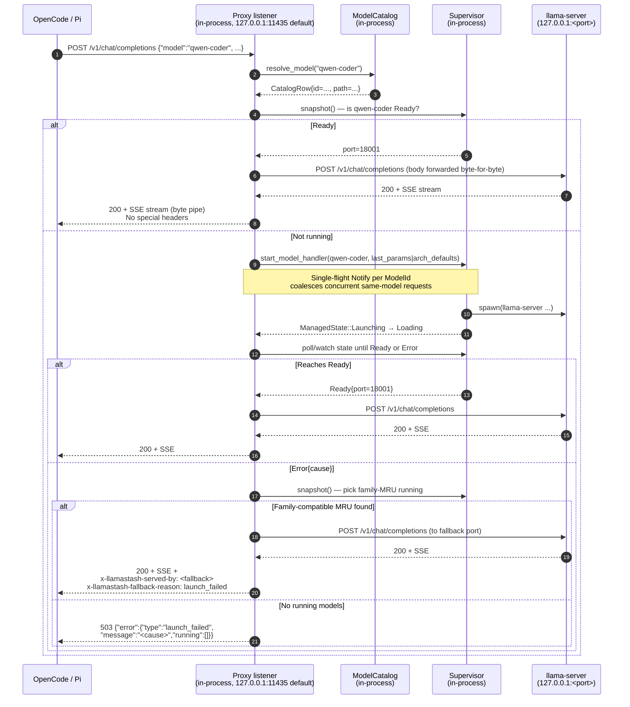

# feat: Proxy router for OpenAI-compat agents (single URL, model-name routing, family-MRU fallback)

## Overview

Add a loopback HTTP listener inside the daemon process that accepts OpenAI-compatible requests on a single stable URL, resolves `body.model` via the existing CLI fuzzy matcher, and forwards to the matching `llama-server` child. If the requested model is not running, auto-start it (replaying `last_params`, else `arch_defaults`). If the supervisor returns `Error{cause}`, fall back to a family-compatible MRU running model (or any-MRU, or error). Substitution is observable via `x-llamastash-served-by` / `x-llamastash-fallback-reason` response headers; the request body and the response body are byte-passthrough.

All product decisions land in [the brainstorm](../brainstorms/2026-05-21-proxy-router-requirements.md). This plan adds the technical decisions, the implementation sequence, and the test scenarios.

## Problem Frame

OpenCode, Pi (pi.dev), and every other OpenAI-client wrapper expect one URL plus a `model:` field. llamastash today hands out one URL per running model and exposes the port only through an IPC `status` call no HTTP client speaks. Multi-model workflows (coder + embedder + reranker) need an alt-tab + port-lookup + agent-restart cycle each switch. The proxy is a thin in-process router that fixes this without touching the v1 security contract — loopback only, same-UID, no auth, no LAN, no MCP.

See origin: [Problem Frame](../brainstorms/2026-05-21-proxy-router-requirements.md#problem-frame).

## Requirements Trace

This plan satisfies R151–R164 from the origin doc. The mapping per implementation unit appears below; cross-reference summary:

| Unit | R# covered |
|---|---|
| 1: HTTP scaffold + config | R151, R162 (partial) |
| 2: `/v1/models` + `/health` | R158, R159 |
| 3: Name resolution + forwarding | R151, R152, R156, R157, R162 |
| 4: Auto-start, single-flight, fallback | R153, R154, R155, R156 |
| 5: Status surface (IPC, CLI, TUI) | R161 |
| 6: Docs + smoke tests | R163, R164 |
| 7: Latency bench (validation) | R160 |

## Scope Boundaries

Carried verbatim from origin doc §Non-goals — list not repeated. The plan respects each one; if implementation discovers a case that demands violating a non-goal, the plan halts and re-routes through `ce:brainstorm`.

In particular: no auth, no TLS, no LAN binding, no Anthropic `/v1/messages`, no native llama.cpp routes, no idle eviction, no memory-pressure eviction, no SSE keepalive during Loading, no per-request advanced-params override, no WebSocket. (see origin: [Non-goals](../brainstorms/2026-05-21-proxy-router-requirements.md#non-goals-explicitly-out-of-scope)).

## Context & Research

### Relevant Code and Patterns

- **HTTP runtime**: nothing in tree today. `reqwest 0.12` (with hyper) is already a dependency for the IPC client, supervisor probe, and HF pull (`Cargo.toml`). Adding `axum 0.8` on the same hyper stack reuses the existing transport. Skip new runtime crates beyond axum.
- **CLI fuzzy resolver**: [`src/cli/resolve.rs::resolve_model(rows, reference) -> Result<CatalogRow, CliExit>`](../../src/cli/resolve.rs) — single source of truth for `start <name>` / `stop <name>` / `presets show <name>`. The proxy will call this verbatim against a `Vec<CatalogRow>` built from `MethodContext.catalog`.
- **Daemon lifecycle wiring**: [`src/daemon/mod.rs::run_foreground`](../../src/daemon/mod.rs) is the canonical place to spawn background tasks. Existing siblings: `discovery_task::spawn` (~line 185), `host_metrics::spawn` (~line 261), and `server::serve` (~line 307, the Unix-socket accept loop). The proxy listener spawns here too.
- **Supervisor state machine**: [`src/daemon/supervisor.rs::ManagedState`](../../src/daemon/supervisor.rs) — `Launching → Loading → Ready | Error{cause} → Stopping → Stopped`, with `ManagedModel::state()` returning a cloned snapshot. The proxy polls `state()` (or a future watch channel; see Unit 4 deferred note) to wait for `Ready`.
- **Supervisor registry**: [`src/daemon/registry.rs::SupervisorRegistry::snapshot()`](../../src/daemon/registry.rs) returns `Vec<(LaunchId, ManagedModel)>`. The proxy reads this to find running models for fallback selection and to look up `(model_id → port)` for forwarding.
- **Method context**: [`src/ipc/methods.rs::MethodContext`](../../src/ipc/methods.rs) already holds `catalog`, `supervisors`, `state` (PersistedState — last_params lives here), and `launch: Option<LaunchEnv>` (binary path, port range, log dir, probe options, arch_defaults). The proxy needs all four; thread them in by cloning the context (it's already `Clone`).
- **start_model launch path**: [`src/ipc/methods.rs`](../../src/ipc/methods.rs) `start_model_handler` (search for "start_model" — it composes `LaunchParams` from `last_params`/`arch_defaults`, reserves a port via `ports::allocate`, calls `supervisor::spawn`, and registers the result). The proxy auto-start path calls **the same handler** rather than re-rolling the launch logic — see Unit 4.
- **status output**: [`src/cli/output.rs::status_json`](../../src/cli/output.rs) and the parallel `StatusSnapshot` type produce the `--json` shape. The new `proxy` field threads through both the IPC `status` response and `status --json`.
- **Tests**: `tests/fixtures/fake_llama_server.rs` is the integration test fixture under `--features test-fixtures`. It answers `/health`, `/v1/models`, `/v1/chat/completions` (streaming), `/v1/embeddings`, `/v1/rerank` with failure-injection markers. The proxy's integration tests use it instead of a real `llama-server`.
- **TUI toast pattern**: commit `2f680c7` introduced the writer-task launch-failure toast pattern; `proxy.status == "port_in_use"` reuses it.

### Institutional Learnings

- `docs/solutions/` does not exist in this repo. No prior memos to consult.
- AGENTS.md §"Common gotchas" warns that the CLI/TUI/daemon are one binary and tests must use distinct temp dirs. Proxy integration tests will follow `unique_temp_dir(label)`.
- AGENTS.md §"Scope boundaries" enshrines "no HTTP or MCP surfaces (R34)." Unit 6 updates this section with the proxy carve-out.

### External References

Web research compared tokio-compatible Rust HTTP server options against R160 (negligible overhead) and the project's binary-size sensitivity (TODO.md R1 audit item). Findings:

- The performance-king options (`may_minihttp`, `ntex` with io_uring) are **incompatible**: `may_minihttp` runs on the `may` stackful-coroutine runtime, `ntex` has its own `ntex-rt`. Neither shares hyper with the existing reqwest dep.
- Among tokio-compatible options at our load (single-user IDE, ~10-100 req/s peak — orders of magnitude below the 17-25k req/s TechEmpower runs), `axum`, raw `hyper`, and `actix-web` are statistically indistinguishable on per-request overhead. All add sub-microsecond routing time; R160's "negligible overhead" is met by any.
- Binary size and dep-tree depth do differ: `hyper` + `hyper-util` is the lightest tokio-compat choice (~30-50 KB beyond what reqwest already pulls); `axum` adds ~150-200 KB plus tower / tower-service / tower-layer / sync_wrapper; `actix-web` is largest.
- The tokio-rs/axum#2566 discussion noted axum being ~25% slower / ~8x higher latency than raw hyper in synthetic TechEmpower-style benchmarks. The maintainers attributed the spread to benchmark configuration rather than architecture, but didn't refute the direction. Negligible at our load, real on the audit axis.

Decision: **`hyper` 1.x + `hyper-util` + `http-body-util`**. Lightest tokio-compat option, matches the project's hand-rolled-infrastructure style (`src/ipc/framing.rs`, `src/daemon/server.rs`), no perf compromise at realistic load. axum considered and rejected on the binary-size axis given TODO.md's R1 audit signal.

llama-server's OpenAI-compat behavior is documented upstream (llama.cpp) — verified in Unit 1.

Sources consulted: [tokio-rs/axum#2566](https://github.com/tokio-rs/axum/discussions/2566), [OSSystems web-client-server-binary-size benchmark](https://github.com/OSSystems/web-client-server-binary-size-benchmark-rs), [Rust forum: highest-performance backend stack](https://users.rust-lang.org/t/looking-for-the-highest-performance-rust-backend-stack-actix-web-vs-hyper-tokio-and-any-lesser-known-high-performance-frameworks/136443), [TechEmpower Round 23](https://www.techempower.com/benchmarks/).

## Key Technical Decisions

| Decision | Choice | Rationale |
|---|---|---|
| HTTP server crate | **`hyper` 1.x + `hyper-util` + `http-body-util`** | Lightest tokio-compatible choice; reuses hyper (already in tree via reqwest). Adds ~50-80 KB binary vs axum's ~150-200 KB. Matches the hand-rolled-infrastructure style of `src/ipc/framing.rs` and `src/daemon/server.rs`. Routing is a `match` on `(method, path)` for 6 fixed endpoints — ~30 lines of glue, no ergonomics loss at our route count. See External References for the axum-vs-hyper analysis. |
| HTTP client for forwarding | **Reuse the existing `reqwest::Client`** | One pooled `Client` is sufficient; hyper handles keep-alive per-host. Adding a second client would just be cargo cult. |
| `body.model` echo strategy | **Do not rewrite the outgoing request body.** Forward `body.model` byte-for-byte. | `llama-server` follows the OpenAI convention of echoing `request.model` into `response.model`. With pass-through, `response.model = requested name` automatically on the happy path *and* on fallback, with zero per-chunk JSON parsing. Unit 1 has a verification task to confirm; see Risks below for the fallback strategy if upstream behavior surprises us. |
| Family classification | **Exact `general.architecture` match.** Missing arch = no family. | Discovery already parses `general.architecture`; treating it as a string equivalence avoids inventing a family-grouping table. Synthetic GGUFs (init) without arch metadata fall straight to "any MRU." Resolves origin finding #2. |
| Port-in-use behavior | **Refuse the listener, log a warning, surface in `status.proxy.status = "port_in_use"`.** No auto-roaming. | Auto-roaming ports defeat the "single stable URL" promise — users would chase a moving target. Refusing is the honest signal; user edits config. |
| Body / header size limits | **Manual 2 MiB body cap** via `http-body-util::Limited`; hyper's default header buffer (~16 KiB). Not exposed in `[proxy]` config at v1. Body cap returns HTTP 413. | Plenty of headroom for OpenAI-shape requests (chat completions with long histories rarely exceed 1 MiB). The cap is intentional rather than implicit, enforced via `Limited<Incoming>` before forwarding. Resolves origin finding #3. |
| Single-flight launch coalescing | **`tokio::sync::Notify` per `ModelId`** in a proxy-local map. Two concurrent requests for the same not-yet-running model share one launch; both park on the same `Notify`. | Cheap, no `Mutex` contention on the hot path, evicts itself when the launch completes. |
| Empty / missing `body.model` | **HTTP 400** with `{"error":{"type":"invalid_request","code":"model_required",...}}`. | OpenAI spec marks `model` as required. Matching the spec keeps clients honest. |
| Mid-stream upstream death | **Pass through.** If reqwest's response stream errors after headers were sent, the proxy closes its connection to the client; the client sees the upstream's failure. No retry, no fallback. | Once the response started, the routing decision is committed. Retrying risks duplicating tokens or scrambling SSE state. |
| `proxy.status` value space | `"disabled"` \| `"listening"` \| `"port_in_use"` \| `"unbound"` (with `bind_error: <string>` for the last) | Covers config-off, the named collision case, and unexpected bind failures (EACCES, EADDRNOTAVAIL, …). Stable wire labels for parser pinning. |
| `last_request_at` per model | **In-memory only**, lives on the proxy's listener task | No persistence value — a daemon restart wipes `state.running` too. Recovered naturally on first request after restart. |
| Implementation-unit naming | **Local Unit 1..7 within this plan.** No claim on a global Unit-N slot. | The v1 Implementation Units (1..9) and v2 plan units are not a continuous index — this work is post-v2 and labels itself locally. |

## Open Questions

### Resolved During Planning

- **HTTP runtime crate** → `hyper` 1.x + `hyper-util` + `http-body-util` (see Key Decisions; axum considered and rejected on binary-size axis per the External References analysis).
- **Port-in-use behavior** → refuse + surface, no auto-roam (see Key Decisions).
- **Body/header size limits** → 2 MiB body via `http-body-util::Limited`, hyper default headers, 413 on overflow (see Key Decisions).
- **Reqwest pool sizing** → reuse the existing pooled `Client` (see Key Decisions).
- **`proxy.status` value space** → 4 variants enumerated (see Key Decisions).
- **`last_request_at` persistence** → in-memory only (see Key Decisions).
- **Empty/missing `body.model`** → HTTP 400 (see Key Decisions).
- **State mutation mid-stream** → pass through upstream error (see Key Decisions).
- **Missing arch metadata** → unknown family, fall through to any-MRU (see Key Decisions; resolves origin finding #2).
- **Body re-write strategy** → no rewriting; rely on llama-server's echo behavior (see Key Decisions; resolves origin finding #1, with verification in Unit 1).

### Deferred to Implementation

- **Exact `service_fn` dispatch shape** — the `match` arms over `(req.method(), req.uri().path())`, the `service_fn` closure's return type alignment, and the precise `Arc<ProxyState>` capture pattern land during Unit 1/3 once hyper-util's `Builder::new(...).serve_connection(...)` API is in front of the implementer. The plan prescribes the *what*, not the function signatures.
- **State watch channel vs `state()` polling for "wait for Ready"** — `ManagedModel::state()` is currently a `RwLock` snapshot. A `tokio::sync::watch` channel would let the proxy `.changed().await` instead of polling at a fixed cadence. Worth doing during Unit 4 if `supervisor.rs` is being touched anyway; otherwise a 100 ms poll loop is fine for v1.
- **Bench harness placement** — `benches/proxy_overhead.rs` with `criterion`, or an ad-hoc `cargo run --bin bench_proxy`. Unit 7 picks based on whether `criterion` is already a dev-dep.

## High-Level Technical Design

> *This illustrates the intended request flow for review. It is directional guidance, not implementation specification — the implementing agent should treat it as context, not code to reproduce.*



The hot path (Ready model, no fallback) is exactly two HashMap lookups + one reqwest call. No JSON re-parsing past extracting `body.model`. SSE responses are a byte pipe.

## Implementation Units

- [x] **Unit 1: HTTP runtime scaffold + config**

**Goal:** Land the `hyper` + `hyper-util` + `http-body-util` dependencies, the `src/proxy/` module skeleton, the `[proxy]` config section, and the listener boot sequence inside `run_foreground`. The listener answers `/health` only; every other route returns `501 Not Implemented`. Also verify llama-server's `response.model` echo behavior so Unit 3's pass-through strategy holds.

**Requirements:** R151 (partial — listener exists), R162 (partial — config schema).

**Dependencies:** None.

**Files:**
- Modify: `Cargo.toml` — add `hyper = { version = "1", features = ["http1", "server"] }`, `hyper-util = { version = "0.1", features = ["server", "server-auto", "tokio", "service"] }`, `http-body-util = "0.1"`. `hyper` is already in the tree transitively via reqwest; the explicit dep keeps the version pinned and surfaces the server features. HTTP/2 is intentionally not enabled — loopback HTTP/1.1 + keep-alive is sufficient and avoids ALPN/TLS surface.
- Create: `src/proxy/mod.rs` — module entry, public re-exports
- Create: `src/proxy/server.rs` — `TcpListener` accept loop, per-connection `serve_connection` via `hyper_util::server::conn::auto::Builder` or `hyper::server::conn::http1::Builder` (pick once the implementer is in the code; both are valid), `serve()` async fn
- Create: `src/proxy/router.rs` — the `service_fn` body: `match (req.method(), req.uri().path())` dispatching to handler functions
- Create: `src/proxy/state.rs` — `ProxyState` struct (catalog, supervisors, persisted state, launch env handles cloned from `MethodContext`)
- Modify: `src/lib.rs` — `pub mod proxy;`
- Modify: `src/config/mod.rs` (and the loader sub-module) — add `ProxyConfig { enabled: bool (default true), port: Option<u16> }` with the effective default derived from mode (`11435` in normal mode, `11434` in Ollama-compat mode)
- Modify: `src/daemon/mod.rs` — wire `proxy::serve` spawn into `run_foreground` alongside `host_metrics::spawn` and `server::serve`. Bind error → log warning, leave `ProxyStatus::PortInUse` in the shared cell; daemon keeps running.
- Create: `src/proxy/tests/echo_verification.rs` (or inline `#[cfg(test)] mod tests`) — manual-run test against `fake_llama_server` that posts `{"model":"sentinel-name", ...}` and asserts `response.model == "sentinel-name"`. Documents the contract on which Unit 3 depends.
- Test: `src/proxy/server.rs` inline tests for the `/health` and `/501` stub paths.

**Approach:**
- `ProxyState` is `Arc`-wrapped; the `service_fn` closure clones the `Arc` per connection. Each handler function takes `(Arc<ProxyState>, Request<Incoming>) -> Result<Response<BoxBody<Bytes, Error>>, hyper::Error>`.
- `serve(state, listen_addr, shutdown_token) -> Result<()>` is the spawn target. Binds a `tokio::net::TcpListener`; on bind failure, returns without panicking; the caller logs and updates the status cell.
- Accept loop mirrors `src/daemon/server.rs`'s shape: `tokio::select!` between `listener.accept()` and `shutdown.wait_until_triggered()`. Each accepted connection spawns a task running `hyper_util::server::conn::auto::Builder::new(TokioExecutor::new()).serve_connection(io, service_fn(...))`. Connection drain mirrors the existing `DRAIN_TIMEOUT` pattern.
- Daemon `run_foreground` adds the proxy spawn after `host_metrics::spawn` and before the unix-socket `server::serve` — order chosen so `MethodContext` is fully populated before the proxy reads from it.
- The `[proxy]` config keys follow the existing config-validation pattern (`unknown_keys_are_errors`) so a typo fails loud.
- Verification task (the echo test) lands here so Unit 3 doesn't discover the dependency mid-implementation.

**Patterns to follow:**
- `src/daemon/server.rs` — accept-loop + connection-drain pattern (the proxy mirrors this for TCP).
- `src/daemon/host_metrics.rs::spawn` — spawn signature taking a `ShutdownToken`.
- `src/ipc/methods.rs::dispatch_request` — large method `match` for request dispatch; the proxy's router follows the same flat-`match` style for the 6 routes.
- `src/config/loader.rs` — config parsing + unknown-key rejection.

**Test scenarios:**
- Happy path: daemon starts with `proxy.enabled: true`; in normal mode `curl 127.0.0.1:11435/health` returns 200 + `{"status":"ok","models_loaded":0,"models_discovered":0}` (counts depend on catalog state — test asserts shape, not exact numbers).
- Happy path: `curl -X POST 127.0.0.1:11435/v1/chat/completions -d '{}'` returns 501.
- Edge case: `proxy.enabled: false` → daemon starts, no listener bound, IPC `status` reports `proxy.status: "disabled"`.
- Edge case: port already in use (test binds the port first, then starts the daemon) → daemon starts anyway, IPC `status` reports `proxy.status: "port_in_use"`.
- Edge case: unknown `proxy.foo: bar` config key → daemon refuses to start, error message names the unknown key.
- Edge case: HTTP/1.1 keep-alive — two `GET /health` requests issued over a single TCP connection both succeed (validates `hyper_util::server::conn::auto::Builder`'s connection reuse; this is the protocol-correctness smoke test the hyper risk row depends on).
- Echo verification: post `{"model":"sentinel-x42", ...}` to `fake_llama_server`; assert `response.model == "sentinel-x42"` and document the result in a top-of-file comment.

**Verification:**
- `cargo test --features test-fixtures proxy` passes.
- A live daemon answers `/health` on the configured port; `lsof -i :11435` shows the daemon process in normal mode.
- IPC `status` response includes the `proxy` block with the expected status value across the four config/port states.

- [x] **Unit 2: `/v1/models` endpoint**

**Goal:** Implement `/v1/models` returning all discovered models in OpenAI shape, sorted alphabetically.

**Requirements:** R158, R159 (the `/health` body's `models_loaded` / `models_discovered` counts gain real values once the catalog is wired).

**Dependencies:** Unit 1.

**Files:**
- Modify: `src/proxy/server.rs` — add `/v1/models` route handler
- Create: `src/proxy/openai.rs` — small module for OpenAI response shapes (`ModelObject`, `ModelList`, `ErrorObject`); these stay private to the proxy
- Test: inline tests in `src/proxy/openai.rs` + integration test under `tests/proxy_models.rs`

**Approach:**
- Handler reads `ProxyState.catalog.snapshot()` (or whatever the existing read accessor is) and projects each `DiscoveredModel` into `{"id": <display_name>, "object": "model", "created": <epoch-of-first-discovery-OR-mtime-OR-0>, "owned_by": "llamastash"}`.
- `created` field source — pick the simplest stable value that doesn't churn agent caches: file mtime (already on `DiscoveredModel` via fs metadata, or 0 if unavailable). If mtime adds plumbing, default to `0` for v1 and note in the doc.
- Sort by `id` ASCII-sort for stability across runs.
- `/health`'s `models_loaded` / `models_discovered` counts come from `ProxyState.supervisors.snapshot()` (only Ready) and `ProxyState.catalog.snapshot()` lengths respectively.

**Patterns to follow:**
- `src/cli/output.rs::list_json` — shape of model row serialization (though OpenAI's shape differs slightly).

**Test scenarios:**
- Happy path: catalog has 3 models → `/v1/models` returns 3 objects in alphabetical order; each carries `object: "model"`, `owned_by: "llamastash"`.
- Happy path: catalog is empty → response is `{"object":"list","data":[]}` (not an error).
- Edge case: a discovered model with `parse_error.is_some()` and no metadata — still appears in `/v1/models` using `path.file_stem()` as `id` (consistent with `llamastash list`).
- Edge case: 200 discovered models — single response under 1 MiB; sort order stable across calls.
- Integration: response is valid JSON parseable by the OpenAI Python/Node client's `/v1/models` deserializer (test with a recorded fixture if practical; otherwise schema-match against an OpenAI sample).

**Verification:**
- `curl 127.0.0.1:11435/v1/models | jq '.data | length'` returns the same count as `llamastash list --json | jq '.models | length'` in normal mode.

- [x] **Unit 3: Name resolution + HTTP forwarding for Ready models**

**Goal:** Wire `body.model` extraction → `resolve_model` → look up the running supervisor's port → forward the request via `reqwest` and stream the response. Includes the response-header emission contract. No auto-start yet; the route returns 503 for unmatched-and-not-running models. This unit lands the routing and pass-through plumbing in isolation so Unit 4 can layer launch + fallback on top.

**Requirements:** R151 (full URL working for already-running models), R152, R156, R157, R162 (full).

**Dependencies:** Unit 2 (`ProxyState` shape, error response helpers).

**Files:**
- Modify: `src/proxy/router.rs` — add `match` arms for `/v1/chat/completions`, `/v1/completions`, `/v1/embeddings`, `/v1/rerank` dispatching to per-route handlers
- Create: `src/proxy/route.rs` — pulls `body.model` from the request body without full deserialization (cheap streaming parse: read up to the first `"model"` field, stop), runs `resolve_model`, looks up `(ModelId → port)` via `SupervisorRegistry::snapshot()`, returns a `RouteDecision` enum
- Create: `src/proxy/forward.rs` — owns the `reqwest::Client` and the byte-pipe forwarding logic; HTTP/1.1 streaming responses preserved end-to-end via `http-body-util::StreamBody` wrapping `reqwest::Response::bytes_stream()`
- Modify: `src/proxy/openai.rs` — add error shapes for `model_not_found`, `ambiguous_model`, `model_required`, `model_not_running`
- Modify: `src/proxy/state.rs` — `ProxyState` gains an `Arc<reqwest::Client>` field
- Test: `tests/proxy_routing.rs`

**Approach:**
- Body model extraction: read the request body via `http-body-util::Limited::new(req.into_body(), 2 * 1024 * 1024).collect().await` — the `Limited` adapter enforces the 2 MiB cap and returns a `LengthLimitError` we map to HTTP 413. Once collected, run `serde_json::from_slice::<JustModel>` where `JustModel { model: String }` ignores all other fields. Forward the buffered body bytes downstream — no re-encoding.
- For the rare case where `body.model` is absent in the first 64 KiB but appears later, the 2 MiB cap is the hard ceiling; in practice OpenAI request shapes put `model` near the top of the JSON object, so we never need to read past a few KiB to find it. We still buffer the whole (capped) body for forwarding.
- Name resolution: call `resolve_model(&rows, &body_model)` where `rows: Vec<CatalogRow>` is built from the catalog snapshot (reuses `cli::resolve::fetch_catalog` if it's pure, else inlines the row build).
- `RouteDecision::ReadyAt { port, served_model_id, fallback: bool }` carries everything `forward.rs` needs.
- Forwarding builds a `reqwest::Request` mirroring the inbound HTTP method, path, headers (with hop-by-hop headers stripped: `Connection`, `Keep-Alive`, `Transfer-Encoding`, `Upgrade`, `Proxy-*`), and the **buffered body unchanged**.
- The response is streamed back: HTTP status, headers (same hop-by-hop strip), and body bytes piped from reqwest's `bytes_stream()` through `http-body-util::StreamBody` (each `Bytes` chunk wrapped in `Frame::data(...)`) into a `hyper::Response<BoxBody<Bytes, Error>>`. No buffering, no chunk-level parsing.
- Fallback-path headers `x-llamastash-served-by` and `x-llamastash-fallback-reason` are added in `forward.rs` based on the `RouteDecision.fallback` flag. Unit 4 supplies the `true` case; this unit covers the `false` case only.
- Unmatched-and-not-running: 503 `{"error":{"type":"model_not_running","message":"<model> not running; auto-start is not yet wired"}}` — placeholder until Unit 4 replaces it with auto-start.
- Ambiguous match: 400 `{"error":{"type":"ambiguous_model","message":"... matched 3 models ...","matches":[...]}}` — body includes the candidate names so the client can refine.
- Missing/empty `body.model`: 400 `{"error":{"type":"invalid_request","code":"model_required",...}}`.

**Patterns to follow:**
- `src/cli/resolve.rs::resolve_model` — the resolver itself.
- `src/daemon/probe.rs` — existing pattern for talking to a `llama-server` child over HTTP.

**Test scenarios:**
- Happy path (non-streaming): chat completion request for a Ready model → upstream `fake_llama_server` returns 200 JSON; proxy forwards the JSON byte-for-byte; client receives identical bytes; no `x-llamastash-*` headers present.
- Happy path (streaming SSE): chat completion `stream: true` for a Ready model → fake server emits `data: {...}\n\n` chunks ending in `data: [DONE]\n\n`; proxy delivers the exact byte sequence; chunk timing approximately preserved (allow ≤5 ms drift in test).
- Happy path (`/v1/embeddings`): embedding request → 200 JSON pass-through.
- Edge case: unknown model name → 404 with `{"error":{"type":"model_not_found",...}}`; body lists no matches.
- Edge case: ambiguous fuzzy match (two models share a substring) → 400 with `{"error":{"type":"ambiguous_model","matches":["a","b"]}}`.
- Edge case: missing `body.model` → 400 `model_required`.
- Edge case: empty string `body.model: ""` → 400 `model_required`.
- Edge case: model exists in catalog but not running → 503 `model_not_running` (placeholder; replaced in Unit 4).
- Edge case: body > 2 MiB → `http-body-util::Limited` returns `LengthLimitError`; proxy maps it to HTTP 413 Payload Too Large.
- Edge case: hop-by-hop headers (e.g., `Connection: close`) → stripped before forwarding.
- Integration: hop-by-hop headers in upstream response (e.g., `Transfer-Encoding: chunked`) → stripped before client receives them, but chunk framing preserved by the body stream.
- Error path: `fake_llama_server` returns 500 → proxy surfaces 500 to client; no fallback (Unit 4's territory).
- Error path: upstream connection dies mid-stream → client connection closes; no panic, no log spam.

**Verification:**
- `curl http://127.0.0.1:11435/v1/chat/completions -d '{"model":"<running>", ...}'` returns the same body as `curl http://127.0.0.1:<port>/v1/chat/completions -d '{...}'` directly to the model's port in normal mode.
- `cargo test --features test-fixtures proxy_routing` green.

- [x] **Unit 4: Auto-start + single-flight coalescing + family-MRU fallback**

**Goal:** When the resolved model isn't running, launch it via the same path `start_model` uses; wait for `Ready` indefinitely (only `Error{cause}` triggers fallback); coalesce concurrent same-model requests; on `Error{cause}` pick family-MRU then any-MRU then 503.

**Requirements:** R153, R154, R155 (incl. unknown-arch fallthrough), R156 (full — fallback headers now emitted).

**Dependencies:** Unit 3 (resolution + forwarding + 503 placeholder).

**Files:**
- Modify: `src/proxy/route.rs` — replace the 503 placeholder with the launch + wait + fallback logic
- Create: `src/proxy/launch.rs` — wraps the `start_model_handler` path so the proxy can call it programmatically (not via IPC; we're in-process). Returns a future that resolves to `Ready{port}` or `Error{cause}`.
- Create: `src/proxy/coalesce.rs` — `Map<ModelId, Arc<Notify>>` for single-flight; the first caller wins the launch, subsequent callers `.notified().await`
- Create: `src/proxy/mru.rs` — tracks `last_request_at: Map<ModelId, Instant>` in-process; provides `pick_fallback(failed_model_arch: Option<&str>) -> Option<(ModelId, u16)>`
- Modify: `src/proxy/state.rs` — `ProxyState` gains `coalesce` and `mru` handles
- Modify: `src/proxy/forward.rs` — emit fallback headers on the `fallback: true` branch
- Test: `tests/proxy_autostart.rs`, `tests/proxy_fallback.rs`, `tests/proxy_coalesce.rs`

**Approach:**
- Auto-start: extract the `start_model_handler`'s composition logic so it's callable in-process without going through IPC dispatch. Probably means lifting the body of the handler into a `pub(crate)` async fn `start_model_inner(ctx: &MethodContext, model_id: ModelId, ...) -> Result<LaunchId, StartError>` and having both the IPC handler and the proxy call it. Avoid duplicating the `last_params → arch_defaults` cascade.
- Wait for Ready: after launch, poll `ManagedModel::state()` at 100 ms (no client-facing timeout — see Key Decisions). On `Ready` → forward. On `Error{cause}` → fallback. The optional `tokio::sync::watch` refactor of supervisor state is deferred (see Open Questions).
- Single-flight coalescing: before calling `start_model_inner`, check `coalesce` for an in-flight `Notify` for this `ModelId`. If present, `.notified().await` (drops the launch attempt). Else insert a fresh `Notify`, run the launch, signal `notify_waiters()` on completion (whether Ready or Error), and remove the entry. All waiters then proceed to their own "is it Ready now?" check — happy waiters forward, the few that lost to a `Error` re-enter the fallback path independently.
- Family-MRU fallback: on `Error{cause}`:
  1. Look up the *requested* model's `general.architecture` from its catalog entry.
  2. Build `running_ready: Vec<(ModelId, arch: Option<String>, last_request_at: Option<Instant>, port: u16)>` from `supervisors.snapshot()`.
  3. If requested arch is `Some(a)`, sort `running_ready` to put `arch == Some(a)` first, then sort each group by `last_request_at` descending (newest first). Else (requested model lacks arch metadata), skip the family-prefer step and sort the whole list by `last_request_at` descending.
  4. Take the first. If `running_ready` is empty → 503 `launch_failed`.
- Emit headers: `x-llamastash-served-by: <served display_name>` and `x-llamastash-fallback-reason: launch_failed`. These ride on the response from `forward.rs`.
- MRU bookkeeping: update `last_request_at` on every successful request *as it starts forwarding* (not on completion — long-running streams shouldn't delay the timestamp).

**Patterns to follow:**
- `src/ipc/methods.rs` `start_model_handler` — the composition pipeline (last_params → arch_defaults → built-in defaults).
- `src/daemon/supervisor.rs::ManagedModel::state` — readback shape.
- `tokio::sync::Notify` patterns elsewhere in the daemon (the discovery task and shutdown plumbing both use them).

**Test scenarios:**
- Happy path: request for a dormant model → proxy starts it → supervisor reaches Ready → forward succeeds; no fallback headers.
- Happy path (slow start): launch takes ~3 s (simulated via `fake_llama_server`'s slow-ready injection) → request blocks for the full window → success.
- Edge case: two concurrent requests for the same dormant model → exactly one `start_model_inner` call observed (assert via mock or instrumentation); both requests succeed.
- Edge case: three concurrent requests for three different dormant models → three concurrent launches; all succeed.
- Error path: launch fails (binary not found, port range exhausted, fake-server fail-on-launch marker) and no running models → 503 `{"error":{"type":"launch_failed","message":"<cause>","running":[]}}`.
- Error path: launch fails and one running model of matching arch exists → fallback fires; `x-llamastash-served-by: <model>` and `x-llamastash-fallback-reason: launch_failed` headers present; response body is the upstream's response.
- Error path: launch fails and only a *different-arch* running model exists → fallback fires anyway (family preference, not requirement); headers emitted.
- Edge case: requested model has no `general.architecture` (synthetic GGUF) and one running model exists → fallback to any-MRU; headers emitted.
- Edge case: launch fails *after* state has transitioned through Loading (probe timeout) → `Error{cause: "probe timeout"}` → fallback fires.
- Edge case: launch fails on first request; a second request arrives 10 ms later → both fall back independently (per-request retry per R155); no caching of the failure.
- Integration: launch + Ready transition is observed by both the IPC `status` method and the proxy simultaneously (no shared-state desync).
- Integration: while a fallback request is in-flight, the original-target model becomes Ready (e.g., a separate manual start) → the in-flight fallback request continues against its chosen fallback; the *next* request for the original model hits it directly.

**Verification:**
- `curl http://127.0.0.1:11435/v1/chat/completions -d '{"model":"<not-running>", ...}'` starts the model and returns a 200 with no fallback headers in normal mode.
- A test that injects launch failure produces a 200 with `x-llamastash-served-by` and `x-llamastash-fallback-reason` headers set.

- [x] **Unit 5: Status surface — IPC, CLI `status --json`, TUI indicator**

**Goal:** Surface the proxy's state through every UI llamastash already has. IPC `status` gains a `proxy` block; `status --json` mirrors it; TUI shows a footer indicator (and a toast on `port_in_use`).

**Requirements:** R161.

**Dependencies:** Unit 1 (the `proxy.status` value lives in a shared cell from day one; this unit makes it visible).

**Files:**
- Modify: `src/ipc/methods.rs` — `status` handler reads `ProxyState.status` (or a separate shared `Arc<RwLock<ProxyStatus>>`) and adds the `proxy` field to the response
- Modify: `src/cli/output.rs` — `status_json` includes the `proxy` block; the human-readable status table gets a `proxy` row when enabled
- Modify: `src/tui/` (specifically the footer / status-bar renderer; concrete file TBD during the unit — likely `src/tui/views/footer.rs` or equivalent) — render a one-glyph indicator (e.g., `⚡ 127.0.0.1:11435` in normal mode when listening, dimmed when disabled, red when port-in-use)
- Modify: `src/tui/events.rs` — toast on `proxy.status` transition to `port_in_use` (reuse the `2f680c7` writer-task-launch-failure toast pattern)
- Test: `src/ipc/methods.rs` inline tests for the new field; `src/cli/output.rs` round-trip tests adding proxy cases; a TUI snapshot test if those exist for footer rendering

**Approach:**
- The proxy listener writes its current `ProxyStatus` into a shared `Arc<RwLock<ProxyStatus>>` cell on every transition. Both the proxy spawn (Unit 1) and the IPC `status` handler hold a clone.
- Wire format:
  ```json
  "proxy": {
    "enabled": true,
    "listen": "127.0.0.1:11435",
    "status": "listening",
    "bind_error": null
  }
  ```
  `bind_error` is non-null only when `status == "unbound"` (an unexpected bind failure beyond port-in-use).
- TUI footer glyph location: pick something out-of-the-way; if footer is crowded, fall back to surfacing in the daemon-info panel.
- Toast: only on transition *into* `port_in_use` (not on every status read). Use a flag-on-first-observation pattern.

**Patterns to follow:**
- `src/ipc/methods.rs::status_handler` (or the equivalent named handler) — existing fields like `host`, `daemon`, `gpu` show the field-add shape.
- Toast pattern from commit `2f680c7`.

**Test scenarios:**
- Happy path: daemon running with proxy enabled and bound → IPC `status` carries `proxy.status: "listening"`, `proxy.listen: "127.0.0.1:11435"` in normal mode, `proxy.bind_error: null`.
- Happy path: `llamastash status --json` includes the same `proxy` block byte-for-byte (same shape as IPC).
- Edge case: config has `proxy.enabled: false` → `proxy.status: "disabled"`, `listen` field absent or `null`.
- Edge case: the preferred port is already taken by another process → `proxy.status: "port_in_use"`, `bind_error: null`, `listen` reflects the *attempted* address (`127.0.0.1:11435` in normal mode, `127.0.0.1:11434` in Ollama-compat mode).
- Edge case: bind fails with EACCES (low-port simulation if feasible) → `proxy.status: "unbound"`, `bind_error: "permission denied"`.
- TUI: launching the TUI against a healthy daemon shows the proxy footer indicator.
- TUI: launching the TUI when proxy is in `port_in_use` state shows a toast on first focus.

**Verification:**
- `llamastash status --json | jq .proxy` returns the spec'd shape in each of the four states.
- IPC `status` shape matches the docstring in `MethodContext` (which is updated to mention `proxy`).

- [x] **Unit 6: Documentation + config example + smoke tests against real clients**

**Goal:** Update every doc surface that drifts under R163, finalize the config example, and confirm OpenCode + Pi (pi.dev) work end-to-end.

**Requirements:** R163, R164.

**Dependencies:** Units 1–5 (everything else implemented).

**Files:**
- Modify: `README.md` — add a section titled "Connecting agents (OpenCode, Pi)" with the one-paragraph base-URL pattern and a screenshot/diagram if it improves clarity
- Modify: `docs/usage.md` — full endpoint table, error shapes, headers, config keys
- Modify: `docs/architecture.md` — add the proxy listener to the one-breath diagram
- Modify: `AGENTS.md` — update the §"Scope boundaries" entry that currently says "No HTTP or MCP surfaces" to explicitly carve out the loopback OpenAI-compat proxy. R34's broader scope stays deferred. Also update the §"Architecture in one breath" diagram if it lives there.
- Modify: `CHANGELOG.md` — one-line entry under `[Unreleased]`
- Modify: `config.example.yaml` — add `[proxy]` section with the two keys + inline comments documenting the (lack of) auth, host, TLS, fallback-tuning knobs
- Modify: `TODO.md` — strike the R1 follow-up "Proxy router" entry; cross-link to this plan
- Modify: `Cargo.toml` keywords/categories — consider adding "openai-compat" or "proxy" if positioning shifts
- Create: `tests/proxy_real_client_smoke.md` — a short manual runbook documenting the OpenCode and Pi smoke checks the maintainer runs before tag-time

**Approach:**
- Smoke tests against OpenCode and Pi (pi.dev) are *manual* — neither is in the automated suite. The runbook lists exact commands / config snippets / pass criteria so anyone reproducing the test gets the same answer.
- All file-path references in the docs use repo-relative paths.

**Test scenarios:**
- Happy path: maintainer follows the OpenCode runbook entry end-to-end → OpenCode shows discovered models in its picker, completes one chat turn against a running model, and completes one chat turn against a dormant model (triggering auto-start).
- Happy path: maintainer follows the Pi (pi.dev) runbook entry end-to-end → analogous result.
- Edge case (documented): pointing OpenCode at the URL when daemon is down → OpenCode shows connection error (not a llamastash bug, but the runbook documents the expected behavior).

**Verification:**
- Maintainer signs off on the PR description with a one-line confirmation: "OpenCode + Pi smoke-tested green at <commit-sha>."

- [ ] **Unit 7: Latency benchmark for R160**

**Goal:** Validate the R160 latency targets (p50 < 0.5 ms routing decision, < 5% streaming first-token overhead, < 2% throughput overhead). Land a reproducible bench harness so regressions are catchable on the maintainer's reference machine.

**Requirements:** R160.

**Dependencies:** Units 1–4.

**Files:**
- Create: `benches/proxy_overhead.rs` (assuming `criterion` is already a dev-dep — if not, fall back to an ad-hoc `cargo run --example bench_proxy` harness)
- Create: `docs/runbooks/proxy-latency-bench.md` — how to run the bench, what the numbers should look like, what to do if a regression appears
- Modify: `Cargo.toml` `[dev-dependencies]` — add `criterion` if not present (preferred); else add a `[[bin]]` entry for the bench binary

**Approach:**
- Bench spawns a daemon + `fake_llama_server` (or a stubbed responder) and times:
  1. Routing-decision latency: time from request arrival to outbound socket write, measured in-process via instrumentation hooks on the proxy.
  2. End-to-end first-token latency, direct vs proxied.
  3. Throughput (tokens/sec via fake-server emitting a fixed payload), direct vs proxied.
- Report median + p99 for each axis.
- If a target is missed: investigate, but treat the numbers in R160 as targets-to-validate rather than blocking. Update R160 in the brainstorm if the achievable numbers materially differ — the goal is "negligible overhead," not a specific sub-ms figure.

**Patterns to follow:**
- Whatever bench harness exists today, if any. (`find . -name 'bench*.rs'` to check during the unit.)

**Test scenarios:**
- Bench reproducibility: running the bench twice in sequence on the same machine yields p50 values within 10% of each other.
- Bench validity: the "direct" arm (curl-equivalent to the model's port) and the "proxied" arm exercise the same upstream behavior — same input bytes, same fake-server response.

**Verification:**
- `cargo bench proxy_overhead` (or the equivalent harness command) emits a report. Maintainer runs it on the reference machine and pastes the table into the PR description.
- If any axis misses R160, the PR description names which and either justifies (and updates R160 in the brainstorm) or fixes.

## System-Wide Impact

- **Interaction graph:** New hyper-based TCP listener task spawned alongside the IPC server and the host-metrics sampler. Shares the same `ShutdownToken`. Reads `ModelCatalog` (lock-free clone), `SupervisorRegistry` (its existing lock surface), and `PersistedState` (existing mutex). Writes to a new `Arc<RwLock<ProxyStatus>>` cell read by the IPC `status` handler.
- **Error propagation:** Proxy errors return as OpenAI-shaped JSON (`{"error":{"type":..., "message":..., "code":...}}`) with appropriate HTTP status. Upstream errors from `llama-server` are passed through verbatim. Bind errors are non-fatal — daemon keeps running, status field carries the cause.
- **State lifecycle risks:**
  - Daemon restart drops the proxy's in-memory `last_request_at` map; on next launch, the proxy starts from a clean slate. Documented behavior.
  - Mid-stream upstream death: proxy closes its connection to the client; no retries.
  - `state.running` mutated by TUI/CLI while a proxy request is in flight: pass-through; proxy doesn't lock against external state changes.
- **API surface parity:** None — this *is* the new API surface. Anthropic compat and MCP are sibling TODOs that will add parallel listeners.
- **Integration coverage:**
  - Auto-start path coalesces with concurrent IPC `start_model` calls — both should succeed; the second observes the in-flight launch and parks.
  - Proxy + TUI both reading `SupervisorRegistry::snapshot()` simultaneously: existing concurrency-safe API; no changes needed.
- **Unchanged invariants:**
  - IPC socket peercred + mode 0600 — untouched.
  - `state.json` schema — untouched (no new persisted fields).
  - Existing exit codes — untouched (the proxy returns HTTP status codes, not CLI exit codes).
  - All `--features uat` behavior — untouched.

## Risks & Dependencies

| Risk | Likelihood | Impact | Mitigation |
|---|---|---|---|
| `llama-server` rewrites `body.model` in its response instead of echoing | Low | High (breaks the pass-through claim; we'd need per-chunk SSE rewriting on fallback) | Unit 1 includes the echo-verification test. If the assumption breaks, revisit R156: the falsifying outcome is "response.model reflects the served model name; agents read `x-llamastash-served-by` for canonical info" — a small spec revision, not a re-architecture. Update the brainstorm in the same PR if so. |
| Default-mode port collision with another local listener | Medium | Medium (proxy refuses to bind, user sees `port_in_use`, may need to edit config) | Normal mode prefers `11435` specifically to avoid colliding with Ollama on `11434`; Ollama-compat mode still intentionally claims `11434`. The status field carries the attempted address and the README documents both modes. |
| R160 latency targets unachievable in practice with fuzzy resolution over 200+ models | Medium | Low (target slips; functionality unaffected) | The targets are aspirational. Unit 7 reports actual numbers; R160 gets revised in the brainstorm if reality forces it. The "negligible overhead" promise is what matters; specific numbers serve as guardrails. |
| Concurrent requests for the same dormant model trigger two launches (single-flight bug) | Medium | Medium (resource waste + potential port-allocation conflict) | Unit 4's coalesce test explicitly exercises this; passing the test is the gating signal. The `Notify` pattern is well-trodden in the codebase. |
| Reqwest connection pool exhaustion under high concurrency | Low | Medium | Default pool size is 100 per host; well above realistic concurrent-agent counts on a single-user box. Revisit if anyone reports it. |
| AGENTS.md scope-boundary update is reviewed-and-rejected (i.e., the v1 "no HTTP surfaces" rule is treated as load-bearing) | Low | High (whole plan blocked) | This is the post-v2 era and the TODO explicitly calls for the feature; the brainstorm carved out the rule deliberately. If reviewers push back, the conversation belongs in the brainstorm, not the plan — re-route via `ce:brainstorm` if so. |
| `start_model_handler`'s composition logic doesn't cleanly extract to a `pub(crate)` helper | Low | Medium (Unit 4 grows; might duplicate logic) | Land Unit 4 with a clean handler extraction; if it isn't possible without surgery, fall back to having the proxy call `start_model_handler` through a synthetic in-process IPC dispatch (cost: small extra indirection, but functionally identical). |
| hyper 1.x's lower-level API costs more implementation time than an axum router would | Medium | Low (slower Unit 1/3; functionality unaffected) | Accepted trade for the binary-size win. The 6-route service is small enough (~30 lines of dispatch) that the lower-level glue stays bounded. If Unit 1 reveals the streaming-body pass-through (`StreamBody` + `BoxBody`) is materially harder than expected, the fallback is to switch to axum — at the cost of the dep-tree growth — and the plan re-routes back through this decision. |
| Subtle streaming-body / keep-alive bug in hand-rolled hyper service | Low | Medium (SSE drops, chunked-transfer corruption, connection leaks) | Unit 3's SSE byte-exactness test catches stream corruption; Unit 1's `/health` keep-alive smoke test catches connection-lifecycle bugs. The `hyper_util::server::conn::auto::Builder` does the protocol-detection and keep-alive accounting for us — we don't re-implement HTTP/1.1 framing, only the request dispatch. |

## Documentation / Operational Notes

- Docs to update: enumerated in Unit 6's Files list.
- No new runbook needed beyond `docs/runbooks/proxy-latency-bench.md` (Unit 7).
- No monitoring/observability work in v1 — the proxy reuses the existing daemon log file. If structured metrics emerge as a need (per-route count, fallback rate, p50 latency), that's a follow-up.
- No feature flag — the proxy is enabled by default. Users who don't want it set `proxy.enabled: false`.
- Rollout: this lands behind a single PR. No migrations, no schema changes, no state.json bumps.

## Sources & References

- **Origin document:** [docs/brainstorms/2026-05-21-proxy-router-requirements.md](../brainstorms/2026-05-21-proxy-router-requirements.md)
- Related code:
  - [src/cli/resolve.rs](../../src/cli/resolve.rs) — fuzzy resolver
  - [src/daemon/supervisor.rs](../../src/daemon/supervisor.rs) — state machine
  - [src/daemon/registry.rs](../../src/daemon/registry.rs) — running-model map
  - [src/daemon/mod.rs](../../src/daemon/mod.rs) — `run_foreground` task wiring
  - [src/ipc/methods.rs](../../src/ipc/methods.rs) — `MethodContext`, `start_model_handler`
  - [src/launch/defaults_table.rs](../../src/launch/defaults_table.rs) — arch_defaults
  - [tests/fixtures/fake_llama_server.rs](../../tests/fixtures/fake_llama_server.rs) — test fixture
- Related TODOs: TODO.md R1 Follow-up entry "Proxy router" (this plan); sibling TODO "HTTP and MCP surfaces (origin: R34)" stays deferred.
- External docs: read-as-needed during implementation — [hyper 1.x server guide](https://hyper.rs/guides/1/server/echo/), [hyper-util docs](https://docs.rs/hyper-util/), [http-body-util docs](https://docs.rs/http-body-util/), llama.cpp server (OpenAI-compat behavior).
