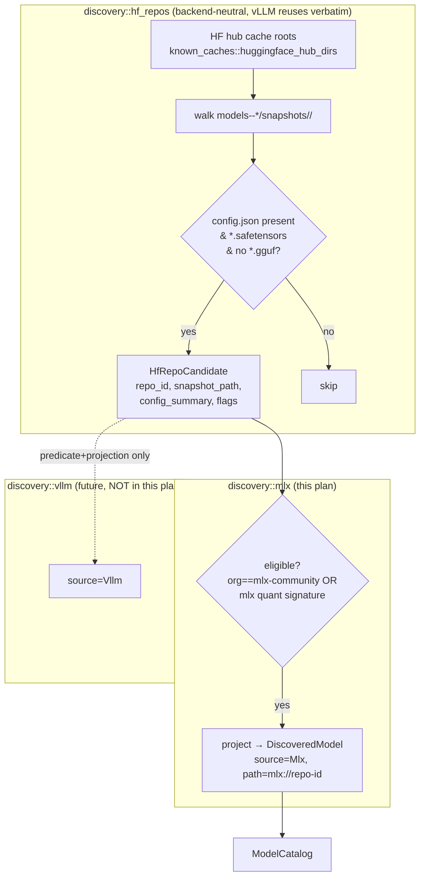
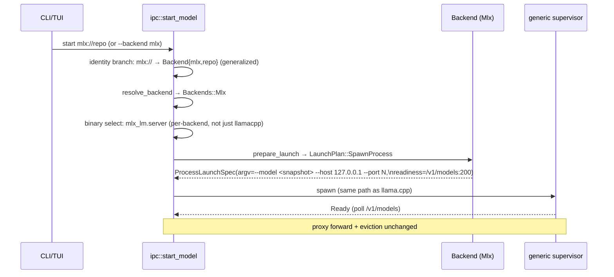
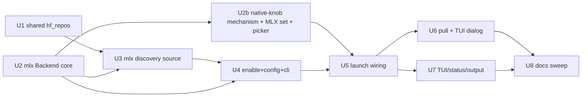

# feat: Add MLX backend with shared HF-repo discovery (vLLM-ready)

## Overview

Add MLX (`mlx_lm.server`, Apple Silicon) as a third inference backend behind
the existing `Backend` seam, alongside llama.cpp (direct, process-per-model)
and Lemonade (managed-multiplexer). MLX is the brainstorm's canonical "clean
direct peer": same process-per-model lifecycle as llama.cpp, so it rides the
generic supervisor unchanged and the format-agnostic proxy forward unchanged.

The headline architectural decision — and the user's explicit ask — is that
**model discovery for safetensors/HF-format engines is built as a shared
two-layer substrate**, not as MLX-specific code. A backend-agnostic
HF-snapshot-repo enumerator walks the HF hub cache once and yields neutral
`HfRepoCandidate` rows; each backend supplies only a small eligibility
predicate + projection. vLLM (and any future safetensors engine) plugs into
the same enumerator with a few dozen lines, paying none of the cache-walking /
`config.json`-parsing tax again.

Per the resolved scope decisions: the MVP ships MLX **enabled by default**
(`mlx.enabled: true`), active wherever `mlx_lm.server` is detected, and
**extends `llamastash pull`** to fetch full MLX snapshot repos (not just single
GGUFs).

## Problem Frame

llamastash today serves GGUF models (llama.cpp) and a Lemonade registry. Apple
Silicon users running MLX-format models (the `mlx-community` ecosystem) have no
way to discover or launch them through llamastash, even though `mlx_lm.server`
is a clean OpenAI-compatible subprocess that fits the existing seam. The
brainstorm (see origin: `docs/brainstorms/2026-06-08-multi-backend-abstraction-requirements.md`
§"Future direct backends (MLX, FLM, vLLM)") names MLX as the proof that the
trait holds for a second *direct* backend, and explicitly flags that doing it
right means the discovery layer must generalize so vLLM is "the easy add the
Success Criteria promise."

Two structural gaps must be closed:

1. **Discovery assumes GGUF.** The scanner walks the HF cache for `.gguf`
   files. MLX/vLLM repos are *directories* of `config.json` + `*.safetensors`
   with no GGUF. There is no enumerator for non-GGUF model repos.
2. **The launch orchestrator's binary + identity branches are bi-modal.** They
   special-case "GGUF → llama-server" vs "Lemonade synthetic path → umbrella".
   A third shape (process-per-model, non-GGUF, its own binary `mlx_lm.server`)
   needs both branches generalized.

## Requirements Trace

Origin requirements (multi-backend brainstorm) this plan advances:

- **R2** — Two lifecycle shapes. MLX is shape 1 (process-per-model); proves
  the trait holds for a second direct backend.
- **R3** — Closed dispatch enum. Add `Backends::Mlx` + every match arm.
- **R6** — Knob-capability subset. MLX honors ~no llama.cpp knobs
  (`capabilities()==none()`); the shared-IR rows are filtered out of the UI, and
  MLX's real tunables come via the separate native-knob channel (P4).
- **R12** — Generalized identity. MLX uses `ModelIdentity::Backend{backend:"mlx", name:<repo-id>}`.
- **R13/R14** — Identity→backend selection + per-row backend tag from source.
- **R16** — Accelerator support. MLX declares `[Cpu, Metal]`.
- **R17** — Per-model backend override. `start --backend mlx`.

Plan-local requirements (from the resolved scope decisions + user ask):

- **P1 (Shared discovery)** — Non-GGUF HF-repo discovery is a reusable
  substrate; vLLM can adopt it via a predicate + projection only. **This is
  the central design requirement.**
- **P2 (Enabled by default)** — `mlx.enabled` defaults to `true`; MLX is active
  wherever `mlx_lm.server` is detected. `mlx.enabled: false` (or `--no-mlx`)
  turns it off; binary absence is a silent no-op.
- **P3 (Pull)** — `llamastash pull <owner/repo>` fetches a full MLX snapshot
  (all repo files) when the repo is safetensors-format; the TUI `d` dialog
  rides the same primitive.
- **P4 (Relevant knobs)** — the launch UI shows only knobs relevant to the
  active backend. MLX maps to ~none of the llama.cpp IR, so this needs a
  per-backend native-knob channel (curated MLX knobs: kv-bits, temp, adapter,
  …) reusable by vLLM.

## Scope Boundaries

- **Not vLLM.** This plan *prepares* shared discovery for vLLM but ships no
  vLLM backend, predicate, or `ModelSource::Vllm`. The proof of reuse is a
  documented seam + a unit test asserting the enumerator is backend-neutral.
- **Not a new proxy path.** MLX is process-per-model with a real port; the
  existing format-agnostic proxy forward routes it unchanged. No `proxy::route`
  changes (unlike Lemonade's umbrella routing).
- **No on-the-fly conversion.** llamastash never runs `mlx_lm.convert`.
  Discovery surfaces already-MLX-format repos; pull downloads pre-converted
  repos. Converting a PyTorch/GGUF model to MLX is out of scope.
- **No MLX-specific admission/OOM projection in MVP.** GGUF admission
  (`project_demand`) is GGUF-header-specific. MLX launches skip it (like
  Lemonade today); a config.json-param-count projection is a deferred
  follow-up tracked in `TODO.md`.
- **No new `KnobField` IR fields.** The shared llama.cpp-keyed typed-knob enum
  is not extended for MLX. MLX's tunables surface through a *separate*
  per-backend native-knob channel (Unit 2b), not by growing the shared IR.
  Truly one-off flags still ride `extras`.

## Context & Research

### Relevant Code and Patterns

- `src/backend/mod.rs` — the seam: `Backend` trait, `Backends` enum (+ every
  match arm), `BackendChoice`, `resolve_backend` / `backend_for_identity`.
  Adding a backend = new impl + enum variant + two selection arms. **Mirror
  this exactly.**
- `src/backend/llama_cpp.rs` — the **direct backend reference** to mirror for
  MLX: `ProcessPerModel`, `process_spec` builds a `ProcessLaunchSpec`
  (binary, argv, env_remove, `Readiness::HttpPoll`, probe). MLX differs only
  in argv construction (own builder, not `compose`) and readiness path.
- `src/backend/lemonade/backend.rs` — the pattern for a **non-GGUF identity +
  synthetic path scheme**: `LEMONADE_PATH_SCHEME` (`lemonade://`),
  `registry_name_from_path`, `identify` → `ModelIdentity::Backend`,
  `resolve_lemond_binary` (config path → PATH lookup). MLX reuses this exact
  shape with an `mlx://` scheme and `resolve_mlx_binary`.
- `src/backend/identity.rs` — `ModelIdentity::Backend(BackendModelId{backend,name})`,
  serde-untagged so it persists in `state.json` with no migration. MLX reuses
  it verbatim (no identity changes needed).
- `src/discovery/mod.rs` — `DiscoveredModel`, `ModelSource` enum + `label()` +
  `backend_id()`. Add `ModelSource::Mlx`.
- `src/discovery/lemonade.rs` — the **list-only discovery source** pattern
  (best-effort, never aborts the scan, projects rows with synthesized
  metadata). MLX's source mirrors this but reads the filesystem cache instead
  of an umbrella API.
- `src/discovery/known_caches.rs` + `model_caches::huggingface_hub_dirs(home)`
  — already resolves HF hub cache roots (honoring `HF_HOME` / `HF_HUB_CACHE`).
  **Reuse for the shared enumerator** so MLX/vLLM discovery scans the same
  roots GGUF discovery already does.
- `src/discovery/scanner.rs` + `watcher.rs` — already understand the
  `models--<owner>--<repo>/snapshots/<rev>/` layout (see `scanner.rs:431`,
  `watcher.rs:50`). The shared enumerator walks the same structure for
  non-GGUF repos.
- `src/daemon/discovery_task.rs::full_rescan` — aggregates `scanner::scan` +
  the Ollama/Lemonade enumerators into the catalog each rescan. MLX
  enumeration hooks in here, gated by the resolved-enabled flag.
- `src/ipc/methods.rs` — `start_model`: identity branch (`~1449-1471`,
  special-cases the `lemonade://` synthetic path), backend resolve (`~1745`),
  binary+port selection (`~1753-1769`, currently keyed on
  `lifecycle == ManagedMultiplexer`), `LaunchPlan` execution branch
  (`~1772`), GGUF-only admission gate (`~1807`). These are the generalization
  sites.
- `src/config/loader.rs` — `LemonadeConfig { enabled, binary, port }`, opt-in
  default-off, OR-ed enable via flag/env. MLX gets an analogous `MlxConfig
  { enabled, binary }` but **default-on** (`enabled` defaults `true`), gated by
  binary detection.
- `src/cli/cli_args.rs` — `BackendArg` enum (`Llamacpp`, `Lemonade`) + wire
  labels; `--backend` override; daemon `--lemonade` flag. Add `Mlx`.
- `src/tui/launch_picker.rs::knob_supported` / `field_visible` — the
  **capability-driven knob filter already exists** (built for Lemonade: it shows
  only `ctx`). The native-knob channel (U2b) extends this same hook; `cycle_*`
  + the `e`-edit affordance (`TensorSplit`/`Extras`) are the render patterns to
  mirror for native knobs.
- `src/launch/flag_aliases.rs` — `knob_specs` / `KnobSpec` (the
  `field → label/description` static table). `NativeKnobDescriptor` mirrors its
  shape for the per-backend channel.
- `src/cli/output.rs::backend_for_source` + `src/discovery/catalog.rs`
  (`backend` field = `source.backend_id()`) — byte-stable JSON shapes; MLX
  rows *add* without changing existing rows.
- `src/cli/pull.rs` → `src/init/download.rs::download_repo` — **already** a
  general multi-file downloader (`probe_repo` lists siblings; the `(None, None)`
  `select_files` arm returns the whole repo), so `pull owner/repo` already pulls
  a full snapshot. MLX work is a prefer-safetensors guard + the TUI dialog path
  (U6). (`hf-hub` 0.5 already a dependency.)
- `tests/fixtures/fake_llama_server.rs` — answers `/health`, `/v1/models`,
  `/v1/chat/completions`. The MLX fixture mirrors it minus `/health` (MLX has
  no health endpoint; readiness is `/v1/models`).

### Institutional Learnings

- `docs/solutions/` is empty — no prior memo applies.
- `docs/plans/2026-06-08-001-refactor-backend-trait-abstraction-plan.md` and
  `docs/plans/2026-06-10-001-feat-lemonade-backend-reintegration-plan.md` are
  the proven precedents for landing a backend through the seam; this plan
  follows their unit shape.

### External References

- `mlx_lm.server` CLI: `mlx_lm.server --model <hf-repo-or-local-path> --host <h> --port 
`;
  default port 8080; OpenAI-compatible `/v1/chat/completions`, `/v1/completions`,
  `/v1/models`. **No `/health` endpoint** — readiness must poll `/v1/models`
  (200). The process loads the model at startup before accepting connections,
  so a 200 from `/v1/models` is a sound readiness signal (to be confirmed at
  execution; see deferred). Source: [mlx-lm SERVER.md](https://github.com/ml-explore/mlx-lm/blob/main/mlx_lm/SERVER.md).
- MLX models: `mlx-community/*` HF repos, MLX-format `.safetensors` +
  `config.json` (quantized models carry a `quantization` block with
  `group_size`/`bits`). Detection of "is this repo MLX-runnable" keys on org
  `mlx-community` and/or the MLX quantization signature — see Key Decisions.
  Source: [mlx-lm conversion & quantization](https://deepwiki.com/ml-explore/mlx-lm/2.2-model-conversion-and-quantization),
  [mlx-community on HF](https://huggingface.co/mlx-community).

## Key Technical Decisions

- **Two-layer discovery (P1).** A shared, backend-neutral
  `discovery::hf_repos` enumerator yields `HfRepoCandidate{ repo_id,
  snapshot_path, config_summary, has_safetensors, has_gguf }`. Per-backend
  modules (`discovery::mlx`, future `discovery::vllm`) own only an
  `eligible(&HfRepoCandidate) -> bool` predicate + a `project(candidate) ->
  DiscoveredModel` that stamps their `ModelSource`. Rationale: this is the
  exact shape of the existing `scanner` (shared walk) + per-source tagging, and
  it is the user's explicit requirement that vLLM reuse discovery. A unit test
  asserts the enumerator references no MLX symbols.

- **MLX is `ProcessPerModel`, not a multiplexer.** One `mlx_lm.server` per
  model, killed on eviction like llama.cpp. Resource attribution (RSS/CPU,
  Apple unified-memory VRAM) works per-PID through the existing sampler —
  strictly better than Lemonade's umbrella attribution. The proxy forward is
  unchanged.

- **MLX identity = HF repo id via an `mlx://` synthetic path.** Catalog key /
  launch input is `mlx://<repo-id>` (mirrors `lemonade://`); identity is
  `ModelIdentity::Backend{backend:"mlx", name:<repo-id>}`. Rationale: repo id
  is stable, machine-portable, and what `mlx_lm.server --model` accepts; reuses
  the untagged-serde `Backend` identity with zero `state.json` change.

- **Launch passes a resolved local snapshot path, offline-safe.** At launch
  the orchestrator resolves `mlx://<repo-id>` → the cached snapshot dir and
  passes that local path to `--model` (falling back to the bare repo id if
  unresolved). Rationale: avoids a network revision check on every start.
  The repo-id↔snapshot resolver can reuse `hf-hub`'s `Cache` API. Exact
  resolver placement is a deferred impl detail.

- **MLX eligibility heuristic (high precision over recall).** A candidate is
  MLX-eligible when org == `mlx-community` **or** `config.json` carries an MLX
  quantization signature (`quantization.group_size` + `quantization.bits`).
  Rationale: avoids surfacing every generic transformers repo as
  "MLX-runnable". A vanilla unquantized MLX repo from a non-`mlx-community` org
  may be missed — accepted for MVP; widening the predicate is a deferred
  follow-up.

- **Enabled-by-default config (P2).** `MlxConfig.enabled: bool`, default `true`
  (unlike Lemonade's default-off). MLX is *operative* when `enabled &&
  resolve_mlx_binary().is_some()` — on by default, with binary detection as the
  practical gate (no `mlx_lm.server` ⇒ MLX silently does nothing, so a
  Linux/Windows box without mlx-lm sees no change). Users who have mlx-lm
  installed but don't want MLX set `mlx.enabled: false` (or pass `--no-mlx`).
  Rationale: the user wants MLX on out of the box; binary presence already gates
  real activity, so an explicit default-true bool is simpler than a tri-state
  and matches the requested config shape.

- **MLX maps to ~zero of the shared IR → `capabilities()` = `none()`.** Walking
  the `KnobField` set against `mlx_lm.server`: offload/multi-GPU knobs
  (`n_gpu_layers`, `device`, `tensor_split`, `main_gpu`, `split_mode`,
  `n_cpu_moe`) don't apply (unified memory); `flash_attn`/`mlock`/`no_mmap`/
  `threads`/`batch_size`/`ubatch_size`/`keep`/`rope_freq_scale` aren't server
  flags; `ctx`/`reasoning` have no launch-time flag. So filtering the shared IR
  for MLX yields an empty set. `capabilities()` (shared IR) stays orthogonal to
  the native-knob channel below.

- **Per-backend native knobs (P4) — the "relevant knobs" mechanism.** MLX's real
  tunables live *outside* the llama.cpp IR, so add a parallel, string-id-keyed
  channel: `Backend::native_knobs() -> &'static [NativeKnobDescriptor]` (default
  empty; llama.cpp/Lemonade return none). A descriptor carries `id`/`label`/
  `description`/`kind` (`Cycle{presets}` | `FreeText` | `Bool`); values live in
  `LaunchParams.backend_knobs: BTreeMap<String, KnobValue<String>>`; each backend
  translates its own ids → flags in `prepare_launch`. Rationale: keeps the shared
  IR llama.cpp-keyed (brainstorm R4) while letting the UI render a curated,
  *relevant* knob set per backend; the existing picker filter
  (`launch_picker.rs::knob_supported`/`field_visible`, built for Lemonade)
  extends to it; vLLM reuses the channel verbatim. **vLLM-reusable, like
  discovery + metadata — the P1 split paying off a third time.**

- **MLX native-knob set (verified against `mlx_lm.server`).** `kv_bits` →
  `--kv-bits`, `kv_group_size` → `--kv-group-size`, `temp` → `--temp` (server
  default), `max_tokens` → `--max-tokens`, `adapter_path` → `--adapter-path`
  (LoRA). `--max-kv-size` is **excluded** — not a server flag yet (pending
  upstream); tracked as a future knob once it lands. Exact preset lists settle
  at code time against `mlx_lm.server --help` on the pinned version.

- **Metadata parsing is ~90% shared (reinforces P1).** MLX has no GGUF header;
  `ModelMetadata` is synthesized from JSON. Most fields are generic
  HF-transformers and live in the **shared** layer (U1): `arch` ←
  `config.json.model_type`, `native_ctx` ← `max_position_embeddings`,
  `chat_template` ← **`tokenizer_config.json`** (a *second* file the enumerator
  must read), `tokenizer_kind` ← `tokenizer_class`, `mode_hint` ←
  architectures, `total_parameters`/`parameter_label` ← config-dim estimate or
  repo-name label. A shared `config_to_metadata()` helper does this mapping;
  vLLM reuses it verbatim. Only quant interpretation is backend-specific (U3).

- **Quant representation: add `quant_label: Option<String>` to `ModelMetadata`.**
  `Quant` is GGML-only and `#[derive(Copy)]`; MLX affine quant ("4-bit gs64")
  has no variant, and `Unknown(u32)` means "unknown *GGML* tag" — wrong to
  reuse. Adding `Quant::Other(String)` would break `Copy` (ripples widely). So
  add an optional `quant_label` string (rendered verbatim where present;
  `quant` stays `Unknown(0)` for MLX). vLLM reuses it for AWQ/GPTQ/FP8. The
  field is `Option`, so GGUF constructors default it to `None` — no GGUF
  behavior change.

- **Param count: estimate, don't parse safetensors headers.** Quantized MLX
  tensors are packed (uint32 + group scales), so summing tensor shapes
  mis-counts. Use a config-dim estimate (quant-independent) or the repo-name
  label for display; exact count deferred.

- **Security strip applies to MLX extras *and* native-knob values.** MLX's argv
  builder must refuse the same loopback/credential-bypass prefixes `compose`
  strips (`--host`/`--port`/`--api-key`/etc.) from both `extras` and any
  free-text native-knob value (e.g. `adapter_path`), so neither channel can
  rebind off loopback. Mirror `FORBIDDEN_ADVANCED_PREFIXES`.

- **Pull MLX is mostly already built (P3).** `download_repo` (`src/init/download.rs`)
  is already a general multi-file repo downloader: `probe_repo` lists every
  sibling via `repo.info().siblings`, `select_files`'s `(None, None)` arm
  returns the whole repo, and standalone `pull owner/repo` already runs with
  `DownloadOptions::default()` (`extension_filter: None`). So `pull
  mlx-community/Foo` **already downloads the full snapshot today** into the
  canonical cache layout. The genuine remaining work is the TUI dialog path
  (today it drives a GGUF quant pick) plus an optional *prefer-safetensors*
  guard so a mixed repo doesn't pull duplicate PyTorch `.bin` weights.
  `<owner/repo>:file.gguf` and the GGUF whole-repo path stay byte-stable.

## Open Questions

### Resolved During Planning

- *Should discovery be MLX-specific or shared?* → Shared two-layer substrate
  (the central decision; P1).
- *Process-per-model or multiplexer?* → Process-per-model (R2 shape 1); no
  proxy changes.
- *Opt-in or auto?* → `mlx.enabled` defaults `true` (on by default); operative
  when the binary is detected; `false`/`--no-mlx` forces off (P2).
- *Pull scope?* → Extend `pull` to MLX snapshot repos, routed by repo content
  (P3).
- *Readiness endpoint?* → Poll `/v1/models` (MLX has no `/health`).

### Deferred to Implementation

- **`/v1/models` readiness timing.** Confirm `mlx_lm.server` does not bind the
  port and answer `/v1/models` *before* the model finishes loading. If it
  does, fall back to a minimal `/v1/chat/completions` warmup probe. Needs the
  real binary on Apple hardware (UAT).
- **Exact repo-id ↔ snapshot-dir resolver.** Whether to reuse `hf-hub`'s
  `Cache::repo().get()` or walk `models--<org>--<repo>/snapshots/<rev>/`
  directly. Decide against the real `hf-hub` 0.5 API at code time.
- **Exact MLX param count.** MVP uses a config-dim estimate / repo-name label;
  an exact count (de-packing quantized safetensors tensors) is deferred.
- **`config.json` weight sizing.** MVP sums `*.safetensors` file sizes (fs
  metadata, no parse) for the SIZE column.
- **MLX admission/OOM projection.** Deferred entirely (TODO.md). Note the known
  unbounded-KV OOM / kernel-panic in `mlx_lm.server` (upstream issue #883) —
  the `kv_bits` / `max_tokens` native knobs are the user's only current
  mitigation until `--max-kv-size` lands upstream.
- **Native-knob resolver layering depth.** Whether native knobs get the full
  preset > last-used > default layering or a simpler user-set-or-default in MVP.
- **`--max-kv-size` knob.** Add once `mlx_lm.server` ships the flag (upstream
  PR pending); would be the primary OOM guard.
- **Exact MLX knob preset lists.** Settle `kv_bits`/`kv_group_size`/`temp`/
  `max_tokens` preset values against `mlx_lm.server --help` on the pinned version.

*(Resolved during research, no longer open: `hf-hub` 0.5 already exposes repo
file-listing via `repo.info().siblings` — see `src/init/download.rs::probe_repo`
— so snapshot enumeration needs no HF-HTTP-API fallback.)*

## High-Level Technical Design

> *This illustrates the intended approach and is directional guidance for
> review, not implementation specification. The implementing agent should treat
> it as context, not code to reproduce.*

**Two-layer discovery (the P1 centerpiece) — shared substrate + per-backend leaf:**

**Launch flow — where MLX joins the existing orchestrator branches:**

## Implementation Units

**Dependency graph** (non-linear):

---

- [ ] **Unit 1: Shared HF-snapshot-repo enumerator + `HfRepoCandidate` + `config_to_metadata`**

**Goal:** A backend-neutral enumerator that walks the HF hub cache and yields
`HfRepoCandidate` rows for non-GGUF model repos, plus a shared
config→`ModelMetadata` mapping. The reusable substrate that makes vLLM cheap
(P1) — including ~90% of metadata parsing.

**Requirements:** P1

**Dependencies:** None.

**Files:**
- Create: `src/discovery/hf_repos.rs`
- Modify: `src/discovery/mod.rs` (register module; no `ModelSource` change yet)
- Modify: `src/gguf/metadata.rs` (add `quant_label: Option<String>` to
  `ModelMetadata`; default `None` in GGUF constructors — no GGUF behavior change)
- Test: inline `#[cfg(test)] mod tests` in `src/discovery/hf_repos.rs`

**Approach:**
- Resolve cache roots via the existing `known_caches`/`model_caches::huggingface_hub_dirs`
  so MLX/vLLM scan the same roots GGUF discovery does.
- For each `models--<org>--<repo>/snapshots/<rev>/`, classify: has `config.json`,
  has `*.safetensors`, has `*.gguf`. Emit a candidate only for safetensors-
  present, gguf-absent repos.
- Parse **two** JSON files into a `config_summary`: `config.json`
  (`model_type`/`architectures`, `max_position_embeddings`, `hidden_size` /
  `num_hidden_layers` / `vocab_size` / `intermediate_size` for the param
  estimate, optional `quantization` block) and `tokenizer_config.json`
  (`chat_template`, `tokenizer_class`). Both reads are best-effort — a missing
  or unparseable file leaves that slice `None`, never drops the candidate.
- Provide a shared `config_to_metadata(&config_summary, repo_id) ->
  ModelMetadata` that fills the generic fields (arch, native_ctx, chat_template,
  tokenizer_kind, mode_hint, total_parameters/parameter_label via config-dim
  estimate or repo-name label, reasoning_hint). It leaves `quant` =
  `Unknown(0)` and `quant_label` = `None`; backends overlay quant in their
  projection. vLLM reuses this helper unchanged.
- Derive `repo_id` from the cache dir name (`models--mlx-community--Foo` →
  `mlx-community/Foo`); keep `snapshot_path` for sizing/launch resolution.
- **No backend symbols.** The module must not reference MLX/vLLM — a test
  asserts neutrality.

**Patterns to follow:**
- `src/discovery/scanner.rs` (cache-root walking, `snapshots/<rev>/` layout,
  best-effort resilience — never abort the scan on one bad repo).
- `src/discovery/known_caches.rs` (root resolution, env overrides).

**Test scenarios:**
- Happy path: a fixture cache tree with one `mlx-community` safetensors repo →
  one candidate with correct `repo_id`, `snapshot_path`, `has_safetensors=true`,
  `has_gguf=false`.
- Edge case: a GGUF-only repo dir → no candidate (GGUF stays the scanner's job).
- Edge case: a repo with both `.gguf` and `.safetensors` → skipped by the
  enumerator (GGUF path owns it); documented as intentional.
- Error path: `config.json` missing or unparseable → candidate still emitted
  with `config_summary=None` (don't drop the row), no panic.
- Edge case: empty/missing cache root → empty vec, no error.
- Metadata happy path: `config_to_metadata` on a fixture `config.json`
  (`model_type:"qwen2"`, `max_position_embeddings:32768`) + `tokenizer_config.json`
  (`chat_template:"..."`) → `arch=="qwen2"`, `native_ctx==Some(32768)`,
  `chat_template==Some(...)`, `mode_hint==Chat`.
- Metadata edge: `tokenizer_config.json` absent → `chat_template==None`, other
  fields still populated from `config.json` (the two-file read degrades per file).
- Metadata edge: param estimate from config dims yields a `parameter_label`
  in a familiar bucket (e.g. `~3B`); helper leaves `quant`/`quant_label` unset.
- Neutrality: a test (or `grep`-style assertion) that `hf_repos` imports no
  `backend::mlx` / `discovery::mlx` symbols.

**Verification:** Enumerator returns correct candidates against a temp HF-cache
fixture; GGUF repos are excluded; broken `config.json`/`tokenizer_config.json`
degrade gracefully; `config_to_metadata` fills generic fields; module is
backend-neutral.

---

- [ ] **Unit 2: MLX `Backend` trait impl + path scheme + identity + dispatch wiring**

**Goal:** `MlxBackend` implementing `Backend` (process-per-model), the `mlx://`
scheme, binary resolution, and all `Backends`/`BackendChoice`/selection wiring.

**Requirements:** R2, R3, R6, R12, R16, R17

**Dependencies:** None (parallel with U1).

**Files:**
- Create: `src/backend/mlx/mod.rs`, `src/backend/mlx/backend.rs`
- Modify: `src/backend/mod.rs` (`Backends::Mlx` + every match arm;
  `resolve_backend`/`backend_for_identity` arms)
- Modify: `src/launch/params.rs` (`BackendChoice::Mlx` + serde label `"mlx"`)
- Test: inline tests in `src/backend/mlx/backend.rs`; extend
  `src/backend/mod.rs` tests for the new arms

**Approach:**
- `MLX_PATH_SCHEME = "mlx://"`, `repo_id_from_path` (inverse of the discovery
  minting), mirroring `lemonade::registry_name_from_path`.
- `id()="mlx"`, `lifecycle()=ProcessPerModel`, `accelerators()=[Cpu, Metal]`,
  `capabilities()=KnobCapability::none()`.
- `identify(path,_)` → `ModelIdentity::Backend{backend:"mlx", name: repo_id_from_path(path)}`.
- `prepare_launch` → `LaunchPlan::SpawnProcess(ProcessLaunchSpec)` with argv
  built directly: `--model <model_path-or-resolved> --host 127.0.0.1 --port N`
  + sanitized `extras` (strip forbidden prefixes), `readiness =
  HttpPoll{"/v1/models", 200}`, env_remove = the loopback/credential strip set.
  (Native-knob translation — `backend_knobs` → mlx_lm flags — is layered on in
  Unit 2b; this unit emits the model/host/port/extras skeleton.)
- `resolve_mlx_binary(cfg)` — config `binary` path → `mlx_lm.server` on PATH
  (mirror `resolve_lemond_binary`).
- Wire `Backends::Mlx` into all five trait-forwarding match arms +
  `resolve_backend`/`backend_for_identity`.

**Patterns to follow:**
- `src/backend/llama_cpp.rs` (`process_spec` shape, env strip, readiness).
- `src/backend/lemonade/backend.rs` (scheme + `resolve_*_binary` + `Backend`
  identity for a non-GGUF model).

**Test scenarios:**
- Happy path: `prepare_launch` yields a `SpawnProcess` whose argv is exactly
  `--model <x> --host 127.0.0.1 --port <N>` for empty extras.
- Edge case: `mlx://mlx-community/Foo` → `repo_id_from_path` = `mlx-community/Foo`;
  a non-`mlx://` path passes through verbatim.
- Security: `extras=["--host","0.0.0.0"]` is stripped from MLX argv (no
  `0.0.0.0` in output) — the loopback contract survives the seam.
- Happy path: `identify` returns `Backend{mlx, repo-id}`, `as_gguf()` is None.
- Happy path: `id`/`lifecycle`/`accelerators`/`capabilities` stable; `capabilities`
  supports no knob.
- Integration (enum): `Backends::Mlx` forwards every trait method;
  `resolve_backend(Backend{mlx,..}, Auto).id()=="mlx"`; `BackendChoice::Mlx`
  forces MLX even for a GGUF identity; `backend_for_identity` routes an
  `mlx` registry identity to `Backends::Mlx`.
- Binary resolve: explicit `binary` that exists → canonical path; missing →
  None; absent config → PATH lookup of `mlx_lm.server`.

**Verification:** `cargo build` compiles with the new variant (compiler proves
every match arm handled); all backend-seam tests pass; argv + identity +
selection arms behave per scenarios.

---

- [ ] **Unit 2b: Per-backend native-knob mechanism + MLX knob set + picker rendering**

**Goal:** A generic channel for a backend to declare its own knobs (beyond the
llama.cpp `KnobField` IR), with the MLX set as the first consumer, rendered as
backend-filtered cycling/edit rows in the launch picker. This is what makes
"show only relevant knobs for MLX" real (P4). The biggest single piece of the
plan, and the third place the shared-vs-backend split pays off (vLLM reuses it).

**Requirements:** P4, R6, R17

**Dependencies:** U2 (MLX backend + `capabilities()`).

**Files:**
- Create: `src/launch/native_knobs.rs` — `NativeKnobKind` (`Cycle{presets}` |
  `FreeText` | `Bool`), `NativeKnobDescriptor { id, label, description, kind }`.
- Modify: `src/backend/mod.rs` — `Backend::native_knobs(&self) -> &'static
  [NativeKnobDescriptor]` (default `&[]`; forward through `Backends`).
- Modify: `src/backend/mlx/backend.rs` — MLX returns its descriptors and
  `prepare_launch` translates set `backend_knobs` → mlx_lm flags (with the
  forbidden-prefix strip).
- Modify: `src/launch/params.rs` — `LaunchParams.backend_knobs:
  BTreeMap<String, KnobValue<String>>`; resolver layering for native knobs.
- Modify: persistence — preset + last-params store/restore a `backend_knobs`
  object (additive key) in `state.json` and the preset/last-params JSON shapes.
- Modify: `src/tui/launch_picker.rs` — `PickerField::NativeKnob(String)`; render
  descriptors below the capability-filtered typed knobs; `←/→` cycle for
  `Cycle`/`Bool`, `e`-edit for `FreeText`; extend the existing
  `knob_supported`/`field_visible` filtering (+ a `BackendChoice::Mlx` arm).
- Modify: `src/cli/cli_args.rs` — decide whether `start` accepts native knobs on
  argv or leaves CLI advanced use to `extras` (lean: extras for CLI, native
  knobs are the TUI surface; confirm at code time).
- Test: inline tests across the above + picker render/cycle/edit + persistence
  round-trip.

**Approach:**
- The shared `KnobField` IR stays llama.cpp-keyed (R4); native knobs are a
  parallel, string-id channel. `capabilities()` and `native_knobs()` are
  orthogonal — MLX has `capabilities()==none()` and a non-empty `native_knobs()`.
- MLX descriptors (verified flags): `kv_bits`→`--kv-bits` (Cycle auto/4/8),
  `kv_group_size`→`--kv-group-size` (Cycle auto/32/64/128), `temp`→`--temp`
  (Cycle auto/0.0/0.7/1.0), `max_tokens`→`--max-tokens` (Cycle/edit),
  `adapter_path`→`--adapter-path` (FreeText). `--max-kv-size` excluded (not a
  server flag yet).
- Translation reuses the forbidden-prefix strip so a free-text value can't
  smuggle `--host`/`--port`.
- Resolver: native knobs layer preset > last-used > descriptor default (may
  collapse to user-set-or-default in MVP — see deferred).

**Execution note:** Build the mechanism against a stub backend's descriptors
first (proves it's generic), then wire MLX's set — the same
neutrality discipline the backend seam used for Lemonade, so the channel can't
grow MLX-shaped assumptions.

**Patterns to follow:**
- `src/launch/flag_aliases.rs` (`knob_specs` static-table shape) for the
  descriptor table.
- `src/tui/launch_picker.rs` (`cycle_*`, `field_visible`, `knob_supported`,
  the `e`-edit affordance used by `TensorSplit`/`Extras`).

**Test scenarios:**
- Happy path: a stub backend with one `Cycle` + one `FreeText` native knob →
  picker renders both; cycling/editing updates `LaunchParams.backend_knobs`.
- MLX translation: `backend_knobs{kv_bits:Set("8"), adapter_path:Set("./lora")}`
  → MLX argv contains `--kv-bits 8 --adapter-path ./lora`.
- Security: a native-knob value `--host 0.0.0.0` is stripped from MLX argv.
- Filter: an MLX model hides every llama.cpp typed-knob row (capabilities
  none()) and shows only MLX native rows; a llama.cpp model shows no native rows
  (`native_knobs()` empty).
- Persistence: a preset carrying `backend_knobs` round-trips through
  `state.json`; a GGUF preset (no native knobs) stays byte-stable.
- Resolver: a saved MLX last-used native knob is reapplied next launch unless
  overridden.
- Edge: an unset / `Auto` native knob emits no flag.

**Verification:** An MLX model in the picker shows its own curated knob rows and
none of llama.cpp's; values translate to mlx_lm flags, persist, and survive the
security strip; llama.cpp / Lemonade picker behavior is unchanged.

---

- [ ] **Unit 3: MLX discovery source (eligibility + projection over U1)**

**Goal:** Project eligible `HfRepoCandidate`s into `ModelSource::Mlx`-tagged
`DiscoveredModel`s. The per-backend leaf of the shared substrate.

**Requirements:** P1, R14

**Dependencies:** U1 (`HfRepoCandidate`), U2 (`mlx://` scheme + backend id).

**Files:**
- Create: `src/discovery/mlx.rs`
- Modify: `src/discovery/mod.rs` (`ModelSource::Mlx` + `label()`="mlx" +
  `backend_id()`="mlx"; register module)
- Test: inline tests in `src/discovery/mlx.rs`; extend `src/discovery/catalog.rs`
  tests for the new source's `backend` tag

**Approach:**
- `eligible(&HfRepoCandidate) -> bool`: org == `mlx-community` OR MLX
  quantization signature in `config_summary`.
- `project(&HfRepoCandidate) -> DiscoveredModel`: `source=Mlx`, `path =
  mlx://<repo-id>`, `display_label = Some(repo-id)`. Build metadata by calling
  the **shared** `config_to_metadata` (U1) for the generic fields, then overlay
  the MLX-specific bits: `weights_bytes` = summed `*.safetensors` sizes, and
  `quant_label` from `quantization.{bits,group_size}` (e.g. `"MLX 4-bit gs64"`)
  while `quant` stays `Unknown(0)`. `multimodal=None`.
- `enumerate(candidates) -> Vec<DiscoveredModel>`: filter+map (best-effort).

**Patterns to follow:**
- `src/discovery/lemonade.rs` (`row_for`/`enumerate` projection shape,
  best-effort, synthesized metadata).

**Test scenarios:**
- Happy path: an `mlx-community` quantized candidate → one MLX row,
  `path=="mlx://mlx-community/Foo"`, `source.backend_id()=="mlx"`,
  `mode_hint==Chat`.
- Eligibility: a vanilla `meta-llama/*` transformers candidate (no mlx quant,
  non-mlx org) → not eligible → no row.
- Eligibility: a non-`mlx-community` repo *with* an MLX quant signature →
  eligible.
- Edge case: candidate with `config_summary=None` → still projected (row with
  empty arch), not dropped.
- Quant overlay: a 4-bit `quantization` block → `quant_label==Some("MLX 4-bit gs64")`,
  `quant==Unknown(0)`; an unquantized eligible repo → `quant_label==None`.
- Metadata reuse: projected row's `arch`/`native_ctx`/`chat_template` match what
  the shared `config_to_metadata` produced (proves the leaf doesn't re-implement
  the generic mapping).
- Integration: a catalog populated from MLX rows reports `backend: "mlx"` in
  the byte-stable JSON; existing GGUF/Lemonade rows unchanged.

**Verification:** Eligible repos surface as MLX rows with correct tags; vanilla
transformers repos do not; catalog JSON adds `mlx` rows without altering
existing shapes.

---

- [ ] **Unit 4: Auto-enable detection + config + CLI surface**

**Goal:** Resolve MLX enablement (default-on `enabled` bool gated by binary
detection), add `MlxConfig`, the `--backend mlx` override, and daemon
enable/disable flags; **wire MLX discovery into the rescan loop** (gated by
enablement); document config.

**Requirements:** P2, R17

**Dependencies:** U2 (`resolve_mlx_binary`, `BackendChoice::Mlx`), U3
(`ModelSource::Mlx`).

**Files:**
- Modify: `src/config/loader.rs` (`MlxConfig { enabled: bool (serde default
  true), binary: Option<PathBuf> }`; add `mlx:` to the root config; a resolver
  `mlx_enabled(cfg) -> bool` = `cfg.enabled && resolve_mlx_binary(cfg).is_some()`)
- Modify: `src/cli/cli_args.rs` (`BackendArg::Mlx` + wire label `"mlx"`; daemon
  `--no-mlx` force-off + `--mlx` force-on, each overriding the config `enabled`)
- Modify: `src/cli/daemon.rs` (thread the flags into the resolved config)
- Modify: `config.example.yaml` (`mlx:` block mirroring `lemonade:`, but noting
  `enabled` defaults **true**)
- Modify: `src/daemon/discovery_task.rs` — run `discovery::mlx::enumerate`
  alongside the scanner in `full_rescan`, gated by `mlx_enabled` (mirror the
  Ollama/Lemonade enumerator hook). This is what makes discovered MLX rows
  actually reach the catalog.
- Modify: `src/daemon/mod.rs` if boot-time backend availability logging needs
  an MLX line (mirror the Lemonade availability log)
- Test: extend `src/config/loader.rs` tests; `src/cli/cli_args.rs` tests; a
  `discovery_task` test that MLX rows appear when enabled + a binary is present
  and are absent when `mlx_enabled` is false

**Approach:**
- Enablement resolution centralized in one helper (`mlx_enabled`) so daemon
  discovery + launch binary selection share the verdict.
- Default-true bool; binary detection is the real gate, so no platform cfg gate
  is needed (a box without `mlx_lm.server` sees no change). The Linux
  pip-install edge case is a documented caveat, resolved by `mlx.enabled: false`.

**Test scenarios:**
- Happy path: missing `mlx:` section → `enabled` defaults `true`; `mlx_enabled`
  is true iff a binary is detected (test the resolver with an injected
  detected/not-detected binary, not the live host).
- Config parse: `mlx:\n  binary: /opt/mlx/mlx_lm.server` → `enabled==true`
  (default) + path.
- Force-off: `enabled: false` → `mlx_enabled==false` even when a binary is
  present.
- Binary absent: `enabled: true` (default) but no `mlx_lm.server` →
  `mlx_enabled==false` (silent no-op, no error).
- CLI: `start --backend mlx` round-trips to `BackendChoice::Mlx`; `BackendArg::Mlx.wire_label()=="mlx"`.
- CLI: `daemon start --no-mlx` forces off even with `enabled:true`; `--mlx`
  forces on even with `enabled:false`.
- Edge case: unknown field under `mlx:` rejected (`deny_unknown_fields` parity
  with `lemonade`/`proxy`).
- Discovery wiring: with `mlx_enabled==true` + a detected binary, a rescan adds
  MLX rows to the catalog; with `mlx_enabled==false`, no MLX rows appear.

**Verification:** Config parses with `enabled` defaulting `true`; `mlx_enabled`
is `enabled && binary-detected`; `--mlx`/`--no-mlx` override it; `--backend mlx`
round-trips; MLX rows reach the catalog only when enabled.

---

- [ ] **Unit 5: Launch orchestration + identity branch + per-backend binary selection + fixture**

**Goal:** Generalize `start_model` so an `mlx://` model resolves to an MLX
identity, selects the `mlx_lm.server` binary, and spawns through the generic
supervisor; add the MLX integration-test fixture.

**Requirements:** R2, R13, R17, P2

**Dependencies:** U2, U2b (so MLX `prepare_launch` emits native-knob flags), U3, U4.

**Files:**
- Modify: `src/ipc/methods.rs` — generalize the identity branch (`~1449-1471`)
  to recognize `mlx://` → `ModelIdentity::Backend{mlx}`; generalize binary
  selection (`~1753-1769`) from "lifecycle==ManagedMultiplexer" to a
  per-backend binary choice (llamacpp→llama-server, mlx→mlx_lm.server,
  lemonade→lemond); resolve `mlx://repo-id` → local snapshot path for `--model`
  (offline-safe, fallback to repo-id); keep the GGUF-only admission gate
  (`~1807`) gated on `as_gguf().is_some()` (MLX skips, like Lemonade)
- Create: `tests/fixtures/fake_mlx_server.rs` (answers `/v1/models`,
  `/v1/chat/completions`; **no** `/health`), registered behind
  `--features test-fixtures` in `Cargo.toml`
- Modify: `Cargo.toml` (`[[bin]]` for the fixture under the feature)
- Test: new `tests/proxy_mlx.rs` (or extend an existing launch integration
  test) driving a fake-MLX launch end-to-end
- Modify: `src/backend/binary.rs` / `src/launch/binary.rs` if binary
  resolution is centralized there rather than in `ipc/methods.rs`

**Approach:**
- The binary-selection refactor is the riskiest edit: it currently branches on
  lifecycle. Replace with a per-backend resolution so a *process-per-model*
  backend can still use a non-llama-server binary. Keep llama.cpp + Lemonade
  behavior byte-identical (golden/integration tests guard this).
- MLX launch reuses the entire generic supervisor (spawn, probe, log rotation,
  resource sampler, eviction) — no supervisor changes.

**Execution note:** Start with a failing integration test that launches a model
against `fake_mlx_server` and asserts it reaches `Ready` via `/v1/models`, then
generalize the orchestrator branches to make it pass. This is the seam most
likely to regress llama.cpp/Lemonade — characterize first.

**Test scenarios:**
- Happy path: `start mlx://mlx-community/Foo` against `fake_mlx_server` →
  reaches `Ready`; `status` shows the model on its port with backend `mlx`.
- Integration: requests proxied to the MLX model's port return the fixture's
  `/v1/chat/completions` body (proves the format-agnostic forward is unchanged).
- Regression: launching a GGUF model still selects `llama-server` and matches
  prior argv (existing golden/integration tests stay green).
- Regression: launching a Lemonade model still delegates to the umbrella
  (existing Lemonade tests stay green).
- Error path: `--backend mlx` with no `mlx_lm.server` resolvable →
  `BINARY_NOT_FOUND` (exit 70) / clear IPC error, reserved port released.
- Edge case: `mlx://` repo not in cache → launch passes the bare repo-id (or a
  clear "not downloaded" error per the resolver decision); no panic.
- Stop/eviction: `stop` kills the MLX process like a llama.cpp child (no
  umbrella unload path taken).

**Verification:** A fake-MLX model launches, probes ready via `/v1/models`,
serves through the proxy, and stops cleanly — with llama.cpp and Lemonade
launch paths unregressed.

---

- [ ] **Unit 6: MLX pull — prefer-safetensors guard + TUI dialog path**

**Goal:** Make MLX snapshot pull first-class. The CLI primitive already pulls a
full snapshot for `pull <owner/repo>` (whole-repo is the default); this unit
adds a prefer-safetensors guard and a TUI `d`-dialog path for MLX repos.

**Requirements:** P3

**Dependencies:** U5 (MLX discovery/launch so a pulled repo is immediately
usable).

**Note on scope (verified against `src/init/download.rs`):** `download_repo` is
already a general multi-file downloader — `probe_repo` lists siblings via
`repo.info().siblings`, `select_files`'s `(None, None)` arm returns the whole
repo, and standalone `pull owner/repo` already runs with `extension_filter:
None`. So `pull mlx-community/Foo` already pulls the full snapshot today. The
remaining work is small.

**Files:**
- Modify: `src/init/download.rs` — optional *prefer-safetensors* filter: when a
  repo ships both `*.safetensors` and PyTorch `*.bin`/`*.pth`, drop the
  duplicates from the whole-repo set so an MLX pull doesn't double-download
  (mlx-community repos are safetensors-only, so this is a generality guard).
- Modify: TUI pull dialog (`src/tui/launch_picker.rs` / the `d` dialog handler;
  exact module confirmed at code time) so the dialog accepts a non-GGUF repo
  and drives the existing whole-repo `download_repo` instead of the GGUF
  quant-pick path.
- Modify: `src/cli/cli_args.rs` only if a `pull --safetensors`/`--all` hint is
  wanted to force whole-repo on a mixed repo (optional; default already pulls all).
- Test: extend `src/init/download.rs` tests for the prefer-safetensors filter;
  a TUI-dialog test for the non-GGUF path.

**Approach:**
- Reuse the existing whole-repo download path verbatim — no new download engine.
- The prefer-safetensors filter is a small `select_files`-adjacent helper:
  given the sibling list, if any `.safetensors` exist, exclude `.bin`/`.pth`
  weight duplicates (keep configs/tokenizers).
- TUI: branch the dialog so a repo without `.gguf` siblings calls the
  whole-repo path; GGUF repos keep the quant-pick UI unchanged.

**Test scenarios:**
- Happy path: `pull mlx-community/Foo` → all repo files land under
  `models--mlx-community--Foo/snapshots/<rev>/`; a subsequent scan surfaces it
  as an MLX row. (Largely a characterization test of existing behavior.)
- Prefer-safetensors: a repo with both `model.safetensors` and
  `pytorch_model.bin` → the filtered set keeps the safetensors, drops the
  `.bin`; configs/tokenizers retained.
- Regression: `pull owner/repo:file.gguf` and GGUF whole-repo pull unchanged
  (existing download tests stay green).
- Edge case: a safetensors-only repo with no `.bin` → filter is a no-op.
- Integration (TUI): the `d` dialog, given an MLX repo, drives the whole-repo
  path and the model appears in the catalog after.

**Verification:** Pulling an MLX repo populates the HF cache and the model
becomes discoverable+launchable; mixed repos don't double-download; GGUF pull
is unchanged; the TUI dialog handles a non-GGUF repo.

---

- [ ] **Unit 7: TUI badges + status/CLI output for MLX**

**Goal:** Surface MLX as a first-class backend in the TUI (badge, info pane,
accelerators) and in `status`/`list` JSON + tables.

**Requirements:** R14, R16

**Dependencies:** U3 (`ModelSource::Mlx`, `quant_label`), U5 (running MLX models
for `status`).

**Files:**
- Modify: `src/cli/output.rs::backend_for_source` (map `"mlx"` → `"mlx"`) and
  `list_json`/`status_json` (additive)
- Modify: the quant column / badge renderer to prefer `quant_label` when present
  (so MLX rows show "MLX 4-bit gs64" instead of an empty/GGML quant tag), in
  both the TUI and the CLI table; GGUF rows (label `None`) render exactly as before
- Modify: TUI surfaces that render the backend tag / source group
  (`src/tui/info_pane.rs`, `src/tui/app.rs`, `src/tui/launch_picker.rs` —
  mirror the Lemonade badge handling)
- Modify: `status` backends/accelerators view so MLX's `[Cpu, Metal]` shows on
  a Mac host
- Test: `src/cli/output.rs` tests; refresh affected TUI golden snapshots
  (`make render`)

**Approach:**
- Most rows already derive `backend` from `source.backend_id()` (done in U3),
  so this unit is display polish + the `backend_for_source` CLI mapping +
  `quant_label` rendering + golden refresh. Keep all existing JSON byte-stable;
  MLX is additive.

**Test scenarios:**
- Happy path: `backend_for_source("mlx")=="mlx"`; an MLX catalog row's
  `list --json` carries `backend:"mlx"`, `source:"mlx"`.
- Quant render: an MLX row with `quant_label==Some("MLX 4-bit gs64")` shows that
  string in the quant column; a GGUF row (`quant_label==None`) shows its GGML
  quant tag exactly as before.
- Edge case: existing GGUF/Lemonade JSON rows are byte-identical (regression).
- Integration: TUI golden snapshots updated for an MLX row's badge; no
  hardcoded key labels introduced (keymap rule).

**Verification:** MLX rows render with the right badge/source in TUI and JSON;
no existing output shape changes; goldens refreshed intentionally.

---

- [ ] **Unit 8: Cross-cutting docs sweep + TODO + plan checkboxes**

**Goal:** Bring the narrative/cross-cutting docs in sync (the repo's "docs ship
with code" rule), add the MLX setup guide, and record deferred follow-ups.

**Requirements:** P1, P2, P3, P4 (documentation of)

**Dependencies:** U6, U7.

**Files:**
- Create: `docs/mlx-setup.md` (mirror `docs/lemonade-setup.md`: install
  `mlx-lm`, auto-detect behavior, config override, `--backend mlx`)
- Modify: `docs/architecture.md` (third backend; the shared two-layer
  discovery; update the data-flow/backends summary)
- Modify: `README.md` (feature list / positioning: MLX on Apple Silicon),
  `docs/usage.md` (mlx config keys, `--backend mlx`, `--mlx`/`--no-mlx`, MLX
  native knobs, pull MLX repos), `CHANGELOG.md` (one `[Unreleased]` line),
  `CLAUDE.md`/`AGENTS.md` scope boundaries (MLX backend + shared discovery +
  per-backend native knobs), `Cargo.toml` keywords if positioning shifts
- Modify: `TODO.md` (deferred: `/v1/models` readiness verification, MLX
  admission projection, eligibility-predicate widening, repo-id↔snapshot
  resolver finalization, `--max-kv-size` knob once upstream, native-knob
  resolver-layering depth, exact MLX param count + knob preset lists) — each
  linking its source location
- Modify: `docs/brainstorms/2026-06-08-multi-backend-abstraction-requirements.md`
  and this plan's checkboxes (tick units as they land)

**Approach:**
- Per-unit docs were updated inside their units (config in U4, usage flags as
  they land); U8 is the cross-cutting *narrative* (architecture diagram, README
  positioning, the standalone setup guide, CHANGELOG consolidation) plus the
  deferred-work ledger.

**Test scenarios:** Test expectation: none — documentation + tracking only. (No
behavioral change; correctness verified by review against the shipped surface.)

**Verification:** A reader of `docs/architecture.md` + `docs/mlx-setup.md` can
understand and configure MLX; `TODO.md` lists every deferred item; no doc
statement contradicts shipped behavior.

## System-Wide Impact

- **Interaction graph:** New backend touches the discovery aggregator
  (`discovery_task::full_rescan`), the launch orchestrator branches
  (`ipc::start_model`), config resolution, CLI arg parsing, the pull path, and
  TUI/status rendering. The generic supervisor, proxy forward, eviction, and
  resource sampler are **reused unchanged**.
- **Error propagation:** Discovery is best-effort (a bad repo never aborts the
  scan). Launch failures surface as existing exit codes — `BINARY_NOT_FOUND`
  (70) when `mlx_lm.server` is missing, `LAUNCH_FAILED` (67) on probe timeout,
  `PULL_FAILED` (69) on snapshot download failure.
- **State lifecycle risks:** MLX identities persist in `state.json` via the
  untagged `ModelIdentity::Backend` variant — no migration, no schema break
  (covered by existing identity round-trip tests). Presets / last-params gain a
  `backend_knobs` object (U2b) — an *additive* key; pre-release, so no
  back-compat shim, but GGUF rows without it must stay byte-stable. Partial
  snapshot downloads must not register as complete models (U6).
- **API surface parity:** `list`/`status` JSON gain `mlx` rows + a `quant_label`
  field additively; preset/last-params JSON gain `backend_knobs`. All existing
  row/field shapes stay byte-stable (pinned by output tests). New CLI:
  `--backend mlx`, daemon `--mlx`/`--no-mlx`, `mlx:` config block; native knobs
  are the TUI surface (CLI advanced use rides `extras`).
- **Integration coverage:** The `fake_mlx_server` fixture proves launch+probe+
  proxy-forward end-to-end (unit tests with mocks can't prove the supervisor
  reaches Ready via `/v1/models`).
- **Unchanged invariants:** llama.cpp argv (golden parity), Lemonade umbrella
  delegation, the proxy route table, the IPC `status` shape for existing
  backends, and the loopback security contract (MLX extras get the same strip)
  all remain as-is. The binary-selection refactor in U5 is the one shared edit
  that must preserve llama.cpp + Lemonade behavior exactly.

## Risks & Dependencies

| Risk | Mitigation |
|------|------------|
| `mlx_lm.server` answers `/v1/models` before the model finishes loading → premature Ready | Verify on Apple hardware (UAT); fall back to a `/v1/chat/completions` warmup probe if needed (deferred, flagged). |
| Binary-selection refactor (U5) regresses llama.cpp/Lemonade launch | Characterization-first: keep existing golden + integration tests green; the refactor only *adds* a per-backend branch, defaults unchanged. |
| Native-knob channel (U2b) churns the picker + preset/last-params persistence | Build generic against a stub backend first; native knobs are additive (empty for llama.cpp/Lemonade, so their picker + persistence are untouched); GGUF preset byte-stability pinned by tests. |
| MLX eligibility predicate too narrow (misses non-`mlx-community` MLX repos) | High-precision MVP heuristic accepted; widening tracked in TODO; users can still `pull` + `start --backend mlx` explicitly. |
| `quant_label` field added to `ModelMetadata` ripples into GGUF constructors | New field is `Option`, defaulted `None`; GGUF rendering/JSON unchanged when absent — covered by existing output byte-stability tests. |
| Default-on + pip-installed mlx-lm on Linux (no Metal) → failed launches | Binary detection gates real activity; a failed launch surfaces a clear probe-timeout error; users set `mlx.enabled: false` / `--no-mlx`. Documented caveat in `docs/mlx-setup.md`. |
| No Apple hardware in CI → MLX launch path only unit/fixture-tested | `fake_mlx_server` covers the wire contract in CI; real-binary validation via the maintainer UAT lane on a Mac (documented in U8). |

## Documentation / Operational Notes

- Docs ship with code (repo rule): config/flags documented in their units;
  U8 lands the architecture diagram update, the `docs/mlx-setup.md` guide,
  README positioning, and the CHANGELOG line.
- Operational: no new network listener, no new privileged surface; MLX is a
  loopback process-per-model child like llama.cpp.
- Validation: after U5/U7, run the E2E CLI loop from `AGENTS.md` (daemon
  restart → `list` → `start --backend mlx` → `status --json` → TUI panel) on a
  Mac before considering the feature done.

## Phased Delivery

### Phase 1 — Shared substrate + backend core + native knobs (U1, U2, U2b, U3)
The reusable discovery enumerator, the MLX `Backend` impl, the per-backend
native-knob mechanism + MLX knob set + picker rendering, and the MLX discovery
leaf. Lands the P1 architecture (shared three ways: discovery, metadata, native
knobs) and makes MLX models *appear* in the catalog with their own knob UI;
no launch yet. U2b is the largest piece — review it on its own.

### Phase 2 — Wiring + enablement (U4, U5)
Auto-enable/config/CLI and the orchestrator generalization + fixture. Lands
*launching* MLX models. The binary-selection refactor (highest blast radius)
is isolated here behind characterization tests.

### Phase 3 — Pull + surfaces + docs (U6, U7, U8)
`pull` snapshot support + TUI dialog, display polish, and the cross-cutting
docs sweep. Completes the user-facing story.

## Sources & References

- **Origin document:** [docs/brainstorms/2026-06-08-multi-backend-abstraction-requirements.md](docs/brainstorms/2026-06-08-multi-backend-abstraction-requirements.md) (§"Future direct backends (MLX, FLM, vLLM)")
- Backend seam precedent: `docs/plans/2026-06-08-001-refactor-backend-trait-abstraction-plan.md`, `docs/plans/2026-06-10-001-feat-lemonade-backend-reintegration-plan.md`
- Code: `src/backend/mod.rs`, `src/backend/llama_cpp.rs`, `src/backend/lemonade/backend.rs`, `src/discovery/mod.rs`, `src/discovery/lemonade.rs`, `src/discovery/known_caches.rs`, `src/ipc/methods.rs` (`start_model`), `src/config/loader.rs`, `src/cli/cli_args.rs`
- External: [mlx-lm SERVER.md](https://github.com/ml-explore/mlx-lm/blob/main/mlx_lm/SERVER.md), [mlx-lm conversion & quantization](https://deepwiki.com/ml-explore/mlx-lm/2.2-model-conversion-and-quantization), [mlx-community on HF](https://huggingface.co/mlx-community)
