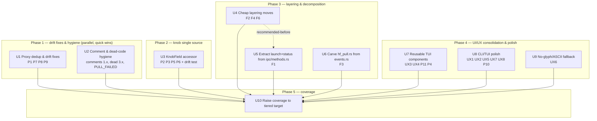

# refactor: Codebase audit — architecture, DRY, quality, comments, UX, coverage

## Overview

A multi-dimension improvement pass over the LlamaStash codebase (~95k LOC, v0.0.5)
driven by a fresh audit across four lenses plus two user-requested workstreams:

1. **Architecture** — fix layering inversions (proxy importing "up" into `cli`/`ipc`)
   and decompose the two genuinely tangled god-files.
2. **DRY** — collapse duplicated projections/formatters and close the two pieces of
   **live drift** the audit found (a proxy `mode_hint` divergence and an
   `/api/ps` umbrella-skip inconsistency).
3. **Code quality** — remove stale `#[allow]`/dead code (including a `PULL_FAILED`
   drift bug), optionally harden a dozen lock unwraps.
4. **Comment optimization** — bring comments in line with the AGENTS.md rules:
   strip rot-prone task/PR/date references, delete narrating comments, trim
   unjustified doc blocks.
5. **UI/UX** — finish the tracked "reusable components" and "more CLI color" items,
   add toggle feedback, and add the tracked no-glyph fallback.
6. **Test coverage** — raise from ~74% toward a tiered target (≈100% on pure-logic
   modules, ~90%+ overall, honest exclusions on terminal-render/IO/`cfg` paths).

The audit's headline finding: the codebase is **healthier than its line counts
suggest**. Most long files are long for legitimate reasons (declarative clap/keymap
tables, pure state machines, large test modules). The real work is concentrated —
two god-files, a handful of misplaced domain types, one un-guarded knob-projection
surface, and comment hygiene. This plan is explicitly **not** a rewrite; nearly every
unit is a mechanical move at an existing function/type boundary, a deletion, or an
additive test.

## Problem Frame

LlamaStash is mature and exceptionally well self-tracked (`TODO.md`), so a generic
audit mostly rediscovers known items. This pass therefore targets **currently
actionable, not-already-tracked** issues plus two new workstreams the user asked for
(coverage + comments). The cost of leaving the top findings:

- **Live drift bugs** already disagree across code paths (the same class as the
  earlier RAM/unified-indicator bug): `/api/show` silently drops the embedding/rerank
  `mode_hint`; `/api/ps` can leak the Lemonade umbrella supervisor.
- The **knob picker** has wildcard `_ => None` / `_ => {}` arms with no exhaustiveness
  test — adding a typed knob and forgetting one arm silently shows `inherited` and
  **drops the user's edit** with no compile error and no test failure.
- **Layering inversions** (`proxy → cli::resolve`, `proxy → ipc::methods`,
  `launch → cli::cli_args`) mean a data-plane change can ripple into presentation
  modules, and the dependency graph misreports the architecture.
- **~470 rot-prone comments** (task/Unit/PR/date tags) directly violate the project's
  own comment rules and several are now factually wrong ("Lands in v2" after v2
  shipped).
- Coverage sits at ~74%; thin spots hide error/edge paths.

## Requirements Trace

- **R1 — Architecture:** remove proxy→cli/ipc and launch→cli layering inversions;
  decompose the two tangled god-files (`tui/events.rs`, `ipc/methods.rs`) at clean
  seams without behavior change.
- **R2 — DRY:** establish single sources of truth for the knob projection, proxy
  `CatalogRow` projection / error envelope / body-cap / catalog index, and TUI
  block/row/center/truncate widgets; fix the `mode_hint` and umbrella-skip drift.
- **R3 — Code quality:** delete stale `#[allow]`/dead code and the `PULL_FAILED`
  drift; optionally harden runtime-poisonable lock unwraps in the wizard/TUI.
- **R4 — Comments:** conform to AGENTS.md comment rules across the tree (no
  task/PR/date IDs, no narration, no unjustified multi-paragraph blocks, every
  `#[allow]` justified).
- **R5 — UI/UX:** unify TUI components (block/row/center/truncate), colorize `--help`,
  align `show` with the shared table look, add feedback to silent toggles, add a
  no-glyph/ASCII fallback.
- **R6 — Coverage:** tiered target — ≈100% on `launch/ config/ gguf/ discovery/`,
  ≈100% on `ipc/ proxy` routing + `init` logic, 90%+ on `daemon/`, 85–95% on TUI/CLI
  logic, best-effort with annotated exclusions on render/IO/`cfg` paths; ~90%+ overall,
  enforced honestly (no gaming).
- **R7 — Docs/TODO sync:** every user-visible change updates the relevant docs in the
  same change; completed `TODO.md` items struck; new follow-ups logged.

## Scope Boundaries

- **Not a rewrite.** No new product behavior beyond the small UX additions in Units 8–9.
- **No crate swaps.** GGUF custom parser, IPC framing → `tokio-util`, `jsonrpc-core`
  are all already investigated and deliberately deferred (`TODO.md`). Out of scope.
- **No new backends / proxy surfaces.** MLX, Ollama-compat Tier 2, OpenAI Responses
  shim, MCP server are tracked elsewhere. Out of scope.
- **Already-tracked perf items stay tracked:** proxy `ArcSwap<Vec<CatalogRow>>` (R-08),
  `spawn_blocking` GGUF read in IPC (R-12). Reference them where a unit is adjacent,
  but they are not owned here.
- **Error-handling is NOT refactored wholesale.** The audit confirmed the ~771
  unwraps are ~98% test code and production unwraps are guarded/invariant. Only the
  ~12 runtime-poisonable lock unwraps are optionally touched (Unit 2).
- **`#[cfg]` per-OS render/IO lines** are not chased to literal 100% (per the chosen
  tiered coverage target); they get annotated exclusions.
- **Proxy `SupervisorSnapshot` view (audit F5)** and **`proxy::auth`→`util` move (F6)**
  are low-blast-radius; F6 is folded into Unit 4, F5 is deferred (see Deferred).

## Context & Research

### Audit findings → unit map

| ID | Finding (short) | Severity | Unit |
|----|-----------------|----------|------|
| P1 | `DiscoveredModel→CatalogRow` projection duplicated; **`mode_hint` drift** (`/api/show` drops it) | High | U1 |
| P7 | Proxy error-response envelope built 3× | Med | U1 |
| P8 | Body-cap (`2 MiB`) logic copied into `ui.rs`; **message already drifted** | Low-Med | U1 |
| P9 | Catalog `path→model` index built 3×; **umbrella-skip inconsistent** (`/api/ps` leak) | Med | U1 |
| Comments 1.1–1.4 | ~441 `(RNN)`/`(Unit N)` + 22 `audit §`/`PR #` + ~6 date-stamps + ~6 stale "lands in v2" | Med | U2 |
| Dead 3.1–3.3 | Stale `#[allow]` (incl. `PULL_FAILED` drift), `token_matches`, benchmark double-suppress | Med | U2 |
| Err 2 (opt) | ~12 runtime-poisonable lock unwraps in wizard/TUI | Low | U2 |
| P2 | Knob picker 13 hand-written match blocks, **no exhaustiveness guard** (silent edit loss) | High | U3 |
| P3 | `params.rs` repeats 19-field knob projection 3× | Med | U3 |
| P5 | Knob `name`/`kind` re-encoded in settings | Low-Med | U3 |
| P6 | `TypedKnobs` overlay/merge layering written 3× | Med | U3 |
| F2 | `cli/resolve.rs` is domain logic → proxy imports from `cli` layer | High | U4 |
| F4 | `launch/mode.rs` imports `cli::cli_args::LaunchMode` (self-defeating) | Med | U4 |
| F6 | `proxy::auth` borrows `daemon::auth` primitives | Low | U4 |
| F1 | `ipc/methods.rs` mixes dispatch with launch-composition + status assembly → proxy→ipc inversion | High | U5 |
| F3 | `tui/events.rs` god-file (5,487 lines) | High | U6 |
| UX3 / P11 | `panel_block` covers 3 of 7 panes; `label:value` row hand-built 4× | Med | U7 |
| UX4 / P4 | 3 centering + 3 truncation helpers; `centered_rect` defined twice | Med | U7 |
| UX1 | `--help` fully monochrome | High | U8 |
| UX2 / P10 | `show` diverges from shared table look; 4th byte formatter | Med | U8 |
| UX5 | Silent toggles (`s` auto-scroll, `r` reasoning-collapse) | Med | U8 |
| UX7 | Header bar collides with hint strip at 80-col | Low | U8 |
| UX8 | Confirm overlay red vs help accent | Low | U8 |
| UX6 | No-glyph/ASCII fallback unimplemented | Med | U9 |
| R6 | Coverage push to tiered target | — | U10 |

### Relevant code and patterns

- **Knob single-source pattern already exists** in `src/launch/params.rs::resolve_layered_inner`
  (spec-driven over `knob_specs()` + `try_inherit_field`) and is drift-tested by
  `apply_knob_handles_every_spec_in_the_alias_table` in `src/launch/tail_args.rs`. The
  fix for U3 is to extend that pattern (a `KnobField`-keyed accessor on `TypedKnobs`)
  to the picker/settings/overlay sites that bypass it.
- **Shared CLI formatting** lives in `src/cli/format.rs` (`table`, `section_header`,
  `kv_block`) and `src/cli/colors.rs` (semantic palette) — `show` (U8) should route
  through these instead of its local `bold()`.
- **TUI shared helpers**: `src/theme/palette.rs::panel_block`, `src/tui/fmt.rs`
  (byte/token formatters), `src/tui/layout.rs::centered_rect`. U7 extends these.
- **Proxy canonical helpers** to consolidate onto: `route::catalog_row_from_discovered`,
  `router::error_response`/`full_body`, `route::buffer_and_extract`.
- **Pure-logic seams already present** for low-risk refactors: `start_model_inner`
  (`ipc/methods.rs:1422`) is a clean function boundary; `cli/resolve.rs` has no clap/
  render deps (only `cli::exit_codes`, the IPC client, `serde_json`).

### Institutional learnings

- `docs/solutions/` is empty; the engineering record lives in `TODO.md`,
  `docs/plans/*`, and `docs/reviews/review-2026-05-24.md`. The prior review's three
  findings (atomic-write fsync, GGUF crate swap, IPC framing swap) are all resolved or
  deliberately deferred — do not reopen them.
- The project has a **documented drift-bug precedent** (RAM/unified indicator computed
  two ways and diverged), which is exactly the failure mode P1/P9 represent today.

### External references

None required. This is consolidation/cleanup of existing, well-understood local code;
no new framework or high-risk domain is introduced. (clap `Styles` API for U8 is the
only external surface and is standard.)

## Key Technical Decisions

- **Sequence drift-fixes and hygiene first (Phase 1).** P1/P9 are live bugs; fixing
  them early de-risks later proxy consolidation and gives quick, independently
  shippable wins.
- **One `KnobField` accessor retires four DRY findings (U3).** A single slot-ref
  accessor over `TypedKnobs` (keyed by `KnobField`, dispatched by `ValueKind`) plus an
  exhaustiveness drift-test replaces ~16 hand-written per-knob sites and closes the
  only silent-data-loss surface. This is the highest DRY payoff and is treated as one
  cohesive unit.
- **Decompose only the two genuinely tangled files.** `tui/events.rs` (U6) and
  `ipc/methods.rs` (U5). Leave `cli_args.rs`, `keybindings.rs`, `list_pane.rs`,
  `app.rs`, `cli/daemon.rs` alone — the audit verified they are large-but-cohesive.
- **`events.rs` split is incremental.** Carve the self-contained HF-pull/download
  subsystem (`tui/hf_pull.rs`) out first (cleanest seam, already its own concept in
  `docs/architecture.md`); the input/actions/tasks three-way split is a follow-up slice
  in the same unit, landed separately if the first slice proves the approach.
- **Comment cleanup keeps the sentence, strips the tag.** Most `(RNN)` tags sit at the
  end of an otherwise-good "why" comment — strip the parenthetical, keep the prose.
  Where the tag *is* the whole comment, reword to describe current behavior. This is a
  text-only, behavior-preserving change gated by `cargo build` + `clippy -D warnings`.
- **Tiered coverage, honestly enforced (U10).** Per the chosen target: pure-logic
  modules to ≈100%; render/IO/`cfg` lines get explicit, commented tarpaulin
  exclusions rather than fake tests. Overall ~90%+. Add characterization tests
  **before** the risky refactors (U3/U5/U6) where coverage is thin, not after.
- **Refactors are behavior-preserving; tests are the contract.** Every move/dedup unit
  must keep the existing suite green and add a regression/characterization test that
  pins the behavior at the seam being moved.

## Open Questions

### Resolved During Planning

- **Coverage target?** → Tiered (user-selected): ≈100% pure-logic, ~90%+ overall,
  annotated exclusions on render/IO/`cfg`. Drives U10 scope.
- **Full `events.rs` four-way split now, or incremental?** → Incremental: `hf_pull.rs`
  first, then input/actions/tasks as a second slice. Avoids one massive risky diff.
- **Touch the 771 unwraps?** → No wholesale refactor; only the ~12 runtime-poisonable
  lock unwraps, and only optionally (U2). The audit proved the rest safe.
- **Proxy `SupervisorSnapshot` read-view (F5)?** → Deferred (small blast radius given
  same-process design); logged under Deferred + `TODO.md`.

### Deferred to Implementation

- **Exact new module/function names** for the `ipc/methods.rs` and `events.rs` splits
  (e.g. `launch::compose_and_spawn`, `daemon::status`, `tui::hf_pull`) — settle when
  the code is in front of you and the borrow/visibility constraints are real.
- **Which `ipc::mod.rs` re-exports are truly dead** vs merely `#[allow]`-suppressed —
  determined by removing the `#[allow]` and reading the resulting warnings (U2).
- **Per-file coverage gap list** — produced by re-running `make test-cov` at the start
  of U10 (the `llvm` engine errored in one environment; the default ptrace engine is
  authoritative).
- **Whether `token_matches` (`launch/flag_aliases.rs`) is wired or deleted** — depends
  on whether the documented dedup caller is wanted near-term (U2).

## High-Level Technical Design

> *This illustrates the intended approach and is directional guidance for review, not
> implementation specification. The implementing agent should treat it as context, not
> code to reproduce.*

**Unit dependency / sequencing graph** (phases are independent of each other except
U10, which lands last):



**The layering fix that several findings share** (proxy currently imports "up"):

```
BEFORE (inverted):                         AFTER (correct direction):
  proxy ──► cli::resolve  (F2)               proxy ──► launch::resolve
  proxy ──► ipc::methods::start_model_inner  proxy ──► launch::compose_and_spawn
  proxy ──► daemon::auth helpers (F6)        proxy ──► util::http_auth
  launch ──► cli::cli_args::LaunchMode (F4)  cli ──► launch::mode::LaunchMode
```

## Implementation Units

### Phase 1 — Drift fixes & hygiene (independent quick wins)

- [x] **Unit 1: Proxy duplication & drift fixes**

**Goal:** Collapse the duplicated proxy projections/helpers onto single sources of
truth and fix the two live drift bugs (`mode_hint`, umbrella-skip).

**Requirements:** R2, R7

**Dependencies:** None

**Files:**
- Modify: `src/proxy/route.rs` (make `catalog_row_from_discovered` `pub(crate)`;
  factor `buffer_body`; reuse shared error/index helpers)
- Modify: `src/proxy/router.rs` (delete `catalog_row_for_resolver`; route
  `ollama_ps` through the shared index + umbrella-skip; use shared error envelope)
- Modify: `src/proxy/forward.rs` (drop `error_envelope`, use shared helper)
- Modify: `src/proxy/ui.rs` (use shared `buffer_body`; use shared index helper)
- Create: `src/proxy/responses.rs` (shared `error_response`/`full_body`/`buffer_body`)
  **or** extend an existing proxy helper module — implementer's call at the seam
- Test: `tests/proxy_ollama_compat.rs`, `tests/proxy_listener_test.rs`, and inline
  `#[cfg(test)]` mods in the touched files

**Approach:**
- **P1 (drift):** Make `route::catalog_row_from_discovered` the one projection; call it
  from `router.rs`. This restores `mode_hint` on the `/api/show` resolution path so
  auto-started embedding/rerank models compose correctly instead of 501-ing.
- **P9 (drift):** One `index_catalog_by_path(&[DiscoveredModel])` + one "ready servable
  supervisors" walker that **consistently skips the Lemonade umbrella**; route the
  three sites (`route::collect_fallback_candidates`, `router::ollama_ps`,
  `ui::collect_running`) through it.
- **P7:** One `error_response(status, code, msg) -> Response<BoxBody>` reused by
  router/forward/route.
- **P8:** One `buffer_body(body, cap) -> Result<Bytes, BodyError>` reused by
  `route::buffer_and_extract` and `ui::forward_ui`; unify the cap message.

**Execution note:** Start by adding a failing test that asserts `/api/show` (or the
resolver path) preserves a non-`None` `mode_hint` for an embedding model, and that
`/api/ps` excludes the umbrella supervisor — these pin the two drift bugs before the
dedup that fixes them.

**Patterns to follow:** the canonical helpers named above; `proxy/route.rs` body-limit
downcast (`LengthLimitError` → 413 vs 400).

**Test scenarios:**
- Happy path: `/api/show` for an embedding-hinted model returns a row whose composed
  mode is embedding (mode_hint preserved), not chat.
- Edge case: `/api/ps` with the Lemonade umbrella supervisor Ready → umbrella row is
  **absent** from output (matches `/api/tags` / fallback behavior).
- Error path: request body over the cap → 413 with the unified message on **both** the
  data path and the `/ui` path (same status + content-type).
- Integration: an auto-started embedding model reachable via the proxy returns
  embeddings (not a 501), proving the projection fix end-to-end against
  `fake_llama_server`.
- Regression: error envelopes from router/forward/route are byte-identical for the
  same `(status, code, message)`.

**Verification:** All three proxy projections/error sites resolve to one helper each;
`grep` shows no second `CatalogRow`-from-`DiscoveredModel` builder; the two drift tests
pass; existing proxy integration suite stays green.

---

- [x] **Unit 2: Comment & dead-code hygiene to AGENTS.md rules**

**Goal:** Bring comments into line with the project's comment rules and remove stale
`#[allow]`/dead code, including the `PULL_FAILED` drift.

**Requirements:** R3, R4, R7

**Dependencies:** None

**Files:**
- Modify (comment cleanup, hottest first): `src/ipc/methods.rs`, `src/backend/mod.rs`,
  `src/proxy/route.rs`, `src/init/recommender.rs`, `src/init/wizard.rs`,
  `src/init/doctor.rs`, `src/launch/params.rs`, `src/tui/app.rs`, `src/tui/render.rs`,
  `src/tui/events.rs`, `src/tui/keybindings.rs`, `src/gpu/mod.rs`,
  `src/init/snapshot.rs`, `src/init/hf_api.rs`, `src/init/benchmark.rs` (+ the long tail
  of ~110 files with `(RNN)`/`(Unit N)` tags)
- Modify (stale `#[allow]`/dead code): `src/cli/exit_codes.rs` (drop
  `#[allow(dead_code)]` + "Lands in v2" on `PULL_FAILED`), `src/theme/mod.rs`,
  `src/ipc/mod.rs`, `src/config/mod.rs`, `src/daemon/mod.rs`,
  `src/launch/flag_aliases.rs` (`token_matches`), `src/init/benchmark.rs`
- Modify (optional unwrap hardening): `src/init/wizard.rs`, `src/tui/events.rs`
  (progress/spinner lock cells)

**Approach:**
- **Comments 1.1:** strip `(RNN)`/`(Unit N)`/`Phase 1`/`R42` tokens, keep the prose;
  reword tag-only comments to describe current behavior. ~441 sites, batch by hottest
  file.
- **Comments 1.2/1.3:** remove `audit §…`/`Issue #…`/`PR #…`/`finding #…` and bare
  date-stamp prefixes (~28 sites). Keep legitimate `//! Plan: docs/plans/…` module-doc
  links and the date-arithmetic comment in `cli/uat/mod.rs` that verifies a constant.
- **Comments 1.4 + Dead 3.1:** delete stale "until consumers land" / "Reserved… Lands
  in v2" comments together with their now-unnecessary `#[allow(unused_imports)]` /
  `#[allow(dead_code)]`. `PULL_FAILED` is **used** in `src/init/download.rs` — its allow
  and doc are both wrong. After removing each allow, let `cargo build` reveal whether a
  re-export is genuinely dead → delete it.
- **Dead 3.2/3.3:** wire or delete `token_matches`; simplify the benchmark
  double-suppression to one mechanism.
- **Err 2 (optional):** swap the ~12 runtime-poisonable `.lock().unwrap()` in the
  wizard/TUI for `unwrap_or_else(|e| e.into_inner())` so a poisoned progress/spinner
  cell degrades instead of panicking.

**Execution note:** Comment-only edits are behavior-preserving — the gate is a clean
`cargo build` + `cargo clippy --all-targets --features test-fixtures -- -D warnings`,
not new tests. The dead-code removals are validated by the compiler.

**Patterns to follow:** the 25 existing `#[allow]` sites that **do** carry one-line
justifications (e.g. `init/wizard.rs:1332`, `proxy/route.rs:84`) — that is the bar.

**Test scenarios:**
- Edge case: removing the `PULL_FAILED` `#[allow]` and rebuilding produces **no**
  dead-code warning (proves it is genuinely used).
- Error path (only if unwrap hardening is done): a poisoned progress-cell mutex does
  not panic the wizard — a targeted unit test poisons the lock and asserts graceful
  read. (`Test expectation: none` for the pure comment-stripping portion — text-only,
  behavior unchanged; build + clippy is the gate.)

**Verification:** `grep -rnE '\((R[0-9]+|Unit [0-9]+)\)|audit §|PR #|Issue #|finding #'
src --include='*.rs'` returns effectively nothing (modulo intentional doc-links);
`grep -rn '#\[allow(' src` shows every remaining allow carries a justification;
`cargo build` + `clippy -D warnings` clean; full suite green.

---

### Phase 2 — Knob subsystem single source of truth

- [x] **Unit 3: `KnobField` accessor over `TypedKnobs`**

**Goal:** Replace the ~16 hand-written per-knob match blocks across picker / params /
settings / overlay with one `KnobField`-keyed accessor, and add an exhaustiveness drift
test so a new typed knob can never silently lose the user's edit.

**Requirements:** R2, R3, R7

**Dependencies:** None (but high-value to land before U10 so the new accessor is the
thing tested)

**Files:**
- Modify: `src/config/loader.rs` (add the `KnobField`-keyed slot-ref accessor next to
  `TypedKnobs`; route `TypedKnobs::overlay` through it — P6)
- Modify: `src/launch/defaults_table.rs` (route `merge` through the shared layering — P6)
- Modify: `src/launch/params.rs` (collapse `field_is_auto` / `set_field_auto` /
  `try_inherit_field` onto the accessor — P3)
- Modify: `src/tui/launch_picker.rs` (replace `user_has` / `user_value_*` /
  `resolved_*` / `set_user_*` 13 match blocks — P2)
- Modify: `src/tui/tabs/settings.rs` (drive `knob_label` off `field_name()` /
  `spec.kind` instead of re-encoded strings — P5)
- Test: inline `#[cfg(test)]` in `config/loader.rs` + `src/launch/tail_args.rs`
  (extend the existing `apply_knob_handles_every_spec…` drift-test family)

**Approach:**
- Add one accessor over `TypedKnobs` keyed by `KnobField`, returning a typed slot
  reference dispatched by `ValueKind` (the shape already implied by `knob_specs()`).
- Migrate the picker's reader/resolved/writer quartets, `params.rs`'s three auto/inherit
  matches, and settings' name/kind re-encodings onto it.
- Route `overlay` (loader) and `merge` (defaults_table) through the same spec-driven
  `or()`-layering the resolver already uses — eliminating the `String`-vs-`Copy`
  hazard in `overlay`.
- Add `KnobField::field_name()` returning the snake_case serde key, asserted against the
  actual serde rename in a test so labels can't drift from persisted JSON keys.

**Execution note:** Characterize first — add a test that round-trips every knob through
read→edit→resolve and asserts the picker preserves user edits for **all** `KnobField`
variants, then refactor. This is the regression net for the silent-edit-loss class.

**Patterns to follow:** `params.rs::resolve_layered_inner` (spec-driven) and the
`apply_knob_handles_every_spec_in_the_alias_table` drift test in `tail_args.rs`.

**Test scenarios:**
- Happy path: setting then reading each typed knob via the picker returns the set value
  for every `KnobField` variant (parametrized over all variants).
- Edge case: a knob left unset resolves to `inherited`/`Auto` and is **not** clobbered
  by the accessor.
- Edge case: `overlay`/`merge` layering produces identical results to the pre-refactor
  struct-literal version for a representative `(over, under)` pair, including a `String`
  knob (guards the P6 hazard).
- Integration (drift guard): a compile-time/`#[test]` exhaustiveness check fails if a
  new `KnobField` variant is added without an accessor arm (the protection the wildcard
  arms currently defeat).
- Regression: `field_name()` for every variant equals the serde key serialized for that
  field.

**Verification:** `grep` shows no remaining per-knob `_ => None`/`_ => {}` wildcard
projection in `launch_picker.rs`; adding a throwaway `KnobField` variant fails to
compile or fails the drift test; settings render + persisted JSON keys agree; full suite
green.

---

### Phase 3 — Layering & decomposition

- [x] **Unit 4: Cheap layering moves (resolve, mode, auth)**

**Goal:** Remove the three low-effort layering inversions so the proxy/launch layers
stop depending "up" on `cli`/`daemon` internals.

**Requirements:** R1, R7

**Dependencies:** None (recommended before U5)

**Files:**
- Move: `src/cli/resolve.rs` → a neutral home (`src/launch/resolve.rs` or new
  `src/resolve/`); re-export from `cli` for existing call sites; decouple from
  `cli::exit_codes` (return a domain error the CLI maps to an exit code at its boundary)
  — **F2**
- Modify: `src/proxy/route.rs`, `src/proxy/router.rs`, `src/proxy/launch.rs` (import
  the resolver/`CatalogRow` from the new home)
- Modify: `src/launch/mode.rs` + `src/cli/cli_args.rs` (define `LaunchMode` once in
  `launch`, make the clap value-enum convert **into** it; flip the dependency direction)
  — **F4**
- Move: `constant_time_eq` + `extract_bearer` from `src/daemon/auth.rs` →
  `src/util/` (e.g. `util::http_auth`); update `src/proxy/auth.rs` + `src/daemon/auth.rs`
  — **F6**
- Test: inline `#[cfg(test)]` mods that move with the code; `tests/` resolver coverage

**Approach:** Pure file/type moves at existing boundaries. `resolve.rs` is already
clap/render-free, so only the `exit_codes` coupling needs breaking (CLI maps the domain
error to its exit code). `CatalogRow` moves with the resolver.

**Patterns to follow:** the existing `cli` → `daemon` daemon-spawn imports are the
*legitimate* direction (CLI must fork the daemon); model these moves to make `proxy`/
`launch` similarly only depend downward.

**Test scenarios:**
- Happy path: model-reference resolution (exact, fuzzy, ambiguous, not-found) returns
  the same results from the new module location for all existing CLI cases.
- Edge case: ambiguous reference still yields the multi-match domain error; the CLI maps
  it to exit code 66 (`MODEL_NOT_FOUND`) exactly as before.
- Edge case: `LaunchMode` round-trips clap-parse → `launch::mode::LaunchMode` for
  chat/embedding/rerank.
- Integration: proxy resolution path (`/v1/...` model routing) behaves identically with
  the relocated resolver; bearer/x-api-key auth still accepted via the moved helpers.
- Security (F6): the relocated `constant_time_eq` keeps its non-short-circuiting compare
  (assert equal-length-different-bytes and unequal-length inputs both return false
  without early exit); a wrong key is rejected on both the proxy and control-plane auth
  paths after the move.

**Verification:** dependency check — `grep -rn 'crate::cli::' src/proxy src/launch`
shows no proxy→cli or launch→cli edges remain for these symbols; CLI exit codes
unchanged; full suite green.

---

- [x] **Unit 5: Extract launch-composition & status assembly from `ipc/methods.rs`**

**Goal:** Move the launch pipeline (`start_model_inner` → `compose_and_spawn`, plus
`StartParams`/`StartedLaunch`/`LaunchModeWire`) and the status-document assembly out of
`ipc/methods.rs`, so it becomes a thin dispatch + parse/serialize layer and the proxy→ipc
inversion disappears.

**Requirements:** R1, R7

**Dependencies:** U4 (recommended — cleaner once `resolve`/`mode` already moved)

**As built:** `MethodContext` is daemon-state, not an IPC concept, so it relocated to
`src/daemon/context.rs` (with `PersistedState` / `LaunchEnv`) — this is what makes every
edge point downward (`ipc`/`proxy` → `daemon`). The launch pipeline then lands in the
daemon layer too.

**Files:**
- Create: `src/daemon/context.rs` — `MethodContext`, `PersistedState`, `LaunchEnv`
  (moved out of `ipc/methods.rs`)
- Create: `src/daemon/launch_service.rs` — `compose_and_spawn(ctx, params, origin) ->
  StartedLaunch`; `StartParams`/`StartedLaunch`/`LaunchModeWire` + the launch-exclusive
  helpers (`start_delegated_lemonade`, admission/recorder spawners, port collection, …)
- Create: `src/ipc/status.rs` — `status_response` + `backends_status` document assembly
- Modify: `src/ipc/methods.rs` (thin `start_model_handler` calls
  `daemon::launch_service::compose_and_spawn`; `status` calls `ipc::status::status_response`;
  `resolve_model_id` / `resolve_model_id_and_arch` stay `pub(crate)` for the launch service)
- Modify: `src/proxy/launch.rs`, `src/proxy/state.rs`, `src/proxy/server.rs`,
  `src/daemon/control_plane.rs`, `src/daemon/mod.rs`, `benches/proxy_overhead.rs`,
  and the proxy/lemonade integration tests (re-path to `daemon::context::*` /
  `daemon::launch_service::*`)
- Test: `tests/supervisor_ipc_test.rs`, the proxy integration suite, inline
  `#[cfg(test)]` (status + launch tests moved with their code)

**Approach:** Move at the existing `start_model_inner` function boundary (already clean,
already referenced by path in tests). Status assembly is a self-contained
document-builder pair. Neither changes wire shape — the `status` JSON and `start_model`
result stay byte-stable.

**Execution note:** Characterize the IPC contract first — assert the `status` JSON shape
and a representative `start_model` success/refusal **before** moving the code, so the
move is provably behavior-preserving (the `status` shape is an agent-facing contract per
AGENTS.md).

**Patterns to follow:** `src/launch/` module conventions; the admission/supervisor
call sites `start_model_inner` already orchestrates.

**Test scenarios:**
- Happy path: `start_model` via IPC composes argv, passes admission, spawns, registers,
  and records last-params — identical observable result to pre-move.
- Edge case: admission refusal (oversized/concurrent) returns the same error envelope
  and exit-mapped behavior.
- Edge case: `status` JSON includes all documented top-level objects (`host`, `proxy`,
  `daemon.build`/`server_path`, per-model `latest_rss_bytes`) with unchanged field
  names — golden/shape assertion.
- Integration: proxy auto-start path drives `launch::compose_and_spawn` and reaches
  Ready against `fake_llama_server` (proves the proxy→launch rewire).

**Verification:** `grep -rn 'ipc::methods::start_model_inner' src tests` and
`grep -rn 'ipc::methods::MethodContext' src tests` both return nothing (everything
references `daemon::launch_service::compose_and_spawn` / `daemon::context::MethodContext`);
`ipc/methods.rs` dropped from ~3283 to ~1142 lines and holds dispatch + the stop/preset/
favorite handlers, not the launch body or status assembly; the
`status_top_level_key_set_is_stable` golden and full suite stay green.

---

- [x] **Unit 6: Carve `hf_pull.rs` out of `tui/events.rs`**

**Goal:** Extract the self-contained HF-pull / download subsystem (~24 functions + the
`StripProgress` `DownloadProgress` impl) from the 5,487-line `events.rs` into
`src/tui/hf_pull.rs`, reducing the god-file's blast radius. Optionally follow with the
input/actions/tasks split.

**Requirements:** R1, R7

**Dependencies:** None

**Files:**
- Create: `src/tui/hf_pull.rs` (HF dialog input/debounce/enqueue, download-strip glue,
  `StripProgress`/`StripProgressInner` impl, `spawn_hf_search`/`spawn_hf_list_repo_files`/
  `spawn_download_task`)
- Modify: `src/tui/events.rs` (remove the moved subsystem; keep input/dispatch/tasks)
- Modify: `src/tui/mod.rs` (module wiring)
- (Optional second slice) Create: `src/tui/input.rs`, `src/tui/actions.rs`,
  `src/tui/tasks.rs`
- Test: `tests/tui_chat_smoke_test.rs`, the TUI pty drivers under `scripts/tui/`, inline
  `#[cfg(test)]`

**Approach:** The HF-pull logic is already conceptually its own module group in
`docs/architecture.md` (`tui::hf_dialog`, `tui::download_strip`) — only the *logic*
stayed behind in `events.rs`. Move it verbatim, fix visibility, no behavior change.

**Execution note:** This is the largest-effort unit; do the `hf_pull.rs` slice alone
first and confirm green before attempting the input/actions/tasks three-way split.

**Patterns to follow:** the already-extracted `tui/hf_dialog.rs` / `tui/download_strip.rs`
state modules — the new `hf_pull.rs` is their behavior half.

**Test scenarios:**
- Happy path: the HF pull dialog flow (open → search → select repo → list files →
  enqueue → download progress) drives identically via the pty harness
  (`scripts/tui/harness.py`) after the move.
- Edge case: download throughput EMA / queue-depth rendering unchanged on the strip.
- Edge case: cached-pull probe short-circuits without re-download.
- Integration: a key handler unrelated to HF (e.g. launch on Enter) still works,
  proving the input loop wasn't broken by the extraction.

**Verification:** `events.rs` no longer contains `StripProgress`/`spawn_download_task`/
HF-dialog handlers; `cargo run -- --render` and the pty harness program pass; existing
TUI smoke tests green.

---

### Phase 4 — UI/UX consolidation & polish

- [x] **Unit 7: Reusable TUI components (block, row, center, truncate)**

**Goal:** Finish the tracked "make custom UI components reusable and consistent" item:
one block builder, one `label:value` row, one centering helper, one truncation helper —
replacing 5 hand-rolled block constructions, 4 row builders, 3 centering helpers, and 3
truncation helpers (incl. the byte-identical `centered_rect` fork).

**Requirements:** R5, R2, R7

**Dependencies:** None (touches the same overlays as nothing else here; independent)

**Files:**
- Modify: `src/theme/palette.rs` (extend `panel_block` with optional `Padding` + a focus
  flag driving border **and** title style) — UX3
- Modify: `src/tui/fmt.rs` (add `kv_row`/`kv_spans` — P11; `centered_rect` — UX4/P4;
  `truncate_end`/`truncate_middle` — UX4) or `src/tui/layout.rs` for the rect helper
- Modify call sites: `src/tui/list_pane.rs`, `src/tui/right_pane.rs`,
  `src/tui/info_pane.rs`, `src/tui/host_stats_pane.rs`, `src/tui/help_overlay.rs`,
  `src/tui/confirm_overlay.rs`, `src/tui/logo_pane.rs`, `src/tui/render.rs`,
  `src/tui/hf_dialog.rs`, `src/tui/tabs/settings.rs`
- Delete: the duplicate `centered_rect` in `src/tui/hf_dialog.rs` and the local
  `centred` helpers in `confirm_overlay.rs` / `help_overlay.rs`
- Test: golden render snapshots (`cargo run -- --render` / `make render`), inline tests

**Approach:** Promote `settings.rs::kv` to `tui/fmt`; extend `panel_block` to absorb the
right-pane padding case and the focus-muted-title case; consolidate the three centering
algorithms (with their differing margin reservations) into one and pick a single
ellipsis convention (`…` vs `…/`). Migrate call sites; delete the forks.

**Patterns to follow:** existing `panel_block` callers (`host_stats_pane`, `info_pane`,
`hf_dialog`); `settings.rs::kv`; `tui/layout::centered_rect`.

**Test scenarios:**
- Happy path: every pane renders through the shared `panel_block` with one consistent
  padding policy — golden snapshots at 80×24 / 120×40 / 160×45 updated and stable.
- Edge case: focused vs unfocused pane title style is correct everywhere (muted when the
  other pane owns focus) via the shared focus flag.
- Edge case: middle-truncation of a long path and end-truncation of a long label both
  use the single shared helper and one ellipsis glyph.
- Edge case: all three overlays (help/confirm/hf) center by the same rule at small and
  large sizes (no off-by-margin drift).
- Regression: no second `centered_rect`/`centred` definition remains (`grep`).

**Verification:** `grep` shows one block builder, one `kv` row, one center helper, one
truncate helper; golden renders pass; the "reusable components" `TODO.md` item is struck.

---

- [x] **Unit 8: CLI & TUI polish**

**Goal:** Close the smaller UX gaps: colorized `--help`, `show` aligned with the shared
table look, feedback on silent toggles, header/hint collision at the 80-col floor, and
confirm-overlay severity coloring.

**Requirements:** R5, R2, R7

**Dependencies:** U7 (recommended — `show` and toggles benefit from the shared helpers,
but not strictly blocking)

**Files:**
- Modify: `src/cli/cli_args.rs` / `src/cli/mod.rs` (add `clap::builder::Styles` on the
  root `#[command(styles = …)]`; honor `ColorChoice::Auto` for `NO_COLOR`/non-TTY and
  flip to `Never` under `--no-colors`) — UX1
- Modify: `src/cli/show.rs` (route section titles through `format::section_header`,
  labels through the shared label-style helper; drop the local `bold()`; reuse a shared
  multi-unit byte formatter instead of the 4th `format_bytes` — UX2/P10)
- Modify: `src/init/detection.rs` or `src/util/` (host the shared spelled-out multi-unit
  byte formatter — P10)
- Modify: `src/tui/events.rs` (toast on `ToggleAutoScroll` / `ToggleThinkCollapse`) — UX5
- Modify: `src/tui/render.rs` (`render_title_left` priority-drop of brand segments +
  1-cell gap before the hint slot) — UX7
- Modify: `src/tui/confirm_overlay.rs` (drive border/title tone off a confirm severity:
  red only for destructive stop/kill/delete, accent/warning for neutral confirms) — UX8
- Test: `src/cli/show.rs` inline tests, golden renders, TUI toast assertions via pty
  harness, `cargo run -- --help` snapshot if one exists

**Approach:** All additive/cosmetic and independently revertible. clap's `Styles`
inherits to subcommands and already respects `NO_COLOR`/non-TTY — wire `--no-colors` to
`ColorChoice::Never`. Toggle toasts reuse the existing success-toast path. Confirm
severity is a field on the confirm payload, not a hardcoded `error_style`.

**Patterns to follow:** `src/cli/format.rs` (`section_header`, `kv_block`, `table`),
`src/cli/colors.rs` semantic palette; the existing "copied X via {backend}" toast path.

**Test scenarios:**
- Happy path: `--help` renders styled section headers/flags when stdout is a TTY and
  `NO_COLOR` unset; identical plain bytes when piped, `NO_COLOR` set, or `--no-colors`.
- Happy path: `show` section headers carry the dim count suffix and labels use the
  shared label style (matches `status`/`presets`).
- Edge case: `show` byte sizes (on-disk total, shards) format identically to the shared
  formatter's thresholds.
- Happy path: pressing `s`/`r` emits a toast stating the new state (`auto-scroll on/off`,
  `reasoning shown/collapsed`).
- Edge case: at 80×24 the brand text drops trailing segments in priority order
  (theme → daemon → version) with a 1-cell gap, never mid-word truncation against the
  hint strip — golden render.
- Edge case: a non-destructive confirm uses the accent/warning tone; stop/kill/delete
  uses red.

**Verification:** `--help` is colored under a TTY and byte-stable when piped; `show`
visually matches the other tables; toggles toast; 80-col header render is clean; the
"more CLI color / --help color" `TODO.md` item is struck.

---

- [ ] **Unit 9: No-glyph / ASCII fallback**

**Goal:** Add the tracked no-glyph fallback so terminals/fonts without the project's
Unicode set (legacy conhost, minimal SSH fonts, some CI ptys) still render status,
severity, spinners, and borders legibly.

**Requirements:** R5, R7

**Dependencies:** U7 (recommended — a shared glyph indirection composes with the shared
components, but not blocking)

**Files:**
- Create: `src/tui/glyphs.rs` (Unicode set + ASCII set; selected once at startup via
  `LLAMASTASH_ASCII=1` env / config flag)
- Modify: `src/tui/status_icons.rs` (route `glyph_for` through the set)
- Modify: severity/spinner/ellipsis literal sites (`△`/`▲`, `◌`/`◐`/`●`, `…`) across the
  panes; box-border style selection
- Modify: `config.example.yaml` + `src/config/loader.rs` (new flag) and `docs/usage.md`
  (document the flag)
- Test: inline tests asserting both glyph sets resolve; golden render in ASCII mode

**Approach:** Explicit opt-in (`LLAMASTASH_ASCII=1` / config) — auto-detection of glyph
support is unreliable; a documented override is the pragmatic v1. Single `glyphs` module
is the indirection point; severity must stay double-encoded (shape + color) in both sets
so the ASCII set keeps a distinct severity marker (`!`/`*`).

**Patterns to follow:** `src/tui/status_icons.rs::glyph_for`; the existing
theme/keymap "single source of truth" indirection style.

**Test scenarios:**
- Happy path: with `LLAMASTASH_ASCII=1`, status column, severity markers, spinner, and
  ellipsis render from the ASCII set — golden render.
- Edge case: severity remains distinguishable in ASCII mode (warning vs critical use
  different markers, not just color).
- Edge case: default (flag unset) renders the existing Unicode set unchanged — existing
  goldens still pass.
- Edge case: config-file flag and env flag agree; env wins per the project's env-truthy
  convention.

**Verification:** an ASCII-mode render contains no non-ASCII glyphs; default renders
unchanged; the "No glyphs fallback" `TODO.md` item is struck; `docs/usage.md` documents
the flag.

---

### Phase 5 — Test coverage

- [ ] **Unit 10: Raise coverage to the tiered target**

**Goal:** Move overall line coverage from ~74% to ~90%+, with ≈100% on pure-logic
modules, adding tests for reachable error/edge paths and annotating the genuinely
unreachable render/IO/`cfg` lines instead of gaming them.

**Requirements:** R6, R7

**Dependencies:** U1–U9 (land tests against the consolidated/relocated code, not code
about to move; characterization tests for U3/U5/U6 are written *inside* those units up
front)

**Files:**
- Create/modify: inline `#[cfg(test)]` mods and `tests/*.rs` across the per-file gap
  list produced by `make test-cov`, prioritized by the tiered floors:
  - ≈100%: `src/launch/`, `src/config/`, `src/gguf/`, `src/discovery/`
  - ≈100%: `src/ipc/`, `src/proxy/route.rs` + `src/proxy/router.rs`, `src/init/` logic
    (recommender/doctor/download/wizard non-interactive paths)
  - 90%+: `src/daemon/` (supervisor, orphans, host_metrics)
  - 85–95%: `src/tui/*` logic (non-render), `src/cli/output.rs` + `src/cli/show.rs`
- Modify: annotate unreachable lines with documented tarpaulin exclusions
  (`#[cfg(not(tarpaulin_include))]` or config-level excludes) — render/raw-mode IO/
  per-OS `#[cfg]` arms
- Modify: `Makefile` / CI (optionally add a coverage floor gate; keep `make test-cov`
  authoritative)
- Modify: `docs/` (record the coverage policy + the honest exclusion list)

**Approach:** Re-run `make test-cov` (default ptrace engine — authoritative) to get the
current per-file breakdown, then close gaps in tiered order. Prefer testing the
pure-logic seams the earlier units created (the `KnobField` accessor, the relocated
resolver, the extracted launch/status assembly, the proxy helpers). For render/IO,
extend the existing pty harness (`scripts/tui/harness.py`) and `--render` goldens rather
than mocking the terminal backend; annotate what remains truly unreachable in CI.

**Execution note:** Coverage is the contract for the refactors — keep the suite green at
every step; do not let a coverage push paper over a behavior change introduced earlier.

**Patterns to follow:** existing inline `#[cfg(test)]` convention (159 modules) and the
`tests/` daemon-spawning integration style (per-test temp dirs, nextest `daemon-bound`
group); the `apply_knob_handles_every_spec…` drift-test style for exhaustiveness.

**Test scenarios:**
- Happy path: each pure-logic module reaches its floor — verified by `make test-cov`
  per-file numbers, not by feel.
- Error path: previously-uncovered error branches (admission refusal variants, parse
  failures, IPC error envelopes, resolver ambiguity, download failures) get explicit
  tests.
- Edge case: boundary inputs for `gguf` parsing (hostile/empty/oversized headers),
  `discovery` (split GGUF, symlink dedupe), `launch` (knob layering precedence).
- Integration: daemon lifecycle paths (orphan adoption three-factor confirmation,
  shutdown drain) covered via the existing integration harness.
- Annotation audit: every excluded line carries a one-line reason (why it is
  CI-unreachable), reviewable by `grep`.

**Verification:** `make test-cov` reports overall ~90%+ and each module at/above its
tiered floor; excluded lines are documented; CI green (and, if added, the coverage-floor
gate passes).

## System-Wide Impact

- **Interaction graph:** U5 rewires the proxy auto-start path through
  `launch::compose_and_spawn` and the IPC `start_model` handler through the same
  service — both must produce identical supervisor/admission/registry effects. U1's
  projection fix changes what `/api/show` and `/api/ps` emit. U3 touches every surface
  that reads/writes a typed knob (picker, settings, resolver, persisted state).
- **Error propagation:** U4 moves exit-code mapping from the resolver to the CLI
  boundary — the proxy/IPC callers must receive a domain error, and the CLI must still
  map ambiguous/not-found to exit 66. U1 unifies the proxy error envelope and body-cap
  status codes (413/400) across data + `/ui` paths.
- **State lifecycle risks:** U3's accessor governs whether a user's knob edit persists —
  the exhaustiveness test is the guard against silent-edit-loss. U6 moves the download
  progress/queue state handling — must not change cancel/cleanup semantics.
- **API surface parity:** `status --json`, `start_model`, `list`/`show`/`favorites`/
  `presets` JSON shapes and the proxy OpenAI/Anthropic/Ollama-compat surfaces are
  agent-facing contracts (AGENTS.md) and must stay **byte-stable** through U1/U5 — pin
  with golden/shape tests before moving code.
- **Integration coverage:** the proxy auto-start→Ready path, daemon orphan adoption, and
  the HF-pull TUI flow are the cross-layer behaviors that unit tests alone won't prove —
  exercised via `fake_llama_server`, the integration suite, and the pty harness.
- **Unchanged invariants:** loopback-only/same-UID security contract, the JSON-RPC wire
  format, lifecycle states, exit-code table, and all documented `status`/CLI JSON fields
  are explicitly **not** changed by this plan — every unit is behavior-preserving except
  the additive UX in U8/U9.

## Risks & Dependencies

| Risk | Mitigation |
|------|------------|
| A "behavior-preserving" move silently changes an agent-facing JSON/wire shape (U1/U5) | Characterize the shape with golden/shape tests **before** moving (execution notes on U1/U5); AGENTS.md flags these as contracts |
| U3 accessor refactor reintroduces the exact silent-edit-loss bug it fixes | Land the all-variants round-trip + exhaustiveness drift test first (characterization-first execution note) |
| `events.rs` extraction (U6) breaks the input loop or download cancel path | Incremental: `hf_pull.rs` slice alone first, gated by the pty harness + TUI smoke tests before any further split |
| Comment cleanup (U2) accidentally deletes a load-bearing constraint comment | Strip tags, keep prose; only delete comments that pure-narrate; reviewer scans the diff; build+clippy gate |
| Coverage push (U10) games numbers with shallow tests | Tiered floors per module + honest annotated exclusions; assert behavior (error/edge branches), not line-hits; reviewer checks exclusion reasons |
| Layering moves (U4/U5) cause churn in many call sites | Re-export from old locations during transition where it reduces diff; moves are at clean existing boundaries |
| clap `Styles` (U8) leaks color into piped/`NO_COLOR` output | Use `ColorChoice::Auto` (clap already gates) and wire `--no-colors`→`Never`; byte-stable piped-output test |

## Documentation / Operational Notes

Per the AGENTS.md docs-sync rule, land doc updates in the **same change** as each unit:

- **U1/U5:** if any proxy/`status` surface wording changes, update `docs/architecture.md`
  and `docs/usage.md`; the two drift fixes (mode_hint, umbrella-skip) warrant a
  `CHANGELOG.md [Unreleased]` one-liner.
- **U2:** no user-facing docs; ensure no struck comment referenced a doc that then goes
  stale.
- **U3:** if a knob's persisted key/label changes, update `config.example.yaml` +
  `docs/usage.md` (knob/Settings section).
- **U7/U8/U9:** update `docs/usage.md` (keybindings/toasts, `--help`/color policy, the
  new `LLAMASTASH_ASCII` flag), `config.example.yaml` (ASCII flag), and strike the
  matching `TODO.md` items ("reusable components", "more CLI color/--help", "No glyphs
  fallback"). `CHANGELOG.md` one-liners for the user-visible UX additions.
- **U10:** record the coverage policy + exclusion list in `docs/` (a short
  testing/coverage note); update `Makefile`/CI if a floor gate is added.
- **TODO.md:** strike completed items; log the deferred follow-ups below as new entries
  with links back to this plan.

## Sources & References

- Audit basis: four parallel agent passes (architecture, DRY, code/comment quality,
  TUI/UX) run 2026-06-20 against the working tree, plus `make test-cov` baseline
  (~74%, last recorded 73.97% = 11149/15072 lines).
- Prior review: `docs/reviews/review-2026-05-24.md` (its findings resolved/deferred —
  not reopened here).
- Project contract: repo-root `CLAUDE.md`/`AGENTS.md` (comment rules, docs-sync,
  scope boundaries, agent-facing JSON contracts), `docs/architecture.md`, `TODO.md`.
- Deferred (logged, not owned here): audit **F5** proxy `SupervisorSnapshot` read-view
  (Med/Med, small blast radius); existing tracked perf items **R-08**
  (`ArcSwap<Vec<CatalogRow>>`) and **R-12** (`spawn_blocking` GGUF read in IPC); the
  `events.rs` input/actions/tasks three-way split (second slice of U6, optional).
