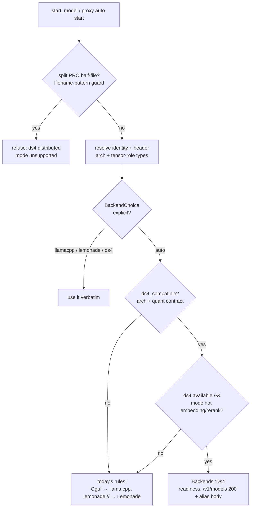

# feat: ds4 (DwarfStar) direct backend for DeepSeek V4 GGUFs

## Overview

Add [ds4](https://github.com/antirez/ds4) (antirez's DwarfStar) as a third
backend: a **direct, process-per-model** peer next to llama.cpp and Lemonade.
ds4-server is a self-contained OpenAI/Anthropic-compatible HTTP server that
runs exclusively the DeepSeek V4 Flash/PRO GGUFs published at
`huggingface.co/antirez/deepseek-v4-gguf`. Those files are standard-format
`deepseek4` GGUFs whose quant recipe matches ds4's deliberately narrow
kernel set; **upstream llama.cpp master also runs deepseek4 GGUFs**
(verified against its source — arch, full tensor vocabulary, graph), so ds4
is the *preferred, purpose-built* engine, not the only one. Routing
therefore keys on a header-level **ds4-compatibility predicate** (arch +
per-tensor-role quant contract, read from ds4's loader source), with
llama.cpp as the normal fallback — never a refusal.

The work lands in two strata:

1. **Pull the native-knob channel out of open PR #46** (the safetensors
   substrate PR) and land it here first — this PR merges **before** #46, so
   the channel is extracted onto this branch byte-identical where possible
   and #46 rebases on top (its knob commits collapse to no-ops). ds4 becomes
   the channel's first real consumer, retiring its "no consumer yet" caveat.
   The rest of #46 (safetensors discovery, pull guard, `quant_label`) stays
   in #46 — ds4 models are plain GGUFs the existing scan and
   `pull owner/repo:file.gguf` already handle.
2. **The ds4 backend itself**: trait impl, compat-predicate routing with
   llama.cpp fallback, binary resolution, lifecycle correctness (adoption,
   proxy, `/ui`), surfaces, docs.

Per the request, ds4 is assumed **DeepSeek-only**: routing is a single
compatibility predicate (deepseek4 arch + ds4's quant contract), not
generic multi-arch registry machinery.

## Problem Frame

DeepSeek V4 Flash/PRO are the strongest local coding/agent models in the
80–300 GB class, and ds4 is the purpose-built engine for them — disk KV
cache, SSD streaming, DSML tool calling, and MTP speculative decoding that
generic runners don't have (llama.cpp master runs the same GGUFs, but as a
generic runner). llamastash users who want the tuned path today must
hand-manage `ds4-server` outside the launcher — no discovery, no
supervision, no proxy attachment, no presets.
The multi-backend abstraction (see origin doc) was built exactly so that "any
supervised, OpenAI-compatible subprocess becomes a peer with a new impl +
registry entry"; ds4 is the first *direct* (process-per-model) peer after
llama.cpp itself, and the first backend with tunables that have no llama.cpp
IR slot — the gap the origin doc flagged and PR #46's native-knob channel
fills.

Verified facts this plan builds on (read from `ds4_server.c`, `ds4.c`, the
GGUF headers themselves, upstream llama.cpp source, and the HF API,
2026-07-10):

- **llama.cpp master implements `deepseek4`**: `LLM_ARCH_DEEPSEEK4` with the
  complete DS4 tensor vocabulary (`attn_compressor_*`, `indexer.*`, `hc_*` /
  `output_hc_*`, `attn_sinks`, `blk.*.ffn_gate_tid2eid`) and real graph
  branches in `llama-model.cpp`. Third-party attestation
  (ssweens/DeepSeek-V4-Flash-GGUF-YMMV): a V4-capable llama.cpp loads
  antirez's files. antirez's own card: "they should" work elsewhere —
  except the MTP sidecar, which "requires a specific loader" (ds4-only).
- **No ds4 metadata marker exists.** A parsed header of the published q2
  file shows only standard keys (`general.*`, `deepseek4.*`,
  `tokenizer.ggml.*`); tensor types are all standard GGML ids. Nothing in
  the file says "ds4" — compatibility is a *quant-recipe* property.
- **ds4's loader contract is strict and checkable** (from `ds4.c`): routed
  expert tensors (`ffn_{gate,up,down}_exps`) must be `IQ2_XXS` / `Q2_K` /
  `Q4_K` (`tensor_is_routed_expert_type`); every other tensor must be
  `F32` / `F16` / `Q8_0` (`matvec_any`) plus `I32` hash tables; the model
  must match the exact V4 Flash/PRO shapes (hard-coded per-layer
  compress-ratio schedules). A generic third-party K-quant (Q4_K/Q6_K on
  attention tensors) dies in ds4; validation is header-level, so the
  failure is seconds, not post-load.

- Spawn shape: `ds4-server -m <gguf> --host 127.0.0.1 --port 
`; defaults
  `127.0.0.1:8000`, ctx 32768. No env-var config, no `--api-key`, no TLS.
- Endpoints: `GET /v1/models(/{id})`, `POST /v1/chat/completions`,
  `/v1/completions`, `/v1/messages` (Anthropic), `/v1/responses` (Codex).
  **No `/health`, no `/props`, no web UI** (everything else 404s).
- `main()` fully loads the model (`ds4_engine_open`) **before** binding the
  listener — so "port answers" ⇒ "weights loaded"; `GET /v1/models` 200 is a
  sound readiness probe.
- `/v1/models` reports a **fixed alias** (`deepseek-v4-flash` |
  `deepseek-v4-pro`), never the file path — this breaks today's orphan
  re-adoption id match.
- Backend-unique flags: `--ctx/-c`, `--tokens/-n`, `--threads/-t`, `--power`,
  `--quality`, `--mtp <path>` (+`--mtp-draft`, `--mtp-margin`),
  `--kv-disk-dir`, `--kv-disk-space-mb`, `--kv-cache-*`, `--ssd-streaming*`,
  `--cors`, `--chdir`, distributed-mode flags.
- Models are 81–300+ GB; hardware floor ≈ 96 GB (Metal) / 128 GB (CUDA/ROCm);
  `--ssd-streaming` is the documented below-floor escape hatch.

## Requirements Trace

From the origin doc (multi-backend abstraction):

- R2 (shape 1): ds4 is a supervised process-per-model backend behind the
  existing `Backend` trait; supervisor/probe/proxy interact only through it.
- R3: ds4 is enumerable in the runtime backends registry — a
  `status.backends` row `{id: "ds4", installed, accelerators}` (Unit 3).
- R4/R5: `TypedKnobs` stays the IR; ds4 translates the resolved IR (only
  `Ctx`) into its own flag spelling in `prepare_launch`.
- R6: typed knobs ds4 can't honor are dropped and surfaced (TUI row-gating
  today, plus a new CLI start warning — Unit 4 delivers it).
- R13 **amended**: "disk GGUFs always bind llama.cpp" gains its first
  exception — a GGUF passing the ds4-compatibility predicate binds ds4 when
  ds4 is available (llama.cpp otherwise). The amendment is documented in
  `AGENTS.md`, not retro-edited into the origin doc.
- R14: catalog rows carry the backend tag; ds4-compatible rows badge `ds4`
  exactly when a plain launch would route there.

New, ds4-specific:

- D1. A discovered **ds4-compatible** GGUF (per the header predicate)
  launches on ds4 with **no user gesture** when ds4 is available, and on
  llama.cpp otherwise — fallback, never refusal; `--backend` stays the
  escape hatch in both directions.
- D2. This PR merges before #46: the native-knob channel lands here,
  extracted byte-identical where practical so #46's rebase is mechanical.
- D3. ds4-unique tunables ride the native-knob channel (descriptors, picker
  rows, preset/last-params persistence, forbidden-head strip) — closing the
  origin doc's "backend-unique knobs have no IR slot" caveat by design
  rather than shunting everything through `extras`.
- D4. Zero behavior change when ds4 is absent: no new JSON fields on
  non-deepseek4 rows, byte-stable argv/wire shapes for llama.cpp and
  Lemonade, all existing tests green without the ds4 binary.
- D5. Lifecycle parity: orphan re-adoption, external-process sweep, stop
  semantics, proxy auto-start, and `/ui` all behave sanely for ds4 launches.
- D6. `doctor` diagnoses the "deepseek4 models present, ds4 unavailable"
  state; docs cover the new surface end to end.

## Scope Boundaries

- **DeepSeek-only.** One compatibility predicate (D-compat). No generic
  arch→backend mapping table, no config knob to route other arches to ds4.
- **No new discovery machinery.** ds4 models are GGUFs; the existing scan,
  identity (path + header BLAKE3), favorites, and `pull
  antirez/deepseek-v4-gguf:<file>.gguf` already work. Nothing from #46's
  `discovery::hf_repos` / pull-guard / `quant_label` is pulled in.
- **No ds4 install/fetch flow.** ds4-server builds in-tree from its repo;
  users point `ds4.binary` at it (or put it on PATH). `init` does not offer
  ds4. (Deferred; mirrors Lemonade's user-driven enablement.)
- **Distributed / split-GGUF mode is out.** The PRO
  `Q4K-Layers00-30` / `Layers-31-output` pair and `--dist-*` flags are
  unsupported; those two files list as two (unlaunchable-together) rows.
  Single-file PRO GGUFs exist (the Q2 `DeepSeek-V4-Pro-IQ2XXS-…-Instruct`
  variants, per the verified HF inventory), so PRO support does not depend
  on split mode — only the split Q4 quant is excluded. Documented, TODO'd.
- **No `/v1/responses` proxy forwarding.** ds4 speaks it; the proxy doesn't
  route it yet. TODO entry, separate follow-up.
- **No embeddings/rerank on ds4.** The backend doesn't serve them; a
  `--mode embedding|rerank` launch of a ds4-compatible model routes to
  llama.cpp instead (see D-route) — a mode mismatch is a routing input, not
  an error.
- **No recommender/benchmark integration.** `defaults_table.rs` and the
  recommender stay llama.cpp-only; ds4 knob defaults are ds4's own.
- **MTP auto-detection deferred.** `--mtp` is a plain native knob (path
  value); auto-pairing the published MTP GGUF is a follow-up.

## Context & Research

### Relevant Code and Patterns

- `src/backend/mod.rs` — `Backend` trait, `Backends` closed enum (adding a
  variant makes the compiler enumerate every dispatch site),
  `backend_for_identity` / `resolve_backend`, `KnobCapability`,
  `AcceleratorSupport`, `Lifecycle::ProcessPerModel` →
  `LaunchPlan::SpawnProcess(ProcessLaunchSpec)` with backend-declared
  `Readiness::HttpPoll { path, ready_status }`.
- `src/backend/llama_cpp.rs` — the direct-backend reference: `process_spec`
  (argv via `compose`, `env_remove`, `/health` readiness), golden argv parity
  tests.
- `src/backend/lemonade/` — the second-backend precedent for config block
  (`LemonadeConfig`), binary resolution (`resolve_lemond_binary`), enablement
  OR-merge (`config || --lemonade || LLAMASTASH_LEMONADE` in
  `src/cli/daemon.rs`), re-exec carry-through (`src/daemon/mod.rs`).
- `src/daemon/launch_service.rs` — `compose_and_spawn`: identity+arch
  resolution, layered knob resolve, admission gate (hard refusal, GGUF-gated),
  binary pick (today only the multiplexer branch overrides the binary — the
  process-per-model path always uses llama-server; this is the seam Unit 4
  opens), probe-timeout scaling (`scale_for_model`: base 120 s +
  size/30 MiB/s, extra capped +2 h, user-raisable via `probe_timeout_secs`).
- `src/daemon/orphans.rs` — three-factor adoption (`pid_alive`, port answers,
  `/v1/models` id matches path/basename) and the external sweep keyed on the
  `"llama-server"` process basename. Both llama.cpp-shaped; Unit 6 fixes.
- `src/daemon/probe.rs` — `poll_until_ready(port, opts, path, status)` is
  already generic (tests pin custom path/status).
- `src/proxy/route.rs`, `src/proxy/launch.rs`, `src/proxy/ui.rs` — catalog
  resolution + auto-start reuses `compose_and_spawn` with
  `StartParams::default()` (so backend routing fixes it for free);
  `/v1/models` aggregates from the **catalog**, not backends (no alias leak);
  `/ui` pins/chooses a running backend and reverse-proxies its web UI.
- `tests/fixtures/fake_llama_server.rs` + `tests/fixtures/fake_lemond.rs` —
  the fake-backend pattern (`[[bin]]` under `test-fixtures`,
  `DaemonOptions.binary` per-test override, `env!("CARGO_BIN_EXE_…")`).
- Branch `pr46-substrate` (fetched from PR #46) — source of the native-knob
  channel: `src/launch/native_knobs.rs`, `Backend::native_knobs()`,
  `LaunchParams.backend_knobs` (+ `skip_serializing_if` byte-stability),
  `StartParams.backend_knobs` passthrough, `PresetBody.backend_knobs`,
  picker/settings rendering.
- `docs/plans/2026-06-24-002-feat-mlx-backend-plan.md` (on `pr46-substrate`)
  — the direct-backend plan template this plan mirrors, minus the discovery
  leaf and pull-dialog units ds4 doesn't need.

### Institutional Learnings

- No `docs/solutions/` directory exists yet; nothing to draw from there.
- The origin doc's two "design deliberately, not discover late" caveats both
  land in this plan: backend-unique knobs (→ native-knob channel, D3) and
  "validate the trait against two shapes so it doesn't grow llama.cpp-shaped
  assumptions" (→ the process-per-model binary-pick seam, adoption id
  contract, and external-sweep marker Unit 4/6 generalize).

### External References

- ds4 repo/README + `ds4_server.c` (flag table, route dispatch, `main()`
  load-before-listen order) — read directly 2026-07-10.
- HF API for `antirez/deepseek-v4-gguf` — `general.architecture:
  "deepseek4"`, ctx 1 048 576, file inventory.

## Key Technical Decisions

- **D-order: land the knob channel here, byte-identical.** Extract from
  `pr46-substrate` only the native-knob hunks (excluding `quant_label` /
  `hf_repos` struct-literal touches, which are cleanly separable — verified
  per-file). Keeping the code byte-identical makes #46's post-merge rebase
  collapse instead of conflict.
- **D-compat: a header-level ds4-compatibility predicate is the routing
  signal — arch alone over-matches.** `ds4_compatible(header)` =
  `general.architecture == "deepseek4"` **and** the per-tensor-role quant
  contract read from ds4's loader: `ffn_*_exps` tensors ∈ {IQ2_XXS, Q2_K,
  Q4_K}, every other tensor ∈ {F32, F16, Q8_0, I32}. Both published
  variants pass; generic third-party deepseek4 quants (K-quants on
  attention tensors, Q6_K anywhere) fail and stay ordinary llama.cpp
  models. The predicate lives in `src/backend/ds4/` as one table with a
  comment pointing at the `ds4.c` source lines
  (`tensor_is_routed_expert_type`, `matvec_any`), and the risk table
  carries a "re-audit per ds4 release" entry. Requires the GGUF parser to
  enumerate tensor-info types if it doesn't already (header-only, no
  weights read).
- **D-route: prefer ds4, fall back to llama.cpp — never refuse.** Rule:
  explicit `BackendChoice` wins → else `ds4_compatible` && ds4 available &&
  mode is not embedding/rerank → ds4 → else today's rules (llama.cpp runs
  deepseek4 GGUFs; verified upstream). One predicate function feeds all
  three consumers — daemon selection (`launch_service`), TUI backend
  derivation (`tui/app.rs`), CLI row badge
  (`cli/output.rs::backend_for_source`) — and all three land in the same
  unit so they cannot diverge. Badges are honest by construction: a row
  badges `ds4` only when the file would actually route there.
- **D-guard: refuse only the genuinely unlaunchable.** The one remaining
  pre-spawn refusal is the split PRO half-files (filename-pattern
  `…-Layers*` guard): each half is unloadable *alone* by either engine, and
  attempting it wastes a 100 GB+ load. Refusal names ds4's distributed mode
  as unsupported. Explicit `--backend` overrides pass through (supervisor
  surfaces the engine's own error).
- **D-denylist: the loopback denylist learns ds4's vocabulary.**
  `FORBIDDEN_ADVANCED_PREFIXES` spells the loopback/credential invariant in
  llama-server flags only; ds4 brings its own network-surface flags —
  `--dist-*` (multi-machine serving is inherently non-loopback) and `--cors`
  (weakens the browser same-origin posture on the loopback child) — which
  today would sail through both the fail-fast `forbidden_in_extras` check
  and the defensive strip. The forbidden set becomes backend-declared
  (default = the existing list; ds4 extends it with `--dist-` and `--cors`),
  enforced identically on ds4 extras and native-knob translation. Unit 2
  audits ds4's full flag table — short forms included — for further
  network-affecting spellings before the set is declared complete.
- **D-enable: default-on, gated by binary detection.** `ds4.binary` config →
  `ds4-server` on PATH; found ⇒ enabled unless `ds4.enabled: false`;
  `--ds4` / `LLAMASTASH_DS4=1` force-enable mirrors the Lemonade OR-merge
  (incl. detached re-exec carry-through, which does NOT ride
  `propagated_cli_args`). Zero footprint when the binary is absent (D4).
- **D-ready: readiness = `GET /v1/models` → 200 with a verified body.**
  Sound because ds4 binds its listener only after the full model load
  (verified in `main()`); the existing size-scaled probe budget covers the
  pre-bind window. Because the reserved port sits *unbound* for that entire
  multi-minute window (unlike llama-server's immediate bind), a status-only
  200 could come from any local process that grabbed the port meanwhile —
  the probe therefore also matches the `/v1/models` body id against the
  backend-declared alias set (the same contract adoption uses) before
  transitioning to Ready.
- **D-admission: standard gate, streaming bypass.** ds4 GGUF launches
  inherit the admission gate unchanged (weights fit ⇒ correct). When the
  `ssd_streaming` native knob is Set, on-disk bytes ≄ memory demand — the
  hard refusal is skipped for that launch (logged). deepseek4 KV geometry is
  unknown to `src/gguf/memory.rs` (term degrades to 0) — accepted MVP
  limitation, TODO'd, along with a *measured* ds4 overhead band for the
  demand model. Because the KV term is blind for this arch on *either*
  backend (1M-token advertised ctx, thin headroom on the target hardware),
  admitting a deepseek4-arch launch emits a one-line "KV demand not modeled
  for this arch" warning (CLI human output + TUI toast tier). The bypass
  keys on the native `ssd_streaming` knob only — an extras-spelled
  `--ssd-streaming` still hits the gate; documented, not detected.
- **D-contamination: gate implicit inheritance on backend match.**
  last-params rows gain a resolved-backend tag (additive, defaults
  `llamacpp` for legacy rows). The `LastUsed` resolver layer and extras
  inheritance apply only when the stored tag matches the launch's resolved
  backend — so llama.cpp extras (`--rope-freq-base …`) saved before ds4
  existed can't poison a ds4 spawn, and vice versa. Explicit, user-authored
  config (presets, inline extras) still applies verbatim: `backend_knobs`
  are structurally safe (only a backend that declares a descriptor id
  translates it), and preset extras are the user's stated intent
  (documented). This **supersedes nothing** — it tightens only the implicit
  path, consistent with the extras selection rule from the default-preset
  work.
- **D-adopt: backend-declared adoption-id contract + argv cross-check.**
  The backend declares what `/v1/models` may report for a given launch
  (llama.cpp: path/basename, today's rule; ds4: the `deepseek-v4-` alias
  set). Because the alias can't discriminate two ds4 instances, the sweep
  cross-checks the recorded model path against the candidate process's argv
  `-m` value (the external scan already parses argv). External sweep learns
  a second process marker (`ds4-server`) so strays surface instead of
  hiding.
- **D-ui: `/ui` never lands on a UI-less backend.** ds4 serves no web UI;
  running ds4 models are excluded from `/ui` auto-pin and rendered
  non-selectable ("no web UI") in the chooser.
- **D-alias: don't rewrite response bodies.** ds4 echoes its fixed alias in
  the `model` field of every response (incl. SSE chunks). SSE-aware
  rewriting isn't worth it; documented caveat instead.
- **D-doctor: new advisory finding, no schema bump.** `doctor` gains an
  info-tier advisory when ds4-compatible models are present but ds4 is
  unavailable — the models still *run* (llama.cpp fallback), so this is
  "install the purpose-built engine", not an error. Its `fix_hint` carries
  the concrete bridge, not just a config key: the clone/`make` recipe,
  `ds4.binary`, and the `docs/usage.md` anchor (there is no packaged
  install to point at). Additive finding ids are not breaking shape changes
  under the documented contract in `src/init/doctor.rs` (readers refuse
  only versions *above* their max), so `schema_version` stays 2 — the v2
  precedent bumped for the `hardware` *section* shape change, not for its
  new ids.
- **D-kvdisk: `--kv-disk-dir` passes through verbatim.** The disk KV cache
  is ds4's own persistent, reuse-across-restarts cache; llamastash does not
  subdir-mangle or clean it. Sharing one dir across concurrent ds4 models is
  documented as a caution — as is confidentiality: the cache durably holds
  conversation-derived state under ds4's own umask at whatever path the user
  typed (none of llamastash's `0600` state-file hygiene), so docs recommend
  a private, user-owned directory.
- **D-downgrade: accepted.** Pre-release (`AGENTS.md`: no back-compat before
  first release); an older binary reading `"backend":"ds4"` quarantines
  `state.json` — noted in troubleshooting, no code.

## Open Questions

### Resolved During Planning

- Can llama.cpp run deepseek4 GGUFs, including antirez's? — Yes: master has
  the arch, the full DS4 tensor vocabulary, and graph branches (read from
  source); ssweens attests a V4-capable llama.cpp loads antirez's files;
  antirez's own card says "they should" (MTP sidecar excepted). This
  reversed the original fail-fast design into fallback routing.
- How do we detect ds4-compatible files, given not every deepseek4 GGUF is?
  — No metadata marker exists (header parsed: standard keys only); the
  per-tensor-role quant contract from `ds4.c` is the checkable signal
  (D-compat).
- Is `/v1/models` a safe readiness probe, or does it 200 before load? —
  Safe: `main()` calls `ds4_engine_open` before `listen_on` (read from
  source).
- Can the #46 knob hunks be extracted without dragging the substrate along?
  — Yes; per-file classification shows the TUI/config/preset/IPC changes are
  ~all knob work, with only separable `quant_label: None` literals nearby.
- Does the proxy `/v1/models` listing leak the ds4 alias? — No; it
  aggregates from the catalog, not from backends.
- Do two concurrent ds4 starts need port work? — No; the shared reserve-
  mutexed ephemeral pool (41100..=41300) already serializes assignment.
- Does the reasoning/jinja toggle leak into ds4 argv? — No; ds4's own argv
  builder never emits `--jinja`/`--reasoning-format`, and the picker already
  hides non-llamacpp rows beyond preset/ctx/extras.

### Deferred to Implementation

- Exact shape of the compat-aware selection signature (extra params vs a
  small selection-context struct) — pick whatever keeps
  `backend_for_identity` pure and the three predicate consumers consistent.
- Whether the adoption argv `-m` cross-check can reuse the external scan's
  argv parser as-is or needs a small extraction — decide at the seam.
- The compose extras strip loop is `compose`-private today; factor a shared
  helper vs a local ds4 copy — decide when writing the ds4 argv builder
  (the fail-fast `forbidden_in_extras` check upstream is already
  backend-independent).
- Whether the `status.backends` registry row for ds4 should carry the
  resolved binary path like the info pane does — follow whatever the
  registry already renders for Lemonade.
- Real-world load throughput for the probe budget: the 30 MiB/s scaling
  assumption is very conservative for local NVMe; if hardware UAT shows
  cold loads brushing the +2 h cap, raise via `probe_timeout_secs` docs
  rather than new code.

## High-Level Technical Design

> *This illustrates the intended approach and is directional guidance for
> review, not implementation specification. The implementing agent should
> treat it as context, not code to reproduce.*

Launch-path backend selection after this plan:

ds4 native-knob set (first real consumer of the channel; id → flag):

| id                | kind     | flag                 | label / description (drive the picker rows) |
| ----------------- | -------- | -------------------- | -------------------------------------------- |
| `power`           | FreeText | `--power`            | GPU power % — GPU usage percentage, 0–100 (default 100) |
| `quality`         | Bool     | `--quality`          | Quality mode — prefer output quality over speed |
| `tokens`          | FreeText | `--tokens`           | Default tokens — default completion budget (count) |
| `threads`         | FreeText | `--threads`          | CPU threads — worker thread count |
| `kv_disk_dir`     | FreeText | `--kv-disk-dir`      | KV disk dir — directory for ds4's persistent disk KV cache |
| `kv_disk_space_mb`| FreeText | `--kv-disk-space-mb` | KV disk cap — disk KV cache limit (MB) |
| `mtp`             | FreeText | `--mtp`              | MTP draft model — path to the MTP speculative-decoding GGUF |
| `ssd_streaming`   | Bool     | `--ssd-streaming`    | SSD streaming — stream weights from disk (below-RAM-floor mode; skips the admission gate) |

Typed IR: only `Ctx` (emitted as `--ctx`). Everything else llama.cpp-shaped
drops per R6. Long-tail ds4 flags (`--kv-cache-*`, `--mtp-draft`, …) ride
`extras` — the origin doc's sanctioned escape hatch.

## Implementation Units

### Phase A — substrate (merges ahead of PR #46)

- [x] **Unit 1: Land the native-knob channel (extracted from PR #46)**

**Goal:** The per-backend native-knob channel exists on main exactly as #46
shaped it, with no consumer yet and zero behavior change.

**Requirements:** D2, D3, D4

**Dependencies:** None

**Files:**
- Create: `src/launch/native_knobs.rs`
- Modify: `src/backend/mod.rs`, `src/launch/mod.rs`, `src/launch/params.rs`,
  `src/daemon/launch_service.rs`, `src/config/loader.rs`,
  `src/daemon/preset_store.rs`, `src/launch/presets.rs`,
  `src/ipc/methods.rs`, `src/tui/launch_picker.rs`, `src/tui/events.rs`,
  `src/tui/app.rs`, `src/tui/tabs/settings.rs`
- Test: inline `#[cfg(test)]` in the files above (they arrive with the
  extracted hunks)

**Approach:**
- Cherry-pick/extract from the local `pr46-substrate` branch only the knob
  hunks: the `native_knobs` module, `Backend::native_knobs()` (default
  `&[]`) + enum forwarding, `LaunchParams.backend_knobs`
  (`skip_serializing_if` empty), `is_forbidden_head` made `pub(crate)`,
  `StartParams.backend_knobs` + the `compose_and_spawn` passthrough,
  `PresetBody.backend_knobs` persistence, and the picker/settings rendering.
  Skip every `quant_label` / `hf_repos` hunk.
- Keep extracted code byte-identical to #46 wherever possible so the #46
  rebase is mechanical; leave a note on #46 (coordination item in Unit 9).
- Checkpoint: if ds4's knobs turn out to need a descriptor kind the channel
  lacks (numeric/path validation), amending the channel *here* wins over
  byte-identity — #46 absorbs the delta at rebase. The shipping consumer
  shapes the channel, not the pending PR.
- Verify the TUI `Ctrl+P` preset-capture path carries `backend_knobs` (flow
  analysis flagged capture as `(TypedKnobs, extras)`-only historically); if
  the #46 hunks don't cover capture, extend here — ds4 knobs must be
  save-able, not just apply-able.

**Patterns to follow:** the #46 code itself; `KnobValue` encoding rules from
the presets scope bullet in `AGENTS.md`.

**Test scenarios:**
- Happy path: `backend_knobs` round-trips through `LaunchParams` JSON with
  `Set`/`Auto` values; empty map serializes to **no** `backend_knobs` key
  (byte-stability, D4).
- Happy path: `translate()` emits `flag value` for Set FreeText/Cycle, bare
  flag for Bool `"true"`, nothing for Bool `"false"`/`Auto`/unset/unmapped id.
- Error path: a knob whose flag head or value hits the forbidden denylist
  (incl. `--host=0.0.0.0` `=`-form) is stripped and logged.
- Edge case: shipping backends all return empty `native_knobs()` →
  picker/persistence byte-identical (neutrality test from #46).
- Integration: preset saved via the daemon presets path with `backend_knobs`
  set lands in `config.yaml` and reloads; TUI capture includes them.

**Verification:** full suite green; `list`/`status`/`last-params --json`
byte-identical to main for existing fixtures; picker golden snapshots
unchanged.

### Phase B — backend core

- [x] **Unit 2: `Ds4Backend` (src/backend/ds4/)**

**Goal:** A complete `Backend` implementation for ds4 that composes correct
argv, declares sound readiness, and exposes the native-knob descriptor set —
compilable and unit-tested without any wiring into selection yet.

**Requirements:** R2, R4, R5, D3

**Dependencies:** Unit 1

**Files:**
- Create: `src/backend/ds4/mod.rs` (backend impl + argv builder + descriptor
  table; split into `backend.rs`/`knobs.rs` if it grows past taste)
- Modify: `src/backend/mod.rs` (add `Backends::Ds4` variant + all forwarding
  match arms — the compiler enumerates the sites)
- Test: inline `#[cfg(test)]` in `src/backend/ds4/mod.rs`

**Approach:**
- `id() = "ds4"`, `lifecycle() = ProcessPerModel`,
  `capabilities() = KnobCapability::of(&[Ctx])`, `accelerators()`: CPU floor
  (GPU support is a ds4 build variant, invisible to us — mirror llama.cpp's
  conservative floor).
- `identify` = the existing GGUF identity (path + header BLAKE3), unchanged —
  ds4 models stay `ModelIdentity::Gguf`.
- `ds4_compatible(header)` — the D-compat predicate as one table-driven
  function: arch `deepseek4` + per-tensor-role quant contract (expert
  tensors ∈ {IQ2_XXS, Q2_K, Q4_K}; all others ∈ {F32, F16, Q8_0, I32}),
  with a comment anchoring each set to the `ds4.c` source
  (`tensor_is_routed_expert_type`, `matvec_any`). If the GGUF parser stops
  at metadata today, extend it to enumerate tensor-info types (still
  header-only).
- Argv builder (never `compose`): `-m <path> --host 127.0.0.1 --port <port>`,
  `--ctx <n>` when the resolved `Ctx` knob is set, then
  `native_knobs::translate(...)` output, then extras (fail-fast
  `forbidden_in_extras` already runs upstream in `compose_and_spawn`; add the
  defensive in-argv strip via a shared helper or local copy — deferred
  decision). No `--jinja`, no `--reasoning-format`, ever.
- `readiness`: `GET /v1/models` → 200 **plus** a body id matching the
  declared alias set (D-ready) — extend `Readiness` with an optional
  body-id check; `HttpPoll` stays the default shape for other backends.
- `env_remove`: the credential subset of llama.cpp's `LLAMA_ENV_STRIP`
  (`HF_TOKEN`, `HUGGING_FACE_HUB_TOKEN`, `HF_HOME`, `HF_ENDPOINT`), factored
  into a shared constant. ds4 reads no env config, but the least-privilege
  rationale (`src/backend/llama_cpp.rs`: keep the credential blast radius
  small) applies at least as strongly to a young third-party binary.
- Forbidden-head extension per D-denylist: ds4 declares `--dist-` and
  `--cors` on top of the default set; audit the full `ds4_server.c` flag
  table (short forms included) for other network-affecting spellings.
- Declare the adoption-id contract for Unit 6: the alias set
  (`deepseek-v4-flash`, `deepseek-v4-pro`; match rule tolerant of future
  `deepseek-v4-*` ids) — shape TBD at the trait or module level when Unit 6
  lands.

**Patterns to follow:** `src/backend/llama_cpp.rs` (`process_spec`, golden
argv parity tests), `src/backend/lemonade/backend.rs` (structure of a second
backend).

**Test scenarios:**
- Happy path (golden argv): defaults-only launch → exactly
  `-m <path> --host 127.0.0.1 --port 
`; with `Ctx` set → `--ctx <n>`;
  each native knob Set → its flag; Bool knobs on/off; ordering stable.
- Edge case: `params.jinja = true` and `reasoning = true` → argv contains
  neither `--jinja` nor any reasoning flag.
- Error path: native-knob value `0.0.0.0 --host` and extras `--api-key x`
  are stripped; argv never rebinds off loopback.
- Error path: extras carrying ds4-declared forbidden heads (`--dist-worker …`,
  `--cors`) are refused/stripped exactly like `--host` (D-denylist).
- Happy path: the spawn env excludes `HF_TOKEN` / `HUGGING_FACE_HUB_TOKEN` /
  `HF_HOME` / `HF_ENDPOINT` (shared credential strip).
- Edge case: typed knobs outside `Ctx` (e.g. `n_gpu_layers`, `flash_attn`)
  set in resolved params → absent from argv (structural drop).
- Happy path: `native_knobs()` returns the 8-descriptor table; ids are
  unique and stable (they are persistence keys); every descriptor carries a
  non-empty `label` and `description` (they drive the picker rows).
- Happy path: `ds4_compatible` accepts synthetic headers matching both
  published recipes (q2: IQ2_XXS/Q2_K experts; q4: Q4_K experts; Q8_0/F16/
  F32/I32 elsewhere).
- Edge case: `ds4_compatible` rejects a `deepseek2` arch, a Q4_K attention
  projection, a Q6_K expert, and a BF16 tensor — each for the right reason.

**Verification:** unit tests green; `Backends::Ds4` compiles through every
dispatch arm; no behavior change anywhere (nothing selects ds4 yet).

- [x] **Unit 3: Config, enablement, binary resolution, launch_service branch**

**Goal:** `ds4.binary`/`ds4.enabled` config + `--ds4`/env enablement mirror
the Lemonade plumbing; the process-per-model spawn path can pick a
non-llama-server binary; the streaming admission bypass and the KV-blind
warning land; ds4 appears in the `status.backends` registry.

**Requirements:** D-enable, D-admission, R3, D4

**Dependencies:** Unit 2

**Files:**
- Modify: `src/config/loader.rs` (`Ds4Config { enabled, binary }`,
  `deny_unknown_fields`), `src/cli/cli_args.rs` (`daemon start --ds4`),
  `src/cli/daemon.rs` (OR-merge `config || --ds4 || LLAMASTASH_DS4`,
  fail-fast precheck), `src/daemon/mod.rs` (`DaemonOptions` field, re-exec
  carry-through, backends-registry row), `src/daemon/launch_service.rs`
  (per-backend binary pick for the `SpawnProcess` arm; admission bypass on
  `ssd_streaming` Set; KV-blind admission warning), `src/backend/ds4/mod.rs`
  (`resolve_ds4_binary`: config path → `ds4-server` on PATH, canonicalized),
  `config.example.yaml`
- Test: inline tests + extend `tests/start_model_ipc_test.rs` (or a new
  `tests/ds4_backend_test.rs` started here and grown in Unit 6)

**Approach:**
- Binary pick seam: today only the `ManagedMultiplexer` branch overrides the
  binary; give the `SpawnProcess` arm a per-backend resolution so ds4 stops
  inheriting llama-server. llama.cpp's device-catalog multi-binary pick must
  stay byte-identical.
- Re-exec: `--ds4` must be explicitly appended in the detached-spawn argv
  (the Lemonade note: env alone doesn't survive detach;
  `propagated_cli_args` does not carry subcommand flags).
- Admission: when the launch's `backend_knobs["ssd_streaming"]` is
  `Set("true")`, skip the hard refusal (log the skip + the computed demand);
  otherwise unchanged. Admitting any deepseek4-arch launch emits the
  D-admission "KV demand not modeled for this arch" warning (CLI human
  output + TUI toast tier).
- Registry: `status.backends` gains `{id: "ds4", installed, accelerators}`
  following the existing row shape.

**Execution note:** characterization tests around the launch_service
binary-selection branch *before* modifying it — llama.cpp (default binary,
device-catalog pick) and Lemonade (umbrella swap) behavior pinned first.
This is the riskiest seam in the plan.

**Test scenarios:**
- Characterization (pre-change): llama.cpp default + `--device`-selector
  launches pick today's binaries; Lemonade delegation unchanged.
- Happy path: `ds4.binary` set to an existing file → resolved, `installed:
  true` in `status.backends`; PATH fallback when config unset.
- Edge case: `ds4.enabled: false` + binary present → ds4 unavailable
  (routing falls back to llama.cpp); `--ds4` flag force-enables over config.
- Error path: `ds4.binary` points at a missing file → not installed;
  daemon-start precheck message names the path.
- Integration: daemon re-exec (detached start) with `--ds4` keeps ds4
  enabled in the child.
- Happy path: oversized model + `ssd_streaming` Set → spawn proceeds (no
  refusal), log records the bypass; same model without the knob → refused.
- Happy path: admitting a deepseek4-arch launch prints the KV-blind warning
  once; non-deepseek4 launches don't.
- Byte-stability (D4): with no ds4 binary present, `status --json` diff vs
  main shows only the new `backends` row; model rows unchanged.

**Verification:** E2E loop from `AGENTS.md` (build, restart daemon, `status
--json | jq .backends`) shows the ds4 row flip installed/uninstalled as the
binary appears/disappears.

- [x] **Unit 4: Selection, routing, and launch-path guards**

**Goal:** ds4-compatible GGUFs auto-route to ds4 when it's available and the
mode fits, and to llama.cpp otherwise — no refusal path; the split-PRO guard
refuses the only genuinely unlaunchable files; explicit `--backend`
overrides everything; every backend-derivation consumer reads one predicate.

**Requirements:** D1, R13-amended, R6, D-compat, D-route, D-guard

**Dependencies:** Units 2–3 (predicate + availability/binary plumbing)

**Files:**
- Modify: `src/backend/mod.rs` (compat-aware selection seam),
  `src/launch/params.rs` (`BackendChoice::Ds4`, wire `"ds4"`),
  `src/daemon/launch_service.rs` (route call site + split-file guard +
  dropped-knob warning data), `src/cli/cli_args.rs` (`BackendArg` ds4
  variant), `src/cli/start.rs` (wire label + dropped-knob warning output),
  `src/tui/app.rs` (`model_backend` derivation via the shared predicate so
  picker gating matches daemon routing), `src/cli/output.rs` (list badge
  via the same predicate — all three consumers land in this unit per
  D-route)
- Test: inline tests in the modified files + extend
  `tests/start_model_ipc_test.rs`

**Approach:**
- Selection precedence per D-route: explicit choice → `ds4_compatible` &&
  ds4 available && mode not embedding/rerank → ds4 → today's rules. Keep
  `backend_for_identity` pure; thread the predicate result + availability
  as inputs rather than side-channel state (exact signature deferred).
- Split-file guard per D-guard: filename-pattern check refusing the PRO
  half-files pre-spawn with a "ds4 distributed mode unsupported" message —
  the one remaining refusal; both engines would fail on a half-model.
- Dropped-knob surfacing: when capability gating discards Set typed knobs
  for the resolved backend, emit a warning line in CLI `start` human output
  (JSON shape untouched).
- Overrides: `--backend ds4` on a predicate-rejected file is allowed (ds4's
  own header validation dies in seconds with a clear error);
  `--backend llamacpp` on a compatible file is allowed and skips the ds4
  preference.

**Test scenarios:**
- Happy path: compatible GGUF + ds4 available + Auto → `Backends::Ds4`;
  the same file with ds4 unavailable → llama.cpp, no error; deepseek2 arch
  and predicate-rejected deepseek4 quants → llama.cpp; `lemonade://` rows
  unaffected.
- Happy path: compatible GGUF + `--mode embedding` → llama.cpp (mode is a
  routing input, not an error); `--backend ds4 --mode embedding` → ds4
  verbatim (override wins).
- Error path: split PRO half-file + Auto → refusal naming distributed mode;
  `--backend ds4` on it passes the guard and ds4 surfaces its own error.
- Happy path: explicit `--backend llamacpp` on a compatible file →
  llama.cpp; explicit `--backend ds4` on a llama-arch GGUF → ds4 path
  (ds4 rejects it with its own message).
- Edge case: CLI `start` with `--flash-attn` on a ds4-routed model prints a
  dropped-knob warning; `--json` output unchanged.
- Integration: TUI picker staged on a compatible row derives backend `ds4`
  (native rows + preset/ctx/extras, no llama typed rows); `list --json`
  badges the same row `"ds4"` and a predicate-rejected deepseek4 quant
  `"llamacpp"` — daemon, picker, and badge agree by construction.

**Verification:** integration suite green; a staged compatible launch in the
TUI, `list --json`, and a CLI `start` agree on the backend with no config;
flipping `ds4.enabled` flips all three together.

### Phase C — lifecycle correctness

- [x] **Unit 5: Backend-tagged last-params (cross-backend contamination fix)**

**Goal:** Implicit inheritance (LastUsed layer + extras) can never carry one
backend's flags into another backend's spawn.

**Requirements:** D-contamination, D5

**Dependencies:** Unit 4 (resolved backend id available at persist time)

**Files:**
- Modify: `src/daemon/state_store.rs` (additive resolved-backend tag on
  last-params rows, serde default `"llamacpp"`),
  `src/daemon/launch_service.rs` (gate LastUsed + extras inheritance on tag
  match), `src/launch/params.rs` (only if the gate lives in
  `resolve_layered` rather than the call site — implementer's choice)
- Test: inline + extend the launch-service integration tests

**Approach:**
- Persist the launch's *resolved* backend id alongside last-params (the
  persisted `LaunchParams.backend` choice stays `auto` for auto-routed
  launches, so it cannot serve as the tag — flow analysis confirmed it's
  write-only today; fix its stale doc comment while here).
- On compose: stored tag ≠ this launch's resolved backend ⇒ skip the
  LastUsed layer entirely and inherit no extras (whole-list, consistent with
  the existing extras selection rule). Preset layers stay untouched
  (user-authored intent, documented in Unit 9).

**Test scenarios:**
- Happy path: llamacpp launch persists tag `llamacpp`; next auto-routed ds4
  launch of the same model inherits neither its typed knobs nor its
  `--rope-freq-base`-style extras.
- Happy path: ds4 → ds4 relaunch inherits last-params (incl.
  `backend_knobs`) normally.
- Edge case: legacy `state.json` row without the tag → treated as
  `llamacpp`; loads without quarantine.
- Edge case: deepseek4 model launched `--backend llamacpp` after a ds4 run →
  ds4-tagged last-params skipped; llama launch starts from defaults.
- Integration: full round-trip — ds4 launch with native knobs, daemon
  restart, plain `start` re-applies them (tag matches).

**Verification:** the contamination scenario from flow analysis (llama extras
→ ds4 spawn failure) is reproducible on main-plus-Units-1-4 and gone after
this unit.

- [x] **Unit 6: Orphan adoption, external sweep, and the fake ds4 fixture**

**Goal:** Daemon restarts re-adopt running ds4-server children instead of
silently orphaning them; stray ds4-server processes surface in the external
sweep; the integration suite can exercise all of it without real hardware.

**Requirements:** D5, D-adopt

**Dependencies:** Units 3–4 (config/binary plumbing + routing)

**Files:**
- Modify: `src/daemon/orphans.rs` (backend-aware expected-id contract, argv
  `-m` cross-check, `ds4-server` external marker), `src/backend/ds4/mod.rs`
  (id-contract implementation), `Cargo.toml` (`[[bin]] fake_ds4_server`,
  `required-features = ["test-fixtures"]`)
- Create: `tests/fixtures/fake_ds4_server.rs`, `tests/ds4_backend_test.rs`
- Test: `tests/ds4_backend_test.rs` (+ orphan-sweep inline tests)

**Approach:**
- Adoption id match becomes backend-dispatched: llama.cpp keeps today's
  path/basename rule byte-identical; ds4 accepts its alias set **and**
  requires the candidate process's argv `-m` to equal the recorded canonical
  path (restores per-file discrimination the alias loses; the external scan
  already parses argv for exactly this value). PID + port factors unchanged.
- External sweep marker set grows `"ds4-server"` alongside `"llama-server"`.
- `fake_ds4_server`: mirrors the real contract — accepts
  `-m/--host/--port/--ctx` plus the native-knob flags (ignored), binds the
  listener only after an optional `--load-delay-ms` (models the real
  load-before-listen), serves `/v1/models` with the fixed alias (an
  `--alias` override supports the foreign-server readiness test),
  `/v1/chat/completions` (SSE), `/v1/completions`, and `/v1/messages`, 404s
  everything else (no `/health`, no `/`), body-marker failure injection like
  `fake_llama_server`.

**Patterns to follow:** `tests/fixtures/fake_lemond.rs` (second-fixture
wiring), `tests/start_model_ipc_test.rs` (in-process daemon +
`DaemonOptions.binary` override — note ds4 launches resolve their binary via
`Ds4Config.binary`, so tests inject the fixture there).

**Test scenarios:**
- Happy path: start via fixture → Loading while listener unbound → Ready on
  `/v1/models` 200 → stop (SIGTERM path) — full lifecycle without `/health`.
- Integration: daemon restart with a live fixture child → three-factor
  adoption succeeds via alias + argv cross-check; entry stays in
  `state.running`.
- Error path: recorded path ≠ candidate argv `-m` (PID reuse simulation) →
  stale, not adopted.
- Edge case: two fixture instances of *different* deepseek4 files with
  swapped ports after restart → each adopts only its own (argv cross-check
  discriminates where the alias can't).
- Edge case: stray fixture process not in `state.running` → external sweep
  row appears (marker match).
- Regression: llama.cpp adoption tests byte-identical (contract dispatch
  didn't disturb the existing rule).

**Verification:** kill -9 the daemon under a fixture launch, restart, and
watch `status` show the row re-adopted; `cargo test --features test-fixtures
--test ds4_backend_test` green.

- [x] **Unit 7: Proxy and `/ui` integration**

**Goal:** ds4 models work end-to-end through the proxy (auto-start, chat,
Anthropic surface) and `/ui` never strands a browser on a UI-less backend.

**Requirements:** D5, D-ui, D-alias

**Dependencies:** Unit 6 (fixture)

**Files:**
- Modify: `src/proxy/ui.rs` (auto-pin/chooser exclusion for UI-less
  backends), `src/proxy/route.rs` (only if the auto-start failure hint
  doesn't already propagate — verify `launch_failed_response` carries it)
- Create: `tests/proxy_ds4.rs` (or extend `tests/proxy_autostart.rs` —
  implementer's judgment by file size)
- Test: as above

**Approach:**
- The auto-start path needs no routing change (it reuses `compose_and_spawn`;
  Unit 4 fixed selection). This unit *proves* it and closes the `/ui` gap.
- When the resolved target backend is ds4 and the request path is
  `/v1/embeddings` or `/v1/rerank`, the proxy answers with a short JSON
  error body naming the limitation instead of forwarding into a bare
  upstream 404 (mirrors the auto-start failure-body pattern).
- UI-less exclusion keys on the backend of the running row (a `Backend`
  surface — e.g. a "serves a web UI" capability bit — rather than an id
  string match; Lemonade rows' current `/ui` treatment is the precedent to
  check first). When every running model is UI-less, `/ui/` renders the
  chooser naming the running model(s) with the "no web UI" reason — the
  "No model running" page stays reserved for zero running models (a page
  claiming nothing runs while `status` shows a 100 GB model up reads as a
  launcher bug).
- Alias-echo caveat (response `model` field ≠ request name) is documentation
  only (Unit 9).

**Test scenarios:**
- Integration: proxy request naming a deepseek4 catalog model, not running →
  auto-start spawns the fixture via ds4, request completes through the
  proxy; SSE streams intact.
- Happy path: `/v1/messages` request against a running ds4 fixture forwards
  and completes (no body translation).
- Happy path: auto-start of a compatible model with ds4 unavailable →
  starts on llama.cpp through the proxy, no error (fallback proven on the
  auto-start path too).
- Error path: auto-start of a split PRO half-file → the D-guard refusal
  message rides the proxy's launch-failure HTTP body, not a generic cause.
- Error path: `/v1/embeddings` targeting a running ds4 model → the proxy's
  explanatory JSON error body ("ds4 serves no embeddings/rerank"), correct
  status, no proxy hang.
- Edge case: single running model is ds4 → `GET /ui/` does **not** auto-pin
  to it; it renders the chooser naming the running model with the "no web
  UI" reason — never the bare "No model running" page. With one ds4 + one
  llama.cpp running, the chooser lists the ds4 row non-selectable with the
  same reason.
- Error path: the readiness probe does not mark Ready when a foreign server
  answers 200 with a non-`deepseek-v4-*` id on the reserved port (fixture
  started with a wrong alias); polling continues until the real backend
  binds or the budget expires.
- Regression: existing `tests/proxy_ui.rs` scenarios byte-identical.

**Verification:** manual browser pass per the E2E policy — `/ui` with only a
ds4 fixture running shows the intentional page, never a raw 404 cascade.

### Phase D — surfaces and docs

- [ ] **Unit 8: Doctor advisory and TUI polish**

**Goal:** The doctor advisory, the in-product alias disclosure, the
preset-drop toast, and the native-knob picker experience land; badge parity
(implemented in Unit 4) is verified end-to-end across list, picker, and
daemon.

**Requirements:** R14 (verification), D6, R6

**Dependencies:** Units 3, 4 (availability + routing/badges); Unit 1 (knob
rows)

**Files:**
- Modify: `src/init/doctor.rs` (new advisory finding id for
  ds4-compatible-models-present + ds4 unavailable; `fix_hint` carries the
  clone/`make` recipe, `ds4.binary`, and the `docs/usage.md` anchor per
  D-doctor; no `DOCTOR_JSON_SCHEMA_VERSION` bump — additive id),
  `src/tui/info_pane.rs` ("serves as: deepseek-v4-flash|pro" row on running
  ds4 models — the D-alias in-product disclosure — plus badge parity where
  Lemonade rows already show backend affiliation), `src/tui/app.rs` (launch
  toast listing typed knobs dropped by capability gating when a preset
  carried them — the TUI leg of R6 surfacing), `src/tui/list_pane.rs`
  (badge parity)
- Test: inline tests + `tests/tui_e2e_render_test.rs` goldens + a
  `scripts/tui/harness.py` program exercising the picker on a compatible row
- Modify: `scripts/tui/` (new `.prog` file if the harness flow is worth
  pinning — implementer's judgment)

**Approach:**
- Doctor: advisory fires when ≥1 catalog model passes `ds4_compatible` and
  ds4 is unavailable; info tier (the models still run via llama.cpp);
  `safe_to_log: true`.
- Alias row: only on running ds4-backed launches; one `kv_row` in the info
  pane, so the `response.model` alias mismatch is explicable in-product.
- Preset-drop toast: reuses the same dropped-knob data the CLI warning
  (Unit 4) computes; fires once per launch.

**Test scenarios:**
- Happy path: `doctor --json` emits the advisory (id, recipe-carrying
  fix_hint) exactly when compatible models present ∧ ds4 unavailable;
  absent otherwise; `schema_version` stays 2.
- Integration (TUI harness): a split PRO half-file launch attempt surfaces
  the D-guard refusal legibly (the actionable part must not truncate at
  common widths).
- Integration (TUI harness): picker staged on a compatible row shows the 8
  native-knob rows + preset/ctx/extras and no llama typed rows; settings
  pane cycles/edits a native knob and the staged value survives.
- Happy path: launching with a preset carrying `flash_attn` on a ds4-routed
  model fires the dropped-knob toast naming the field; same preset on a
  llama.cpp-routed model doesn't.
- Happy path: info pane on a running ds4 fixture shows the "serves as"
  alias row; llama.cpp rows show none.
- Regression: golden renders for non-ds4 catalogs unchanged.

**Verification:** TUI E2E per `AGENTS.md` (launch, eyeball the panels);
`doctor --json` carries the advisory with `schema_version` still 2.

- [ ] **Unit 9: Docs sweep, TODO ledger, PR #46 coordination**

**Goal:** Docs ship with the code; every deliberate omission is written down
where the next reader will look.

**Requirements:** D6, repo docs-in-sync policy

**Dependencies:** Units 1–8 (content reflects what landed)

**Files:**
- Modify: `AGENTS.md` (new scope bullet: ds4 backend contract — the
  D-compat predicate + llama.cpp fallback, R13 amendment, alias caveat,
  readiness, admission bypass, kv-disk policy;
  the new doctor finding id noted in the doctor schema bullet — no version
  bump; `status.backends` note), `README.md` (feature
  list + supported-backends blurb), `docs/architecture.md` (backends section
  + data-flow), `docs/usage.md` (`--backend ds4`, `ds4.*` config keys,
  `--ds4`/`LLAMASTASH_DS4`, native-knob table, a "which GGUFs run on ds4"
  section documenting the D-compat contract and the llama.cpp fallback,
  alias-echo caveat, extras escape hatch, an "MTP draft model" subsection
  with the exact `pull antirez/deepseek-v4-gguf:<mtp-file>` command and the
  `mtp` knob plus its ds4-only caveat, kv-disk privacy note — private
  user-owned dir, never cleaned by llamastash), `SECURITY.md` (generalize the child-listener bullet from
  "llama-server children" to backend children — llama-server, ds4-server —
  keeping the in-scope clause covering any child LlamaStash launched),
  `docs/troubleshooting.md` (no embeddings/rerank on ds4;
  `/v1/responses` not forwarded by the proxy yet — Codex/Responses-API
  clients; response-model alias mismatch; "why did my deepseek4 model
  launch on llama.cpp, not ds4" — the predicate/availability/mode
  checklist; split PRO half-file refusal; oversized-model refusal vs
  `ssd_streaming` (native knob only — an extras spelling doesn't bypass);
  KV demand not modeled for deepseek4; kv-disk cache holds
  conversation-derived state under ds4's own permissions; state.json
  downgrade quarantine note), `config.example.yaml` (`ds4:` block),
  `CHANGELOG.md` (one `[Unreleased]` line), `TODO.md` (deferred ledger:
  `/v1/responses` proxy forwarding; deepseek4 KV geometry in
  `src/gguf/memory.rs`; distributed/split-GGUF support; MTP auto-pairing;
  measured ds4 admission overhead band; ds4 in `init`; real-hardware ds4
  UAT run), this plan's checkboxes
- Test expectation: none — docs-only unit (verify via `make render` goldens
  where docs feed the TUI help, plus a link check).

**Approach:**
- Coordination: after this PR merges, note on PR #46 that the native-knob
  channel is on main (byte-identical extraction) and the branch needs a
  rebase that drops those hunks. (Outward-facing comment — needs explicit
  approval in-session per user policy; the unit just prepares the text.)

**Verification:** the `AGENTS.md` docs-drift checklist walked once,
explicitly; a reader can set up ds4 from `docs/usage.md` alone.

## System-Wide Impact

- **Interaction graph:** selection now consults the ds4-compatibility
  predicate (one function, three consumers per D-route); admission consults
  `backend_knobs`; orphan sweep dispatches id-matching per backend; `/ui`
  chooser consults backend UI capability. Supervisor, probe, port pool,
  drain, and presets machinery untouched.
- **Error propagation:** one new pre-spawn refusal (the split-PRO guard)
  must carry its message through IPC → CLI exit-code mapping
  (`LAUNCH_FAILED` family) → proxy auto-start HTTP body → TUI toast; the
  KV-blind admission warning and dropped-knob warning ride the same
  surfaces as advisories, not errors.
- **State lifecycle risks:** additive last-params tag (legacy default
  `llamacpp`); `backend_knobs` already additive from Unit 1;
  `"backend":"ds4"` in state.json quarantines older binaries (accepted,
  documented). `--kv-disk-dir` is user-owned persistent state llamastash
  never cleans.
- **API surface parity:** `list --json` backend field value changes for
  deepseek4 rows only; `status.backends` gains a row; `doctor` gains an
  additive finding id (no schema bump, D-doctor); everything else
  byte-stable (D4). CLI/TUI/proxy all route through the one
  selection seam.
- **Integration coverage:** fixture-backed end-to-end (launch → ready → chat
  → stop), restart adoption, proxy auto-start, `/ui` exclusion — all in
  Units 6–7; real-hardware UAT is explicitly out (no 96 GB+ box assumption),
  mirroring the MLX needs-a-Mac gating.
- **Unchanged invariants:** llama.cpp argv byte-identical (golden tests);
  Lemonade delegation untouched; `LLAMASTASH_BENCH_DISABLE_DEFAULTS` parity
  contract unaffected (ds4 never enters the bench path); loopback/credential
  denylist enforced on every new argv channel (native knobs, ds4 extras),
  including ds4's own vocabulary via the backend-declared extension
  (`--dist-*`, `--cors` — D-denylist).

## Risks & Dependencies

| Risk | Mitigation |
|------|------------|
| ds4's loader contract drifts across releases (new quant kernels, relaxed shape checks), making the D-compat predicate stale in either direction | Predicate is one table anchored to named `ds4.c` functions; "re-audit per ds4 release" TODO; `--backend ds4` override covers false negatives, ds4's own fast header validation covers false positives |
| #46 rebase pain if extracted knob code drifts | Byte-identical extraction (Unit 1) + coordination note (Unit 9); drift is visible as diff noise at rebase time |
| launch_service binary-pick branch regresses llama.cpp multi-binary/device selection | Characterization tests before the change (Unit 4 execution note); golden argv suite |
| `ssd_streaming` admission bypass removes OOM protection when users set it casually | Bypass is logged with computed demand; docs state the trade explicitly; standard gate everywhere else |
| Alias-based adoption misattributes processes | argv `-m` cross-check restores per-file discrimination; PID+port factors unchanged |
| No real-hardware validation in CI (fixture ≠ ds4-server) | Fixture mirrors verified source behavior (bind-after-load, alias, no /health); real-box UAT tracked as follow-up in `TODO.md` |
| ds4 flag surface changes upstream (young project) | All ds4-specific spellings live in one module (`src/backend/ds4/`); native-knob ids are ours, flag map is one table |

## Documentation / Operational Notes

Covered by Unit 9. Notable reader-facing caveats: response `model` field
echoes ds4's alias; embeddings/rerank absent; kv-disk cache is ds4-owned
state; oversized launches need `ssd_streaming` consciously set.

## Phased Delivery

1. **Phase A** (Unit 1) is independently mergeable and behavior-neutral — it
   could even ship as its own PR if #46 review timing shifts.
2. **Phase B** (Units 2–4) makes ds4 launchable end-to-end from the CLI.
3. **Phase C** (Units 5–7) is the correctness tail — safe restarts, clean
   proxy/browser behavior.
4. **Phase D** (Units 8–9) closes surfaces and docs. Ship the PR after D;
   phases are commit boundaries, not separate PRs (except A's option).

## Sources & References

- **Origin document:**
  [docs/brainstorms/2026-06-08-multi-backend-abstraction-requirements.md](../brainstorms/2026-06-08-multi-backend-abstraction-requirements.md)
- Substrate source: PR #46 (`feat: shared safetensors/HF-repo discovery
  substrate`), local branch `pr46-substrate`; its MLX plan
  `docs/plans/2026-06-24-002-feat-mlx-backend-plan.md` (template)
- Related code: `src/backend/`, `src/daemon/launch_service.rs`,
  `src/daemon/orphans.rs`, `src/proxy/`, `tests/fixtures/`
- External: <https://github.com/antirez/ds4> (`ds4_server.c` read at source),
  <https://huggingface.co/antirez/deepseek-v4-gguf> (HF API metadata)
